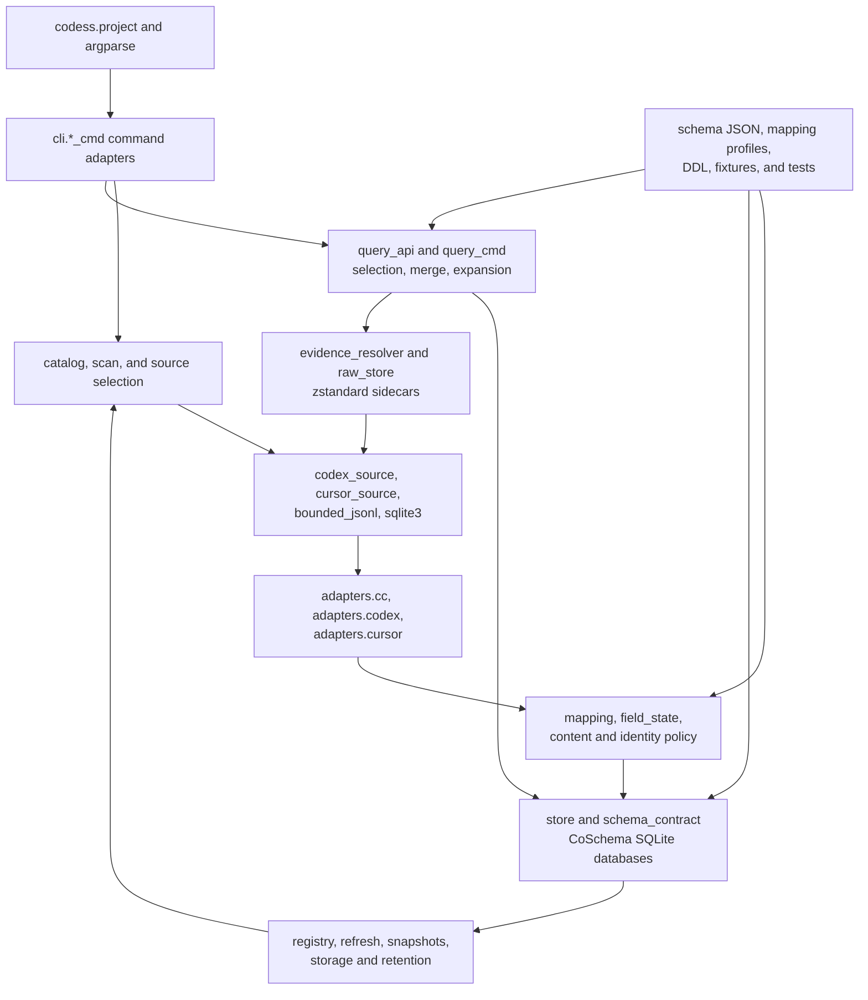
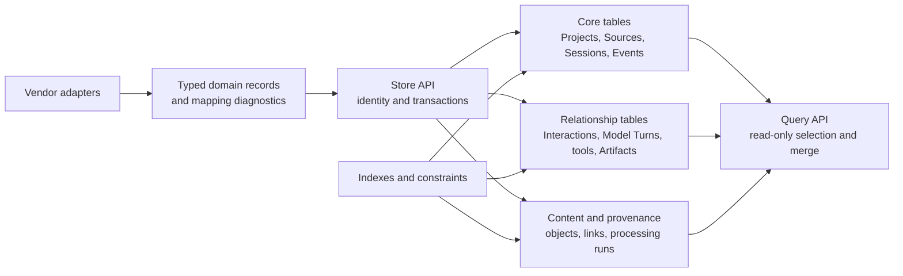

# CoPlan

CoPlan explains how Codess is implemented, how components relate, how behavior
is tested, what is operational now, and what engineering work remains. It is
the sole current implementation-status and work registry.

## 1. Implementation Priorities

Implementation work follows the product value chain:

1. selective vendor Source access;
2. precise and resilient vendor decoding;
3. evidence-preserving classification and normalization;
4. constrained, indexed SQLite storage;
5. strong search, reconstruction, and structured results;
6. representative validation and performance measurement; and
7. supporting publication, catalog, raw evidence, and retention.

Supporting subsystems are maintained when they protect correctness or routine
operation. They do not take priority over decode, classification, search, or a
reproduced performance problem.

## 2. Repository Structure

```text
CodeSess/
├── main.py                     # source-tree development entry
├── pyproject.toml              # package and codess command
├── src/
│   ├── cli/                    # command adaptation and rendering
│   └── codess/                 # source, domain, store, query, operations
├── schema/
│   ├── coschema/               # current common contract and SQLite DDL
│   ├── mappings/               # vendor mapping profiles
│   └── *.json                  # query, result, policy, and selection contracts
├── catalog/                    # reviewed Project policies and evidence
├── tests/                      # unit, contract, CLI, and integration tests
└── tools/                      # thin focused maintenance wrappers
```

The installed entry point is `codess.project:console_main`. Normal users invoke
`codess`; modules below `src/` are implementation surfaces rather than separate
applications.

## 3. Architecture

### 3.1 Component Hierarchy



| Component | Principal modules | Responsibility |
|---|---|---|
| Entry and dispatch | `codess.project`, `cli.*_cmd` | Parse one public interface, resolve common options, dispatch operations, render results and exit status. |
| Project selection | `project_catalog`, `catalog`, `project_annotations`, `catalog_operations`, `registry_store` | Stable Project identity, locations, workspace bindings, catalog scope, and observations. |
| Source discovery | `scan`, `codex_source`, `cursor_source`, Claude path helpers | Find attributable source records and calculate bounded metadata without normalization. |
| Vendor decode | `adapters.cc`, `adapters.codex`, `adapters.cursor` | Interpret selected vendor records and emit common candidates plus exact source evidence. |
| Mapping and policy | `mapping`, `field_state`, `ingest_pipeline`, `ingest_review`, `content_processing`, `context_content`, `tool_identity`, `tool_result_status` | Classify, diagnose, sanitize, bound, and normalize vendor candidates. |
| Persistence | `store`, `schema_contract`, `identity`, `processing_contract` | Enforce CoSchema, replace source-owned records transactionally, maintain indexes and stable identities. |
| Query | `query_api`, `cli.query_cmd`, `configuration_audit`, `artifact_correlation` | Select stores, push predicates, order and merge results, expand exchanges, facet, and render structured output. |
| Evidence | `evidence_resolver`, `evidence`, `raw_store` | Resolve normalized identities to captured, sealed, or verified live source evidence. |
| Supporting operation | `snapshot`, `baseline_*`, `refresh_*`, `retention`, `storage_report` | Publish complete Project store sets, compose routine refresh, inventory storage, and prune reviewed derivatives. |
| Focused audits | `vendor_audits.*`, `mcp_audit`, `codex_parent_audit`, `cursor_feature_audit`, `orientation_audit`, `token_usage` | Gather bounded evidence for one source capability or derived measure; never act as alternate ingesters. |
| Shared infrastructure | `config`, `helpers`, `fileio`, `bounded_jsonl`, `resources`, `resource_policy`, `sanitize`, `progress` | Configuration, safe I/O, limits, progress, and common utilities. |

### 3.2 Dependency Rules

- Source-access modules may know vendor storage but not CoSchema query behavior.
- Adapters may depend on common mapping and content helpers but not query,
  catalog publication, or command renderers.
- Store and query code must not parse vendor records.
- Query reads normalized stores and must not invoke adapters.
- Cursor table and key-range knowledge belongs in `cursor_source`, not in scan,
  ingest commands, or the adapter.
- Codex active/archive traversal and selection belongs in `codex_source`.
- DDL exists only in `schema/coschema/sqlite/schema.sql`.
- Administrative wrappers call domain operations instead of implementing a
  second workflow.

Cross-cutting utilities remain content-neutral unless their stated purpose is
content processing. Logging, progress, resource observation, and catalog code
must not become hidden vendor parsers.

## 4. Structured Store Realization

CoSchema is authoritative for entities, fields, and cardinality. The
implementation translates domain records into grouped SQLite tables without
letting physical column names define vendor interpretation.



| Relationship | Construction | Query use |
|---|---|---|
| Project to location/workspace | Catalog operations and vendor discovery | Project resolution and source selection |
| Source to Source record | Adapter record locators and Source revision | Provenance and evidence resolution |
| Session to ordered Event | Adapter ordering followed by store validation | Session reconstruction and sequence windows |
| Interaction and Model Turn to Event | Vendor boundaries or adapter structural mapping | Complete exchange expansion and activity measures |
| Model Turn to configuration | Direct or explicitly inherited vendor setting evidence | Model and configuration filters |
| Tool invocation to result | Vendor call identifier and source relationship | Lineage, failure, denial, and missing-result analysis |
| Event to Artifact | Adapter extraction and correlation assertions | File/repository investigation across Sessions |
| Event or record to content | Content processing and deduplicated content identity | Search, bounded display, and derivation tracking |

Adapters construct source-supported relationships. Store code validates and
persists them. Query code follows them but never invents missing edges.

## 5. Data Flows

### 5.1 Scan

```text
Project roots or catalog scope
  → vendor indexes and metadata
  → bounded source-system observations
  → Project attribution and candidate rows
  → CSV and registry observation
```

`scan.run_scan` is index-led. It uses Claude indexes or path bindings, Codex
`session_meta` records, and Cursor workspace/header metadata. Explicit bounded
Git discovery can locate repository boundaries; ordinary scan does not recurse
through every file below a work root.

Scan writes observations, not normalized Events. Its Session and Event counts
are source-system metrics and can differ from normalized store counts.

### 5.2 Ingest

```text
resolved Project and source-system scope
  → selected Source revisions
  → bounded source reader
  → vendor adapter
  → field-state, classification, content, and resource processing
  → source-level transactional replacement
  → common validation and indexes
  → complete Project publication
```

`cli.ingest_cmd` coordinates the run. Vendor access and adapters produce
records; `store` owns SQLite transactions. State advances only after the
source-owned normalized replacement commits. A valid empty Source removes
stale normalized records from that Source and records an informational
diagnostic.

Claude and Codex process transcript files independently. Cursor selects a
Project cohort from shared SQLite state and replaces the Sessions owned by that
selected database observation in one transaction.

### 5.3 Query

```text
Project and store selection
  → canonical typed request
  → per-store SQL predicate and limit
  → deterministic bounded merge
  → optional Interaction or Model Turn expansion
  → facets and structured result
  → optional evidence resolution or derived consumer
```

`query_api` owns typed request validation, filter semantics, stable results,
facets, expansion, comparison, and byte/row limits. `cli.query_cmd` owns command
adaptation and human or structured rendering. Direct report modes remain
separate renderers over the same stores.

## 6. Vendor Pipelines

### 6.1 Claude Code

```text
~/.claude/projects
  → project index/path binding
  → selected top-level and supported subagent JSONL
  → bounded line reader
  → adapters.cc
  → common Events, tools, context, configuration, and relations
```

Claude work centers on reliable distinction between direct prompts,
harness-carried user envelopes, tool results, delegated prompts, assistant
messages, tool operations, compaction, and subagent relationships.

### 6.2 Codex

```text
active/archive Session trees
  → codex_source inventory and Project cwd match
  → selected rollout JSONL
  → bounded line reader
  → adapters.codex
  → messages, reasoning summaries, tools, context, lifecycle, and settings
```

Codex work centers on canonical versus notification records, tool call/result
lineage, context and compaction envelopes, turn settings, lifecycle events, and
structured collaboration evidence.

### 6.3 Cursor

```text
Cursor User directory
  → workspace bindings and composer indexes
  → cursor_source read-only SQL selection
  → selected headers, fallback indexes, bubbles, and context values
  → adapters.cursor
  → messages, inferred turns, tools, context, status, and model selection
```

Cursor performance depends on indexed selection of relevant composer key ranges
instead of decoding the complete shared database. Source-level physical
duplicate handling uses stable vendor bubble identity; repeated real Events are
retained.

## 7. Persistence and Indexing

### 7.1 Store Layout

Each Project can have source-system stores such as:

```text
.codess/
├── sessions_cc.db
├── sessions_codex.db
├── sessions_cursor.db
├── ingest_state.json
├── last-ingest-report.json
└── current.json
```

The manifest and current pointer combine the selected source-system databases
into a Project store set. Published sets are also retained in the central
registry so query and evidence access do not depend entirely on the checkout.
This layout does not change the logical entities exposed to query.

### 7.2 Transaction Boundaries

- One Claude or Codex transcript replacement is atomic.
- One selected Cursor cohort replacement is atomic.
- Source availability and normalized replacement commit together.
- Incremental state advances after commit.
- Project publication selects a complete validated result, never a partial
  working transaction.

### 7.3 Index Strategy

The physical schema indexes identity, Session ordering, source lineage,
Interactions, Model Turns, Event kinds, Actors, statuses, tools, time, model
configuration, and relationship keys used by current queries.

Index changes require:

1. a representative query;
2. `EXPLAIN QUERY PLAN` before and after;
3. relevant table cardinality and selectivity;
4. measured execution and allocation behavior; and
5. identical ordered result identities.

Do not add an index merely because a field is available. Write and storage cost
must be justified by a repeated predicate or relationship traversal.

## 8. Configuration

Configuration has four layers:

1. built-in safe defaults;
2. environment variables for machine locations and ordinary run defaults;
3. command arguments for one invocation; and
4. versioned JSON policies for structured content and resource behavior.

The command line overrides environment-backed defaults where an explicit value
is supplied. Structured policies are preferable to a growing matrix of
source-specific flags. Source locations and ordinary run defaults are resolved
by `config`; content and resource policies are parsed by their domain modules;
command adapters pass the resolved configuration into operations.

`config.validate_config()` validates the resolved machine configuration before
scan, ingest, or query work begins. Exact current flags and defaults remain in
the parser, policy schemas, and `codess --help`, not in this plan.

## 9. Interfaces

### 9.1 Daily Commands

- `codess scan` discovers and observes candidate Project evidence.
- `codess ingest` decodes and writes source-system stores and publishes a
  Project store set.
- `codess query` searches, reconstructs, summarizes, and emits structured
  results.

### 9.2 Administrative Families

Administrative operations are grouped under:

- `refresh` for composed Project updates;
- `catalog` for Project identity, selection, locations, and onboarding;
- `baseline` for validated publication operations;
- `evidence` for bounded capability audits;
- `schema` for current contract checks;
- `session` for operator names; and
- `storage` for observation and reviewed cleanup.

Thin scripts in `tools/` may provide familiar focused entry points, but their
logic belongs in `codess` modules and command families.

### 9.3 Structured Query Interface

The reusable query contract supports Sessions, overview, Events, and search.
Requests and results use checked-in JSON contracts. Structured output includes
scope, stable row identities, truncation/completeness information, and facets
needed by external consumers.

New predicates belong in the common typed executor when they serve repeated
use cases. Project-specific or experimental analysis can use direct read-only
SQL or external processing without expanding the public query contract.

## 10. Validation

### 10.1 Test Layers

| Layer | Evidence |
|---|---|
| Unit | Field-state decoding, identity, mapping, content, status, helper, and predicate behavior |
| Contract | CoSchema package, DDL, mapping profiles, JSON requests/results, and policy validation |
| Adapter | Representative Claude, Codex, and Cursor records, including malformed and hazard cases |
| Store | Transactions, constraints, ordering, replacement, and relationship persistence |
| Query | Qualification, NULL and literal handling, ordering, limits, facets, expansion, and result identity |
| CLI | Real argument parsing, subprocess execution, exit behavior, and structured output |
| Integration | Scan, ingest, update, query, evidence, and publication across temporary vendor layouts |
| Real Project | Small representative source-system stores followed by multi-source and scale cases when required |

The default verification command is:

```bash
pytest -q
```

Tests use temporary vendor roots, registries, and Project store sets. They must not
depend on or mutate the developer's live Claude, Codex, or Cursor data.

### 10.2 Validation Ladder

For a change:

1. run focused unit and contract tests;
2. run the complete automated suite;
3. exercise the smallest real Project containing the affected source shape;
4. add one Project for each additional adapter changed;
5. use a multi-source Project for common classification or query behavior; and
6. use a large or skewed Project only for the scale claim being made.

Every classification or mapping change should inspect exact source evidence and
the resulting normalized row. Every query change should compare stable result
identities with focused direct SQL or a reference implementation.

### 10.3 Performance Evidence

Performance work records:

- workload and selected Project/source shape;
- phase timing;
- source bytes and selected record counts;
- SQLite query plans and rows visited;
- peak resident memory or allocation evidence;
- progress stage where a stall appears; and
- ordered result identity before and after.

Optimization is complete only when the functional result remains equal and the
measured bottleneck improves on both a small correctness case and the intended
large case.

## 11. Current Implementation Status

### 11.1 Core Pipeline

| Capability | Implemented scope |
|---|---|
| Project and Source discovery | Index-led source observation, Project attribution, catalog bindings, and bounded Git discovery |
| Claude Code decode | Selected main and supported subagent JSONL, messages, tools, context, configuration, and lineage |
| Codex decode | Selected active/archive rollout JSONL, messages, summaries, tools, context, lifecycle, settings, and supported collaboration evidence |
| Cursor decode | Read-only workspace/header selection and bounded decode of selected bubbles, tools, context, status, and model evidence |
| Participant classification | Independent human, harness, tool, and model Actors with source role, content role, origin, and Session relation |
| CoSchema persistence | Transactional source replacement, constraints, indexes, Project store sets, and evidence locators |
| Query and reconstruction | Typed Session, overview, Event, search, configuration, expansion, saved-result, comparison, evidence, and citation operations |
| Cross-Project querying | Bounded ordered merge over explicitly selected Project store sets |

### 11.2 Supporting Operation

Catalogs, raw evidence, complete Project publication, refresh, storage
observation, and reviewed pruning are implemented sufficiently for current
operation. Work in these areas is maintenance unless a correctness, recovery,
or storage defect blocks the core pipeline.

## 12. Current Work Registry

This registry contains only incomplete work. Status means:

- **WIP:** implementation or evidence work has begun;
- **Planned:** accepted and ordered, but not yet begun;
- **TODO:** accepted but not scheduled;
- **Under review:** the problem is established but the resolution is not yet
  accepted; and
- **Postponed:** intentionally excluded from the current development phase.

### 12.1 Immediate Core Work

| Priority | Status | Work | Completion evidence |
|---|---|---|---|
| Critical | WIP | Audit source-type and Actor classification across representative Claude Code, Codex, and Cursor Sessions. | Fixtures and real-source checks agree on Actors, roles, origins, relations, and counts. |
| Critical | WIP | Strengthen current tool, context, compaction, model-setting, and agent/subagent decode. | Each supported family has exact source evidence, mapping, partial/malformed coverage, diagnostics, and an explicit validation basis. |
| Critical | Under review | Separate exact package integrity from SQLite-layout, logical-schema, decoder, mapping, and fixture identity. | A non-semantic package-file change cannot make an unchanged store layout unwritable; each identity has a defined consumer and test. |
| High | Planned | Review high-value predicates and reconstruction against actual investigations. | Bounded deterministic results and complete requested expansions agree with focused direct queries. |
| High | Planned | Establish repeatable query and ingest performance workloads. | Small correctness and representative scale cases report timing, query plans, rows, memory, and stable result identities. |
| High | WIP | Confirm selective Cursor work remains independent of unrelated shared-database content. | Selection, fingerprinting, decode, and query remain bounded as unrelated Cursor content grows. |

### 12.2 Next Functional Work

| Priority | Status | Work | Start condition |
|---|---|---|---|
| Normal | TODO | Improve search reports and structured-query examples. | Core predicate and reconstruction checks are stable. |
| Normal | TODO | Report source-to-common coverage, loss, and unknown shapes. | The report can derive from profiles, diagnostics, and selected source observations. |
| Normal | Under review | Exercise third-party read-only query and visualization interfaces. | A real investigation identifies the interface and required provenance. |
| Normal | Under review | Expand cross-Project analysis inputs. | A consumer identifies entities, fields, selection, and output checks. |

### 12.3 Secondary Maintenance

- Fix snapshot, catalog, raw, refresh, or retention behavior when it threatens
  correctness, recoverability, bounded storage, or normal operation.
- Add resource controls only for observed accidental or pathological input.
- Maintain session aliases and utilization observations without allowing them
  to displace core decode and search work.

### 12.4 Deferred Directions

The following are **Postponed** until a concrete consumer or measured
limitation justifies reopening them:

- a mapping expression language;
- remote schema or mapping registries;
- fuzzy cross-vendor identity resolution;
- a built-in general search engine beyond current SQLite predicates;
- standardized Parquet, DuckDB, or merged-database products;
- automatic narrative or assessment generation;
- cost, quota, or billing analysis; and
- broad raw-source search.

## 13. Change Procedure

Every core change should land vertically:

1. state the affected use case and current failure or limitation;
2. capture representative vendor or query evidence;
3. update functional design only when the rule or rationale changes;
4. update source-format evidence and its mapping when source meaning changes;
5. update the common logical contract and physical DDL only when stored meaning
   or layout changes;
6. implement source access, adapter, store, and query behavior in their owning
   components;
7. add focused, contract, integration, and representative real-source checks;
8. update operating instructions only when the normal workflow changes; and
9. update the project entry point only when user entry or navigation changes.

Avoid copying current command flags, corpus counts, Project lists, or generated
status into durable prose. The parser, executable contracts, catalogs, reports,
and tests remain authoritative for those facts.
