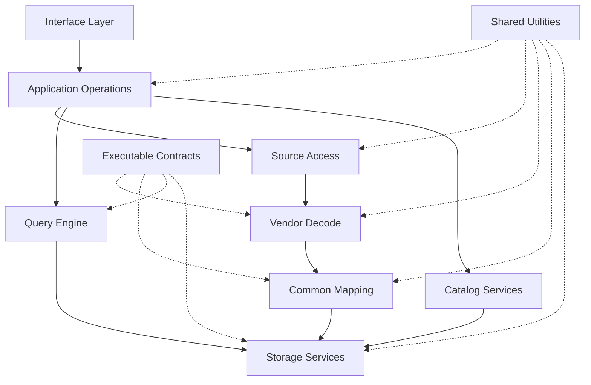
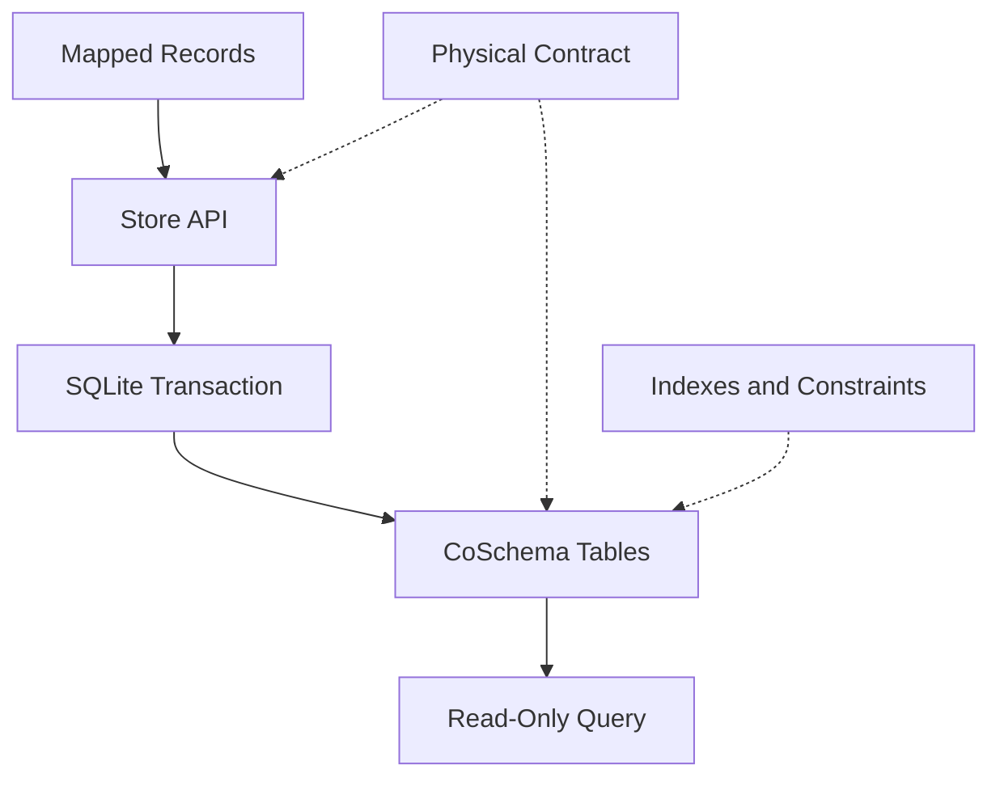
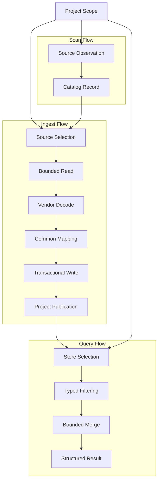
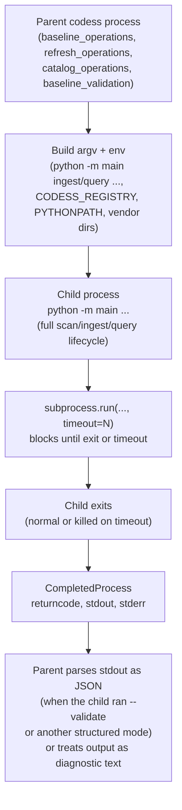
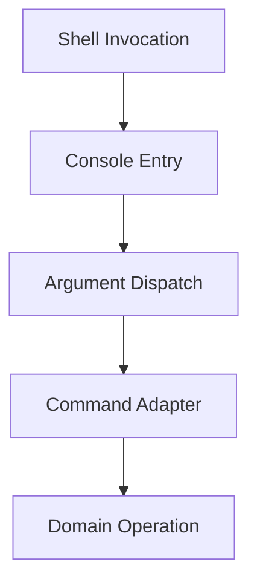

# CoPlan

CoPlan explains how Codess is implemented, how components relate, how behavior
is tested, what is operational now, and what engineering work remains. It is
the sole current implementation-status and task list.

## Task List at a Glance

Every numbered work item (full detail in
[14.2 Immediate Core Work](#142-immediate-core-work) and
[14.3 Next Functional Work](#143-next-functional-work)), in one place for
immediate review. Status follows 14's own vocabulary -- **WIP** active,
**Planned** accepted and ordered, **TODO** accepted but unscheduled,
**Under review** an established problem with no accepted resolution yet
(distinct from merely unscheduled), **Postponed** intentionally outside the
current phase. Unnumbered Postponed directions (mapping expression
language, remote schema registries, and the rest of
[14.5 Deferred Directions](#145-deferred-directions)) are not individually
tracked work items and are not repeated in this table.

Rows are ordered by priority, not by identifier. Identifiers are assigned
once and never reused or renumbered, so a later item can carry a higher
priority than an earlier one -- W31 sits with the High group above the
Normal items that precede it numerically.

#### Execution Categories

Priority states how much an item matters; it does not say when the work
happens or what is blocking it. Reviews surface findings faster than they
are fixed, and a finding with no category becomes a note nobody acts on.
Every identified duplication, unused definition, rename, or defect belongs
in exactly one of these:

| Category | Meaning | Items |
|---|---|---|
| **A. Fixed now** | Landed in the working tree, with tests. Carries no work item. | **Decode is complete for what the three vendors state.** Every stated field is decoded, the model name is decomposed into line, generation, version, and gradation, Claude's structured tool results and per-Event parent links are retained, and Codex's output header supplies six fields plus the exit code on 14,795 results where 79 were reachable before. **Names are settled** in [CoNames](CoNames.md), which is authoritative: `entity_id` is qualified per table, `model_params` replaced `model_configurations`, `source_path` replaced a `source_uri` that held no URI. **Hashing was evaluated** at every call site; five were removed as unnecessary and the rest are identity, integrity, content addressing, or change detection. What each change established is recorded where it is checkable -- `schema/field-coverage-baseline.json` for accepted gaps, `schema/model-aliases.json` for the model vocabulary, `config.py` beside each bound -- rather than retold here. Two bounds were made configurable and named for what they govern: `SOURCE_READ_MAX` (`CODESS_SOURCE_READ_MAX`, was `SOURCE_FULL_HASH_MAX`) and `CODESS_QUERY_BYTE_LIMIT`; `MAX_TOKEN_LINE_BYTES` moved to 4 MB, still 3x the largest line in 58,106 real records. |
| **B. Fix as WIP** | Actively in progress; the remaining work is named. | W45, W46, W52 |
| **C. Fix later** | Accepted, unblocked, not started. Grouped and ordered below. | W04, W07, W08, W09, W13, W47, W48, W49, W50, W51, W55, W14, W15, W18, W19, W21, W24, W28, W31, W32, W38, W41, W42 |
| **D. Postponed** | Deliberately deferred; the reason is recorded on the item. | W43 (validation table: withdrawn on inspection -- `validate_request` already groups 30 fields into 10 branches), W16 (external interfaces: no requester), W35 (fixture inventory: no longer gates anything after W03), task 28 (manual image-only review, deferred by request) |
| **E. Needs decision** | Blocked on a judgment nobody has made, not on effort. Doing the work first would encode the wrong answer. | W05, W17 — each question stated below. Four wire-format items were decided this pass and moved to F; the identity-vocabulary item was answered by looking at the sources and became a decode gap, since fixed. |
| **F. Decided, awaiting regeneration** | Accepted; each changes what a store records, so all land in one rebuild. | W25, W33, W34, W36, and W31/W32 which rewrite the same identity prefix. See below for what regeneration is. |

##### What Regeneration Means, and Why F Exists

**Codess never migrates a store.** 5.1's reasoning is that vendor Sources
remain the authority, so a format change is a rebuild from those Sources
rather than an `ALTER TABLE`: the store is a projection, and the way to
change a projection is to recompute it. `require_store` enforces this --
only the current format is accepted, for reading as well as writing, so a
store written under an older contract is refused rather than upgraded.

Concretely, regeneration means: install the new released contract, then
`codess ingest --force` every Project so each store is rewritten from the
vendor Sources under the new rules, then republish. Every `.codess` store
set on the machine is unreadable by the new code until its Project is
reingested, which is why the work is a single event rather than a rolling
change.

**That cost is what makes F a category rather than a queue.** Each of these
changes what a store records:

| Item | What changes on disk |
|---|---|
| W25 | Nineteen time columns become seven; one rename |
| W33 | `package_digest` becomes `contract_digest` in `store_meta` |
| W34 | `sha256` leaves 4 columns, ~20 JSON keys, and the identity prefix |
| W36 | One Event kind becomes four; the Claude mapping profile splits |
| W31, W32 | Every `entity_id` gains a format qualifier and a new derivation |

Landing them together costs one rebuild of every Project. Landing them
separately costs up to six, and each intervening state has stores some
tools read and others refuse. W34 and W31/W32 additionally rewrite the
*same* identity prefix, so splitting those two would rewrite every stored
identity twice.

**The decision they wait on is therefore not "is each one right" -- all six
are accepted -- but "when."** The trigger is the next regeneration that is
owed for another reason; one is already due from the W03 and W20 changes.
F holds them until then so a reviewer does not read "Planned" as "start
this now" and force a rebuild for one rename.

Two rules keep the categories honest. **A finding is never left uncategorized**:
if it is not fixed in the same change, it gets an item and a category before
the review closes. And **E is not a parking space** -- an item sits there
only while a specific unanswered question is named on it, and moves to C the
moment that question is answered.

##### C Grouped and Ordered

Twenty-three items is a list, not a plan. They fall into five groups, and
within each the order is a real dependency rather than a preference:

| Group | Order | Why this order |
|---|---|---|
| **1. Decode correctness** -- what the stores say is true | **Complete** | Gaps validated against real sources, the coverage sweep worked, and coverage reported last, since a report built earlier describes an incomplete decoder. |
| **2. Contract enforcement** -- what the code is held to | W04 → W13 → W14 | W04 puts the candidate contract at the decode boundary; W13 enforces the architecture paths mechanically, which needs the boundary to exist; W14 is the narrow Project-identity case within it. |
| **3. Identity and naming** -- what a value means | W31 → W32 → W15 → W24 | W31 makes `IDENTITY_FORMAT` observable and W32 routes derivation through `hashing`; both change stored identities, so they land together. W15 and W24 are independent naming resolutions that ride along. |
| **4. Reporting and interface** -- how results leave the system | W18 → W38 → W21 | W18 defines the reporting contract; W38's row emitter is where a row becomes output, so it attaches to W18; W21 routes `walk_sessions`'s debug prints through the same contract; The worked examples that were W11 now belong to W05. |
| **5. Scale and structure** -- what happens under load | W07 → W08 → W09 → W19 | W07 bounds ancillary reads, W08 establishes the workloads that measure them, W09 confirms Cursor selectivity under those workloads, W19 decomposes `walk_sessions` so the Project logic is testable apart from vendor scanning. |

Groups 1 and 2 are Baseline 2's content and run first. Group 4 depends on
W18, which is also Baseline 2. Groups 3 and 5 are independent of both.

##### Naming and Rename Items Are One Sequence

Nine items propose or depend on a rename, and they were each reasoned about
separately -- which is how the inconsistencies they describe arose. They are
recorded here as one sequence so a reviewer sees the dependency rather than
nine independent proposals:

| Step | Items | Why in this order |
|---|---|---|
| 1. Settle the names | **Complete** -- [CoNames](CoNames.md) | Names every designator once, across DB, module, file, structure, method, and field. Every step below checks against it. |
| 2. Decide the vocabulary | **W40** (identity terms), **W50** (glossary correspondence), **W51** (source identity), **W48** (constant and unread columns) | Each answers *what a thing is called and whether it is kept*. None writes a store. |
| 3. Protect the change | **W52** (SQL construction) | A renamed column must fail a test, not a query. Its value is entirely in guarding step 4. |
| 4. Land the wire format | **W25**, **W33**, **W34**, **W36** | One regeneration, after the names are settled and the SQL is guarded. |

**W47** (record and source diagnostics) sits outside this: it adds evidence
rather than renaming any, and can run at any point.

The failure this ordering prevents is concrete. W25 proposes time-column
names, W33 a digest name, W34 an algorithm-name rule, W36 an Event-kind
split, W50 a glossary reconciliation, W51 a source-identity scheme -- and
several touch the same columns. Landing any one first fixes a name against
five unmade decisions.

##### Ordering the Seven Groups

The groups are internally ordered by dependency; between them the order is
a judgment, and this is it. Two questions decide it: **does anything else
wait on this**, and **what does it cost to be wrong for another month.**

| Rank | Group | Why here |
|---|---|---|
| 1 | **1. Decode correctness** -- **complete** | Its failure mode is silently wrong data, which every other group builds on and none of them detects. A reporting contract over a wrong decode reports wrongly, on schedule. The confirmed gaps closed, so what remains is the coverage sweep's tail and the loss report. |
| 2 | **6. Ingest state and layering** (W45 → W46 → W06 step 4) | Not the most valuable, but the most *blocking*: it changes adapter signatures, and groups 2 and 5 both touch the same functions. Doing it after them means editing those call sites twice. Partly landed, which lowers its remaining cost. |
| 3 | **2. Contract enforcement** (W04 → W13 → W14) | Baseline 2's substance, and coverage reporting in group 1 reports against the profiles W04 enforces. Ranked below group 1 only because a coverage gap you can see beats a conformance check you have not written. |
| 4 | **4. Reporting and interface** (W18 → W38 → W21) | The first group whose absence a user feels rather than a maintainer. Held below contract enforcement because W18's contract should describe a decode that is already correct and enforced. |
| 5 | **7. Recovery and hygiene** (W41, W42) | Independent of everything, small, and W41 fixes a real operational hole -- Operations 10.5 directs an operator to a command that cannot do the job. Ranked here rather than lower because it can be done in any gap between larger items. |
| 6 | **3. Identity and naming** (W31 → W32 → W15 → W24) | Correctness-neutral: no reader gets a wrong answer today. It is in F for the regeneration, so its real trigger is that event, not this ranking. |
| 7 | **5. Scale and structure** (W07 → W08 → W09 → W19) | Deferred deliberately. No measured workload is failing, and W08 exists to establish what "too slow" means -- until that is defined, optimizing is guesswork. W19 is the exception and may be pulled forward with group 6, since both restructure the same ingest path. |

**The one cross-group constraint worth stating:** W19 (group 7) and W45/W46
(group 6) restructure the same code, and three of the six remaining
duplicate blocks live at exactly that seam. Whichever runs first should
take the duplicates with it.

**Two new groups.** **6. Ingest state and layering** -- W45 → W46 → W06 step 4 -- is the one defect this review kept re-finding, now partly landed: grouping the parameters (W45) had to precede moving the Cursor phase (W46), and splitting `opts` finishes both. **7. Recovery and hygiene** -- W41 (snapshot recovery has no CLI route) and W42 (the adapters' bound-process-check helper) -- are independent and can run any time.

**W05, W16, and W17 left C.** Each waits on something other than code, which
is not the same as being queued. W16 is **postponed to D**: 12.3.3 already
records that no consumer has asked for external interfaces, and an item
nobody is waiting for does not belong in an ordered queue. W05 and W17 move
to **E**, because each has a real unanswered question rather than merely a
missing input -- stated with the other E items below.

##### E: The Open Questions

Each item names one unanswered question. An item leaves E when that question
is answered, not when someone starts the work.

| Item | The question | What is already established |
|---|---|---|
| **W05** | Which three to five investigations, and who judges the answers adequate? | The predicates exist and 31 tests exercise them against fixtures, so the code is not in question. What the item asks is whether the surface answers *real* questions -- given a distinctive phrase, can a reader reach the Interaction that produced it, and is the expansion the one they needed? A fixture cannot check that, because it contains the answer by construction. **W11 is merged in**: it asked for better search reports and examples without saying what was inadequate, and running the investigations is what produces both a worked example and evidence of any missing facet. What remains unanswered is only which investigations, named before the data is examined. |
| **W17** | What entities, fields, and grain does a cross-Project consumer need? | Cross-Project querying already works over selected store sets with retained identity. This item asks for *expanded inputs*, which is unspecifiable without a consumer. Deciding whether the Misses project counts as that consumer -- Codess.md 4.4 names it as one -- would answer the question or confirm the item should be postponed with W16. |
| **W25** | Accept CoSchema 5.1.1's resolution -- nineteen time columns to seven, six removals plus three unread stamps, one rename? | The measurements are done and unambiguous: three byte-identical duplicate pairs, two columns exactly equal to `MIN`/`MAX(events.event_at)`, one null in all 85,840 rows. What remains is agreeing that removal beats retention. |
| **W33** | What replaces `package_digest`? | `contract_digest` matches the function name and what W03 narrowed the value to cover. `matching_set` was the earlier candidate and is now weaker. The question is only which name. |
| **W34** | Where may an algorithm name appear at all? | 13.4.8 proposes keeping it in integrity fields a reader recomputes and removing it elsewhere. The alternative -- no algorithm name outside `hashing`, with callers passing an expected width -- has not been evaluated against it. 144 occurrences depend on which rule wins. |
| **W36** | Is `state.product` split into `session.label`, `harness.setting`, and `content.marker`? | The evidence is complete: Claude-only, 19,528 Events, nine subtypes spanning three unrelated purposes, and `event_kind` is a declared open vocabulary so adding kinds is expected. The question is whether three kinds is the right partition. |
| **W40** | Which of `vendor_name`, `product_name`, `harness_name`, `surface_kind` are independently observed? | All four are constants of each other across 507 Sessions and none is a query filter. Either they are the axes a fourth source system would separate -- keep and record the degeneracy -- or they are one fact spelled four ways. |

**The regeneration decision.** W25, W33, and W36 each change what a store
records, so each requires every store to be rebuilt from vendor sources
before it can be read again. Codess does not migrate stores: 5.1's own
reasoning is that vendor Sources remain the authority, so a format change is
a rebuild rather than an `ALTER TABLE`.

That makes rebuild count the thing to decide, not each rename separately. A
regeneration is already owed from the W03 and W20 changes. Landing all three
inside it costs one rebuild; landing them separately costs three, and each
intervening state has stores that some tools read and others do not.

So the decision is: **accept or reject W25, W33, and W36 together, then
regenerate once.** Accepting two and deferring the third is the outcome to
avoid, because the deferred one then owes its own rebuild later. This is why
all three sit in E rather than being worked in priority order -- their
sequencing is coupled even though their subject matter is not.

W34 and W40 are not wire-format items and are independent of that decision.
W34 gates W32's emitted identity prefix, so it should be answered before
group 3 runs; W40 gates whether W36's `product` reasoning holds, so it
should be answered before or with W36.

| ID | Priority | Status | Work |
|---|---|---|---|
| W04 | High | Planned | Shared candidate-record contract and runtime mapping-profile enforcement. |
| W05 | High | Planned | Run named real investigations against the query surface, and produce the worked examples they yield. **W11 merged here**: running the investigations is what produces the examples, and any predicate they expose as missing is the report gap W11 described. |
| W07 | High | Planned | Bound ancillary reads that can encounter large source or repository content. |
| W08 | High | Planned | Establish repeatable query and ingest performance workloads. |
| W09 | High | WIP | Confirm selective Cursor work remains independent of unrelated shared-database content. |
| W28 | Normal | Planned | Give the central registry a retention policy; it accumulates an entry per Project ever scanned, including test temporary directories. |
| W31 | High | Planned | Make `IDENTITY_FORMAT` observable and enforced: it is hashed into every identity but recorded nowhere, so two derivation schemes cannot be told apart. |
| W32 | Normal | Planned | Route `identity._qualified` through `codess_hash`; it hand-rolls component hashing and hardcodes `sha256` in the emitted value. |
| W33 | Low | **Accepted** | Rename `package_digest` to **`contract_digest`**, matching the function that computes it and the six files W03 narrowed it to. Wire-format change; regenerate with W25 and W36. Superseded text: rename `package_digest` to name the contract it now records; the current name reads as the Python distribution and no longer matches what the value covers. W03 narrowed it to six files, so the rename should follow that meaning. Batch with W20's `store_meta` change. |
| W34 | Normal | **Accepted** | **The algorithm name appears only inside `codess/hashing.py`** -- not in general code, messages, or documentation. A reader recomputes with `codess_hash`, which already knows the algorithm, so naming it in a field taught them nothing actionable. **The remaining occurrences are wire-tied, and split into two classes that should not land together.** **(a) 71 are name-only**: a `_sha256` suffix on a column or JSON key -- `content_sha256`, `policy_sha256`, `selection_sha256`, `plan_sha256`, `stored_sha256`. Renaming these changes what a field is called, not what any value contains, so on disk it is a key rename and the substitution is mechanical. **The replacement is `_hash`, not `digest`**: `codess_hash` is already the function name and `hash_file` the helper, so `content_hash` matches the code that produces it. **(b) 32 are inside stored values**: `codess:session:sha256:…` on every identity and `sha256-fingerprint:…` on 259 `source_revision` values, where `fileio` composes the algorithm into the string. Renaming these rewrites stored bytes that are compared across stores, and it collides with W31/W32, which rewrite the same identity prefix -- so class (b) is theirs to land, not this item's. **Sequencing**: (a) joins the W25/W33/W36 regeneration; (b) waits for W31/W32 so no identity is rewritten twice. | A reviewed rule states where an algorithm name may appear; code outside `hashing` follows it; changing the algorithm touches one module plus the scheduled wire-format change. |
| W35 | Low | **Postponed** | Decide whether the eight manifest fixtures no test reads should be wired into tests or removed from the released set. Not an integrity question: W03 took them out of the write gate, so they now affect only `codess package verify`. |
| W36 | Normal | **Accepted** | Split the Claude-only `product_state` family into four kinds: `session.label`, `harness.setting`, `content.attachment`, `session.marker`. Nine subtypes spanning titles, permission settings, file diffs, and a transcript pointer are one kind today, so a query for any is a query for all. Four, not three: `last_prompt_marker` is a position pointer, not attached material. Wire-format change; regenerate with W25, W33, W34. |
| W38 | Normal | Planned | Give `query_cmd` one row emitter. 105 `print` calls and 27 hand-assembled rows each re-decide separator, column order, and which fields to sanitize. Pairs with W18's reporting contract. |
| W46 | Normal | **Partly done** | Move Cursor preflight out of the CLI layer. `_cursor_preflight` sits in `cli.ingest_cmd`, but of its calls **six are domain operations** -- `load_selection_marker_cache`, `save_selection_marker_cache`, `get_selection_markers`, `combine_selection_markers`, `cohort_needed`, `prepare_cursor_cohort` -- against **seven `progress_trace` calls and one `print`**, which are the only parts that belong to a command. `cursor_cohort` already declares it "owns caching" and decides when a cached cohort is valid; the sequencing of scan-versus-reuse, the container-stability bracket, and the cohort decision are that module's subject, not the CLI's. 5.2's layering says a command adapts arguments and renders results, so a 247-line phase deciding Cursor read strategy is on the wrong side of it. Move the decision to `cursor_cohort`, returning a result the command reports; the `progress_trace` calls become that result's fields or a callback. Pairs with **W45**: doing this first would move a 10-parameter function rather than a 3-parameter one. **Landed this pass:** `CursorSelection` now lives in `cursor_cohort` and carries `workspace_ids`, `global_db`, and `project_headers` with `roots`, `empty`, and `selections()` derived, replacing four parallel parameters. **Remaining:** the decision itself is still in `ingest_cmd` -- six domain calls against seven `progress_trace` calls and one `print` -- so the phase body should move to `cursor_cohort` and return a result the command reports. | Cursor read strategy lives with the module that owns Cursor caching; `ingest_cmd` reports the outcome instead of computing it; the phase is testable without a CLI. |
**A value survey extends the coverage sweep from absence to constancy.**
`tools/field_coverage.py` asks which columns are *empty*; asking which hold
one *constant* value finds a larger and differently-shaped class. Over 241
columns across all three vendors:

| Class | Count | What it means |
|---|---|---|
| Absent for every vendor | 18 | No adapter writes it |
| Absent for all but one | 7 | One vendor supplies evidence the others do not |
| Absent for exactly one | 6 | The decode-gap class, all explained in the baseline |
| **One value, same for every vendor** | **32** | A column carrying no information |
| **One value, differing per vendor** | **11** | A vendor tag, correct but redundant |
| Constant for all but one vendor | 14 | Usually a vendor that genuinely varies |
| Constant for exactly one vendor | 22 | Usually a small sample, not a finding |

The two middle rows are the useful ones. **Thirty-two columns hold a single
value across every store and vendor** -- `content_objects.charset` is always
`utf-8`, `media_type` always `text/plain`, `storage_class` always `inline`,
`event_content.integrity_state` always `verified`, `sequence_no` always `1`,
`event_artifacts.confidence` always `1.0`, `tool_results.producing_actor_kind`
always `tool`. Each is a column the schema declares as varying and the
implementation never varies. That is not automatically wrong: several are
reserved for a capability not yet built, and a constant that will vary later
is cheaper to keep than to add back. But it is 32 columns' worth of storage
and reader attention spent on values that answer nothing today, and no
current item accounts for them.

**Eleven more are pure vendor tags** -- `sessions.source`, `source_system_id`,
`storage_format`, `vendor_name`, `product_name` -- each derivable from which
store a row came from, which is W40's finding seen from the data rather than
from the code.

**Three of the constants are a defect rather than a redundancy.**
`mapping_diagnostics.level` is always `field`, `events.event_at_basis` always
`vendor`, `event_artifacts.evidence_source` always `tool_input` -- each
declares a vocabulary the decoder never exercises, so a reader cannot
distinguish "this never happened" from "this is never recorded".

**`event_at_basis` was the sharpest of the three and is fixed.** It defaulted
to `vendor` whenever unset, which asserted vendor provenance for **14,031
Events that had no vendor timestamp at all** -- precisely the claim the column
exists to prevent. The basis now follows the value: `vendor` where an instant
was reported, `unknown` where none was. Re-ingest confirms the split (22,178
against 6,638 in one Project) and a test pins it, exercised through
`upsert_event` rather than the fixture, because the defect was in the writer
rather than the schema.

The other two are W47's subject: nothing constructs a source or record
diagnostic, and `evidence_source` has one producer. Until then the coverage
report states `record=0 (not recorded)` rather than a bare zero, so its own
output does not repeat the error this survey found.

| W55 | Normal | Planned | Unify text and record parsing across the decode layer. **Measured**: 98 `json.loads`, 42 SQLite `json_extract`, 38 `startswith`, 31 `re`, 20 `split`, 4 `removeprefix`, 7 `fromisoformat`, 8 `urllib.parse` -- spread over 38, 6, 17, 9, 15, 4, 6, and 4 modules. The ordering is sound (a parser first, a regular expression last) but the spread is not: 17 modules classify a prefix by hand where 4 use `removeprefix`, and 15 split on a separator with no shared helper. **Three specific candidates.** (1) The `mcp__`/`mcp_`/`mcp-` server split is implemented twice, in `store._tool_namespace` and `mcp_audit._mcp_candidate`, against the same three vendor spellings. (2) Timestamp parsing appears in all three adapters with slightly different fallbacks, where one bounded parser would serve. (3) The Codex output header is the only free-text regex that carries decoded fields; it should stay regex but its field table belongs beside the other vendor vocabularies rather than inside the adapter. **Also assess whether a library replaces hand-rolled work** -- `email.parser` or `dateutil` for the timestamp fallbacks, and whether SQLite's own JSON functions can replace materializing rows Python then re-parses, which is the 98-against-42 imbalance. Correctness-neutral, so it batches with no regeneration. | One helper per parsing concern; no vendor spelling is matched in two modules; a new adapter reaches for the same tools in the same order. |
| W52 | Normal | WIP | Unify SQL construction and narrow where it lives. **Measured**: 186 statements across **24 modules**; **37 are built with f-strings in 11 modules**, and only 8 modules validate an interpolated name against the live schema. Four distinct interpolation patterns are in use and only the first is reviewed: (a) a predicate composed internally with bound parameters (`query_api`, the S608-exempt pattern); (b) a table or column name from the schema quoted by hand (`store.table_counts`, `schema_contract.column_names`, `value_survey`); (c) a fragment constant such as `cursor_source._BUBBLE_ROWS`; (d) an aggregate or projection list assembled per call (`query_reports`, 11 statements). **The risk is not injection** -- no site interpolates external input -- **it is drift**: a column renamed in the DDL is caught by (b) where `column_names` is consulted and silently produces an empty or failing query everywhere else, which is exactly what W25, W33, W34, W36, W50, and W51 are about to do to twelve column names at once. **Steps.** (1) One helper for quoting an identifier, replacing the four hand-rolled `replace('"', '""')` sites. (2) Every interpolated table or column name resolved through `table_names`/`column_names` so a rename fails loudly at the call site rather than returning nothing. (3) The three read-only audit modules that SELECT core tables from outside the query layer (7.3: 21 statements in 9 modules) either move behind `query_reports` or state at the call site why they read directly. (4) A test that parses every `execute` call and asserts each interpolated identifier appears in the released DDL, so the next rename cannot pass silently. Sequence before the regeneration batch, since its value is protecting exactly that change. | One identifier-quoting helper; every interpolated name checked against the schema; a renamed column fails a test rather than a query; SQL-executing modules reduced from 24 toward the store and query layers. **This session supplied the evidence the item predicted.** Renaming `global_id` to three table-qualified names broke **34 tests**, each traced by hand: a `JOIN sources s` where the `s.` prefix meant sources rather than sessions, an events upsert given the session qualifier, a double prefix from two overlapping passes, and eight row-access keys. Every one failed at runtime rather than at a check, which is exactly what step 4 exists to prevent. **The interpolation surface is now measured precisely**: one site interpolates a table *name* (`store.table_counts`, from the store's own catalog, never a caller); the rest interpolate `?` placeholder lists, which are safe because values stay bound. So the risk is drift, not injection, and the check needed is that every interpolated identifier appears in the released DDL. |
| W51 | Normal | Planned | Resolve the source-identity naming, measured against peer projects rather than against our own v1. **v1 is not evidence**: `schema/legacy/coschema-v1.sql` has two tables, was generated, and was never reviewed or approved, so it cannot settle a convention. Four other local SQLite schemas can: `Misses` (48 tables), `OSINT` (4), `spank-py` (3), `spank-rs` (1). Of 56 tables across them, 11 are singular and **every one is a mass noun** -- `metadata`, `evidence`, `coverage`, `usage`, `provenance`, `audit`, `store_meta`. Countable-entity tables are plural without exception. **That settles CoSchema's four `*_content` tables**: `event_content` averages 1.27 rows per Event, so it is a countable set and should be `event_contents` -- or, better, renamed to what it holds. `store_meta` is correctly singular by the same rule. **`_id` carries four incompatible formats**, which is the sharper defect: `sessions.id` is a vendor UUID, `sessions.entity_id` a `codess:session:sha256:` derivation, `sources.id` a bare SQLite rowid, `sessions.source_system_id` a dotted literal `anthropic.claude-code`. A reader cannot tell from the suffix whether a value is derived, assigned, or borrowed. **`source_system_id` is not an identifier under that reading** -- it is `vendor + "." + product` composed in the mapping profile, so `source_system` or `source_system_key` says what it is. **Superseded in part**: `vendor_name` is not merely a redundant tag but the wrong fact for a harness running another provider's model, so [CoNames](CoNames.md) owns its disposition rather than this item. **`product` is required by `mapping-contract.json` and defined nowhere**: no vocabulary, no examples, no CoSchema entry, and `sessions.product_name` holds only the three literals the profiles supply. Either define it or drop it with W40. **`sessions.source` is the `SOURCE_PROFILES` dict key** -- `Claude`, `Codex`, `Cursor`, confirmed across 601 real Sessions -- so `adapter_key` names it honestly and frees `source` for the Source entity the glossary defines. Wire-format; batch with the regeneration. | One suffix rule states whether a value is derived, assigned, or borrowed; `source` names the Source entity only; every contract-required field has a definition and examples; plurality follows the mass-noun rule the peer schemas already use. |
| W50 | Normal | Planned | Reconcile schema names with the terminology Codess.md 7 defines. Measured against a live store rather than the DDL text: of twenty terms checked, **six are glossary entities and appear in table or column names** (Project, Session, Interaction, Event, Artifact, Source, workspace), **five appear in names but are not defined** (`location` 1 table + 2 columns, `path` 9 columns, `content` 6 tables + 8 columns, `text`, `raw`), and several defined concepts have no schema presence at all. Four specific defects. **(1) `source` carries three meanings**: `sources.id` is a transcript file, `source_system_id` is a vendor, and `sessions.source` is an adapter key (`Claude`) -- 26 columns share the prefix. The glossary defines Source as "logical upstream evidence container", which is only the first. **(2) `level` is used for two different things, and the parallel to code location was mine and is withdrawn.** The column holds `source`/`record`/`field`, which is a granularity and not an ordering -- summing its values overstates loss, which is the actual defect. But `field_state.diagnostic` builds a dict carrying **both** `"level"` (meaning severity: `info`/`warn`) and `"diagnostic_level"` (meaning granularity), and `store` reads the second into the column named after the first. That is the naming collision worth fixing; the store rows themselves are correct (`level=field, severity=info`). `field` and `record` here name storage granularity, which is the one place that is genuinely the subject, so they are justified -- but only after `level` is renamed to say granularity, and only because no better word distinguishes "a whole record" from "one of its values". **(3) Plurality is inconsistent, and v1 shows the convention**: the one archived schema (`schema/legacy/coschema-v1.sql`) had two tables, `sessions` and `events`, both plural. Twenty-two of twenty-four current tables are plural; the exceptions are `store_meta` (correct -- a mass noun) and the four `*_content` link tables, which name sets. `event_artifacts` and `event_content` are both link tables from `events` and disagree. **Recommend plural throughout**, since a table holds rows, with `store_meta` as the stated exception. **(4) `location` and `path` are used interchangeably** in `project_locations.observed_path` and `sessions.project_path` while the glossary defines "Project location" as an entity and leaves `path` undefined. Wire-format changes; batch with the regeneration. | Every term in a table or column name is either defined in Codess.md 7 or is a plain English word carrying no Codess meaning; `source` names one thing; plurality has one rule and one stated exception. |
| W49 | High | Planned | Identify a worktree as the repository it belongs to. Codess.md 7 states "one repository is one Project; clones, worktrees, editor workspaces, and filesystem locations are bindings or observations of it", and `project_locations` exists to hold those observations -- but **the capability is unreachable in practice**. `project.get_project_root` resolves identity with `git rev-parse --show-toplevel`, which returns the *worktree* root, so two worktrees of one repository become two Projects. Measured: `~/Work/ZK/Zero400` and `~/Work/ZK/ZeroPerf` are worktrees of the same repository -- identical `--git-common-dir` (`Zero400/.git`), different `--show-toplevel` -- and carry different `project_id`s, each with one location. All 21 registered Projects have exactly one location for the same reason, which is why `project_locations` looked like a table that is always one row: the multi-location case cannot currently arise from discovery. A `worktree` catalog state and a `worktree_of` relation exist but require `--related-project-id` on the command line, so the relation is only ever recorded by hand. **`--git-common-dir` is the signal**: identical for worktrees of one repository, distinct across repositories, and already a subprocess shape the codebase uses. Resolving identity by it makes a second worktree a second `project_locations` row rather than a second Project. | Two worktrees of one repository share a `project_id` and appear as two locations; a clone with its own history does not; the multi-location path is exercised by discovery rather than only by manual catalog edits. |
| W48 | Normal | Planned | Resolve the value-survey findings that no other item owns. `tools/value_survey.py` reports six classes; three need decisions. **Thirty-one columns hold one value across every vendor**, and only two of them are ever used as a query predicate (`artifact_kind`, `relation_kind`) -- `charset` is always `utf-8`, `media_type` always `text/plain`, `storage_class` always `inline`, `integrity_state` always `verified`, `sequence_no` always `1`, `confidence` always `1.0`, `producing_actor_kind` always `tool`, `session_purpose` always `coding`. Each is written by Codess from a literal and read back by nothing, so they are storage and reader attention spent on a value that answers no question today. Decide per column: reserved for a capability being built, or removed. **Three vendor tags are never queried** -- and the vendor/provider split supersedes the conclusion that they are simply removable, since `vendor_name` is wrong rather than redundant --: `sessions.vendor_name`, `product_name`, and `storage_format` appear in zero predicates, while `source_system_id` and `source` appear in eighteen -- so the useful denormalization is real and the rest is not, which is W40's finding measured from the query side. **Two link tables disagree on plurality**: `event_artifacts` and `event_content` both link from `events`, and both name a set. Wire-format changes, so any removal batches with the regeneration. | Every column either varies, is read, or is recorded as reserved with the capability that will fill it; the link tables agree on plurality. |
| W47 | High | Planned | Persist record- and source-level mapping diagnostics. `mapping_diagnostics.level` declares `source`, `record`, and `field`, and **only `field` has ever been written** -- 38,092 rows across every store, none at the other two levels. Nothing constructs them: `field_state.diagnostic` hardcodes `"field"`, and `store._record_diagnostic` accepts a `level` argument that no caller passes. The counts that *would* fill them exist -- `unsupported_records`, `ignored_records`, `known_ignored_records`, `malformed_records`, `duplicate_records`, `filtered_records` -- but only as run-time counters the ingest command prints to stderr and discards. So the loss report has a structurally empty half: it correctly reports zero record-level loss, and that zero is unfalsifiable rather than measured. Route the adapter counters into `mapping_diagnostics` at the level they belong to, with the source record type and locator they already know. **Where each level would come from, since the question is what could legitimately produce one.** A **record** diagnostic belongs where an adapter refuses one record and continues: `adapters/cc` line 891 raises `unsupported_records` for a compaction summary whose content is not text, and at that point it holds the record, its `line_num`, and the source file -- exactly the locator a diagnostic row needs, and it discards all of it into a counter. `malformed_records` is the same shape at the JSONL parse site. A **source** diagnostic belongs where a whole Source is skipped: `ingest_sources` counts `empty_sources` and `failed_sources` with the path in hand. Neither level needs new evidence to be collected; both need the evidence already at the call site to be written rather than tallied. The granularity is therefore genuinely three-valued and worth recording -- it is the column name that is wrong (W50), not the concept. | A record Codess did not admit is queryable with its reason and locator; the coverage report distinguishes "no record loss" from "record loss not recorded"; the stderr counters become a rendering of stored evidence rather than the only copy. |
| W45 | Normal | **Partly done** | Group the ingest phase parameters, which the phase extraction made visible. `_ingest_project` takes **17** and `_cursor_preflight` **10**, which is unreadable and easy to mis-order at a call site -- but they are not arbitrary. Classifying `_ingest_project`'s 17 by lifetime gives **five accumulators mutated in place** (`outcome`, `diagnostics`, `source_stats`, `staged_store_roots`, and `opts` via `_begin_project`) and **twelve read-only inputs**, of which `settings`, `config`, `force`, `min_size`, `staging_root`, `registry_root`, `sources`, and `roots` are fixed for the whole run and `project_path`/`project_index` alone vary per Project. That is exactly the three-lifetime split `ingest_cmd`'s `opts` comment already names as W06 step 4's target -- run-wide inputs, run-wide collectors, per-Project state -- so the parameter count is the same defect seen from the signature side rather than a new one. **The two must be resolved together**: a `RunContext` (read-only) plus a `RunTotals` (accumulators) would take `_ingest_project` from 17 parameters to 4 and `_cursor_preflight` from 10 to 3, and it is the same interface change that splits `opts`. Doing either alone would mean changing adapter signatures twice. Twenty functions in `src/` take eight or more parameters, so the pattern is codebase-wide, not local to ingest; `refresh_operations.refresh_projects` (17) and `_publish_project` (15) are the next candidates and should follow the same grouping once it is proven here. **Landed this pass:** `RunTotals` groups the five accumulators and `IngestConfig` already held the run-wide inputs, so the redundant parameters collapsed -- `_ingest_project` 17 to 10, `_publish_project` 15 to 13, and `_cursor_preflight` 10 to 7 once `CursorSelection` (W46) took its four Cursor values. `run` takes one parameter. The change surfaced a real name collision: `totals` is already a local in `_ingest_project` for `store.totals()`, so the parameter is `run_totals` -- a shadow that would have silently passed a dict where a `RunTotals` was expected, and did, until an integration run caught it. **Remaining:** `opts` still mixes three lifetimes internally (W06 step 4); splitting it is what would take `_ingest_project` from 10 to about 4, and it changes adapter signatures, which is why it is still its own step. Ten functions in `src/` remain at 10 or more parameters, `refresh_projects` (17) and `_base_event` (19) highest; the first should follow this grouping, the second is a record envelope where the parameters are the fields.

**Two argument clusters recur across the codebase, and they are different problems.** Scanning every signature of four or more parameters for co-occurring names: **run-invocation** (`registry`, `repo_root`, `resource_policy`, `raw_mode`, `source`) appears in five functions -- `baseline_operations.run_ingest` and `apply_project`, `refresh_operations.refresh_projects`, `catalog_operations._run_ingest_stage` and `onboard_catalog` -- and is exactly the argv these functions build for the `python -m main` child process described in 5.4. It wants one `ChildInvocation` object, which would also give the four hand-built command lists one shape. **Record-context** (`session_id`, `source_file`, `line_num`, `opts`) appears in six adapter functions across `cc` and `codex`, and is the identity of the record being decoded; it wants a small frozen context threaded through decode rather than four positional values. Neither is fixed here: the first is a subprocess-boundary change and belongs with W18's reporting contract, the second changes adapter signatures and belongs with W06 step 4. Recording them together is the point -- the same defect appears as 17 parameters in one place and as four repeated positional arguments in another. | Ingest phases take a context and a totals object rather than a list; `opts`'s three lifetimes are separated in the same change; a call site cannot silently mis-order arguments. |
| W42 | Normal | Planned | Give the adapters one bound-process-check helper. `codex.process_file` scores F (126) and 27 of its 62 branches are `None` guards, not record dispatch: every content-bearing branch repeats bound, process, check `None`, bound again. One helper returning processed content or signalling "dropped by policy" removes about a third of the branches without merging a record type. |
| W43 | Low | **Withdrawn on inspection** | The table was proposed from the complexity score before reading the function, and the function already is one where it can be. Five `for key in (...)` loops apply a shared rule to **30 fields using 10 branches**; the remaining **28 branches are each a distinct rule** -- format, action, sortedness, cross-field agreement between `project_snapshots` and `project_ids`, `since <= until`. A table over those would need a per-entry predicate and message, which is the code that exists with a dictionary wrapped round it. Kept as a note: `resource_policy` raises 8 field errors with no loop and is the better candidate if this pattern is pursued. |
| W41 | Normal | Planned | Expose snapshot recovery through the CLI. `snapshot.recover_current_snapshot` and `rebuild_manifest` reconstruct a lost `current.json` and a corrupted `manifest.json`, but no command reaches either, so Operations 10.5 directs an operator with a hash mismatch to `codess baseline`, which cannot do it. Dead-code detection reports both; the defect is the missing route, not the code. |
| W40 | High | **Answered; now a decode gap** | Which of the four identity terms does the source actually supply? **`vendor_name` is real but unobserved** (never in a record; correctly inferred from which store a Session came from). **`harness_name` and `surface_kind` are real, observable, and currently wrong for Codex**: `session_meta` carries `originator` (`codex_cli_rs`, `Codex Desktop`, `codex-tui`, `codex_exec`) and `source` (`cli`, `vscode`), while Codess stores the constant `codex-cli`/`cli` for all 13 Sessions -- so a Desktop or VS Code Session is recorded as CLI. **`product_name` is struck**: it is a pure function of `source_system_id` (`anthropic.claude-code` -> `claude-code`), never observed in any record, and filtered by nothing, so it stored a derivable constant on every Session. Decode the two observable fields; drop the column. |
| W24 | Normal | Planned | Bundle the three-vendor description into one shared vendor table, generalizing `store.SOURCE_PROFILES`. |
| W25 | Normal | **Accepted** | Reduce nineteen time columns to seven and rename the one ambiguous survivor, per CoSchema 5.1.1. Six removals: three byte-identical duplicate pairs, two columns exactly equal to `MIN`/`MAX(events.event_at)`, one null in all 85,840 rows. Wire-format change; regenerate with W33 and W36. |
| W13 | Normal | TODO | Mechanically enforce architecture/contract paths; observe child-process coverage. Query-request validation-library adoption is Postponed (13.4.2). |
| W14 | Normal | TODO | Require or explicitly mark Project identity for direct library writes. |
| W15 | Normal | **Under review** | Resolve the meaning and name of raw mode `none` -- it retains no raw bytes but still creates a raw-manifest observation. Blocked on deciding whether `none` means no bytes or no raw observation. |
| W16 | Normal | TODO | Evaluate/plan external investigation interfaces (9.7); does not authorize implementation. |
| W17 | Normal | **Under review** | Expand cross-Project analysis inputs. Blocked on a consumer specifying entities, fields, selection, transformation, and output checks. |
| W18 | Normal | Planned | Structured operational-reporting subsystem (9.6.1). |
| W19 | Normal | Planned | Decompose `walk_sessions()` so Project canonicalization is testable apart from vendor discovery. |
| W21 | Normal | Planned | Route `walk_sessions` inline `debug` prints through W18's reporting contract, after W19's extraction. |

## 1. Implementation Scope

By this point, the reader has already seen how to start Codess, why the product
exists, and which functional rules its conversions must preserve. CoPlan begins
at the software boundary. It identifies the code that owns each responsibility,
the allowed dependencies between components, the data passed at runtime, the
physical store implementation, and the tests that establish conformance.

The first part of this document describes the intended implementation
architecture. It distinguishes that intended structure from the current code:
the implementation-status and code-review sections state what exists and where
it diverges, while the task list turns each unresolved finding into a
prioritized item with completion evidence. Product capabilities and functional
rationale are not restated here unless they impose a concrete software
boundary or verification obligation.

Vendor record processing receives the most implementation attention because it
contains the greatest structural variation and uncertainty. Catalog,
publication, raw evidence, refresh, and retention are supporting services. They
remain important, but do not define vendor meaning or common query semantics.

## 2. Repository Layout

This is a static filesystem map: it answers where implementation, contracts,
tests, catalogs, and maintenance wrappers live in the source tree. It does not
show imports, runtime calls, database contents, or deployed data locations.

```text
CodeSess/
├── main.py                     # source-tree development entry
├── pyproject.toml              # package and codess command
├── src/
│   ├── cli/                    # command adaptation and rendering (flat)
│   └── codess/                 # source, domain, store, query, operations
│       ├── adapters/           # one vendor decoder per source system
│       │   ├── cc.py
│       │   ├── codex.py
│       │   └── cursor.py
│       ├── vendor_audits/      # bounded structure-only evidence audits
│       │   ├── claude_features.py
│       │   └── codex_features.py
│       └── *.py                # flat modules: catalog, store, query,
│                                # scan/ingest coordination, snapshot,
│                                # retention, evidence, per-vendor source
│                                # access, and shared utilities together
├── schema/
│   ├── coschema/               # current common contract and SQLite DDL
│   ├── mappings/               # vendor mapping profiles
│   └── *.json                  # query, result, policy, and selection contracts
├── catalog/                    # reviewed Project policies and evidence
├── experiments/                # bounded investigations and review notes
├── tests/                      # unit, contract, CLI, and integration tests
└── tools/                      # thin focused maintenance wrappers
```

`adapters/` and `vendor_audits/` are the only subpackages under `src/codess/`;
every other module in that package -- catalog, store, query, scan/ingest
coordination, snapshot, retention, evidence, per-vendor source access
(`codex_source.py`, `cursor_source.py`), and shared utilities -- is a flat
file at the same directory level, not grouped into further subdirectories.
The Component Responsibilities table in 3.2 and the Dependency Rules in 3.3
are the actual grouping and boundary authority; this diagram shows where
files sit on disk, which is coarser than and does not substitute for either.
A prior version of this diagram implied a directory split by concern (source
access, domain, store, query, operations) that does not exist in the source
tree; the dependency rules those directories would have encoded are enforced
in code today (see 13.2, 13.4.1) independent of physical file placement.

The installed entry point is `codess.project:console_main`. Normal users invoke
`codess`; modules below `src/` are implementation surfaces rather than separate
applications.

## 3. Architecture

### 3.1 Software Layers

The diagram is a static code-dependency model, not a function call tree or
runtime data flow. A solid arrow means that the upper component may import or
depend on the public interface of the lower component. It does not assert that
every invocation follows the complete chain. Dashed lines mean that executable
contracts and shared utilities constrain or support several layers without
owning their domain behavior.



Vendor decoding and common mapping are adjacent but separate. The former knows
the source record; the latter knows CoSchema classifications and content
policies. Query and catalog services share storage infrastructure but do not
enter the ingest chain. Runtime records flowing through these components are
shown later under Data Flows.

### 3.2 Component Responsibilities

“Behavioral authority” means the component in which the behavior is implemented
and which must change when that behavior changes. It is not a named human
maintainer, a documentation location, or a list of every caller. “Implementation
location” identifies the current code; the dependency diagram identifies
permitted consumers; Designs, CoSchema, and the vendor schema documents remain
the authorities for functional meaning rather than code ownership.

| Component | Implementation location | Behavioral authority |
|---|---|---|
| Interface layer | `codess.project`, `cli.*_cmd` | Parse the public CLI, adapt arguments, render output, and return exit status. |
| Application operations | `scan`, `query_api`, `refresh_operations`, `baseline_operations`, `ingest_sources`, `ingest_publication`, and currently parts of `cli.ingest_cmd` | Coordinate one use case without defining vendor formats or physical schemas. |
| Project catalog | `project_catalog`, `catalog_operations`, `project_annotations`, `registry_store` | Project identity, locations, workspace bindings, selection, and observations. |
| Source access | `bounded_jsonl`, `codex_source`, `cursor_source`, plus Claude selection in `scan` and ingest coordination | Locate and read attributable source records with stable locators and bounds. |
| Vendor decode | `adapters.cc`, `adapters.codex`, `adapters.cursor` | Interpret one selected source family and emit source-annotated candidate Sessions and Events. |
| Common mapping | `mapping`, `field_state`, `content_processing`, `context_content`, `tool_identity`, `tool_result_status`, `ingest_review` | Apply common classifications, field-state rules, content policy, diagnostics, and mapping evidence. |
| Storage services | `store`, `schema_contract`, `identity`, `processing_contract`, `raw_store`, `snapshot` | Enforce CoSchema, transactions, identities, publication, and retained evidence. |
| Query engine | `query_api`, `investigation`, `configuration_audit`, `artifact_correlation` | Execute typed predicates, bounded merge, expansion, correlation, and structured results. |
| Operational services | `refresh_*`, `baseline_*`, `retention`, `storage_report`, `source_verification` | Compose updates, verify publication, resolve evidence, report storage, and perform reviewed cleanup. |
| Evidence audits | `vendor_audits.claude_features`, `vendor_audits.codex_features`, `cursor_feature_audit`, `codex_parent_audit`, `mcp_audit`, `orientation_audit`, `token_usage` | Measure a bounded source or stored capability without authorizing a mapping. |
| Shared utilities | `config`, `helpers`, `fileio`, `resources`, `resource_policy`, `sanitize`, `progress` | Configuration, safe I/O, resource control, sanitization, and progress reporting. |

### 3.3 Dependency Rules

- Source-access modules may know vendor storage but not CoSchema query behavior.
- Adapters may depend on common mapping and content helpers but not query,
  catalog publication, or command renderers.
- Store and query code must not parse vendor records.
- Query reads normalized stores and must not invoke adapters.
- Cursor table and key-range knowledge belongs in `cursor_source`, not in scan,
  ingest commands, or the adapter.
- Codex active/archive traversal and selection belongs in `codex_source`.
- DDL exists only in `schema/coschema/sqlite/schema.sql`.
- Administrative wrappers call domain operations instead of implementing a
  second workflow.

Focused evidence audits may inspect a vendor store directly when the source
shape itself is the subject of the audit. That exception is read-only,
explicitly bounded, and prohibited from becoming an alternate ingest path.

The exception is a permission, not a preference, and it should be taken only
where a source-access module does not already own the storage in question.
`cursor_feature_audit` relied on it and should not have: `cursor_source`
already owned Cursor connections and key ranges, so the audit's own
connection was a second, weaker implementation of a solved problem rather
than access the exception was needed for. Its queries now live with the rest
of Cursor selection (6.4), and the audit owns the report. Where the exception
does still apply -- an audit over a vendor shape no ingest path reads -- the
bound is the same: read-only, structure-only, and not a second decode.

Cross-cutting utilities remain content-neutral unless their stated purpose is
content processing. Logging, progress, resource observation, and catalog code
must not become hidden vendor parsers.

### 3.4 Snapshot File-Access Case Study

Section 3.2 assigns `snapshot` sole behavioral authority over "publication
and retained evidence." Before the consolidation described here, that
assignment was true in intent but not in the code: the physical layout it
governs -- `.codess/`, `current.json`, `manifest.json`,
`raw-manifest.jsonl`, and related filenames -- was independently
constructed and, in several cases, independently *read and hash-verified*
by twelve modules with no shared implementation. This section records what
was found, because the specific shape of the duplication is the evidence
for the dependency rules in 3.3, not merely a historical note.

#### 3.4.1 What Was Duplicated

Every module below had its own literal `".codess"`, `"current.json"`,
`"manifest.json"`, or `"raw-manifest.jsonl"` string, constructing the same
paths `snapshot.py` already constructed, for a reason specific to that
module's own stated purpose:

| Module | Stated purpose | What it needed from snapshot files |
|---|---|---|
| `baseline_operations` | Baseline preservation, apply, fixed-point workflow | Legacy-store archival, working-store reset gated on a readable current snapshot |
| `baseline_validation` | Read-only snapshot verification | An independent pointer/manifest read-and-hash-verify, parallel to `snapshot.py`'s own |
| `catalog_operations` | Batch onboarding, Project-location lifecycle | Whether a Project's current snapshot has fully captured raw records |
| `retention` | Retention planning, validated pruning | The strictest read: pointer, manifest, raw manifest, and every store hash, plus containment and identity checks before permitting deletion |
| `project_annotations` | Catalog annotations for reporting | Best-effort snapshot facts (session/event counts, raw mode) for a report row |
| `refresh_operations` | Staged refresh orchestration | Best-effort raw-mode inference to pick a sensible default for the next refresh |
| `project_catalog` | Project identity, locations, durable roots | A verified current `snapshot_id`, consumed by three internal call sites with three different fault-tolerance needs |
| `source_verification` | Locate an Event's original bytes and report whether they still match | Locating which ancestor directory of a store path is a snapshot root |
| `storage_report` | Dated storage observations | A whole-registry, unverified scan of every Project's current snapshot for size/inventory reporting |
| `cli.ingest_cmd` | Ingest CLI command | Runtime-report path, current-snapshot-id lookup, and a sealed-snapshot check gating raw capture upgrade |
| `cursor_source` | Cursor discovery and read-only SQLite access | An unrelated file, `source-links.json`, under the same `.codess/` directory |
| `project` | Project/Git roots, CLI dispatch | The same `source-links.json`, for Claude slug resolution |

Three of the twelve (`project_catalog`, `cli.ingest_cmd`'s
`_current_snapshot_id`/`_current_snapshot_is_sealed`, and
`catalog_operations`) read `current.json` and used its `snapshot_id`
**without verifying `manifest_sha256` at all** -- not a weaker version of
`snapshot.py`'s check, an absent one. A tampered or stale pointer in any of
these paths would have been trusted silently.

#### 3.4.2 Why It Duplicated Rather Than Reused

No module above imported `.codess`/`current.json` from a broken build --
each added its own literal because the module already existing at the time
needed one fact from the snapshot layout, `snapshot.py` did not yet expose
a function returning exactly that fact, and adding one inline string was
smaller than extending the shared module. Repeated across twelve additions
over time, this produced the file-literal duplication without any single
change being the wrong call in isolation -- the structural gap was the
absence of a rule requiring the *next* need to route through `snapshot.py`
rather than repeat the pattern that had worked eleven times already.

The two verified-vs-unverified variants split along a further-avoidable
axis: `current_snapshot()` (formerly `resolve_current_snapshot`) already
existed and performed the correct check when several of the unverified call
sites were written; they did not fail to find it because it was hard to
find, they constructed their own read because a three-line inline read
looked equivalent to a function call and the missing hash comparison was
not visible without deliberately comparing the two.

#### 3.4.3 What Changed

- Every filename and directory-name literal above moved to `config.py`
  (`STORE_DIR`, `CURRENT_POINTER_FILE`, `MANIFEST_FILE`, `MANIFEST_BACKUP_FILE`,
  `RAW_MANIFEST_FILE`, `SNAPSHOTS_DIR`, `LAST_INGEST_REPORT_FILE`,
  `PROJECT_FILE`, `SOURCE_LINKS_FILE`, `WORKING_ARCHIVES_DIR`), which
  `snapshot.py` itself now imports rather than defining locally -- a single
  source for a name any module may cite, independent of whether that module
  also uses `snapshot.py`'s functions.
- The three unverified `current.json` reads (`project_catalog`,
  `cli.ingest_cmd`, and the read/verify logic in `retention` and
  `baseline_validation`) were redirected to call `current_snapshot()`
  instead of re-reading the pointer file, closing the missing-hash-check
  gap as a side effect of removing the duplication, not as a separate
  change.
- `retention._validate_current` keeps genuinely additional checks
  `current_snapshot()` does not perform (containment inside the Project's
  own `snapshots/` directory, snapshot-name-equals-snapshot-id identity,
  raw-manifest hash, per-store hash, SQLite `quick_check`, raw-object
  presence and size) -- these remain local to `retention.py` because they
  exist specifically to gate a destructive pruning decision, not because
  the consolidation was incomplete. A function that already performs a
  stricter check than the shared primitive is not evidence of remaining
  duplication; only an *independent, weaker* reimplementation is.
- `refresh_operations` and `project_annotations`'s best-effort reads (raw
  mode inference, annotation facts) were also redirected to
  `current_snapshot()`, even though their prior unverified behavior was
  low-risk by design (both already degrade gracefully on any read failure)
  -- consistency of "one function reads the pointer" was judged more
  valuable than preserving each site's slightly different historical
  tolerance for a stale pointer.
- The raw `hash_file`/comparison calls this consolidation exposed (nine
  sites in `snapshot.py` alone) were themselves collapsed into four shared
  `fileio` primitives -- `read_hash` and `write_hash` for small JSON
  documents whose content a caller needs afterward, `verify_hash` for
  pass/fail checks on files that may be large (a raw-capture object, a
  SQLite store) and must stream rather than be held in memory, and
  `rewrite_hash` for a verified read-modify-write. `CODESS_NO_HASH` /
  `--no-hash` (Operations.md 9.5) is a recovery/debugging bypass built on
  the same primitives, not a separate mechanism -- every module that calls
  `read_hash`/`verify_hash`/`rewrite_hash` observes the bypass identically,
  rather than each needing its own opt-out check.
- Two functions with unrelated implementations shared the name
  `current_store_paths` (`snapshot.py`'s single-Project verified accessor
  and `storage_report.py`'s unverified whole-registry scanner). Renamed to
  `current_stores` and `all_store_paths` respectively so the name no longer
  implies they are interchangeable.

#### 3.4.4 What This Predicts Elsewhere

The mechanism observed here -- a module needs one fact from a file another
module already owns, a three-line inline read is smaller than a shared-code
change, the inline read silently drops a check the canonical path performs
-- is not specific to snapshot files. Section 14 (Current Task List)
already tracks the Cursor SQL boundary (W10) as a comparable case: a second
module reimplementing access to state its owning module already exposes.
Any future audit for the same pattern should look for the same three
preconditions -- a shared physical format, more than one module reading it
for a locally justified reason, and no runtime or lint check requiring the
canonical accessor -- rather than searching for the specific filenames
already fixed here.

### 3.5 Duplication and Centralization of Constants and Low-Level Calls

The same "a module needs one fact, an inline literal is smaller than a
shared-code change" mechanism from 3.4 was checked against numeric
constants, focused on byte-size thresholds after `1024`-scale arithmetic
was found scattered well beyond `config.py`'s already-centralized
`resource_policy`-derived maximums. Unlike the file-literal case, most of
what was found was not duplicated -- the audit therefore had to
distinguish the two before centralizing anything, since collapsing
genuinely independent constants into a false shared value would be a worse
outcome than leaving them alone.

3.5.1 through 3.5.3 record that constant audit and its outcome. 3.5.4
applies the same criterion to repeated standard-library calls, where the
mechanism is identical but the duplication conceals a decision rather than
a value, and is therefore harder to see and more consequential when it
diverges.

#### 3.5.1 Two Confirmed Duplication Clusters

| Value | Meaning | Independent declarations found |
|---|---|---|
| 128 MiB | A normalized store at or above this size is labelled "large" | `cli.admin_cmd` (`--large-bytes` default, two subcommands), `refresh_operations` (two function parameter defaults), `project_annotations` (`DEFAULT_LARGE_STORE_BYTES`) |
| 2 MiB | A single-line source record above this size is rejected | `cli.admin_cmd` (`--max-record-bytes` default, two subcommands), `bounded_jsonl` (`DEFAULT_MAX_RECORD_BYTES`) |

Both clusters shared the same origin as 3.4's file-literal case: the value
was correct everywhere it appeared, nothing was functionally broken, and
each independent declaration was individually reasonable at the moment it
was written. The risk was latent, not active -- a future change to either
threshold would need to be found and applied at every site by hand, with
no mechanism forcing that to happen. Both are now defined once in
`config.py` (`LARGE_STORE_BYTES`, `MAX_RECORD_BYTES`) and imported
everywhere they were previously re-declared.

#### 3.5.2 Genuinely Independent Constants, Centralized on Request

The remaining `1024`-scale constants found were each a distinct, correctly
scoped decision with no duplication:

| Constant | Prior location | What it actually governs |
|---|---|---|
| `LARGE_RAW_REVISION_BYTES` (1 GiB) | `retention.py` | A raw-capture revision this large triggers explicit `--keep-comparison-revisions` review during retention planning |
| `MAX_TOKEN_LINE_BYTES` (8 MiB) | `token_usage.py` | A single JSONL line above this size during token-usage scanning is treated as implausible and skipped |
| `SOURCE_READ_MAX` (64 MB, `CODESS_SOURCE_READ_MAX`) | `config.py` | The largest Source `read_source_revision` reads in full; above it the revision comes from sampled windows plus size, and `method` records which claim was made. 395 of 405 real Sources fall under it. |
| `LARGE_RAW_OBJECT_BYTES` (300 MiB) | `storage_report.py` | A raw-capture object above this size is called out individually in a storage report |
| `DEFAULT_QUERY_BYTE_LIMIT` (16 MiB) | `cli.query_cmd` | Default maximum inline content bytes for one typed query result, overridden by explicit `--byte-limit` |

None of these were wrong or duplicated -- each was the single place its own
governing decision lived, which is the outcome 3.4's consolidation was
working toward for file literals. They were moved to `config.py` on an
explicit decision to optimize for one discoverable location over literal
proximity to the one function that uses each value, not because leaving
them local was a defect. `config.py` records why each one exists inline
(a short comment naming the governed behavior) so a reader scanning the
module does not need to chase the constant back to its sole call site to
learn what it is for.

Three further constants (`DEFAULT_HASH_CHUNK_BYTES`, `SOURCE_SAMPLE_CHUNK_BYTES`,
`RAW_CAPTURE_CHUNK_BYTES`) were centralized on the same basis but are a
different kind of value: streaming I/O buffer sizes, not policy thresholds.
Changing one does not change what Codess accepts, rejects, or flags --
only how much memory one read call buffers at a time. They are grouped
under a separate heading in `config.py` for this reason; a future reader
should not infer a governance meaning from their presence next to the
threshold constants above.

#### 3.5.3 What Was Deliberately Left Alone

Several other `1024`-shaped expressions were checked and are not
duplicated, not policy thresholds, and were left as local arithmetic:

- `resource_policy.BUILTIN_MAXIMUMS` (`transcript_bytes`, `cursor_container_bytes`)
  is the source `config.py` itself already reads from via the table-driven
  env-var defaults (12.1); moving it would invert that ownership rather
  than fix a duplication.
- `bounded_jsonl`'s `1024`-byte floor on `max_record_bytes` is a sanity
  minimum on a caller-supplied value, not a default or a threshold shared
  with anything else.
- `scan.py`'s four `/ (1024 * 1024)` divisors and `admin_cmd.py`'s
  `* 1024**3` are unit-conversion arithmetic (bytes to MB for display,
  GB to bytes for a CLI argument), not limit values -- the same category
  as a Celsius/Fahrenheit conversion constant, not a configuration
  decision.
- `resources.py`'s platform-conditional `* 1024` converts a
  platform-reported unit (KB on non-Darwin, bytes on Darwin) to a common
  unit; the multiplier is a fact about the operating system's reporting
  convention, not a Codess policy value.

Centralizing these would have added indirection without removing any real
duplication -- the same failure mode 3.4.4 warns against for file literals,
applied to numbers instead of names.

#### 3.5.4 The Same Audit Applied to Low-Level Calls

The constant audit above asks one question -- *is this literal a shared
decision or an independent one?* -- and the answer decides whether
centralizing helps or adds indirection. Repeating a standard-library call
is the same mechanism with a different surface: an inline
`datetime.now(...)` or `hashlib.sha256(...)` is smaller than importing a
shared helper, so each site writes its own, and the shared decision inside
it never acquires an owner. Three clusters were found by applying the
constant criterion to calls rather than literals.

| Cluster | Independent sites | Shared decision with no owner | Divergence found |
|---|---|---|---|
| Current UTC time | A private `_now` helper in most modules that stamps records | Which representation is persisted | Yes: most return ISO text, `registry_store` renames it `_now_iso`, `storage_report` returns a `datetime` |
| SHA-256 derivation | A direct `hashlib` call wherever a digest is needed | Algorithm, encoding, truncation width and end | Yes: widths of 48, 64, 96, and 256 bits chosen per site with no stated basis |
| Canonical JSON for digesting | An inline `json.dumps` before each digest | Serialization form that makes equal content give equal digests | Yes: a minority passed `ensure_ascii=False`, the rest took the default |

The pattern is uniform. Each site was individually reasonable, nothing was
visibly broken, and the duplication was accumulated rather than chosen --
the same origin 3.5.1 records for the byte-size clusters. What differs is
the consequence. A duplicated constant risks a *future* inconsistency when
one site is updated and others are missed; a duplicated call already
carries an *embedded decision*, so the sites can diverge without anyone
editing them in relation to each other. All three clusters had in fact
already diverged.

The severity ranking follows from what the divergence produces, and it is
not the ranking the site counts suggest:

- **Silently wrong results.** The `ensure_ascii` split makes two equal
  documents digest differently, with no error and no failing test. This is
  the only cluster that produces a wrong answer rather than a maintenance
  hazard, which is why it was prioritized and resolved first despite being
  the smallest cluster.
- **Unreviewed values.** The SHA-256 widths were selected per site; of the
  five key sites, one turned out not to need a hash at all and the rest moved
  to declared widths (13.4.8). Resolved under W20.
- **Reader confusion.** The `_now` return-type split means a name does not
  predict its own type. No incorrect behavior, but every reader must check.

The three clusters are now resolved differently, which is itself the point.
The SHA-256 and canonical-JSON clusters became one shared module because
each carried a single decision that simply had no owner. The `_now` cluster
remains open because its decision has not been made rather than merely
misplaced.

Concretely, `_now` awaits one choice: **what a timestamp accessor returns.**
Most sites return ISO 8601 text, `storage_report` returns a `datetime`, and
both are legitimate for their callers -- persistence wants text, comparison
and arithmetic want an aware object. The question is whether to provide two
accessors named so the return type is evident, or one canonical type with
conversion at the boundary. Until that is settled a shared helper would
relocate the ambiguity rather than remove it, because the divergence is in
the contract, not the implementation. This is the reverse of the hashing
case, where every site wanted the same thing and just had no common place to
get it.

**A fourth cluster: literal SQL.** The same criterion applied to SQL
statements found the same shape again, and the same already-diverged
outcome. Statements duplicated across modules fell by roughly two thirds
once the shared ones had an owner; what the survey found is more useful than
the count:

| Duplicated read | Sites | Divergence found |
|---|---|---|
| `store_meta` as a mapping | 5 | None; every site wrote the identical expression and picked one key |
| Table-to-count-query map | 2 modules | Yes: one quoted the table name and one did not, one listed eleven tables and the other twenty-two, and the DDL declares twenty-four -- so both were incomplete and neither knew it |
| Read-only connection URI | 19 | Yes: only some also set `query_only`, so whether a read could accidentally write varied by call site rather than by intent |
| Structural checks (`integrity_check`, `foreign_key_check`) | 3 | None, but each assembled the pair by hand |
| Column list of one table | 3 | None; each tolerated an older store by asking SQLite itself |
| Session structure aggregates | 2 | None yet -- but the overview and the orientation audit reported the same four counts from separately written statements, so a change to one would have silently disagreed with the other |
| Source-selection predicate | 2 | Yes: the diagnostics clause re-derived the identifier tuple the predicate had already computed, and spelled the placeholder list differently, so one statement contained `IN (?, ?)` and `IN (?,?)` |

The count map is the sharpest instance of the general point. Two modules
each maintained a list of the schema by hand, both drifted from the DDL, and
neither could detect it, because a hand-written list has nothing to be
checked against. Deriving the tables from the store removed the list, the
drift, and the second spelling together. The read-only URI is the sharpest
*consequence*: a missing `query_only` is not a maintenance hazard but a
weaker guarantee, and it was weaker at some sites and not others for no
stated reason.

The source-selection predicate is the instructive case, because it was
introduced by this very consolidation rather than found by it. Lifting the
command module's `_source_predicate` onto `QueryScope` gave the diagnostics
variant a method to call, and it did call it -- then recomputed the
identifier tuple it had just been handed, because the second half of the
clause needed "the same thing for a different alias" and the parameter was
not there to ask for. Two spellings of the placeholder list followed, in one
statement. The fix was to make the alias a parameter and compose the clause
from two calls, which is what the method should have taken in the first
place. The lesson is narrow and worth stating: extracting a helper does not
by itself remove duplication if the helper cannot express the second
caller's variation, and the second caller will then reimplement it
alongside.

One further finding is a boundary rather than a duplication:
`store.replace_source_sessions` had no production caller at all. The Cursor
streaming path had replaced it and reimplemented its removal logic inline,
so the function survived only because a test still called it -- a test that
therefore verified nothing the software did. Extracting the shared removal
and deleting the dead function kept the behavior its test asserted while
removing the copy.

**The same pattern in test fixtures, surveyed separately.** Test SQL is not
production SQL and was reviewed on its own terms: a fixture may legitimately
build an odd shape, since that shape is often the subject of the test. What
is not legitimate is building the *ordinary* shape differently in each file.
The Cursor vendor tables were created in five modules, the key/value insert
appeared in three spellings, and the header table in four column variants of
which three were incidental. These now come from shared builders, with the
deliberate variants -- a reduced header, an unexpected future column, a BLOB
value -- passing their shape explicitly so the intent is visible rather than
implied by a hand-written statement. The builders are themselves tested
against the vendor module that reads them, because a fixture that lies makes
every test agree with the others and disagree with Cursor.

**A fifth cluster, found by tooling rather than by reading.** The four
clusters above were found by surveying the codebase by hand. Running
duplicate detection (`lizard -Eduplicate`) afterwards found one more that no
survey had: `truncate_content` was byte-identical in all three vendor
adapters -- that name in Claude, `_truncate` in Codex and Cursor. Three
copies of one truncation policy: which character marks elision, whether the
reported length is before or after bounding, and what a non-positive limit
means. It is one definition in `codess/context_content.py` now, and the
codebase-wide duplicate rate is 1.27%.

The lesson is about method rather than about truncation. A reader surveying
constants finds duplicated constants, and a reader surveying calls finds
duplicated calls; neither reliably finds a duplicated *function body*,
because each copy reads as correct in its own file. That is what a tool is
for, and it is why the survey is now recorded with the tools that extend it
in `experiments/structural-analysis-tools.md`.

Dead-code detection over the same tree found nine definitions with no
consumer, of which two -- `_source_predicate` and `_limited` in `query_cmd`
-- were residue from W06 step 6: their callers moved to `query_reports` and
the originals stayed, called by nothing. A suite passing throughout is
expected, since a function nothing calls breaks nothing when removed. The
same class had already been found once by hand (`store.replace_source_sessions`
above), which is the argument for running the check after every extraction
rather than relying on noticing.

**The findings are four kinds, not one.** Classifying each by *why* it is
unreferenced decides the response, and only the first is simply deletable: a
**leftover remnant** whose caller moved (`_source_predicate`,
`replace_source_sessions`); a definition **redefined elsewhere**, which needs
the copies compared before either is removed; a **complementary** half of a
symmetric set, which wants isolation rather than deletion; and something that
**should be used but is not**, which is an open item rather than dead code.

The fourth class is why the list is worth reading. `schema_contract.validate_mapped_event`
is exercised by four test modules and called from no production path --
which is exactly 13.4.2's finding that it "is not a common ingest boundary",
tracked as W04. A dead-code report and an open architectural item pointed at
the same function from opposite directions.

**A definition that existed twice, with copies that disagreed.** `project`
and `helpers` both defined `path_to_slug` and `slug_to_path`. The encoders
were byte-identical; the decoders were not. Claude's slug encoding is lossy
-- `spank-py` and `spank/py` produce the same slug -- so `helpers.slug_to_path`
consults the filesystem to choose a reading, and `project.slug_to_path` did
not. It decoded a real path, `~/Work/Spank/spank-py`, to a non-existent
`spank/py`. Production imported the correct one and only tests imported the
weaker, which is why nothing failed. `project` now re-exports `helpers`.

This is the case that argues against acting on a dead-code report
mechanically: the *unreferenced* copy was the correct one, and deleting it
would have kept the defect.

**The surviving decoder was also weak, in a way the duplicate hid.**
Consolidating onto `helpers` fixed the disagreement but not the decoding.
The retained fallback rejoined only the final two segments, so it covered
`Spank/spank-py` and nothing deeper. Measured against the eighteen real
Claude slugs on the development machine, **four decoded to paths that do not
exist**: `WP/spank-py`, `WP/splunk-py`, `ZK/ZKs-insight`, and a worktree
slug carrying hyphens at four depths. The failure was silent, because a
misdecoded path and a deleted Project are both just a `Path` that does not
exist -- the decoder could not tell a caller which it had produced.

The exposure is bounded by how discovery works. `walk_sessions` prefers
`sessions-index.json`, which records the working directory directly, and
falls back to the slug only when there is none. Six of the eighteen slugs
carry that index; **twelve depend on decoding alone**, including
`ZK/ZKs-insight` and the worktree slug. Discovery output is unchanged by
this work, since the wrongly-decoded paths did not exist and were dropped
either way. What changes is that a caller can now distinguish the two cases.

`resolve_slug` replaces the guess with a filesystem walk. It matches slug
tokens against directories that exist, longest name first, so `spank-py` is
preferred over `spank/py` because a literal directory is better evidence
than a split that happens to parse. All fourteen live Projects resolve, at
0.09 ms each, and the four whose directories are gone return `None`.
`slug_to_path` keeps the naive split as a fallback so existing callers still
receive a value; the two are separate precisely so a caller acting on the
path can tell a resolved directory from a guess, which one function
returning a `Path` cannot express.

*Traversal was bounded before the change and is now structurally excluded.*
A slug segment reading `..` decoded to a real parent reference -- the old
decoder read a directory legitimately named `..-evil` as `../evil` -- but
`walk_sessions.in_work_root` resolves before comparing, so an escape from
the configured work root was already refused. The residual exposure was
misattribution *within* the root: `A-..-B` decoded to `A/../B`, which
resolves to `B`, so Sessions could be attributed to a sibling Project. The
walk removes that class rather than filtering it, since it only ever
descends into directories that exist and matches `..` as a literal name,
which no filesystem provides.

One of its findings was correct to *reject*. `config.BKB` and `config.BGB`
are unused, but they are the inverse half of a converter set whose forward
half is used, and an incomplete set invites the next caller to write
`/ 1024` inline -- which is precisely how one conversion acquires several
spellings. The right change was isolation rather than deletion: all six
converters now live in `codess/units.py`, which owns the conversion, with
`config` re-exporting them because callers have long imported from there.
A tool that reports an asymmetry has not thereby said which side to remove.

Two conclusions carry back to the constant method. First, applying it to
calls is worthwhile precisely because a call hides a decision that a
literal exposes -- `1024 * 1024` is visibly a number to agree on, while
`hashlib.sha256(x.encode())` looks like an implementation detail until two
sites encode differently. Second, 3.5.3's warning still governs: a shared
helper is justified by a shared decision, not by syntactic similarity. That
is why `codess/hashing.py` offers four modes rather than one function --
streaming, canonical-document, in-memory, and component derivation are
genuinely different operations, and collapsing them would repeat the false
consolidation 3.5.3 rejects. It is also why the 12 incremental digest
constructions keep their read policy in `fileio`: only the digest
construction was a shared decision, not the bounded-window sampling around
it.

#### 3.5.5 Coupling and Separation of Concerns

The audits above work upward from individual values. Two further passes
look at the codebase as a whole -- one from repeated values, one from module
dependencies -- and they converge on the same modules.

**Bottom-up: repeated literals mark absent vocabulary.** Bare strings
recur across many modules, but they are not one problem. Three groups behave
differently and warrant different treatment:

| Group | Examples | Failure mode | Treatment |
|---|---|---|---|
| CoSchema field names | `project_id`, `session_id`, `event_kind`, `snapshot_id` | A typo yields a silently missing value, since `dict.get` returns `None` rather than raising | Leave as literals; see below |
| Closed vocabularies | Actor kinds, origin kinds, content roles, status values, raw modes | An invalid value is accepted and stored, corrupting a controlled vocabulary | Named constants or an enumeration |
| Vendor keys | `cc`, `codex`, `cursor` and their display forms | A missed site silently omits one vendor from an operation | Bundle; see the Vendor discussion below |

**Resolution for field names: keep the literals, add a contract test.**
Three reasons, in order of weight.

First, the indirection loses information. `row["project_id"]` names the
column it reads; `row[FIELD_PROJECT_ID]` names a constant that names the
column, so every reader resolves one extra hop to learn the same fact. That
is the cost 3.5.3 warns about for constants, and it applies with more force
here because the literal *is* the documentation.

Second, constants would not catch the actual failure. A misspelled key fails
because `dict.get` returns `None` rather than raising, and a constant only
moves that risk to whether the right constant was chosen -- `FIELD_SESSION_ID`
where `FIELD_SOURCE_ID` was meant reads as plausibly as the literal would.
Neither form is checked at the point of use.

Third, the real exposure is different from what constants address. These
names are a published contract that CoSchema declares, restated at every use
with nothing connecting declaration to use, so a schema rename is a
search-and-replace with no mechanical check. A test asserting that every
field name used in a query exists in `contract.json` closes exactly that gap,
catches the misspelling case that constants do not, and leaves the call sites
readable. That is the better trade, and it belongs with the mechanical checks
in 13.5 rather than with a renaming pass.

Closed vocabularies are the opposite. Their values are enumerated in
CoSchema and validated at the store boundary, so a wrong literal is a
correctness defect rather than a typo, and the set is small enough that
naming it is genuinely clarifying. These are the ones worth extracting.

**Which vocabularies are actually closed, on inspection.** The examples this
table originally listed -- Actor kinds, origin kinds, content roles -- are
not among them. `contract.json` declares all three `open_vocabulary`, and
CoSchema 6 states the rule directly: "Common classifications remain open
where vendor evidence can introduce useful new values. Closed taxonomies are
used only where stable query behavior requires a bounded vocabulary."
Extracting them as enumerations would have contradicted the design and
rejected the new vendor evidence they exist to admit. The premise was right
and the examples were wrong, which is worth recording because the examples
are what an implementer would have acted on.

The genuinely closed sets are the ones the DDL enforces with a `CHECK`, and
of those only **raw modes** were duplicated: `none`, `reference`, `capture`,
`seal` were written out longhand at nine sites, including one already named
`RAW_MODES` in `raw_store`. That is exactly the stated failure mode -- a mode
added at one site would have been accepted by some boundaries and rejected by
others -- and it now has one owner in `config`, with `raw_store` re-exporting
it as a set. The five rejection messages that each spelled the valid list
into their own prose share one formatter, so adding a mode is one edit rather
than eleven.

`normalized_status` is the instructive non-case. Its eight values look like
the same shape, but the literals in `store._normalized_status` are *source*
values being mapped -- `complete`, `success`, `error` as vendors write them
-- not the closed vocabulary, and the normalized outputs are already enforced
by the column's `CHECK`. Extracting there would have named a vendor's
spelling as if it were Codess's own.

**Vendor keys are a third case, and the strongest.** The three-vendor key
set appears across command modules, discovery, refresh, review, and Project
handling, in several shapes: as a set of valid keys, as key-to-display-name
mappings, and as the reverse mapping. `store.SOURCE_PROFILES` already models
a vendor properly -- source system identity, vendor and product names,
harness, storage format, surface kind, and mapping profile, keyed by display
name -- but it is private to `store` and describes only the fields `store`
needs, so every other module re-derives its own partial view.

A shared vendor description is the natural consolidation, and the existing
table is most of it already. The question is its shape. A frozen dataclass
per vendor, exposed as one vendor table, would give every module the same
fields, make the key-and-display-name pairing a property rather than two
mirrored dictionaries, and turn "iterate the vendors" into iterating a
collection rather than repeating a literal set. It would also give the
per-vendor paths, environment variables, and store filenames -- currently
scattered -- one place to live.

**Where vendor-specific and common concerns actually sit.** The intended
layout is a narrow vendor-specific layer under a common model:

```text
  vendor-specific          common                       consumers
  ───────────────          ──────                       ─────────
  adapters/cc.py    ─┐
  adapters/codex.py  ├──►  candidate records  ──►  store ──►  query
  adapters/cursor.py─┘         (CoSchema)                      CLI

  cursor_source.py  ── vendor storage access ──┘
```

The measured reality diverges: vendor names appear well outside that layer,
so the three change scenarios cost very differently.

| Change | Touches | Assessment |
|---|---|---|
| Improve handling for one vendor | That vendor's adapter, sometimes `cursor_source` | Correct and cheap. The adapter layer works as intended |
| Add a processing step for every vendor | All three adapters, plus `store` if the common model gains a field | Reasonable. Repetition across three adapters is the cost of keeping vendor decode separate, and is preferable to a shared decoder with per-vendor branches |
| Add a fourth vendor | Sixteen files, including every command module, `config`, `walk_sessions`, `project`, `snapshot`, `evidence`, `token_usage`, `storage_report`, and `schema_contract` | The defect. Most of those files need only a *description* of the vendor -- its key, display name, paths, store filename -- not knowledge of how it decodes |

The third row is the argument for W24. The adapters are legitimately
per-vendor and would still be written for a new vendor; what should not be
required is editing a dozen unrelated modules that merely enumerate vendors.
Once one vendor table supplies keys, display names, paths, and store
filenames, adding a vendor becomes: write an adapter, add a table entry, and
add a mapping profile. The rest iterate the table.

**Partitioning beyond vendor coupling.** Reviewing the same 32 files for
structure rather than vendor names surfaces three problems the vendor table
does not address.

*Command modules are the largest code in the tree, and hold domain logic.*
`cli/ingest_cmd.py` is the biggest module at roughly 2,000 lines across
about twenty functions -- an average near a hundred lines each -- and
`cli/query_cmd.py` is third largest. A command module should adapt
arguments, call a domain operation, and render a result; these run ingest
workflows and report SQL directly. This is W06, and the size measurement is
the argument for prioritizing it: the two largest modules in the codebase
are both in the layer that should hold the least.

W06 has since closed on exactly this reading. `ingest_cmd` is about 1,400
lines and `query_cmd` about 1,350, with the workflows in `ingest_sources`,
`ingest_publication`, and `query_reports`; neither command module decodes a
source, opens a publication transaction, or writes a report query. The
measurement above is retained as the state that motivated the work.

**One defect keeps reappearing under different names, and the items that
describe it should be read together.** Each was found by a different route
and each is a face of the same thing: state whose lifetime is not expressed
by the structure holding it.

| Item | Where it shows | Status |
|---|---|---|
| **W06** step 4 | `opts` mixes three lifetimes -- run-wide inputs, run-wide collectors, per-Project state -- in one dict every adapter takes whole | Closed on module size; the `opts` split was named and deferred |
| **W45** | `_ingest_project` takes 17 parameters and `_cursor_preflight` 10, which classify as **5 accumulators and 12 read-only inputs** -- the same three lifetimes, hoisted from the dict into a signature | Planned |
| **Phase extraction** | It found three calls to `run`'s `cleanup_cursor_cohort` closure from functions where it no longer resolved, plus a bare `1` where a tuple was required -- all correct while the state was implicit in one scope | Complete |
| **W38** | `query_cmd` assembles 27 rows by hand because no object owns "a report row" | Planned |
| **W42** | `codex.process_file`'s 27 `None` guards are the absence of a type that says "content, or dropped by policy" | Planned |

The order matters. **W45 and W06 step 4 are one change** -- a `RunContext`
and `RunTotals` are what splitting `opts` produces, and doing either alone
changes adapter signatures twice. **W46 depends on W45**: moving Cursor
preflight into `cursor_cohort` should move a 3-parameter function, not a
10-parameter one. The completed extraction is the evidence: making the state explicit
is what exposed the four latent defects, none of which any test had reached.

*Two modules mix a store with its policy.* `store.py` combines connection
and transaction handling, per-vendor profile data, and event-mapping rules;
`query_api.py` combines request validation, SQL construction, multi-store
merge, and result shaping. Both are cohesive by subject and hard to read by
size. The useful split is by *phase* rather than by entity: validation,
construction, execution, and shaping are separable in `query_api`, and
profiles, schema access, and write operations are separable in `store`.
Neither should be split by vendor or by table.

*Related modules are fragmented without a package.* `codess/` holds around
sixty flat modules including four Cursor-specific ones, three catalog
modules, and three baseline modules. Flatness is a deliberate choice
recorded in 2, and it should not be abandoned wholesale, but a subpackage
per genuine cluster -- as `adapters/` and `vendor_audits/` already are --
would make the dependency direction visible at the file tree rather than
only in imports.

*What not to do.* None of this is an argument for splitting by size alone.
`adapters/codex.py` and `adapters/cc.py` are large because vendor formats
are large, and dividing them would spread one format's decode across
several files for no gain. Size is a symptom worth investigating, not a
defect in itself; the defect is a module doing work that belongs in another
layer.

**Proposed reorganization.** The pieces of a vendor description already
exist; they are split across three owners and then re-derived by every
consumer:

| Fact | Currently owned by | Re-derived in |
|---|---|---|
| Key (`cc`) and display name (`Claude`) | Nowhere; mirrored dictionaries | Command modules, discovery, refresh, review |
| Source system identity (`anthropic.claude-code`) | `store.SOURCE_PROFILES` (private) | `token_usage`, `storage_report` hardcode the strings |
| Vendor storage paths | `config` (`CC_PROJECTS`, `CODEX_SESSIONS`, `CURSOR_DATA`) | `evidence` hardcodes `~/.codex/sessions` again |
| Store filename (`sessions_cc.db`) | `config` (three constants) | `get_store_path` maps display name to constant |
| Mapping profile name | `store.SOURCE_PROFILES` | Adapter tests |

One `vendors.py` module should own all five, as a frozen dataclass per
vendor exposed through an ordered table:

```text
codess/vendors.py
    @dataclass(frozen=True)
    class Vendor:
        key            "cc"                     # CLI and internal selector
        display        "Claude"                 # store-set and report label
        system_id      "anthropic.claude-code"  # CoSchema source_system_id
        product        "claude-code"
        harness        "claude-code-cli"
        storage_format "claude-jsonl"
        surface        "cli"
        mapping        "claude"                 # released mapping profile
        store_db       "sessions_cc.db"
        source_roots   (CC_PROJECTS,)           # from config, not duplicated

    VENDORS: tuple[Vendor, ...]
    by_key(key) / by_display(name) / keys() / displays()
```

The dependency direction stays correct: `vendors` imports `config` for
paths and is imported by everything else, so it is a leaf beside `config`
and `fileio` rather than a new hub. `store.SOURCE_PROFILES` becomes a view
over the vendor table rather than a second source of truth.

**What the refactor changes, by group.** The earlier "sixteen files" figure
was the subset that must change to *add* a vendor. The full footprint is
larger: 32 files name a vendor at least once. Counting them by role shows
why the groups are not multiples of three -- vendors are not represented
symmetrically.

| Group | Files | Vendor references | After the vendor table |
|---|---|---|---|
| Decode | 8 | Heaviest per file | Unchanged. Vendor-specific by design |
| Enumerate | 17 | 3 to 27 each | Iterate `VENDORS`; most drop to zero references |
| Dispatch | 4 | 4 to 138 | Resolve `--source` to a `Vendor`, then pass it |
| Incidental | 3 | 1 to 2 | A stray name in a docstring or constant; no change needed |

Three asymmetries explain the shape. Cursor needs more decode files than the
others (`cursor_source`, `cursor_cohort`, `cursor_feature_audit`) because it
is the only vendor whose storage is a shared SQLite database rather than
per-session files, so selection and caching are separate concerns. Claude
Code and Codex have feature-audit modules while Cursor's sits elsewhere.
And `cli.ingest_cmd` alone carries 138 references -- more than every
adapter combined -- which is not a vendor property at all but the command-
layer concentration W06 tracks.

**Expected reduction.** The vendor table does not delete files; it removes
knowledge from them. The 17 enumerate files should drop to near zero vendor
references, since almost all of what they name is description rather than
behavior. The 4 dispatch files retain argument validation only, and shrink
much further now that W06 has moved their workflows into domain modules. The 8
decode files and 3 incidental ones are unaffected. So the count of files
naming a vendor should fall from 32 to roughly 11 -- the decode layer plus
the vendor table itself -- and the count that must change to add a vendor from
16 to 3.

**Naming: not a registry.** `codess/vendors.py` is unrelated to
the *registry* in the operational sense -- the central `~/.codess` store of
Project records, bindings, and snapshots. That collision is exactly the
vocabulary hazard 14.3 records for overloaded terms, so the module should
not be called a registry in prose or in code. `VENDORS` as an ordered tuple
with lookup helpers needs no collective noun; where one is unavoidable,
"vendor table" or "vendor descriptions" avoids the clash.

**Cursor SQL is a separate axis, and now closed.** W10 concerned *where
vendor SQL lives*, not which modules know vendor names, and it is complete:
`cursor_source` owns every vendor-table query and connection, and
`adapters/cursor.py` has no SQL and no SQLite dependency. The adapter asks
for records by path (`read_composer_data`, `open_bubble_rows`,
`open_message_request_context_rows`) and decides only what they mean. Its
remaining `cursorDiskKV` mentions are record-type labels retained as source
evidence, which is correct.

That leaves W24 free of interference: W10 pushed vendor-specific *access*
down into the source layer, while W24 pulls vendor-specific *description*
out of unrelated modules. The Cursor module partitioning the closed boundary
made assessable was W26, now settled: the four-way split holds, and the one
module that spanned two concerns was corrected (6.4).

**Sequencing.** W24 is unblocked. W06 was complementary rather than
blocking -- the vendor table reduces what command modules *know* about
vendors, while W06 reduced what they *do* at all -- and is now complete, so
W24 runs against a command layer that no longer holds the workflows. The
vendor references remain, since moving a workflow does not remove a name:
`ingest_publication` carries its own vendor table, which is one of the
partial views W24 consolidates.

What it must not become is a home for vendor *behavior*. Decoding differences
belong in the adapters, and a vendor table that starts holding decode callbacks
recreates the vendor mixing 3.5.5 identifies in the command layer, only
centralized. The boundary is that the registry describes vendors and the
adapters interpret them, which is the same separation W10 established for
Cursor source access.

**Top-down: command modules concentrate every concern.** Measuring how many
`codess` modules each module imports gives a direct reading of where
concerns collect:

| Module | Imports many `codess` modules | Also mixes |
|---|---|---|
| `cli.admin_cmd` | Highest fan-out in the tree | Catalog, retention, snapshot, and reporting workflows |
| `cli.ingest_cmd` | Nearly as high | All three vendors by name, plus transactions, raw capture, and publication |
| `cli.query_cmd` | Third | Report SQL alongside argument adaptation |

This is the same finding as **W06**, recorded here with a measurement behind
it rather than an impression; the workflow half is now resolved, and the
vendor-naming half is W24's. The vendor mixing is the sharper half: `cli.ingest_cmd`
names Claude Code, Codex, and Cursor throughout, so adding or changing a
vendor means editing a command module. `store` and `walk_sessions` mix
vendors too, but for a defensible reason -- they implement the common model
over all three, which is their purpose. The test is whether a module *decides*
per vendor (a concern that belongs in an adapter or source module) or merely
*dispatches* across them.

By contrast the most-imported modules are `config`, `fileio`, and `hashing`.
Shared leaf utilities with high fan-in and no fan-out are the intended
shape, and their prominence is evidence the dependency direction is right
even where the command layer is not.

**What this does not justify.** Neither pass is an argument for splitting
modules by size. `project_catalog` is large and contained two functions over
a hundred lines each (`ensure_project_binding`, `catalog_readiness`), which
was worth reducing -- but by extracting the steps those functions perform,
not by dividing the module, since catalog identity, locations, and readiness
are one concern. The failure mode to avoid is the one 3.5.3 records for
constants: rearranging structure without removing a shared decision leaves
the same coupling with more files to read.

**Module count, measured rather than estimated.** The related worry -- that
there are too many files, some barely holding code -- was checked by counting
*code* lines with comments, docstrings, and blanks excluded. Eight of
seventy-one modules fall under forty: three package markers, `codess/__init__`
(1), `processing_contract` (3), `path_label` (28), `tool_identity` (31), and
`context_content` (32). The high comment ratio is intentional --
`processing_contract` is three constants with the reasoning for each -- so a
low code count is not itself a finding.

Fan-in settles it. `processing_contract` is read by six modules, so merging
it into one would make the other five import that module for a constant:
coupling raised to remove a file. The same holds for `identity` (6),
`context_content` (4), and `tool_identity` (2). `path_label` is the only
genuine candidate at 28 code lines and exactly one importer, and it is left
alone because the file is coherent and the merge would save nothing but a
name. The measurement is recorded in
`experiments/structural-analysis-tools.md`; the conclusion is that file count
is not this codebase's problem, and per-function complexity is.

Both are now reduced to their named steps, extracted within the module as
that reasoning requires. `ensure_project_binding` reads any retained binding,
resolves the identity, rebuilds the entry from the observation, and persists;
`catalog_readiness` assesses whether a Project can be queried, composes its
record, and summarizes. Each step is separately testable, which is what made
the identity-resolution order -- binding first, then a catalog entry already
claiming the path, then a new identity -- assertable rather than implied.

The decomposition also exposed a defect the length had concealed. The
function called `datetime.now(UTC)` three times while recording one
observation, so a single logical event could be stamped at three different
instants; the value is now computed once and applied to the entry, the
location, and the catalog together. This is the same failure the removal of
the `_now` wrappers found in this module's other write paths (14.4), which is
evidence for the general point rather than a coincidence: a hundred-line
function hides repeated calls that a four-step one does not.

**Swept for elsewhere, and found twice more.** Because the same defect had
now appeared in two unrelated places, the codebase was checked for functions
that read the clock more than once. Most such functions are correct -- a
started/completed pair, a created/updated pair, and a per-item stamp inside a
loop are genuinely different instants, and collapsing them would be the
opposite error. Two were not:

| Site | What was stamped twice | Why it matters |
|---|---|---|
| `baseline_operations.archive_stale_working_stores` | The archive directory name and the manifest's `archived_at` | The directory is what an operator sorts by, and it could name a different second than the manifest inside it |
| `retention.apply_retention_plan` | The receipt's `applied_at` and the receipt's own filename | A receipt exists to correlate an action with its record; a file named a different instant than its contents defeats that |

Both now compute the instant once and render it twice, and both have a test
asserting the name and the contents agree. The shape is worth naming: the
defect appears wherever one event is written to two places, because the
second write is usually added later and reaches for the clock again rather
than for the value the first write used. The rule that follows is narrow --
*one recorded event, one clock read* -- and it does not extend to intervals
or to per-item stamps, where two reads are the point.

## 4. CoSchema Read and Write Path

This section concerns the physical and code realization of the store, not the
logical entity design. CoSchema remains authoritative for entities,
cardinalities, fields, and vocabularies. Repeating its entity-relationship
diagram here would create a second schema description; the implementation view
instead shows where records are checked, written, indexed, and read.



| Store concern | Responsible component | Enforcement |
|---|---|---|
| Physical initialization | `schema_contract`, `store.init_db` | Package verification, DDL execution, application ID, schema version, constraints, and indexes |
| Project and Source identity | `identity`, `store.sync_project_catalog`, `store.ensure_source` | Stable IDs, observed locations, Source revisions, and provenance keys |
| Session replacement | `ingest_pipeline`, `store.replace_session_events`, `store.replace_source_sessions` | Source ownership, transaction rollback, stale-row removal, and state advancement after commit |
| Relationships | `store.upsert_event` and specialized recorders | Foreign keys plus source-supported Interaction, Model Turn, tool, content, and Artifact edges |
| Content and processing | `content_processing`, `store.record_processing_run` | Bounded content identity, derivation links, policy identity, and transformation evidence |
| Diagnostics | `ingest_review`, mapping diagnostics in `store` | Source-, record-, and field-scoped limitations retained beside usable records |
| Read access | `store.connect`, `query_api` | Read-only connections, qualified predicates, deterministic order, and global limits |

Adapters construct source-supported candidate relationships. Common mapping
classifies them. Store code validates and persists them; query code follows
persisted edges but never manufactures a missing relationship.

## 5. Data Flows

This diagram describes runtime data movement. Unlike the dependency diagram,
its arrows mean that observations or normalized records pass between stages.
Scan ends in catalog observations; ingest ends in a published Project store
set; query starts from selected stores and ends in a bounded result.



### 5.1 Scan

`scan.run_scan` is index-led. It uses Claude indexes or path bindings, Codex
`session_meta` records, and Cursor workspace/header metadata. Explicit bounded
Git discovery can locate repository boundaries; ordinary scan does not recurse
through every file below a work root.

Scan writes observations, not normalized Events. Its Session and Event counts
are source-system metrics and can differ from normalized store counts.

### 5.2 Ingest

`cli.ingest_cmd` coordinates the run. Vendor access and adapters produce
records; `store` owns SQLite transactions. State advances only after the
source-owned normalized replacement commits. A valid empty Source removes
stale normalized records from that Source and records an informational
diagnostic.

Claude and Codex process transcript files independently. Cursor selects a
Project cohort from shared SQLite state and replaces the Sessions owned by that
selected database observation in one transaction.

### 5.3 Query

`query_api` owns typed request validation, filter semantics, stable results,
facets, expansion, comparison, and byte/row limits. `cli.query_cmd` owns command
adaptation and human or structured rendering. Direct report modes remain
separate renderers over the same stores.

### 5.4 Subprocess Invocation

Several domain operations do not call `scan`/`ingest`/`query` in-process;
they launch a second `codess` invocation as a child process and read its
exit status, stdout, and stderr. This section describes that boundary --
what data crosses it, and what happens to the child on completion, timeout,
or failure -- since it is easy to miss when reading only the in-process call
graph in 5.1-5.3.



Every launch site (`baseline_operations.run_ingest`,
`refresh_operations`'s ingest/query calls, `catalog_operations.
_run_ingest_stage`, `baseline_validation.run_query_smoke`) follows the same
shape:

| Concern | Behavior |
|---|---|
| Launch | `subprocess.run([sys.executable, "-m", "main", ...], cwd=repo_root, env=env, capture_output=True, text=True, timeout=N)` |
| Environment | `env = os.environ.copy()` plus explicit overrides -- always `PYTHONPATH` (so the child resolves the same `src/` checkout without an install step) and usually `CODESS_REGISTRY`; vendor-directory env vars (`CODESS_CC_PROJECTS`, `CODESS_CURSOR_DATA`, and similar) are forwarded only by call sites that need a non-default vendor source location, not universally |
| IPC | Two channels: **exit status** (`0` accepted, nonzero rejected) and **stdout**, which is either free-form diagnostic text or one JSON document when the child ran in a structured mode (`ingest --validate`, `query` with `--output-format jsonl`); stderr is diagnostic/progress text only, never parsed |
| Timeout | An explicit `timeout=` is required at every site (3600s for ingest, 120s for the baseline query smoke test, a configurable value for refresh); `subprocess.run` enforces it |
| Termination and reap | `subprocess.run` is synchronous: it calls `Popen.wait()` internally and does not return control to the caller until the child has exited, so there is no separate reap step and no zombie-process risk from this code. A `timeout` expiring raises `subprocess.TimeoutExpired` -- the Python standard library kills the child (`Popen.kill()`) and waits for it before raising, so the child is not left running or orphaned; only `refresh_operations` catches this exception explicitly (to report a timeout as a structured failure rather than letting it propagate), the other three sites let an uncaught `TimeoutExpired` surface to their own caller |
| Working directory | Always the parent's `repo_root` (the Codess checkout), not the target Project -- the child's own `--dir`/`--registry` arguments select the Project and registry, not `cwd` |

A structurally identical but separate category launches `git` rather than
`codess` itself: `project.get_project_root` (`git rev-parse
--show-toplevel`) and `candidate_review._git_run` (arbitrary read-only `git`
subcommands for repository and worktree discovery). These use the same
`subprocess.run(..., capture_output=True, text=True, timeout=N)` shape with
a short timeout (5-10s) and treat a nonzero exit or `FileNotFoundError` as
"no Git information available" rather than a fatal error.

No launch site in this codebase uses `subprocess.Popen` directly, threads a
long-lived child, or manages a process pool; every child is a single
bounded request-response invocation. One test uses `Popen`
(`test_cli.py`), reading the child's stdout line by line to assert that
query output streams rather than buffering to completion -- which is a
property of the child that `subprocess.run` cannot observe, since it
returns only after exit. That is an assertion about a launch site, not
another one. A future streaming or long-running
subprocess use case would need its own lifecycle design -- this section
describes only the pattern actually implemented.

## 6. Vendor Record Processing

Vendor record processing is the most specialized part of Codess. Each source
family has different selection indexes, storage envelopes, ordering evidence,
role semantics, tool lineage, context records, and update behavior. An adapter
therefore owns interpretation of one selected source family; it does not own
Project identity, common vocabulary, SQLite layout, publication, or query.

### 6.1 Adapter Contract

Source access supplies an adapter with bounded records plus a Source revision,
stable locator, selected Project, and any direct Session-level metadata. The
adapter emits candidate Sessions and Events that retain exact source type,
subtype, role, identifier, order, and field provenance. Candidate records may
also carry tool, configuration, context, lineage, status, and Artifact evidence
for the common conversion stage.

Every adapter must handle these cases independently:

- a valid record that emits one, several, or no common Events;
- an optional field that is absent, null, empty, malformed, or unsupported;
- a record with useful source evidence but no accepted common classification;
- content that is external, structured, non-text, or over a configured bound;
- direct, structurally mapped, inherited, ambiguous, and unavailable
  relationships; and
- a source format that changes without changing every surrounding record.

Adapters stream or group only as much as the source relationship requires.
They attach mapping candidates and diagnostics but do not write SQL. Current
violations of that boundary are recorded in the code review.

### 6.2 Claude Code Records

Claude Code uses Project-scoped JSONL trees under `~/.claude/projects`. Its
directory slug is lossy, so `sessions-index.json.projectPath`, reviewed catalog
bindings, and the selected checkout carry more authority than reversing the
slug. Main transcript files and supported subagent files are selected before
the bounded line reader enters `adapters.cc`.

| Stage | Implementation detail |
|---|---|
| Session selection | Index entries supply `sessionId`, `fullPath`, `fileMtime`, `isSidechain`, and Project path evidence; top-level and related subagent JSONL remain distinguishable. |
| Record identity | JSONL line, `uuid`, `parentUuid`, `sessionId`, and available `tool_use_id` establish record and call lineage. |
| Message decode | `user`, `assistant`, and `system` envelopes can contain strings or typed `text`, `tool_use`, and `tool_result` blocks; one source line can emit several Events. |
| Participant decode | A `user` envelope can contain a direct prompt, local-command control, delegated task, compacted context, or tool result. Prompt-origin and tagged-command evidence override the envelope role. |
| Context decode | `compact_boundary` and its `isCompactSummary` record become related context Events; system/project instructions, attachments, memory, and product state remain separately classified. |
| Tool decode | Tool-use IDs link calls and results; permission denial is separated from other failures; persisted output paths are validated inside the Session subtree before becoming external content. |
| Configuration | Assistant message model and usage service tier are direct observations; harness version and Session titles remain separate metadata. |
| Session relations | `isSidechain`, agent fields, fork context, and explicit parent identifiers can support a subagent relation; time or path proximity cannot. |

Claude's envelope role cannot be copied directly into `actor_kind`. A `user`
envelope containing `tool_result` is a tool result; one containing
`<local-command-caveat>` is harness context; one containing
`<local-command-stdout>` is harness-produced command output; and one marked
`isCompactSummary` is injected compacted context. Treating all four as human
prompts would corrupt prompt counts, response pairing, and utilization reports.
The adapter therefore classifies the typed block or tagged payload before it
uses the envelope role.

Non-message records require an explicit retention decision. Current behavior
and remaining work are:

| Source case | Current decision | Remaining action |
|---|---|---|
| Image-only user record | Record `attachment_only_records`; do not emit empty human text | Define Artifact/content-link mapping before retaining the image as searchable content (W02) |
| `attachment` product-state record | Emit bounded attachment type, item count, initial/command flags, and content-presence metadata; do not copy an unbounded body | Validate newer attachment shapes and decide which fields support search (W02, W12) |
| `toolUseResult.persistedOutputPath` | Accept only a path inside the selected Session tree and retain it as related external content | Replace the current complete-file read with bounded streaming and explicit oversize diagnostics (W07) |
| `isSidechain`, `agentId`, fork context, or parent field | Preserve each observed field; create a Session relation only when an explicit parent identity resolves | Measure field availability by Claude Code release and report unresolved parentage (W02, W12) |
| Mode, permission, title, queue, snapshot, and similar product state | Emit the currently mapped bounded subtypes; retain unknown shapes as diagnostics rather than message text | Add a subtype only when it has defined query or reconstruction value (W02, W12) |

`vendor_audits.claude_features` inventories these shapes and field-presence
rates without retaining content bodies.

### 6.3 Codex Records

Codex stores active and archived rollout JSONL in separate trees. `codex_source`
builds an inventory from `session_meta` before ingest and selects Sessions by
their reported working directory and approved Project bindings. Archive
location is observation evidence, not a different Session identity.

| Stage | Implementation detail |
|---|---|
| Session selection | `session_meta.payload.id`, `cwd`, CLI version, source surface, and active/archive location define the selected rollout and its Session metadata. |
| Record envelopes | `session_meta`, `response_item`, `event_msg`, `turn_context`, and `compacted` have different authority; notification records do not automatically duplicate canonical content. |
| Message decode | Role-bearing response items supply human, developer, system, or model content; reasoning summaries remain distinct from ordinary model responses. |
| Tool decode | Function, custom, web, and tool-search request/result variants retain exact names and call IDs; output linkage uses explicit source identifiers rather than adjacency. |
| Context decode | Developer/system messages, request context, compaction replacement history, and context-compacted notifications remain distinguishable. Encrypted content stays opaque. |
| Turn decode | `turn_context.payload.turn_id` supplies Model Turn identity; model, provider, effort, speed, service tier, and collaboration mode are nullable independent settings with direct or explicit inherited provenance. |
| Lifecycle | Task start/completion, abort, thread settings, and supported collaboration records become typed lifecycle or configuration evidence rather than message text. |
| Session relations | Parentage is stored only from an explicit identifier that resolves to an observed Session. Active/archive location, chronology, and similar content do not establish it. |

The rollout is an execution log, not a guaranteed copy of the complete
harness-to-model transport. Codess therefore claims completeness only for the
selected locally retained records. It does not infer hidden planning, encrypted
reasoning, or omitted request/response traffic.

| Source case | Current decision | Remaining action |
|---|---|---|
| Canonical `response_item` plus an `event_msg` notification carrying the same message or reasoning | Retain the `response_item`; count the notification as a known duplicate envelope | Extend duplicate-shape fixtures when Codex adds notification variants (W02, W12) |
| `response_item.reasoning.summary` and `encrypted_content` | Store exposed summary text as reasoning-summary content; never decode encrypted reasoning. Encrypted compaction content remains bounded opaque context | Verify each placement of `encrypted_content`; field spelling alone cannot determine its meaning (W02) |
| `turn_context` or settings update followed by Events | Attach only directly observed settings and explicitly inherited settings to subsequent Model Turns; keep provenance for each value | Define and test termination at the next replacement setting, Turn, or Session boundary for every supported field (W02) |
| Collaboration begin/end records | Emit lifecycle/activity Events; do not create a separate Session merely because an agent nickname or operation appears | Create parent/child Sessions only from stable child and parent identifiers observed in rollout metadata (W02) |
| `parent_thread_id` or `forked_from_id` | Preserve the exact field and create the corresponding relation only when the referenced Session resolves | Audit positive, missing, and dangling identifiers by supported release (W02, W12) |
| `compacted` envelope plus `context_compacted` notification | Emit the replacement-history compaction once from `compacted`; suppress the notification duplicate | Verify that newer compaction item variants retain the complete searchable summary or mark opaque/partial content explicitly (W02) |

`vendor_audits.codex_features` measures general record and setting shapes;
`codex_parent_audit` measures resolvable, missing, and dangling parent evidence.

### 6.4 Cursor Records

Cursor combines workspace-local SQLite state with a large shared global
database. Project attribution must be established before bubble decoding.
`cursor_source` resolves workspace bindings, reads current `composerHeaders`,
uses workspace `composer.composerData` only as a provenance-labelled fallback,
and selects indexed key ranges for the resulting composer IDs.

| Stage | Implementation detail |
|---|---|
| Project selection | `workspace.json`, header `workspaceId`, fallback composer indexes, catalog bindings, and explicit source links determine the selected Project cohort. |
| SQLite access | Query-only connections include the live WAL, use bounded busy timeouts, and issue prefix ranges over composer IDs; unrelated global rows are not decoded. |
| Source records | `composerHeaders`, `bubbleId:*`, `messageRequestContext:*`, and selected `composerData:*` values have separate Session, Event, context, and diagnostic roles. |
| Value decode | Bubble values are normally UTF-8 JSON with a supported base64-wrapped fallback. Only mapped fields are projected before composer ordering and grouping. |
| Message decode | Bubble type is source evidence, not sufficient participant evidence. Direct user bubbles and assistant-shaped bubbles emit messages only when usable message or tool evidence exists. |
| Tool decode | `toolFormerData`, nonempty legacy `toolResults`, source status, `userDecision`, and call identifiers produce linked calls, results, permission decisions, and application-failure evidence. |
| Context decode | `conversationSummary`, truncation boundaries, request-context values, and context-window observations become bounded context Events or metadata without duplicating summary bodies. |
| Model decode | A non-default `modelInfo.modelName` governs the following inferred Model Turn with inherited provenance; missing or `default` values do not invent a model. |
| Repetition | Within one composer, matching source type and `serverBubbleId` can prove physical duplication. Equal content, repeated tools, or similar responses remain separate Events. |
| Update detection | Selected headers, fallback indexes, bubble ranges, and request-context ranges form the Project change marker; whole-database modification time is only a cheap container observation. |

Cursor still violates the intended source-access boundary:
`adapters.cursor` previously opened SQLite and executed bubble and
request-context queries, which prevented testing decode from bounded source
records alone and spread vendor table knowledge across two components. W10
moved all Cursor SQL, connection handling, and key-range iteration into
`cursor_source`. The adapter now requests records by path and has no SQLite
dependency; its remaining `cursorDiskKV` references are record-type labels
retained as source evidence.

| Source case | Current decision | Remaining action |
|---|---|---|
| Composer absent from headers but present in workspace `composerData` | Use the workspace index only as a provenance-labelled fallback | Measure false attribution and stale entries before treating the fallback as equivalent to a header (W09, W12) |
| Composer absent from both indexes | Do not attribute it to a Project from content or chronology alone | Report it as unbound source evidence and require an explicit catalog binding if it matters (coverage reporting) |
| Agent/subagent-looking Composer state without a stable parent ID | Preserve the source fields; do not manufacture a parent Session | Identify and validate an explicit Cursor parent/child field before adding the relation (W02) |
| File-backed or oversized context/tool content | Keep the reference and bounded metadata; do not load it as an ordinary message | Define Artifact linkage and bounded content access for observed reference shapes (W02, W07) |
| Adapter projection omits a source field | The omitted field is neither normalized nor silently claimed as supported | Compare audit shape inventories with projected keys and report loss or unknown fields (coverage reporting) |

`cursor_feature_audit` performs the structure-only inventory. W09 verifies that
selection remains bounded as unrelated global-database content grows.

**The four-module split, confirmed and corrected.** Cursor needs more modules
than the other vendors because it stores Sessions in shared SQLite databases
rather than per-session files, so selection, caching, and decode are genuinely
separate concerns. Reviewed against the closed source-access boundary, the
split holds, but one module spanned two concerns and now does not:

| Module | Owns |
|---|---|
| `cursor_source` | Selection: storage layout, connections, key ranges, and every selective SQL statement |
| `cursor_cohort` | Caching: when a captured cohort is still valid, and restoring it |
| `adapters/cursor` | Decode: selected records to common Events |
| `cursor_feature_audit` | Reporting: which counted evidence an audit states, and what each shape is taken to mean |

`cursor_feature_audit` had kept its own connection and fifteen vendor SQL
statements -- the same violation W10 closed for the adapter, left in place
because the audit is not on the ingest path. The queries are now
`cursor_source.read_feature_evidence`, and the audit composes the report and
joins the catalog, which is Codess state rather than vendor storage. Output
is byte-identical.

The move removed a defect the boundary had concealed rather than only
tidying ownership. The audit's hand-rolled connection was weaker than the
shared one: no `query_only` pragma, no busy timeout, and no fallback for the
sidecar-free workspace shape that `connect_readonly` handles. A second,
pre-existing fault became visible once the queries sat beside the accessors
that state their preconditions -- a workspace database has no
`composerHeaders` table, so pointing the audit at one produced a bare SQLite
"no such table" rather than saying the audit is scoped to the global store.
Selection now rejects it by name.

The cohort cache stays where it is. It was worth asking whether it belongs
with source access, since both concern the shared database, but they answer
different questions: `cursor_source` decides which rows exist, and
`cursor_cohort` decides whether a capture may be reused across Projects. The
cache holds no vendor SQL, which is the test that would have shown otherwise.

### 6.5 Evidence Audits

“Audit” is Codess implementation terminology, not a vendor record type or a
CoSchema field. It does not mean a security or compliance audit. It is a
read-only, bounded source-shape measurement that answers one question without
retaining message bodies. Examples include counting Claude `user` envelopes
containing a `tool_result`, measuring resolvable and dangling Codex
`parent_thread_id` values, or comparing Cursor composers found in headers with
those found only in a workspace fallback index.

The challenge is that vendor formats are release-dependent, sparse, and only
partly documented. Observing a field proves presence and shape, but not stable
semantics, completeness, or suitability for a common mapping. Negative evidence
also matters: a parent field absent from the selected records does not prove
that the vendor never emits it. Audit output therefore records selection,
source versions, counts, field types, and unresolved cases. It must feed a
mapping decision, fixture selection, or source-to-common gap report; otherwise
the audit has no continuing purpose.

A mapping decision additionally requires understood semantics, a common or
specialized consumer, a declared retention class, and fixtures covering normal
and irregular states.

Audits are deliberately narrower than adapters. Feature audits omit content
bodies; parentage audits inspect only candidate lineage fields; MCP audits
distinguish discovery from actual invocation; orientation and utilization
audits operate on normalized stores. Their output belongs in generated reports,
not durable implementation claims or alternate ingest paths.

## 7. Common Conversion and Mapping

Vendor adapters expose source evidence in different shapes. The common
conversion stage gives that evidence regular names, types, identities, and
relationships without replacing the exact source designation. This stage is
implemented by shared domain modules and enforced again at the store boundary.

### 7.1 Candidate Record Boundary

A candidate Event carries Session identity, source locator, exact record type
and subtype, available order and time, source role, content, and optional tool,
model, context, status, Artifact, and lineage evidence. `mapping.annotate_mapping`
adds the selected rule, source path, and structured trace. Candidate dictionaries
are currently the adapter-to-domain interface; they are validated when stored,
but a single explicit typed boundary is not yet enforced for all three adapters.

“Dictionary” here means a mutable Python `dict[str, Any]`, not necessarily a
JSON object. Required and optional keys are established by convention across
adapter and store code. This accommodates sparse and changing vendor evidence,
but static analysis cannot reliably catch a misspelled key, an invalid value
type, or inconsistent null handling, and some failures appear only at the store
boundary.

The immediate improvement is a shared `TypedDict` family for candidate Session,
Event, tool, configuration, and diagnostic shapes plus one runtime validator at
the post-decode boundary. `TypedDict` preserves optional source-specific fields
with little conversion cost; runtime validation supplies the protection that
Python type hints alone cannot. Dataclasses can be reconsidered after the
candidate shapes stabilize. W04 includes this candidate contract as well as
mapping-profile enforcement.

### 7.2 Field States and Admission

`field_state` distinguishes absent, explicit null, empty, sentinel-valued,
malformed, unsupported, and valid values before defaults are applied.
`ingest_review` records Source-, record-, or field-scoped diagnostics.
`ingest_pipeline` decides whether a Source can be read and whether its prior
normalized rows can be replaced. A malformed optional field removes only that
mapping; missing identity or an unreadable container can reject the record or
Source at the appropriate boundary.

### 7.3 Names and Representations

| Source evidence | Common representation |
|---|---|
| Vendor record name and subtype | Exact `source_record_type` and `source_record_subtype`, plus a mapped `event_kind` when supported |
| Vendor role or envelope | Exact source role plus independent `actor_kind`, `content_role`, and `origin_kind` |
| Vendor Session or record identifier | Exact vendor ID plus deterministic common identity scoped by its source authority |
| Source order and time | Stable `sequence_no`, nullable explicit time, and separate time-basis and observation fields |
| Tool operation | Exact source tool name and call ID, optional canonical alias, structured input, results, permission evidence, and separate source/common status |
| Model setting | Nullable provider, family, exact name, revision, effort, speed, service tier, and mode in one configuration identity |
| Scalar content | Bounded UTF-8 text with original length, processing state, content identity, and searchable role |
| Structured content | Valid bounded JSON when internal shape is needed; opaque or display text remains text |
| File or URI evidence | Project-relative or external Artifact identity plus evidence-backed Event relation |
| Unknown or partial material | Exact source designation, retained evidence when selected, and a scoped diagnostic rather than a guessed common value |

Common storage uses lowercase `snake_case`; exact vendor spelling remains in
source fields and mapping traces. A source status and normalized outcome can
coexist. A source role never collapses into Actor, and one suggestive model
string does not populate unrelated configuration dimensions.

### 7.4 Content and Resource Processing

`content_processing` applies the selected pre-processing policy before bounded
retention and the post-processing policy before publication. Character decoding,
Unicode handling, control removal, secret suppression, privacy masking,
vocabulary blanking, and topical filtering are ordered and attributable.
`context_content` owns the tighter context/compaction limits. Structured tool
input and output pass through JSON normalization rather than ambiguous string
coercion.

Classification precedes the final size decision so an oversized value can be
diagnosed as a likely wrong record type, external content, or bounded derivation
instead of disappearing as an undifferentiated limit failure. Source, Session,
Event, and context bounds come from versioned policies with safe built-in
defaults.

### 7.5 Mapping Profiles and Conformance

The released profiles in `schema/mappings` declare source selectors, target
structures, operations, and one of `core`, `specialized`, `extension`,
`raw_only`, or `discard`. `schema_contract` verifies profile syntax, referenced
rules, and package integrity. Fixtures demonstrate representative source
shapes and expected common output.

The remaining enforcement gap is runtime symmetry. Adapters annotate mapped
Events, but the same post-decode conformance check and strict/diagnostic policy
do not yet govern every vendor. The intended boundary is:

1. adapter emits a source-annotated candidate;
2. common validation resolves field states and vocabulary;
3. the selected mapping rule is checked against the released profile;
4. diagnostics preserve partial, unsupported, and malformed evidence; and
5. only a conforming candidate enters transactional persistence.

This work is tracked explicitly in the task list and code review.

## 8. Database Lifecycle and Indexing

Section 4 explains the code path that validates, writes, and reads CoSchema
rows during one operation. This section explains the longer-lived database
artifacts: where files are kept, what one atomic replacement includes, when a
Project store set becomes selectable, how integrity is checked, and why an
index is added. It is therefore about database lifecycle and operational
behavior rather than logical schema or repository layout.

### 8.1 Store Layout

Each Project can have source-system stores such as:

```text
.codess/
├── sessions_cc.db
├── sessions_codex.db
├── sessions_cursor.db
├── ingest_state.json
├── last-ingest-report.json
└── current.json
```

The manifest and current pointer combine the selected source-system databases
into a Project store set. Published sets are also retained in the central
registry so query and evidence access do not depend entirely on the checkout.
This layout does not change the logical entities exposed to query.

### 8.2 Transaction Boundaries

A transaction here is one SQLite atomic write unit. Codess begins the unit
before deleting or replacing source-owned rows, writes the new Session, Events,
relationships, content links, and diagnostics, and commits only after all those
writes succeed. An exception rolls back the unit, leaving its previous rows
visible. Incremental ingest state is updated only after that commit.

The transaction is deliberately smaller than a complete multi-vendor ingest:
one Claude Code or Codex transcript is one replacement unit, while one selected
Cursor database/cohort observation is a replacement unit. Project publication
is a later validated pointer change over completed source-system databases, not
part of the same SQLite transaction.

- One Claude or Codex transcript replacement is atomic.
- One selected Cursor cohort replacement is atomic.
- Source availability and normalized replacement commit together.
- Incremental state advances after commit.
- Project publication selects a complete validated result, never a partial
  working transaction.

### 8.3 Index Strategy

The physical schema indexes identity, Session ordering, source lineage,
Interactions, Model Turns, Event kinds, Actors, statuses, tools, time, model
configuration, and relationship keys used by current queries.

Index changes require:

1. a representative query;
2. `EXPLAIN QUERY PLAN` before and after;
3. relevant table cardinality and selectivity;
4. measured execution and allocation behavior; and
5. identical ordered result identities.

Do not add an index merely because a field is available. Write and storage cost
must be justified by a repeated predicate or relationship traversal.

### 8.4 Publication and Integrity

Query and source inspection use read-only SQLite connections where the platform
permits them. Ingest writes through explicit transactions with foreign keys and
source-owned replacement. A working database can change during ingest while
the Project pointer continues to select the last complete published store set;
this is staging, not partial publication.

Published stores and captured objects are immutable by identity and
verification, not by filesystem permissions. A local writer can modify a file,
but its manifest or content verification then fails. The integrity model detects
uncoordinated corruption; it is not protection against a writer able to alter
both content and its manifest.

## 9. Command-Line Interface

The `codess` command is the public application interface. Command modules adapt
arguments and render results; they should not own vendor SQL, ingest policy,
transactions, or reusable analysis. Python modules and direct read-only SQLite
remain integration surfaces, but are not parallel command implementations.

### 9.1 Configuration Resolution

Configuration resolves in four layers: safe built-ins, environment-backed
machine locations and ordinary defaults, invocation-specific CLI arguments,
and versioned JSON policies for structured content and resources. An explicit
command argument overrides its environment default. Structured policies avoid
a growing matrix of vendor-specific flags.

`config` resolves and validates machine configuration before scan, ingest, or
query. Domain modules parse content and resource policies; command adapters
pass the resolved values into application operations. The parser, policy
schemas, and `codess --help` remain authoritative for current flags and
defaults.

### 9.2 Construction and Dispatch

The installed command is constructed by the package entry in `pyproject.toml`:

```toml
[project.scripts]
codess = "codess.project:console_main"
```

`main.py` provides the equivalent source-tree development entry and delegates
to the same function. This is implementation construction. A user invocation,
such as `codess query overview --dir /path/to/project`, enters that function,
passes through `parse_and_run`, and dispatches to a command adapter.



This is a deliberately shallow runtime dispatch path, not a generated function
call graph. `scan`, `ingest`, and `query` use the primary parser and their
`cli.*_cmd` adapters. Administrative first tokens use `cli.admin_cmd`, which
then calls catalog, evidence, baseline, storage, or other domain operations.

### 9.3 Primary Commands

- `codess scan` discovers and observes candidate Project evidence.
- `codess ingest` decodes and writes source-system stores and publishes a
  Project store set.
- `codess query` searches, reconstructs, summarizes, and emits structured
  results.

### 9.4 Administrative Commands

Administrative operations are grouped under:

- `refresh` for composed Project updates;
- `catalog` for Project identity, selection, locations, and onboarding;
- `baseline` for validated publication operations;
- `evidence` for bounded capability audits;
- `schema` for current contract checks;
- `session` for operator names; and
- `storage` for observation and reviewed cleanup.

Thin scripts in `tools/` may provide familiar focused entry points, but their
logic belongs in `codess` modules and command families.

### 9.5 Structured Query Interface

The reusable query contract supports Sessions, overview, Events, and search.
Requests and results use checked-in JSON contracts. Structured output includes
scope, stable row identities, truncation/completeness information, and facets
needed by external consumers.

New predicates belong in the common typed executor when they serve repeated
use cases. Project-specific or experimental analysis can use direct read-only
SQL or external processing without expanding the public query contract.

### 9.6 Operational Reporting

Operational reporting covers command status, progress, warnings, failures, and
diagnostic context produced while Codess runs. It is separate from query result
data and from source-to-common mapping diagnostics stored in CoSchema. A record
that says an adapter could not map a vendor field belongs with the extracted
data; a record that says a source read started, consumed a number of bytes, or
failed with an I/O error belongs to operational reporting. When an operational
failure also limits extraction completeness, the durable Source diagnostic
records that effect independently.

The intended subsystem is small and synchronous. Codess does not need a
logging server, an in-process message broker, thread supervision, or a general
event bus. Standard stream writes and Python logging locks are sufficient for
the limited parallel work currently performed. An operation identifier and
ordered timestamps provide correlation when a command invokes a subprocess or
performs concurrent reads.

#### 9.6.1 Future Logging Task

**W18** implements `codess.reporting` as the single application facility for
status logging, progress messages, and error reporting. It must preserve the
existing separation of output channels:

- stdout contains the requested human or machine-readable result;
- stderr contains ordinary human status, progress, warnings, and errors;
- JSON Lines operational output contains the same events under a stable
  machine-readable contract; and
- durable ingest or refresh reports retain only selected bounded operational
  events, not the complete live log.

Every event has a fixed envelope:

| Field | Meaning |
|---|---|
| `format` | `codess.operational-event/1` contract identifier |
| `at` | UTC observation time |
| `elapsed_seconds` | Monotonic time since the operation began |
| `level` | `debug`, `info`, `warning`, or `error` |
| `event` | Stable dotted event code such as `ingest.source.done` |
| `message` | Concise human explanation |
| `operation_id` | Correlation identity for one command operation |

Optional scope fields identify the command, phase, Project, vendor, Source, or
Session only when known. Numeric observations such as events, bytes, rows,
duration, and queue or buffer size remain numeric. Additional details are
bounded JSON scalars or shallow arrays under a defined extension object; they
must not carry transcript bodies, tool input or output, raw request data,
secrets, or unbounded exception text.

One event is rendered by interchangeable sinks rather than reconstructed at
each call site:

- a concise human stderr renderer;
- a one-object-per-line JSON renderer;
- a bounded collector for selected report events; and
- a standard logging bridge for library call sites that cannot receive a
  reporter directly.

The JSON renderer's mechanics are specified here rather than left to
implementation. It emits one JSON object per line. It maintains a
reserved-attribute exclusion list separating standard `logging.LogRecord`
fields from caller-supplied extras, which is the same distinction this
section's "Additional details are bounded JSON scalars... under a defined
extension object" draws. It applies an encoding fallback that degrades a
non-serializable value to `str()` and then to a fixed placeholder, so a
value that cannot be encoded never raises out of the logging call itself --
a reporting subsystem must not become a source of failures in the operation
it reports on. Configuration is applied once at process startup, matching
the "standalone module with no dependency on vendor adapters, stores, or
command parsers" requirement in the implementation order below.

Expected domain failures remain typed where boundaries need different
behavior. The command boundary converts them into a stable event code, safe
message, appropriate exit status, and optional debug exception detail. A deep
shared exception hierarchy is not required. Unexpected exceptions are logged
once at the owning boundary; ordinary mode omits the traceback, while debug
mode includes bounded exception information. Mapping diagnostics and content
validation records continue through their existing CoSchema paths and are not
silently replaced by operational logs.

Implementation and transition proceed in this order:

1. define the event value types, privacy bounds, renderers, and contract tests;
2. implement the synchronous reporter and bounded collector in a standalone
   module with no dependency on vendor adapters, stores, or command parsers;
3. adapt `ProgressTrace` event names and report collection to the new facility;
4. route ingest status and its top-level failures through the reporter;
5. route scan, query, and administrative errors and status through the same
   command-boundary handling;
6. replace operational `print()` calls and ad hoc logger setup while retaining
   dedicated stdout result renderers; and
7. remove the transitional progress and logging paths after their tests and
   report consumers use the common contract.

Completion requires:

- default human output remains concise and machine-result stdout remains clean;
- every JSON log line validates and preserves numeric value types;
- normal expected failures have a stable event code, message, and exit status
  without a traceback;
- debug mode exposes useful bounded exception evidence;
- sensitive or conversational content cannot enter operational fields through
  ordinary reporter calls;
- retained report events are bounded and disclose their dropped-event count;
- scan, ingest, query, and administrative integration tests cover success,
  warning, expected failure, and unexpected failure; and
- emission remains correct under the small amount of current concurrent or
  subprocess work without adding a queue or lifecycle framework.

### 9.7 External Investigation Interfaces

External interface work is not part of the current implementation tranche.
This section records the reference implementations, their intersection with
Codess use cases, and the boundaries that a later design must evaluate. It does
not authorize a new report contract, dependency, service, user interface, or
export path.

#### 9.7.1 Capability Intersection

Codess must continue to own Project selection, vendor access, decode,
classification, mapping, and provenance. An external system may consume a
published database or a typed Codess result; adopting another system's raw-file
adapter would create a second, inconsistent decode path.

| Codess use case | Required interface capability | Relevant candidates | Principal gap |
|---|---|---|---|
| Project orientation | Select Project store sets; summarize source systems, Sessions, time, models, Actors, tools, and evidence coverage | Datasette; CodeBurn and Claude Monitor UX patterns | Datasette browses databases independently; the monitors summarize a narrower token/cost model. |
| Activity exploration | Apply period and cohort filters; return time buckets and breakdowns; retain unknown and incomplete measures | CodeBurn charts; ccusage periods and tables; Claude Monitor terminal views | Their measures emphasize calls, tokens, cost, quota, and inferred activity rather than Codess Events and relationships. |
| Session investigation | Search content and structured fields; expand a match through Session order, Interaction, Model Turn, tool, and Artifact links | Datasette SQL and stored queries; a Codess-native renderer | Usage-monitor payloads lack the content and relationship graph required for reconstruction. |
| Cross-Project comparison | Apply the same query and definitions to several selected Project store sets | Codess typed query; later analytical consumers | Loading several SQLite files does not itself provide a common cross-database query or reconcile scope and completeness. |
| Reuse and publication | Emit bounded JSON or CSV with stable identities, scope, ordering, provenance, and truncation state | Datasette renderers; ccusage and Claude Monitor output patterns; OpenTelemetry and Langfuse | Existing external schemas omit Codess Source and mapping evidence or assume live, complete request traces. |

#### 9.7.2 Reference Implementations

**Datasette** is the strongest direct-data candidate. It can open a published
SQLite database as immutable, provide read-only table and SQL exploration, and
return JSON or CSV without copying the records. Stored parameterized queries
could expose common Session, Event, tool, and Actor selections. Its plugin hooks
could later add Project-manifest navigation or a Codess result renderer. The
first design must account for one Project store set containing several
source-system databases, restrict arbitrary publication and database download,
preserve query limits, and avoid presenting an individual database as a complete
cross-vendor Project view. Feeding Datasette requires configuration and possibly
a small plugin; it does not require copying its server into Codess.

**CodeBurn** provides the most relevant local web presentation. Its
`src/menubar-json.ts` payload feeds both `src/web-dashboard.ts` and the React
components under `dash/src`. Period selection, metric cards, time-series charts,
ranked bars, tables, Project and Session breakdowns, compact summaries, and
freshness/error handling are useful concepts. Its data contract is dominated by
cost, model calls, cache tokens, and behavioral estimates; filling those fields
with zeros or inferred Codess values would be misleading. A later design should
compare two approaches: adapt generic MIT-licensed components to a Codess-native
endpoint, or reproduce the small visual vocabulary without carrying the
CodeBurn application structure. Its vendor providers, pricing, optimization,
guard, and yield classifiers are not integration points.

**Claude Code Usage Monitor** provides the nearest Python terminal precedent.
`output/snapshots.py` builds one versioned and confidence-labelled snapshot;
`output/formatters.py` renders machine and compact text forms; and
`ui/table_views.py` plus `terminal/themes.py` implement Rich tables and themes.
This separation is useful for a Codess result-first terminal design. Limit
windows, plan assumptions, burn forecasts, and Claude-specific session logic
must remain outside Codess. The design should compare using Rich as an optional
renderer with lifting only isolated MIT-licensed layout and display-width code.

**ccusage** is a useful CLI behavior and modularity reference. Its Rust workspace
separates source adapters, common reporting, configuration, terminal output, and
the CLI. Its date ranges, daily/weekly/monthly/Session cohorts, Project and
source-system selection, compact tables, and JSON output match common entry
points. Its token-and-cost report schema and vendor adapters do not represent
Codess evidence and are not suitable data interfaces. The useful path is to
compare commands and golden outputs while implementing equivalent controls over
the Codess query executor.

**CodexBar** is a focused quota and status application, not a Codess provider
host. Its descriptors and fetch strategies produce usage-window snapshots with
percentages, resets, credits, spend, and provider status. Its compact provider
switching, stale/error treatment, refresh behavior, charts, and separation of
core provider code from Swift UI are useful design references. A Codess provider
would be dishonest until Codess owns those measurements, and the Swift UI is too
platform-specific to adopt merely for historical Session activity. A separate
consumer of a future Codess result is more plausible than extending its current
provider enum.

OpenTelemetry GenAI conventions and Langfuse remain possible selected-export
targets. They offer trace, generation, tool, model, usage, latency, metadata,
visualization, and assessment concepts. Their live-instrumentation assumptions
do not directly describe reconstructed local history. Any design must decide
whether an Interaction becomes a trace root, a Session groups several traces,
Model Turns become generation observations, and linked tool operations become
children; it must also mark reconstruction, missing time, completeness, Source
revision, snapshot, and record identity. Content export remains explicit,
bounded, and policy-filtered.

LiteLLM is relevant only when it is intentionally placed in the live request
path and later treated as another Source. QuotaMeter supplies no useful code or
data interface. General BI systems add deployment and semantic-model work before
they improve Session reconstruction. None belongs in the first evaluation
tranche.

#### 9.7.3 Evaluation Deliverables

The backlog evaluation should produce a decision, not an implementation. It
must:

1. inventory the current Codess query results that already satisfy each early
   use case and identify missing fields or relationships without presuming a
   new public schema;
2. test the architectural viability of direct immutable Datasette access across
   the databases in one Project store set;
3. compare a Codess-native terminal result renderer with isolated reuse from
   Claude Monitor and behavioral compatibility with ccusage;
4. compare adapting CodeBurn's generic web components with implementing a small
   Codess-native local view;
5. specify any proposed result or export contract, including Project and
   snapshot scope, identity, ordering, units, unknown values, completeness,
   truncation, content policy, and versioning;
6. assess license attribution, dependency weight, update coupling, local-server
   security, privacy, and test obligations for each reuse or integration; and
7. recommend staged implementation work, acceptance criteria, and explicit
   rejections for approaches that duplicate vendor decode or misstate evidence.

## 10. Quality Requirements

### 10.1 Accuracy and Completeness

Accuracy means that every normalized identity, value, order, and relationship
represents the selected source evidence and its declared mapping. Completeness
means that every supported record and relationship inside the declared
selection boundary is retained or explicitly accounted for. Success does not
imply support for an entire Source family, vendor release, Session, or field
set.

The conversion and query paths must satisfy these requirements:

- source selection identifies its Project, source system, Source revision, and
  applicable support boundary;
- source-field states remain distinguishable through decode, mapping, and
  diagnostics;
- identity, ordering, Actor classification, and relationships are not inferred
  without a documented evidence basis;
- unknown shapes, ambiguous attribution, exclusions, malformed fields,
  transformations, truncation, and external content remain visible; and
- an important query result can be traced to its stable common identities,
  source locator, mapping evidence, processing state, and result limits.

Supported, unsupported, excluded, rejected, partial, and diagnosed material
must reconcile with the declared selection. A successful partial conversion
must not present itself as complete merely because some values were usable.

### 10.2 Resource and Performance Requirements

Source work should be proportional to the selected Project and records, not to
the complete contents of a shared vendor store. Readers use vendor indexes,
key ranges, bounded streaming, and selective SQLite queries where the Source
permits them. Conversion uses explicit transactions and bounded content;
queries push typed predicates into each selected store, use justified indexes,
and merge globally bounded ordered results.

Large inputs are classified before content limits decide whether to retain,
derive, externalize, or reject them. Hashing and copying stream. Transient
buffers are released after the relevant record or transaction, and progress
identifies the active phase of work. An alternative search or storage engine
requires a measured workload that the existing design cannot satisfy.

### 10.3 Change Traceability

A change is complete when its original requirement can be followed through the
necessary design decision, implementation owner, and validation evidence. Not
every change modifies every artifact; the affected contract determines the
path.

| Stage | Required decision or evidence | Completion condition |
|---|---|---|
| Requirement | Named use case, defect, source gap, or measured limitation in the task list | Scope, priority, affected vendors or components, and expected outcome are explicit |
| Source analysis | Representative exact records, field states, source versions, and relationship evidence | The observed source behavior and unsupported cases are reproducible |
| Design | Functional rule in Designs, source interpretation in the vendor schema, common contract in CoSchema, or component plan here | Only the documents and executable contracts whose authority changes are updated |
| Implementation | Changes in the modules that own source access, decode, mapping, store, query, or interface behavior | Dependency boundaries remain intact or the deviation is recorded |
| Automated validation | Focused unit/contract cases followed by the complete suite | Normal, malformed, partial, and failure paths produce stable expected identities and diagnostics |
| Real-source validation | Smallest current Project with the affected shape, then additional vendors or scale only when claimed | Normalized rows and query results agree with inspected source evidence |
| Release and operation | Package identity, user workflow, or operational guidance only when those surfaces changed | Published contracts and instructions identify the resulting behavior without transient corpus detail |

The work-item ID is the traceability key. Code-review findings cite that ID,
and completion evidence is recorded against the same item rather than in a
separate chronology.

### 10.4 Secure Coding

Codess constructs SQL from selected filters, schema-adaptive column lists,
and vendor-derived key ranges throughout the store, query, audit, and
Cursor-access code. String-built SQL is therefore routine here, not
exceptional, and the standing rule is one of construction discipline rather
than an outright ban on string composition:

- every bound value reaches SQLite through `execute(sql, params)`'s
  parameter argument, never through interpolation into the SQL text;
- SQL text may itself be built from an f-string or concatenation only when
  the interpolated fragment is a `?`-placeholder skeleton (e.g.
  `",".join("?" for _ in values)`), a column or table name drawn from a
  fixed literal set (a Python tuple or dict key list in the surrounding
  function, not derived from filter input), or a column name resolved by
  schema introspection (`PRAGMA table_info`) and passed through
  `cursor_source.quoted_column`/`table_columns`, which escape embedded `"`
  characters before quoting; and
- no other source of SQL-text interpolation is permitted; a new pattern
  requires either a documented addition to this list or removal.

This rule exists because a static scanner cannot itself decide which of
these string-built statements are safe: it can only recognize the shape
"SQL text built by string operation," not which values fed that operation.
Distinguishing a `?`-skeleton or a schema-checked identifier from actual
attacker-reachable data is a judgment call that requires reading the
surrounding function, not a property the scanner can compute. Every
`# noqa: S608` in the codebase is a recorded instance of that judgment call,
not a blanket suppression.

#### 10.4.1 Verification Method

Ruff's `S608` (`flake8-bandit` possible-SQL-injection) rule flags any SQL
string assembled with an f-string, `.format()`, `%`, or concatenation,
independent of whether the interpolated fragment carries a value. The
verification pass read every hit across `src/` at the source line, not
accepted or dismissed from the rule name alone, and classified each into
exactly one of the three permitted patterns above; none matched a fourth,
unrecognized pattern, and no exploitable injection was found.

Neither the count of currently-suppressed sites nor the list of files that
carry them belongs in this document: both change as sites are read,
rewritten (10.4.2 gives the rewrite criteria), or newly introduced and
reviewed, and a number or file list written into prose goes stale the next
time either happens without anyone updating the text. Run
`tools/report_sql_suppressions.py` for the current figures instead of
citing one here; it also flags any `S608` finding that is *not* currently
suppressed, which is the signal that actually matters day to day -- a
nonzero result there means a site was added since the last review pass, or
an existing exemption was removed without a rewrite, and needs the same
read-and-classify treatment as every other site before it ships.

Each remaining site is covered by a file-level
`[tool.ruff.lint.per-file-ignores]` entry in `pyproject.toml` (10.4.4), added
only after manual verification (not before). A source file carries at most a
single-line pointer at its first S608 site or in its module docstring naming
the permitted pattern its sites use, so the suppression is locally traceable
rather than opaque at the point a reader encounters it.

This is the model for any future rule where the scanner's finding rate and
its true-positive rate diverge: run broad, read every hit once, classify
against a small fixed set of named-safe shapes, suppress only the
classified hits with a reason, and leave everything else flagged.

#### 10.4.2 Rewrite Versus Suppress

A verified-safe hit does not automatically mean `# noqa` (or, since the
per-file exemption in `pyproject.toml`, no source annotation at all — see
10.4.4) is the answer; some sites have a rewrite that clears the warning
outright. Which applies depends on which pattern the site matches.

##### 10.4.2.1 `?`-Placeholder Skeletons

No rewrite avoids the underlying construction: SQLite's parameter binding
has no variable-arity `IN (?, ?, ...)` form, so the placeholder-count
string must be built dynamically regardless of which operator does it.
Two mechanical options exist for the *operator* choice, not the underlying
need:

- Single-line query: `"".join((prefix, placeholders, suffix))` clears the
  warning (ruff's pattern matches f-string/`.format()`/`%`/`+`, not
  `.join()`) and reads acceptably in isolation — the split lands on the
  natural `IN (` / `)` seam.
- Multi-line query: the same `.join()` rewrite forces the SQL template
  apart across separate triple-quoted blocks, splitting `IN (` from its
  closing `)` across list items — a net readability loss, not a style
  disagreement; the SQL's own structure is what gets fragmented. An
  f-string with no source annotation (10.4.4) is the better response here
  even though a mechanical rewrite exists.

**Choose per function, not per query.** If one function contains both a
single-line and a multi-line site of this pattern, use f-string for all of
them, not `.join()` for the ones that happen to fit on one line — mixing
both operators for the same construction within one function reads as if
there is a functional difference between the sites, and there is not; a
reader should not have to check whether the choice of operator means
anything before concluding it doesn't. `orientation_audit.py::
_sqlite_observations` mixed both during this review's first pass and was
corrected to f-string throughout once the multi-line sites in the same
function made an all-`.join()` rewrite impossible. The `.join()` form is
only worth using in a function where every affected site is single-line.

##### 10.4.2.2 Fixed-Literal Column/Table Names

Rewritable, and should be rewritten, where a single-line query interpolates
one identifier drawn from a short, statically enumerable set: replace the
f-string with a literal dict mapping each key to a complete, pre-written
query string. This removes all runtime string construction and ruff does
not flag a bare dict-value lookup passed to `execute()` — a dict
*comprehension* over the same literal keys still triggers the rule, because
the f-string is still evaluated somewhere in the source regardless of when.

Does not apply to a function accepting a caller-supplied identifier list
outside a fixed set (e.g. `snapshot.py::_logical_counts`'s `only:`
parameter) — a lookup-table rewrite there would either silently drop
caller-supplied names the dict doesn't contain, or require anticipating
every name in the schema, neither of which matches the function's
contract. Also does not apply where the query set is combinatorial rather
than a short enumeration (a per-column optional-projection loop, a
per-filter predicate assembly) — a lookup table there would have as many
entries as the current code has branches, trading a verified string-build
pattern for a harder-to-audit literal table of equivalent size.

##### 10.4.2.3 Schema-Introspected Identifiers

Cannot be rewritten to avoid the warning under any tested form, including
`.join()`. SQLite's DB-API binds values through `?` placeholders but has no
equivalent for identifiers; a dynamically resolved column name must enter
the SQL text through some string operation regardless of operator, and
every form tested triggers `S608` identically.

Run `tools/report_sql_suppressions.py` for which files currently rely on
each response above and to confirm no site has gone unreviewed since the
last pass — not a count or file list fixed in this document, which would
go stale the next time a site is rewritten or added.

#### 10.4.3 Automating the Judgment Call

A scanner cannot certify a "safe pattern" match by itself, but a
purpose-built check can verify the narrower, mechanical half of the
judgment once a human has named the patterns:

1. **Params-argument presence.** For every `S608` hit, confirm the same
   `execute(...)` call also passes a second (params) argument, or, if it
   passes none, confirm the SQL text contains no `?` placeholder either
   (a query with no bound values and no placeholders is categorically
   different from one quietly missing its params argument). This is a
   syntactic AST check: walk `ast.Call` nodes for `.execute(`, inspect
   argument count, and cross-reference placeholder count in the string
   literal or f-string fragments. It would have caught, by construction,
   any future site where a value is interpolated directly into SQL text
   instead of passed as a parameter — the exact failure mode S608 exists to
   catch, but confirmed here rather than merely suspected.
2. **Fixed-literal-set provenance for interpolated identifiers.** For the
   "column/table name from a fixed literal set" pattern, a check can verify
   that the interpolated name traces to a `tuple`/`list`/`dict` literal
   assigned in the same function or module (not a function parameter, not a
   filter/request field) by walking the name's binding back through the
   AST. This distinguishes `for key in ("tool_invocations", ...)` from a
   hypothetical `for key in filters["fields"]`, which would not qualify.
3. **Introspection-and-quoting pairing.** For the `quoted_column`/
   `table_columns` pattern, a check can confirm that every value flowing
   into an f-string SQL fragment from those two functions only, never a
   bare `columns[...]` lookup or a raw `PRAGMA` result — i.e., that the
   quoting call is actually on the path, not merely present somewhere in
   the same function.
4. **New-pattern detection.** Any `S608` hit that does not match one of
   items 1-3 above is a genuinely new pattern and must fail the check
   pending a human read and, if accepted, an addition to the permitted-
   pattern list in 10.4 and this section's mechanical rules.

None of this replaces the initial human read that produced the three named
patterns; it prevents the verified conclusion from silently going stale as
the codebase changes. It belongs with the mechanical-enforcement checks in
13.5 once implemented, as a Secure Coding-specific companion to the
import-boundary and SQL-ownership checks already listed there: those check
*where* SQL may be constructed, this checks *how* the SQL that is
constructed there stays safe.

#### 10.4.4 Suppression Mechanism and Source Annotation

`S608` suppression is a file-level `pyproject.toml`
`[tool.ruff.lint.per-file-ignores]` entry, not a per-line `# noqa: S608`
comment — a file with several sites matching the patterns in 10.4.2 needs
one `pyproject.toml` line, not one comment per site. This document is the
sole place the rationale for an exemption is written down: `pyproject.toml`
carries only the mechanical ignore list, and no source file carries a
docstring note, a pointer comment, or any other reference to this section.
A reader auditing why a file is exempted starts and ends here in 10.4,
against the current `pyproject.toml` list, rather than piecing the reasoning
together from a comment that can drift from the file it was written for.

#### 10.4.5 Scope Note

`S608` is the only rule in this category that received the full read-every-
hit verification in 10.4.1. Ruff's full `--select ALL` run also flags
`S603`/`S607` (subprocess call and partial-executable-path warnings) and
`S105` (hardcoded-password-string) at a number of sites; a narrower spot
check during this review (confirming `subprocess.run` calls pass argument
lists rather than `shell=True`) did not surface a concern, but that check
was not the same site-by-site read applied to `S608` and does not license
treating `S603`/`S607`/`S105` as cleared. They have no documented pattern
list here and remain open review scope, not a known-clean result.

## 11. Test Structure and Coverage

Testing has two distinct purposes: demonstrate expected behavior and reveal
implementation paths that the suite did not execute. Test organization answers
the first question; coverage measurement helps with the second. Neither alone
establishes source-format support or correctness on current real data.

### 11.1 Automated Test Structure

| Test group | Principal evidence | Boundary |
|---|---|---|
| Unit | Field states, identity, mapping, content, status, helpers, configuration, and resource policy | One function or small component with controlled inputs |
| Contract | CoSchema package, DDL, mapping profiles, query/result JSON, and policy schemas | Executable agreement between components or releases |
| Vendor adapter | Claude Code, Codex, and Cursor fixtures including malformed, partial, and hazard records | Source record to candidate/common output without live vendor stores |
| Store | Constraints, transactions, replacement, ordering, relationships, content, and diagnostics | Candidate records to one temporary CoSchema database |
| Query | Predicate qualification, NULL and literal handling, order, limits, facets, expansion, and result identity | Read-only operations over controlled stores |
| CLI | Packaging entry, argument parsing, dispatch, exit status, and structured rendering | Installed or source-tree command surface |
| Integration | Scan, ingest, update, query, evidence, and publication across temporary vendor layouts | Several components and filesystem/database boundaries together |
| Scale and hazard | Large counts, skewed Sessions, oversized records, rollback, and bounded allocation cases | A named resource or failure claim rather than general correctness |

Tests and fixtures live under `tests/`; contract inputs also come from `schema/`.
Temporary vendor roots, registries, and Project store sets prevent the automated
suite from mutating live Claude Code, Codex, or Cursor data. The ordinary suite
is:

```bash
pytest -q
```

#### 11.1.1 Test Naming

**A test name identifies; the docstring explains.** The name answers "which
test failed" from a one-line pytest summary. The reasoning -- why the
behavior is what it is, what would break otherwise -- goes in the docstring,
where it can be a sentence with punctuation and does not have to survive
being read as an identifier.

**Form: `test_<subject>_<condition>`.** Both parts are noun phrases naming
what is under test and which case; neither is a clause. Articles (`a`,
`an`, `the`), copulas (`is`, `are`, `does`), and conjunctions are the signal
that a name has become a sentence, because an identifier does not need
grammar to be read:

| Instead of | Write | Why |
|---|---|---|
| `test_capture_rejects_a_source_that_changed_during_the_read` | `test_capture_source_changed` | Subject `capture`, condition `source_changed`. The rejection is the assertion, and the docstring already says it. `mid_read` is the docstring's job too -- the condition needs only enough to distinguish the test from its siblings. |
| `test_criticality_is_decided_by_the_field_not_the_state` | `test_criticality` | One test, no sibling to distinguish from; the claim is the docstring's. |
| `test_a_delta_without_a_backup_still_decodes` | `test_delta_without_backup` | The condition names the case; "still decodes" is what the assertions check. |
| `test_git_discovery_never_walks_a_broad_system_root` | `test_discovery_broad_system_root` | The refusal is the behavior under test, not part of its identity. |

**The rule that decides:** if the name contains a verb asserting an outcome
-- `rejects`, `records`, `is`, `never_walks`, `still_decodes` -- that verb
belongs in the docstring, and the condition it applied to stays in the name.
Removing the verb should leave a name that still distinguishes the test from
its siblings; if it does not, the condition was under-specified rather than
the verb necessary.

**Shorter than feels natural is usually right.** The condition needs only
enough to separate a test from its siblings, and the class or module already
supplies the subject: inside `TestResolveSlug`, `test_leading_dotdot` is
complete. Applying this to `tests/test_helpers.py` brought its longest name
from 56 characters to 38 and its median from 47 to 17, without losing a
distinction -- the removed words were all restating what the assertions do.

**This is the house style, not an isolated slip.** 592 of 1018 test names
(58%) carry a prose connective, and the repository median is 47 characters,
so length does not by itself identify the problem -- the flagged example was
unremarkable by length and a full sentence by construction. Renaming every
file at once would be a large diff touching no behavior; the convention
applies to new and edited tests, and a file being changed for other reasons
is the occasion to bring its names along, as `test_helpers.py`,
`test_field_state.py`, and `test_snapshot_raw.py` were here.

**A stale name is worse than a verbose one.** Four tests cited design
identifiers `A14`, `A16`, `D17`, and `D18` that appear in no document in the
repository -- a name that has stopped identifying anything, which no length
or grammar rule catches.

No linter enforces this. `flake8-pytest-style` (`PT`) checks assertion
structure rather than naming, and no rule caps length or detects a verb
phrase, so this is a review convention. Writing it down is the enforcement:
the rule was previously unstated, which is why it was not applied.

### 11.2 Coverage Measurement

Coverage is measured over both `codess` and `cli`, with branches enabled:

```bash
pytest --cov=codess --cov=cli --cov-branch --cov-report=term-missing
```

Line coverage shows whether a statement executed; branch coverage distinguishes
alternate decisions inside an executed function. Neither proves that assertions
were strong, vendor fields were interpreted correctly, all source releases were
represented, or important query combinations were exercised.

Coverage must therefore be read along several dimensions:

| Dimension | Evidence |
|---|---|
| Python path | Line and branch reports for the measured process |
| Contract behavior | Valid and invalid executable-schema cases |
| Source-shape coverage | Fixture and audit inventory of supported, malformed, and unknown vendor records |
| Scenario coverage | Named scan, ingest, replacement, query, evidence, and failure workflows |
| Real-source coverage | Inspected source records compared with normalized rows and stable query results |
| Scale coverage | Timings, query plans, rows, allocations, and result identity for one stated workload |

CLI integration tests launch child processes. An ordinary parent-process
coverage run does not attribute those child paths, so a low scan or ingest
percentage can coexist with successful installed-command tests. W13 must add
subprocess-aware collection or directly test extracted domain coordinators
while retaining the subprocess tests. Coverage percentage remains diagnostic;
completion depends on the named behavior and expected evidence.

### 11.3 Validation Sequence

For a change:

1. inspect the exact source shape and distinguish absent, malformed,
   unsupported, and valid field states;
2. state the mapping and retained source evidence;
3. run focused unit, contract, adapter, store, or query tests;
4. run the complete automated suite;
5. exercise the smallest real Project containing the affected source shape;
6. add one Project for each additional adapter changed;
7. use a multi-source Project for common classification or query behavior;
8. use a large or skewed Project only for the scale claim being made; and
9. for any decode, classification, or mapping change, run
   `tools/decode_audit.py` over the Projects exercised in steps 5 to 7 and
   confirm it exits zero.

Step 9 is what makes the classification claim re-checkable rather than
observed once. The audit is content-free, so it can run over whatever real
Projects a developer has locally, and its nine invariants fail the run rather
than reporting a number nobody compares. `tools/quality_report.py` covers the
same ground for lint, type, and test counts.

Every classification or mapping change inspects exact source evidence and the
resulting normalized row. Every query change compares stable result identities
with focused direct SQL or a reference implementation.

### 11.4 Performance Workloads

Performance evidence records the selected Project and source shape, phase
timing, source bytes, selected record counts, SQLite plans and rows visited,
peak memory or allocation evidence, progress stage, and ordered result identity.
Optimization is complete only when the functional result remains equal and the
measured bottleneck improves on a small correctness case and the intended scale
case.

## 12. Current Implementation Status

### 12.1 Core Pipeline

| Capability | Implemented scope |
|---|---|
| Project and Source discovery | Index-led source observation, Project attribution, catalog bindings, and bounded Git discovery |
| Claude Code decode | Selected main and supported subagent JSONL, messages, tools, context, configuration, and lineage |
| Codex decode | Selected active/archive rollout JSONL, messages, summaries, tools, context, lifecycle, settings, and supported collaboration evidence |
| Cursor decode | Read-only workspace/header selection and bounded decode of selected bubbles, tools, context, status, and model evidence |
| Participant classification | Independent human, harness, tool, and model Actors with source role, content role, origin, and Session relation |
| CoSchema persistence | Transactional source replacement, constraints, indexes, Project store sets, and evidence locators |
| Query and reconstruction | Typed Session, overview, Event, search, configuration, expansion, saved-result, comparison, evidence, and citation operations |
| Cross-Project querying | Bounded ordered merge over explicitly selected Project store sets |

### 12.2 Supporting Operation

Catalogs, raw evidence, complete Project publication, refresh, storage
observation, and reviewed pruning are implemented sufficiently for current
operation. Work in these areas is maintenance unless a correctness, recovery,
or storage defect blocks the core pipeline.

Operational reporting is partial. Ingest has bounded structured progress
records and attaches selected records to its report, but application logging,
status rendering, error rendering, and exit behavior do not yet share one
contract. W18 defines the transition without changing CoSchema mapping
diagnostics or stdout query results.

### 12.3 Functionality Baselines

12.1 and 12.2 record what is implemented. This section states what the
implemented parts should add up to, in the order the additions become
useful. A baseline is a state in which the system is dependable for a named
reader, not a fraction of the task list completed: the point of naming them
is to make "is this ready for X" answerable without re-reading 14.

Two are defined. A third -- external consumption -- is deliberately not,
because it has no requester; see the note at the end.

#### 12.3.1 Baseline 1: Trustworthy Single-Project Investigation

*For an operator investigating their own Project on their own machine, who
needs the answers to be right rather than merely produced.*

The claim this baseline makes is narrow and checkable: what Codess reports
about one Project matches what the vendor actually recorded, and where it
cannot, it says so.

Already in place: decode for the three source systems, transactional
publication with verified snapshots, the typed query surface over Sessions,
overview, Events, and search, Interaction and Model Turn expansion, and
bounded JSON and CSV output. The identity and integrity foundation is
settled -- the write gate consults the executable contract (13.4.4), every
derived value states what it identifies (13.4.8), and no derivation happens
outside one module.

| Remaining | Why the baseline needs it |
|---|---|
| **W01**, **W02** | The only open items whose failure mode is silently wrong data. Both are now validated against real Sessions rather than fixtures -- 17 Projects, 142,363 Events, no classification inconsistency (13.4.9) -- so what remains is narrower than the rows suggest: W01 wants the audit run as part of the validation sequence, and W02 wants two known decode gaps closed. |
| **W29** | Complete. The rule set is declared and lint, type, and test counts report together (13.4.10), so the claims below are measurable rather than asserted. |
| ~~W27~~ | Complete. Both discovery lists are replaced by `CODESS_AGGREGATORS` and `CODESS_EXCLUDE_REVIEW_DIRS`, validated as work-root-relative, and documented in Operations 3.1; an empty value expresses "no grouping directories", which the frozen set could not. |

What this baseline does not require: cross-Project work, external output
contracts, or performance characterisation. A single Project answered
correctly is the whole claim.

#### 12.3.2 Baseline 2: Reproducible, Shareable Results

*For a reader acting on a result they did not produce -- a review, a report,
a second person checking the first.*

The added claim is that a result carries enough with it to be re-derived and
challenged: what was selected, what was mapped, what was missed, and under
which released contract.

| Remaining | Why the baseline needs it |
|---|---|
| **W04** | A shared candidate-record contract enforced at the decode boundary, so every vendor is held to the same released profile rather than to whatever its adapter emits. |
| **Coverage reporting** | Coverage, loss, and unknown shapes. A result a reader can challenge has to state what it did *not* map. |
| **W05** | Predicates and reconstruction reviewed against real investigations, so the query surface is known to answer the questions asked of it. |
| **W13** | Mechanical enforcement of the architecture and contract paths, so the boundaries this document asserts are checked rather than described. |
| **W18** | One reporting contract, so status, progress, warnings, and errors are separable from results by a consuming program. |

**Order within the baseline.** W04 precedes coverage reporting: a report derives
from the profiles W04 enforces, so building it first reports against
something unenforced. W05 pairs with the decode validation in Baseline 1
rather than running separately, since both want real investigations to check
against.

**The wire-format items belong here.** W25's time-column rename, W33's
`package_digest` rename, and W36's `product_state` split all change what a
store records. A regeneration is already due from the W03 and W20 changes, so
landing these before the next rebuild costs nothing and landing them after
means a second one. That is a sequencing fact rather than a priority claim.

W36 is the one that is not merely a rename, and it should be settled before
the batch rather than inside it. Splitting one Event kind into three changes
what a query returns, so it wants the decision made on its own terms; the
regeneration is then the cheap part.

#### 12.3.3 Why a Third Baseline Is Not Defined

External consumption -- W16's interface evaluation, W17's cross-Project
inputs, and the analytical products in 14.5 -- would be the natural third.
It is not stated as a baseline because no consumer has asked for it. 9.7
analyses the capability intersection carefully, but building an interface
against no requester is how a system acquires surfaces nobody uses and
everybody maintains. The standing rule in 14.5 applies: reopen when a
concrete consumer or a measured limitation justifies it, and let that
consumer's requirements define the baseline rather than this document
guessing them.

## 13. Code Review

This section records durable conclusions from comparing the implementation and
tests with the architecture, data flows, contracts, and operating model above.
It does not reproduce generated Project status, corpus measurements, or a
transient list of passing test counts.

### 13.1 Review Method

The review examines:

1. package entry points, command dispatch, module imports, and SQL ownership;
2. source discovery, vendor access, adapter output, and mapping enforcement;
3. CoSchema package verification, DDL agreement, transactions, publication,
   and read-only query behavior;
4. identity, provenance, raw evidence, resource bounds, and large-file access;
5. unit, contract, adapter, store, query, CLI, integration, and scale tests; and
6. branch coverage as evidence about which implementation paths the tests
   actually execute in the measured process.

`pytest -q`, package-contract tests, `compileall`, static import inspection,
targeted SQL-location searches, and branch coverage provide the repeatable
automated basis. Real vendor Sources remain a separate validation layer: the
automated suite uses temporary roots and fixtures so it cannot alter a
developer's live harness data.

#### 13.1.1 Retention Rules for Unused and Unproven Code

Reviews generate pressure to keep things. The reasons offered are familiar
and mostly bad, and naming them is what stops them being reused:

- *"It might be needed."* A caller that does not exist has no requirements,
  so the code cannot be right for it. Write it when the caller does.
- *"It was not broken by this change."* Not being broken is the condition
  for leaving code alone, not a reason to keep code that has no consumer.
- *"Removing it is out of scope."* Scope bounds what a change must address,
  not what it may. A finding recorded and not acted on becomes a note.
- *"Tests pass either way."* That is the property of dead code, not evidence
  for it. `store.replace_source_sessions` and the `query_reports` residue
  both passed the suite for months after their callers moved.
- *"It is symmetric."* Symmetry justifies keeping the *inverse of something
  used* -- `BKB` against `KB`, where the next caller would otherwise inline
  `/ 1024`. It does not justify a wrapper over an exported constant:
  `field_state.is_vacant` was `state in VACANT_STATES` and was removed.
- *"A tool flagged it, so it goes."* The opposite failure. The unreferenced
  copy of `slug_to_path` was the *correct* one; deleting it mechanically
  would have kept the defect.

**The rule.** Code stays when it has a consumer, or is the inverse of
something with one, or is a boundary a test exercises deliberately. Anything
else is removed in the change that finds it. Where removal is genuinely
blocked -- a released contract, a wire format, an unlanded decision -- it
gets a work item and an execution category, never a comment saying it might
be useful later.

**The same rule governs recorded exceptions.** An entry in
`schema/field-coverage-baseline.json` states that a column is legitimately
empty for a vendor, which suppresses a check. It is admitted only with
evidence that the source does not carry the value, or that the null is a
property of the sample. "Not yet examined" is not a reason to accept: the
first version of that file accepted all twelve observed gaps, six of which
were merely unexamined, which turned a gate into a record of what had been
noticed. It now accepts six, each with the evidence cited, and the other six
fail the check until they are closed or explained.

### 13.2 Compliance Summary

| Area | Assessment | Basis |
|---|---|---|
| Entry and packaging | Compliant | The installed `codess` command and source-tree entry both dispatch through `codess.project:console_main`; package discovery follows the documented `src/` layout. |
| Discovery | Largely compliant | Scan is index-led, rejects broad system roots, prunes known generated trees, and attributes nested workspaces to repository Projects. Known-source fallback traversal remains bounded to vendor storage rather than arbitrary work trees. |
| Vendor separation | Compliant | Source traversal is separated from decode for all three vendors. `cursor_source` owns every vendor-table query and connection; no adapter has a SQLite dependency. |
| Mapping and classification | Partially compliant | Mapping profiles, traces, field diagnostics, and representative adapter fixtures exist. Common runtime conformance and strict behavior are not yet enforced uniformly across vendors. |
| CoSchema persistence | Compliant in the principal path | The released package is hash-checked, the DDL is centralized, logical and physical contracts are compared, foreign keys are enabled, and source replacement commits or rolls back atomically. |
| Query | Partially compliant | The typed executor provides bounded, deterministic, multi-store results with provenance and stable identities. The fixed reports are in `query_reports` rather than the command renderer, but remain outside the request contract, so query-contract parity is still incomplete. |
| Publication and evidence | Largely compliant | SQLite backup, manifest hashes, atomic pointer replacement, content-addressed raw objects, and read-time verification implement reproducible publication. Raw-mode semantics remain unresolved under W15. |
| Derived values | Compliant | Every digest routes through `codess/hashing.py`, which fixes the algorithm, the canonical JSON form, and the supported widths; a contract test fails if a `hashlib` call or an undeclared width appears elsewhere. Each value's lifetime and resilience requirement is stated in 13.4.8. Where an algorithm name may appear in a stored value remains W34's question. |
| Configuration | Compliant | Scan, ingest, and query validate resolved configuration before source work; built-ins, environment, command arguments, and JSON policies have explicit ownership. |
| Operational reporting | Partially compliant | `ProgressTrace` supplies bounded timed ingest events, but ordinary logging, direct stderr messages, error conversion, and result-channel rules are not implemented through one structured facility. |
| Maintenance wrappers | Partially compliant | Most wrappers adapt arguments and call library operations. A small number still contain catalog or pruning workflow logic that belongs in a domain module. |
| Tests | Broad but unevenly observable | Contract, adapter, store, query, CLI, integration, hazard, and scale behaviors are exercised. Subprocess execution prevents the current coverage run from attributing much scan and ingest execution to those modules. |

### 13.3 Finding-to-Work Map

| Finding | Impact | Related work |
|---|---|---|
| Runtime mapping conformance | Released profiles do not govern every emitted vendor candidate uniformly | W04 |
| Query path fragmentation | Query-contract parity is incomplete; the fixed reports now have a domain home but remain outside the typed executor by design (13.4.1) | W05, W13 |
| Ancillary unbounded reads | Tool output and worktree identity can materialize large bodies | W07 |
| Project identity fallback | Direct library writes can create unrelated provisional Project IDs | W14 |
| Raw mode ambiguity | `none` has no bytes but still creates a raw-manifest observation | W15 |
| Test observability | Child-process scan and ingest paths are not attributed by ordinary coverage | W13 |
| Operational reporting fragmentation | Status, progress, logger calls, exceptions, and exit results lack one event and rendering contract | W18 |
| Discovery scoping | Aggregator and exclusion directory sets are hardcoded to one layout, and the recency window silently omitted Projects until it was reported | W27 |
| Registry retention | The central registry accumulates an entry per Project ever scanned and prunes none | W28 |
| Session discovery coupling | Project canonicalization is reachable only through vendor filesystem discovery, so its rules cannot be tested directly | W19 |
| Canonical serialization divergence | Resolved: every digest over a structure routes through one canonical encoder, so equal content cannot hash differently | Closed |

### 13.4 Deviations and Defects

#### 13.4.1 Source and Command Boundaries

The Cursor source-access boundary violation is resolved: **W10** is complete
and described in 6.4. `cursor_source` owns all vendor SQL and connections;
the adapter receives selected records by path and has no SQLite dependency.

Command-layer separation was tracked by **W06**, which is complete. Vendor
ingest coordinators are in `codess/ingest_sources.py`, publication in
`codess/ingest_publication.py`, and the report queries in
`codess/query_reports.py`. The command modules retain argument adaptation,
presentation, and exit status, and neither decodes a source, opens a
publication transaction, nor writes a report query. The few maintenance
scripts that still perform catalog or pruning workflows require the same
treatment, and are not part of this item.

**What had blocked it.** Nothing external. W06 had no dependency on another
item, no undecided design question, and no missing contract -- it stayed open
because the change was large and had no safe increment. `ingest_cmd.run()`
was roughly a thousand lines, half the module, holding 53 top-level
statements and three nested closures. It opened transactions, handled raw
records, coordinated publication, and rendered results in one scope, so any
edit touched everything and no test covered a part of it in isolation. That
was the obstacle: not difficulty in knowing what to do, but the absence of a
first step that could not break ingest. The six increments below are the
answer that worked, and are retained because the sequencing is the reusable
part -- each preserved behavior, each was verifiable on its own, and none
depended on a later one.

**Increments that are individually safe.** Each step below preserves
behavior, is verifiable by the existing suite passing unchanged, and leaves
the tree working. None depends on a later one.

| Step | Change | Why it is safe | Evidence it worked |
|---|---|---|---|
| 1 | Lift the three closures in `run()` to module level with explicit parameters | They capture argument values, not accumulating state, so lifting is mechanical | Existing ingest tests pass unchanged |
| 2 | Extract each `run()` phase -- configuration resolution, Project selection, per-vendor ingest, publication, reporting -- into named private functions in the same module, still called in order | Pure code motion within one module; no import or signature crosses a boundary | Same, plus each phase is now separately callable in a test |
| 3 | Add tests against the extracted phase functions | Adds coverage without changing code | New tests pass; coverage attributes to the phases rather than one opaque call |
| 4 | Move the vendor ingest coordinators (`_ingest_cc`, `_ingest_codex`, `_ingest_cursor`) into a `codess` domain module | They already take explicit parameters after step 2 and return reports; the command keeps calling them | Existing tests pass; `ingest_cmd` loses its transaction and raw-record handling |
| 5 | Move publication coordination likewise | Same shape as step 4 | Same |
| 6 | Replace `query_cmd`'s direct report SQL with typed-executor calls, one report at a time | Each report is independent, so a single report can be converted and compared against the previous output | Report output is byte-identical before and after |

Steps 1 to 3 are preparation and can be done without deciding anything.
Step 4 is where the module boundary actually moves, and it is only safe
*after* step 2, because extracting a coordinator out of a thousand-line
function and into another module at once is the change that has been
deferred. Step 6 is independent of 1 to 5 and can proceed in parallel.

**Why the vendor blocks are not simply extracted with parameters.** The
obvious move -- lift each `if "cc" in sources:` block into a function -- was
measured rather than assumed. Each vendor block reads 14 to 16 names from the
enclosing scope and the publication block reads 27, for 30 distinct values
overall. Raw counts do not settle the question, though; the roles do:

| Role | Count | Examples | What it implies |
|---|---|---|---|
| Run-wide configuration | 8 | `iopt`, `opts`, `force`, `min_size`, `sources`, `progress_trace`, `staging_root`, `registry_root` | Identical for every Project. Belongs in one object built once, not threaded through each call |
| Per-Project identity | 5 | `project_path`, `project_entry`, `state_path` | Genuinely varies per iteration; the natural parameters |
| Accumulators mutated in place | 5 | `proj_stats`, `changed_vendors`, `diagnostics` | Sets and dicts, so a callee can add to them through a plain parameter |
| Counters read and rebound | 3 | `project_ingested`, `project_had_error` | The hard case: `+=` and `=` on integers and booleans |
| Rollback markers | 3 | `resource_start`, `review_start` | Positions captured before the block so a failure can truncate back |
| Other per-Project state | 6 | `raw_store`, `project_raw_records`, `seal_upgrade` | Mostly one-way inputs |

Two conclusions follow. First, a fourteen-parameter signature is not the
alternative -- eight of those values are run-wide, so the honest shape is a
configuration object plus a handful of per-Project arguments. Second, the
three rebound counters are why the extraction is step 4 rather than step 2:
a function cannot rebind its caller's integer, so each extracted block must
*return* its counters and the caller must accumulate them. That is a real
interface change, not code motion, and it is exactly the sort of change that
should not ride along with a mechanical one.

**How the state should be packaged.** The role analysis above says what
needs to travel; the measurements say where the boundaries are. Two facts
decide the shape.

First, **only three values genuinely accumulate across Projects**:
`had_error`, `total_ingested`, and `total_events`. Everything else assigned
before the loop is either configuration that never changes or a value the
loop overwrites each iteration. A run-level result is therefore small.

Second, **`opts` is already an ad-hoc version of both objects, fused into
one**. It carries nineteen keys, of which six -- `project_id`,
`location_id`, `content_actions`, `raw_records`, `raw_store`, and
`raw_records_changed` -- are reassigned inside the Project loop. A reader
cannot tell from a call site whether `opts["raw_store"]` is run
configuration or this iteration's store, and a function that receives `opts`
receives both. That fusion, not the parameter count, is the actual defect.

Three objects, distinguished by lifetime:

| Object | Lifetime | Mutability | Holds |
|---|---|---|---|
| `IngestConfig` | One run | Frozen | Resolved arguments and policy: sources, resource limits, raw mode, force, minimum size, registry root, staging root, validate-only. Built once by `_resolve_ingest_request` |
| `IngestRun` | One run | Mutable, small | The three accumulators plus the shared services a run owns: progress trace, diagnostics counter, per-vendor `source_stats` |
| `ProjectRun` | One Project | Mutable | Identity (path, entry, binding, state path), this Project's accumulators (`proj_stats`, `changed_vendors`, `catalog_changed_vendors`), counters (`ingested`, `processed_events`, `had_error`), rollback markers, and per-Project services (`raw_store`, `raw_records`) |

Methods rather than bare fields, because the accumulate-and-report pattern
is what the current code spells out longhand at every site:

```text
IngestConfig                       # frozen; no methods beyond accessors
    store_path(project, vendor)    # replaces _store_path's five arguments

IngestRun
    absorb(project_run)            # folds one Project's counters into the run
    note_failure()                 # the had_error = True that appears 8 times
    summary()                      # what _report_ingest_outcome renders

ProjectRun
    record_vendor(display, n, events, failed, store_changed)
                                   # the block repeated for all three vendors
    note_failure()
    rollback_markers()             # resource/review/diagnostic positions
```

`ProjectRun.record_vendor` is the piece that resolves the counter-rebinding
problem: the three per-vendor blocks currently rebind `project_ingested`,
`project_processed_events`, `project_had_error`, `total_ingested`,
`total_events`, and `had_error` in the enclosing scope, which is precisely
what an extracted function cannot do. Calling a method on an object it was
handed works, because the object is mutable and shared rather than rebound.
`IngestRun.absorb` then folds a finished Project into the run once, instead
of six `+=` statements interleaved through the vendor blocks.

Two constraints on the design. The per-Project object must not hold a
reference to the run object: the direction is that a Project reports upward
when it completes, so a Project cannot silently mutate run totals mid-ingest
and leave them inconsistent if it later fails. And `IngestConfig` must be
frozen, because the current `opts` demonstrates what happens otherwise --
values written during one Project silently become inputs to the next.

The migration order follows from lifetimes rather than from size.
`IngestConfig` first, since `_resolve_ingest_request` already computes
exactly its contents and returning a frozen object instead of a tuple
changes nothing else. `ProjectRun` second, which is what makes the vendor
blocks extractable. `IngestRun` last, since its value appears only once the
vendor blocks stop rebinding run totals directly.

`IngestConfig` and `VendorStore` are implemented.

`IngestConfig` wraps the existing options mapping rather than restating its
seventeen keys as fields, since those keys are already contract-documented on
`build_ingest_run_options` and a second copy would be a second thing to keep
current. What it adds is a boundary that actually holds: `frozen=True` stops
field rebinding, and the mapping is stored as a `MappingProxyType` over a
*copy*, so neither `config.sources = ...` nor `config["force"] = ...` nor a
later edit to the caller's dict can change resolved settings. The remaining
gap is nested values, which a deep freeze would cost more to close than it is
worth; the guarantee is "no accidental rewrite through this object", not an
immutable object graph.

One field is deliberately excluded from that guarantee. `staged_store_roots`
is registered partway through a run when a rebuild stages a Project, and
removed on promotion, so it is live shared state rather than a setting.
Copying it broke rebuild staging, which the existing suite caught
immediately; it is now typed `MutableMapping` so the exception is visible
rather than implied.

`VendorStore` unifies three free functions -- path resolution, store creation
with catalog sync, and post-ingest totals -- that each re-derived the same two
facts: where a store lives given the run's staging arrangement, and what the
vendor is called in a report. The vendor display-name mapping had been
written out at two sites and its inverse at a third; all three now read one
table. The class is frozen because a store's identity does not change once
chosen, and its methods are `path`, `exists`, `create`, and `totals`.

`total_errors` replaces the paired `had_error`/`project_had_error` booleans.
The two were always set together, so a count costs nothing extra and carries
strictly more: reports now say how many failures occurred rather than only
that one did, and zero reads naturally as no errors.

`opts` remains the open case. It carries three lifetimes at once -- run-wide
settings mirrored from the options mapping, run-wide collectors that
accumulate across Projects, and six keys reassigned on every loop iteration.
Every adapter takes the whole dict, so splitting it changes their signatures;
that is the step-4 interface change rather than something to do piecemeal.
The boundary is now documented at the construction site so the next reader
sees which keys belong to which lifetime.

**What is actually being counted.** The state threaded through `run()` was
enumerated rather than estimated. Eighteen values are tracked, at three
levels that form a hierarchy, plus a fourth group that is derived and should
never be stored at all:

| Level | Values | Mutation sites |
|---|---|---|
| Per vendor, within one block | `n`, `e`, `failed`, `store_changed` | Returned by `_ingest_*`, consumed immediately |
| Per Project | `project_ingested`, `project_processed_events`, `project_errors`, `proj_stats`, `changed_vendors`, `catalog_changed_vendors` | 8 rebindings plus 6 collection updates |
| Per run | `total_ingested`, `total_events`, `total_errors`, `source_stats`, `diagnostics` | 15 rebindings plus 9 collection updates |
| Derived | `overall_sessions`, `overall_events`, and three `status` expressions | Recomputed at each use |

Two observations shape the design. The counters are **the same three
quantities at two scales** -- sessions ingested, events processed, errors --
so a per-Project tally and a run tally are one type used twice, not two
types. And every `status` is a function of the error count
(`"failed" if total_errors else "accepted"`), which is why status is a
property rather than a field: storing it would allow it to disagree with the
count it summarizes.

**The shape that follows.** One tally type, held at both levels, with the
run holding the Projects' results rather than each Project reaching upward:

```text
IngestTally                       # the three counters, used at both scales
    sessions, events, errors      # ints
    add(sessions=, events=, errors=)
    absorb(other)                 # fold a finished tally into this one
    status                        # property: derived, never stored
    failed                        # property: errors > 0

ProjectOutcome                    # one Project's result
    tally: IngestTally
    store_totals: dict            # per-vendor session/event counts
    changed_vendors: set
    catalog_changed_vendors: set
    record_vendor(display, sessions, events, failed, store_changed)

IngestOutcome                     # the whole run
    tally: IngestTally
    source_stats: dict
    diagnostics: Counter
    absorb(project_outcome)       # the only upward path
    overall_sessions / overall_events   # properties over source_stats
```

The design is implemented. `record_vendor` is what removed the rebinding
problem. The three vendor
blocks currently do six `+=` statements each against enclosing variables;
they would instead call one method on an object they were handed. Because
the object is mutable and shared rather than rebound, an extracted function
can update it -- which is precisely what a plain integer parameter cannot
do, and the reason steps 4 and 5 have been blocked.

`absorb` is the only path from a Project to the run, called from the Project
loop's `finally` so it runs exactly once whether the Project completed or
failed. That direction matters: today a vendor block updates
`project_ingested` and `total_ingested` in adjacent lines, so a Project that
fails after the first vendor has already contributed to the run totals. With
`absorb` the run learns about a Project exactly once, after its outcome is
known.

**Where closures remain, and why.** Nesting is justified when a helper
rebinds enclosing state, because that is precisely what a module-level
function cannot do. Six closures survive; they divide cleanly:

| Closure | Rebinds via `nonlocal` | Verdict |
|---|---|---|
| `_ingest_cursor.flush`, `ingest_db_stream.flush` | `current_events`, `largest`, `current_tick` | Justified. A batch flusher exists to reset the counters it reads; returning them would make every call site do the reset |
| `run.cleanup_cursor_cohort` | `cursor_cohort_temp` | Justified today, but it is the one whose enclosing state should move into the step 4 refactor rather than persist |
| `_sqlite_backup.backup_progress` | `last_progress_tick` | Justified. It is an SQLite progress callback with a fixed signature, so throttling state has nowhere else to live |
| `_ingest_cc.record_source`, `_save_stats.mut` | none | Not justified by rebinding. They read enclosing values only, so they lift to module level with explicit parameters exactly as the three in `run()` did |

The rule the audit applies: a closure that rebinds is a design choice, a
closure that only reads is an accident of where it was written. The two
without `nonlocal` are candidates for the same treatment already applied in
step 1, and are noted here rather than done immediately because they sit
inside functions that step 4 will move.

**Progress.** Steps 1 to 5 are complete and step 6 has begun. `run()` is down
from about a thousand lines to 684, and its top-level statement count from 53
to 35, with every increment landing on an unchanged suite.

| Step | State | What moved |
|---|---|---|
| 1 | Done | Two of three closures lifted to module level. `cleanup_cursor_cohort` stays: it rebinds an enclosing variable through `nonlocal` at four sites, so lifting it means introducing shared state, which belongs with step 4 rather than before it |
| 2 | Done | Request resolution, the completion report, the preflight report, the repeated vendor store-open, and the post-ingest store totals are named functions. The store-open and store-totals cases were verbatim duplication across all three vendors, differing only in the display name |
| 3 | Done | `tests/test_ingest_phases.py` covers source-selector expansion, argument rejection, store-path resolution under preflight and rebuild staging, and vendor store creation -- paths that previously required running a whole ingest to reach |
| 4 | Done | The three vendor coordinators and the nine helpers they share are in `codess/ingest_sources.py`, and `ingest_cmd` no longer decodes a source or writes a store during ingest. Validated as the step required: `tests/test_ingest_sources.py` calls the module directly (46 cases over the helpers and all three coordinators, each against a Project fixture carrying one Session for its vendor), and one Project of each vendor was rebuilt through the moved code, publishing stores and reproducing identical Session and Event counts |
| 5 | Done | Snapshot creation, rebuild promotion, catalog resync, Artifact correlation, and content-processing records are in `codess/ingest_publication.py`; the command module retains `_publish_project`, which orders the phases and translates the run's state into their parameters. `create_snapshot` and `os.replace` no longer appear in `cli/`. The extraction is behavior-preserving and does not decide the W03/W20 identity questions: it moves the derivation without changing it, which is why it no longer waits on them |
| 6 | Done | Every report query is in `codess/query_reports.py`: mapping diagnostics, Artifact evidence, tool lineage, permission denials, audit events, tool totals and per-Session counts, Task invocations and results, Session selection, Session Events, and store counts. `query_cmd` retains its column headers and terminal formatting; the only `execute` left in the module is the store-readability probe, which is a connection check rather than a report |

**Why step 5 no longer waited on W20.** The step was held for the decision on
whether `snapshot_id` is a creation or a content identity, on the ground that
extracting first would fix the current derivation in place. That applies to
*changing* the derivation, not to moving the block: `publish_snapshot` calls
`create_snapshot` with the same arguments the inline code did, so whichever
way W20 settles, the edit lands in one function in the domain module rather
than in a 230-line block inside a Project loop. Moving it first makes that
decision cheaper to apply, not harder.

One boundary was clarified while extracting. `snapshot_required` and
`derived_changed` had been separate locals whose difference was implicit:
the first is why a snapshot is due, the second only records that correlation
or content processing wrote a store. The evidence summary is reused across
runs when the first is false, so folding them together would have reused a
summary for a Project whose stores had in fact changed. `PublicationOutcome`
now carries both, with the distinction stated on the field.

**What step 6 turned out to be.** The step was written as "replace
`query_cmd`'s direct report SQL with typed-executor calls", which assumed the
typed executor could answer these reports. It cannot, and should not: it
executes a validated request over the four structured actions -- sessions,
overview, events, search -- while these are fixed analyses with their own
shapes, and forcing mapping diagnostics or an Artifact histogram through a
request contract would either distort the contract or produce a request no
caller could construct.

The layering goal was nonetheless exactly right, so the reports moved to
`codess/query_reports.py` in the same shape as `ingest_publication`: the
domain owns the query and the ordering, and the command owns the column
headers and terminal formatting. Ordering travels with the query rather than
the renderer, because it is part of what a report *is* -- a caller that
sorted differently would produce a different report under the same name.

Two decisions came out of the move. `QueryScope` gained `source_predicate`
and `diagnostics_predicate` as methods, so a report receives the scope
instead of reaching back into the command module for a helper; the second
exists because a mapping diagnostic reaches a source system through either
its Session or its Source, and a record-level diagnostic often has no Session
at all. And `_project_counts` kept its zero-filling in the command layer:
the domain reports the stores it opened, while whether a named root with no
readable store should appear as a zero row is a question about what the user
asked for.

Verification was byte-identity rather than the suite alone. All ten reports
were captured before and after over a three-vendor Project, then compared
again under each source filter and with a row limit -- thirty comparisons,
all identical.

One observation from doing the work: an attempt to introduce a per-Project
state object *before* extracting the vendor blocks was reverted. The
container looked reasonable in isolation but had no consumer yet, so it
would have been scaffolding committed ahead of the change it was meant to
serve. The increments hold only if each one is complete on its own.

**What remains, measured.** A call-tree survey of `ingest_cmd`'s 37
definitions found that every one except `run` has one to five in-module
callers and no external source consumer -- they are `run`'s private
decomposition, correctly placed, and moving any would create an import for a
single caller. `run` itself is 692 lines, 54% of the module's definition
lines, and its Project loop is 353 of those.

So the module is not a collection of misplaced implementations; it is one
very large function with helpers around it. The remaining W06 target is that
353-line loop rather than the file's function count. Length is not padding
either: of `run`'s 692 lines, 36 are exception handling and none are
multi-line messages, so 94% is decisions
(experiments/structural-analysis-tools.md).

The measurement that made this urgent rather than tidy: `ingest_cmd` and
`query_cmd` were the largest and third-largest modules in the codebase, both
in the layer that should hold the least logic. `ingest_cmd` is now about
fourteen hundred lines and `query_cmd` about thirteen hundred and fifty, with
the domain work in `ingest_sources`, `ingest_publication`, and
`query_reports`.

#### 13.4.2 Mapping and Query Contracts

Uniform runtime mapping conformance is tracked by **W04**. Released profiles are
package-checked and sampled by adapter tests, but `validate_mapped_event` is not
a common ingest boundary. Strict mapping currently covers selected Claude Code
failures without equivalent Codex and Cursor semantics. A vendor-neutral
post-decode stage must provide diagnostic and strict modes over partial,
malformed, unsupported, and hazard records.

##### W04 Decomposition

**What the gap is not.** Running `validate_mapped_event` over every
current-format store on the development machine returns **zero failures across
279,735 Events** -- 73,009 Claude, 84,862 Codex, 121,864 Cursor. All four
required scalars (`source_record_type`, `source_record_locator`,
`mapping_rule`, `mapping_trace`) are populated, every `mapping_rule` names a
rule declared in the vendor's released profile, and every `mapping_trace`
parses as a JSON object whose `applied_rules` are declared.

Three stores under one Project are excluded, and what they are is worth
stating exactly, because "legacy" alone invites the wrong reading. They are
**pre-CoSchema Codess stores**, not an older vendor format: two tables
(`sessions`, `events`), no `application_id`, no `user_version`, and no
`store_meta`, so they record neither a format version nor the decoder that
wrote them. Their `events` table has `event_type` and `role` but no
`event_kind`, `actor_kind`, or mapping columns. The anchor for them is
therefore Codess's own `format_version`, now 4, and they predate its
introduction -- a vendor release number would not identify them, since the
shape is ours. They are superseded observations awaiting re-ingest, not
decode failures, and `verify_store_identity` already refuses them on
`application_id` before any mapping check runs.

So W04 is **not** a data-repair item. `annotate_mapping` already produces
conformant evidence for all three adapters. The gap is that **nothing enforces
it**: the property holds today by construction and would break silently. An
adapter can add a rule id absent from its profile, or emit an Event through a
path that never calls `annotate_mapping`, and no check fails.

**Steps.**

| Step | Work | Verified by |
|---|---|---|
| W04.1 | Call `validate_mapped_event` at one vendor-neutral post-decode boundary, between adapter output and `store` insertion, so every Event passes through it regardless of vendor. | A test that routes a deliberately non-conformant Event through each adapter's ingest path and observes the same rejection. |
| W04.2 | Define the shared candidate-record contract as a type, so the shape passing that boundary is declared rather than implied by three adapters agreeing. | Adapters type-check against the declared candidate; mypy covers the decode boundary. |
| W04.3 | Give the boundary diagnostic and strict modes with the same semantics for all three vendors, replacing the Claude-only strict-mapping coverage. | Equivalent partial, malformed, unsupported, and hazard fixtures per vendor produce equivalent dispositions. |
| W04.4 | Record each non-conformance as a `mapping_diagnostics` row rather than only raising, so diagnostic mode is inspectable after the fact. | Diagnostic-mode ingest of hazard fixtures yields rows with the reason codes the profiles declare. |
| W04.5 | Extend `tools/decode_audit.py` with a conformance count per vendor, so the zero above is re-measurable rather than a one-time observation. | The audit reports conformance alongside its existing invariants and exits nonzero on any failure. |

**Relation to coverage reporting**, which states coverage, loss, and unknown shapes. Two of
the five steps feed it directly and are the ordering constraint:

- **W04.4 supplies its input.** A loss report states what was *not* mapped.
  Diagnostic rows are that record; without them the report has to re-derive
  non-conformance by re-decoding, which is a second decode path.
- **W04.3 makes those counts comparable across vendors.** If Claude raises
  where Cursor tolerates, a coverage figure means something different per
  vendor and the cross-vendor comparison it exists to support is unsound.
- **W04.1 and W04.2 do not feed it** and could land independently. W04.5
  overlaps it in presentation and should be folded into it if the report lands
  first.

This is what the ordering means concretely: a report built first would state
against unenforced profiles, so a clean coverage report would attest to
nothing.

Query-contract parity is part of **W13**. Checked-in JSON schemas and the
hand-written runtime validator do not merely risk drifting independently —
verified during a later review pass that every `schema/*-v1.json` and
`schema/*-contract.json` file declaring `"$schema":
"https://json-schema.org/draft/2020-12/schema"` (`query-request-v1.json`,
`query-result-v1.json`, `query-row-v1.json`, `investigation-v1.json`,
`project-set-v1.json`, `candidate-policy-v1.json`,
`resource-policy-contract.json`, `baseline-selection-v1.json`) has zero
references anywhere in `src/` or `tools/`; none is ever loaded or validated
against at runtime. `query_api.py::validate_request` hand-checks the same
contract `query-request-v1.json` already declares in structured form,
independently and without reference to it.

**The problem being solved.** A query request is not only executed, it is
saved, compared, and re-selected later. Two requests that select exactly the
same thing must therefore be the same document, byte for byte. A JSON array
is an ordered sequence, but the request uses arrays to carry *sets* --
`project_ids` names which Projects to search, and asking for A and B is the
same query as asking for B and A. Without a rule, the same selection has
many valid encodings, so equality comparison and any identity derived from
the serialized request become unreliable.

The fix is to admit exactly one encoding per set. In database terms the
array must be a **distinct, ordered set**: duplicates removed, elements in
a defined collation. The collation here is the codepoint ordering of
Python's default string comparison, which corresponds to SQLite `BINARY` --
not a locale- or case-sensitive collation, so ordering does not vary by
environment. Requests are normalized to this form on construction
(`sorted(set(...))`) and rejected if supplied otherwise, so a
non-canonical request is a caller error rather than something silently
rewritten.

Beyond ordinary structural checks, `validate_request` enforces three rule
classes. They recur below and tag the test vectors, so they are named once
here:

| Rule class | What it constrains | Example |
|---|---|---|
| Structural | One field at a time: presence, type, enumerated value, element uniqueness | `action` must be a supported action name |
| Canonical form | An array must be a distinct, ordered set under `BINARY` collation | `project_ids` must be deduplicated and ordered |
| Related fields | A constraint relating two fields whose values are individually valid | `filters.since` must be at or before `filters.until` |
| Action-dependent | Which filters an action admits, determined by the tables that action's SQL actually joins | A `sessions` query never reads the `events` table, so `event_kinds` cannot apply to it |

The vector fixture tags these `canonical_form`, `related_fields`, and
`action_dependent`. The names describe *what a rule must look at* to be
decided, which is what separates the classes and what determines whether a
declarative schema can express them.

Structural rules look at one field. **Related-field** rules look at two
fields that are individually valid but constrained with respect to each
other; `since` and `until` are each a valid timestamp, and only their
relationship can be wrong. The name says the fields are related, which is
the fact a reader needs -- the previous "cross-field" phrasing described
the check crossing a boundary rather than the fields being connected.
**Action-dependent** rules look at one field's value to decide whether
another field is admissible at all, and additionally depend on knowledge
outside the document: which tables that action's SQL joins. That external
dependency is why it is a different kind of rule, not merely a harder one.

Ordering the three by what they must look at -- one field, two related
fields, another field's value plus external knowledge -- is also the order
of increasing difficulty for any declarative schema, which is why the
distinction is worth naming.

"Unique and canonically sorted" is the wording the runtime error messages
already use, and it is accurate and readable; prefer it in user-facing
documentation over the internal tag names, which exist to classify test
vectors rather than to explain the requirement.

**The two-field comparison could be represented differently.**
`since <= until` is the only related-field rule, and it exists because the
time window is expressed as two independent fields that happen to be
related. Representing the window as one value would eliminate the rule
class rather than validate it:

| Representation | Effect on validation | Cost |
|---|---|---|
| Two fields, compared (current) | Needs a hand-written related-field check; each field is individually valid, so no per-field keyword catches the inversion | None beyond the check itself |
| One `interval` array `[since, until]` | Ordering becomes the array's own canonical-form rule, folding this into a class already enforced | Changes the request wire format; a two-element array is a weaker self-description than two named fields |
| One object with a required ordering invariant | Same comparison, only relocated | No gain; the check moves without disappearing |
| Start plus duration | Inversion becomes unrepresentable, since a duration is validated as non-negative by a per-field bound | Changes user-facing semantics; callers naturally express windows as two instants, and a negative duration is merely a different spelling of the same error |

None is clearly better than the present form. The comparison is one line,
the failure mode is a clear message, and the alternatives trade a
hand-written check for a wire-format change and a less obvious request
document. The rule class is worth *naming* because it constrains validator
choice, not because the representation is wrong. Retain two fields; revisit
only if the request format changes for other reasons.

The `jsonschema` package (a mature, actively released, widely adopted
implementation of the spec) is already an installed dependency but is
likewise never imported. Tested directly against `query-request-v1.json`
and representative request shapes: it correctly validates the structural
half of the contract (types, enums, required fields, `uniqueItems`), but
canonical ordering has no JSON Schema equivalent under any draft (checked
every published draft the library implements, draft3 through 2020-12; none
has a "sorted" keyword -- `uniqueItems` gives distinctness but not order)
and would remain hand-written under any jsonschema adoption. The
related-field `since <= until` comparison is expressible through `if`/`then`
combinators, confirmed working, but reads less directly than the current
one-line check.

Action-dependent filter validity (`ACTION_FILTERS[request["action"]]`) is a
different kind of rule than the other two, not merely a harder one:
`ACTION_FILTERS` encodes which query dimensions each action's SQL
generation can actually join against (`sessions` queries never touch the
`events` table, so `event_kinds`/`tool_names` are not merely disallowed by
convention, they are inexpressible for that action) — this is a fact about
`query_api.py`'s own query-construction code, not a constraint on the
request document's grammar. It is technically expressible via JSON Schema
`if`/`then` (confirmed working against a proof-of-concept) but doing so
would duplicate business logic about query capabilities into a document
meant to describe syntax; it does not belong in a schema regardless of
which validation library is chosen.

Pydantic (also installed and unused) was tested as a materially different
candidate rather than a variant of the same choice: it expresses all three
rule classes as ordinary methods (`@field_validator`, `@model_validator`)
alongside the structural checks, so no rule has to live outside the model.
Its cost is that the standard path from an existing JSON Schema file, the
separately published `datamodel-code-generator`, is a one-time generation
step rather than a live bridge -- the generated class becomes authoritative
and the source `.json` is no longer necessarily kept in sync.

**Decision: the schema files are retained as-is and the migration is
Postponed.** Replacing `validate_request` with jsonschema alone is not
available, since canonical ordering cannot move to a declarative schema and
action-dependent validity should not. Pydantic has neither limitation but
would let the JSON files drift from a generated class. Neither trade is
worth making while the runtime validator is correct and covered by vectors.
The architecture and coverage portions of W13 remain open.

`tests/fixtures/validate_request_vectors.json` and
`tests/test_validate_request_vectors.py` supply the correctness baseline any
future migration would need. Vectors exercising the three named rule classes
carry a `capability` tag; untagged vectors cover the structural rules. The
fixture is tool-agnostic by construction -- request and outcome pairs with
no reference to `validate_request`'s internals -- so a migration would be
complete when every vector still passes against the replacement. The
vectors were written to cover each rejection path, but nothing asserts they
still do, so that completeness claim decays silently as paths are added.

The eight files are the published, language-independent statement of the
request, result, row, investigation, Project-set, candidate-policy,
resource-policy, and baseline-selection document shapes. This paragraph is
the single place recording that they are not consulted at runtime; the
files themselves are not annotated, since a status that may change does not
belong duplicated across eight documents where it would have to be revised
in eight places and could disagree with this section. Their value is as a
portable contract for the interfaces in 9.7, for documenting document
shapes from one source, for validating investigation, Project-set, and
baseline-selection documents produced outside Codess, and as the starting
point if the trade-offs above change.

#### 13.4.3 Bounded Processing

Ancillary large-file handling is tracked by **W07**. Persisted Claude tool output
uses `read_bytes`, while snapshot worktree identity captures complete binary
diffs and untracked files in memory. Both paths can encounter exactly the large
logs or binary objects that resource policy is intended to contain. They must
stat and classify first, then stream through bounded hashing or decoding and
record an explicit rejection or limitation before excessive allocation.

#### 13.4.4 Identity and Evidence Semantics

Uncatalogued Project identity is tracked by **W14**. Store code can generate a
new Project UUID when no catalog binding is supplied. Normal CLI operation
supplies the binding, but direct library writes can assign different Project
identities to separate vendor stores for one repository. Current-format writes
should require Project identity, or mark the generated identity explicitly
provisional and reconcile it before publication.

Raw mode `none` is tracked by **W15**. It retains no raw bytes but writes
a `not_retained` source-revision observation into the snapshot raw manifest.
The design can be read as promising no raw-manifest record. The decision must
state whether `none` means no bytes or no raw observation and then align the
mode name, manifest, documentation, and tests. Normalized Source provenance is
required either way.

Package identity separation was tracked by **W03**, now closed; the decision
and what implementing it revealed are recorded at the end of this section.

**What the digest covers.** `schema_contract.verify_package()` walks the
released manifest, verifies each listed file against its recorded SHA-256,
and folds every one of those per-file hashes into a single digest over the
whole set. That one value is the *package digest*. Its members fall into
two groups that serve unrelated purposes:

| Group | Members | Runtime role |
|---|---|---|
| Executable contract | The SQLite DDL, the logical contract, the mapping contract, and the three vendor mapping profiles | Loaded by `src/` at runtime; determines the layout a store is written into and the mapping evidence attached to decoded records |
| Validation fixtures | Representative minimal, maximal, golden, edge, negative, hazard, and version-compatibility documents | Read only by the test suite; never loaded by `src/` |

The split is the reason W03 exists. The first group defines what a store
*is*; the second only defines what the tests exercise. The digest does not
distinguish them.

**Why that blocks writes.** Every store records the package digest current
when it was written into its `store_meta`. `require_store(write=True)`
refuses to open a store whose recorded digest differs from the digest
computed now. The intent is sound — a store must not be extended by
software whose schema or mapping has moved underneath it — but because
fixtures are inside the digest, editing a fixture, or any packaged file
not loaded at runtime, changes the digest and makes every already-published
store fail that check. The store's layout, decoder, and data are unchanged;
only a test document moved. Rebuilding from source is then the only way
back, which is disproportionate to a change that provably cannot affect
stored data.

**W03 was reproduced against real data, not only reasoned about.** Removing
the `codess:legacy:uuid:` column defaults changed `schema.sql`, which changed
the package digest, which made every already-published store on this machine
unwritable:

```text
UnsupportedStoreError: store package differs from the current released
package; rebuild the derived working store from source
```

The DDL edit was semantic, so refusing the write was defensible here. What
the incident demonstrates is the mechanism: any packaged-file change produces
this outcome, including edits to fixtures that no runtime code reads. The
same one-line failure would have followed a comment change in a test
document. That is the coupling W03 exists to break.

It also shows the practical cost. Validation had to run in preflight mode
against every real Project rather than ingesting, because ingesting would
have required rebuilding stores unrelated to the change under test.

**Fixture identity is a development-lifecycle concern, not a runtime one.**
Fixtures establish that the decoders behave correctly; that is settled by
running the test suite before a release, not by a check inside the shipped
program. Their digest answers "is this working tree the reviewed one," a
question the test suite already answers more directly and more completely.
Carrying that question into a runtime admission check gives the program an
opinion about its own test data, which it has no use for. Removing fixtures
from the write gate is therefore not a weakening -- the guarantee moves to
where it was already being established.

**One digest must be justified, not assumed.** A shared digest is a claim
that its members change together and mean one thing. That holds within the
executable contract: the DDL, the logical and mapping contracts, and the
vendor profiles jointly determine how a store is written and read, and a
store built under one combination cannot be assumed compatible with
another. It does not hold between that group and the fixtures, which have
an unrelated lifecycle. Grouping by shared lifecycle is the rule; a single
digest spanning groups needs proof that coordinated state across all
members is actually required, and no such proof exists here.

**Checking cost must be proportionate in a development environment.** The
existing integrity machinery is not free: `verify_package()` hashes every
manifest file, and it is reached from the store write gate, snapshot
creation, refresh, baseline catalog operations, and query metadata. Codess
runs locally against a developer's own data, so the threat this guards
against is accidental mismatch, not tampering. That justifies a cheap
check, not a pervasive one. Verification that exists to protect a release
should run at release time; runtime should retain only what prevents a
specific, demonstrated failure. Where a runtime check survives on those
grounds, it should be skippable, so ordinary local work is not paying for
a guarantee it does not need.

**Mismatch means regenerate, which bounds the whole problem.** Codess does
not migrate stores in place; the established approach is to detect that a
store disagrees with current processing and rebuild it from vendor sources,
which remain the authority. That makes the write gate's job narrow. It does
not need to identify precisely which release produced a store or to support
compatibility across versions. It needs to answer one question -- *would
extending this store mix records written under different rules?* -- and on
disagreement, direct the operator to regenerate. Schema evolution is handled
by regeneration rather than by digest precision, so precision beyond that
question buys nothing.

**What separation requires.** The write gate should consult only the
executable contract, and the resulting check should be explicit about
prescribing regeneration. Exact package verification remains available as a
release and diagnostic operation, where its cost is appropriate and its
question is the right one. Each identity needs a named consumer and a test
fixing which question it answers, so adding a file to the manifest cannot
silently reintroduce the coupling.

**Decision and outcome.** Accepted and implemented: `contract_digest()` covers
the six runtime files, is what a store records, and is what the write gate
compares; `verify_package()` retains the whole released set and is reached
from `codess package verify`, which reports both values and names the files
outside the gate. Six is not merely sufficient but exact -- the DDL fixes the
physical layout, `contract.json` the logical one, and the mapping contract
and three profiles the decode; nothing else in the manifest is loaded by
`src/` at all.

Two things measured during implementation changed the argument that was
recorded above, and both are worth keeping:

*The cost argument was wrong and is withdrawn.* `verify_package()` is
`@lru_cache(maxsize=1)`: 3.18 ms cold, 0.0006 ms warm, once per process
rather than per store. The six subsystems that reach it share one cached
result, so cost was never a reason to act here.

*The skip is implemented, and cost was the wrong reason to weigh it.* This
section's requirement that a retained runtime check "should be skippable"
was first read as resting on cost, and dropped when cost measured
negligible. That inverted the argument. Cost is a reason to make a check
cheap; **recovery** is the reason to make it escapable, and it does not
depend on how fast the check runs. A store whose recorded contract
disagrees, whose vendor sources are gone and whose released files are not
reconstructible, is unreadable under a mandatory gate -- the check would
then be protecting nothing and withholding retained evidence. Tests need
the same escape for the opposite reason: to exercise a deliberately
mismatched store without regenerating the released set.

`--no-check` (`CODESS_NO_CONTRACT_CHECK`) covers both the write gate and
digest verification, following the existing `--no-hash` precedent, including
its environment-read (the flag is parsed after config's constants resolve).
The override is not the default and warns: each bypass logs the store and
the failures it passed over, and a store created under it records
`contract_override` in `store_meta`, so a later reader does not have to
infer it from a failing check. Operator-facing behavior for both overrides is
in [Integrity Check Overrides](Operations.md#106-integrity-check-overrides);
this section records why the escape exists.

*A second, sharper failure mode was found by reproducing the first.* The
recorded defect is that a fixture edit makes published stores unwritable.
Editing a fixture *without* updating the manifest is worse: `verify_package`
raises inside `load_ddl`, `load_contract`, and `load_mapping`, so a
half-finished edit to a test document disabled store creation and every
other path that reads the released contract -- not only the write gate. Both
modes were reproduced before the change and confirmed fixed after, with a
control proving a real DDL or mapping-profile change still refuses the write.

**What the manifest's other ten entries turned out to be.** The framing above
treats the fixtures as test data whose lifecycle the test suite settles. That
is true of two of them. The other eight -- both `compatibility/store-meta-v*`,
`maximal/event`, `minimal/session`, `negative/event-sequence-zero`,
`hazard/cursor-tool-former`, and the rest -- are referenced by nothing but
the manifest itself. The two that tests do read are read by direct path, not
through the manifest. So most of the digest's members were inert: they could
not fail a test, because no test read them, yet they gated every store write.
Whether they should be wired into tests or removed from the released set is
a fixture-inventory question rather than an integrity one, and is tracked
separately as **W35** (Postponed).

#### 13.4.5 Test Observability

Subprocess coverage is tracked by **W13**. CLI integration tests execute scan and
ingest in child processes, so ordinary branch coverage cannot attribute those
paths and cannot locate their untested branches reliably. Subprocess coverage
or directly tested domain coordinators should supply that evidence while the
installed-interface subprocess tests remain in place.

#### 13.4.6 Operational Reporting

The current implementation has four distinct reporting paths. Command modules
write requested results and many status or error messages directly with
`print()`. Project, scan, helper, Cursor-source, adapter, and command modules
use standard library loggers, but `parse_and_run()` configures them only through
`logging.basicConfig()` when verbose mode is selected. `ProgressTrace`
independently emits timed ingest events to stderr and retains a bounded deque.
Domain functions also return or mutate report and diagnostic dictionaries that
command code later renders.

`ProgressTrace` is the most complete current contract. It records UTC and
monotonic time, uses stable dotted event names, declares transcript content
out of scope for its call sites, caps retained events, reports drops, and can
select the events attached to each Project report. Ingest, raw capture, Cursor
cohort work, and selected adapters emit useful stage, count, size, reuse, and
completion events through it. Focused tests cover rendering, disabled output,
retention, drop reporting, and representative ingest progress sequences.

Its limits are also concrete. Arbitrary field names and values have no runtime
contract or privacy enforcement. Human rendering is built into the collector,
and only ingest uses it systematically. Scan and query rely primarily on direct
stderr text. Standard logger records and progress records have different
formats and configuration. There is no operation correlation identity, stable
application error code, JSON operational stream, or common boundary that maps
typed failures to messages and exit status.

Error handling is correspondingly distributed. The administrative dispatcher
catches a selected group of exceptions, scan logs some unexpected root
failures, and ingest and query contain many local catches and stderr messages.
`console_main()` handles `BrokenPipeError` but is not a general application
error boundary. Tests establish several valuable surface rules—invalid input
must not expose a traceback, progress stays on stderr, machine outputs remain
parseable, and broken downstream pipes remain quiet—but those rules are not
owned by one implementation component.

This finding does not apply to CoSchema mapping diagnostics. Those diagnostics
are evidence about decoded Source records and must remain queryable beside the
data. W18 consolidates only application operation reporting under the contract
in Section 9.6.1.

#### 13.4.7 Session Discovery Decomposition

`walk_sessions()` is tracked by **W19**. It is the entry point for Project
discovery: given a work root, it returns one row per discovered Project with
its contributing vendors, Session counts, size, and activity span.

**Measured.** `walk_sessions` has cyclomatic complexity **99**, and its
module carries 194 total across only 10 functions -- so 79% of the module's
complexity sits in its three worst functions, the highest concentration in
the codebase. The maintainability index rates the module `C` at 596 lines,
while `ingest_cmd` rates `B` at 1,431: the index is not tracking size, it is
tracking few functions carrying much branching, which is exactly this item's
subject (`experiments/structural-analysis-tools.md`).

**The problem.** Three responsibilities are interleaved in one body rather
than sequenced. Vendor path discovery reads Claude Code, Codex, and Cursor
storage, each with its own index format and fallback traversal. Path
canonicalization then reduces the discovered paths to Project locations:
attributing a nested path to its enclosing Git root, dropping a parent when
a more specific child is present, and excluding aggregator directories.
Row assembly finally gathers per-Project metrics. The middle stage is pure
path algebra with no I/O beyond existence checks, but it is reachable only
by running the first stage, so its rules cannot be tested without a
populated vendor filesystem. That is the practical cost: the logic most
likely to be wrong -- which directory *is* the Project -- is the logic
hardest to test.

**Why the nesting is not load-bearing.** Four helpers are defined inside
the function. Nesting is justified when a helper closes over derived local
state, but none does. `in_work_root`, `_is_agg`, and `canonicalize` capture
only `work_root`, itself a parameter; `project_boundary` captures
`work_root` and one derived set of existing paths. No helper captures
accumulating or loop-local state. Each becomes a module-level function by
adding one or two explicit parameters, which is why the extraction is
mechanical rather than a redesign.

**Candidate designs.** Three options, in increasing scope:

| Design | Change | Gains | Costs |
|---|---|---|---|
| A. Lift helpers only | Move the four helpers to module level with explicit parameters; leave the body otherwise intact | Canonicalization rules become directly testable; smallest possible diff; behavior-preserving by inspection | The function remains long; discovery and assembly stay interleaved |
| B. Lift helpers and separate the three stages | A. plus splitting the body into vendor discovery, canonicalization, and row assembly, passing path sets between them | Each stage independently testable; the pipeline becomes readable as three named steps | Larger diff; requires deciding the intermediate representation passed between stages |
| C. Per-vendor discovery modules | B. plus one discovery function per vendor behind a common signature | Vendor-specific traversal isolated, matching the adapter-layer separation elsewhere | Largest scope; the Cursor boundary it depended on is now closed, so it is unblocked |

Design A is the recommended first step: it removes the testability blocker
at near-zero risk and is a strict prefix of B. B should follow once A's
extracted functions have tests, since the intermediate representation is
easier to choose when the canonicalization contract is pinned by tests.
C is unblocked now that the Cursor source boundary is closed, but should still follow B.

**Validation.** The extraction is behavior-preserving, so the existing
discovery tests must pass unchanged -- that is the primary evidence, and a
change to their expectations indicates a defect in the extraction rather
than a needed update. Beyond that, A is complete when canonicalization has
direct unit tests that construct path sets in a temporary tree and assert
Git-root attribution, parent-versus-child selection, and aggregator
exclusion without invoking vendor discovery. These cases are currently
unreachable, so they are new coverage rather than relocated coverage.

**Excluded from W19: the inline `debug` prints.** These are tracked
separately as **W21** and must not be folded into the extraction.

The two changes differ in kind. Extraction is behavior-preserving: it moves
code without altering what the program does, so its correctness is
established by the existing tests passing unchanged. Rerouting the `debug`
statements is a behavior change. They currently write to stderr immediately
via `print(..., file=sys.stderr)` and only when `debug` is set, whereas
`_record_diagnostic` and its siblings accumulate structured entries into the
`diagnostics` dictionary the caller supplies. Converting them changes where
the information goes, when it appears, whether it survives the call, and
whether it is emitted at all when `diagnostics` is `None`. No existing test
asserts that difference, so a defect introduced here would be silent.

Combining them destroys the extraction's safety argument. If the tests are
expected to pass unchanged and one fails, that failure must mean the
extraction was wrong; once a behavior change rides along, a failure is
ambiguous and the reviewer must decide which change caused it. Keeping them
separate preserves a clean signal in both directions.

W21 belongs with W18, not with W19. `walk_sessions` is one instance of the
reporting fragmentation described in 13.4.6 -- direct `print` calls
carrying operational status that no shared contract governs -- so the
destination for these statements is whatever W18's event contract defines,
not the module-local diagnostics dictionary. Converting them to
`_record_diagnostic` first would move them into a structure W18 may then
replace. W21 therefore waits on W18's contract and applies it here, using
the extraction as the occasion rather than the justification. Extraction
makes the call sites obvious, which is why the two look related; that is an
argument for sequencing, not for merging.

#### 13.4.8 Derived Key Requirements

Independently derived SHA-256 keys were tracked by **W20**, now closed. The
requirements below are the settled record; each site's outcome is noted with it.

**The identity system, in layers.** Codess derives identifiers in three
distinct groups, and only the third is under review. Confusing them is the
main hazard, since they share a hash function and nothing else.

*Entity identities* (`identity.py`) name logical CoSchema entities across
stores and machines. All use one `_qualified()` construction -- a format
tag, an entity kind, and NUL-separated components -- and all retain the
full 32-byte digest, rendered as
`codess:<kind>:sha256:<64 hex>`. They derive from vendor-supplied
identifiers rather than local state, which is what makes them portable:

| Identity | Derived from | Purpose |
|---|---|---|
| `global_session_id` | Source system ID, vendor session ID | Names one vendor Session independently of any database or path |
| `global_event_id` | Session identity, vendor event ID | Names one Event within a globally qualified Session |
| `global_source_revision_id` | Source system, URI, revision | Names one immutable observation of an upstream Source |
| `global_source_record_id` | Source revision identity, locator | Names one record position within that revision |
| `source_observation_id` | Entity identity, source system, URI, revision, Project | Names one extraction observation of a logical entity |
| `location_id` | Machine ID, normalized real path | Names a machine-local observed location, explicitly never a Project |
| `artifact_uri_id` | Artifact URI | Names an Artifact locator consistently across Project databases |

These compose deliberately: `global_event_id` takes a `session_id` that is
itself a qualified identity, so an Event's name is only meaningful relative
to a Session's. That is layering, not the violation described below -- the
Session identity is an *input* to the Event identity, not a field inside the
structure the Event identity digests.

*Vendor identifiers* are the raw values a harness recorded, retained
unchanged as evidence. `tool_use_id` is Claude Code's field naming a tool
invocation; `call_id` is Codex's equivalent. Adapters read whichever the
vendor supplies and place it in Event metadata. These are not Codess
constructs and are never invented.

`source_call_id` is the CoSchema column that stores that vendor value after
bounding (item 5 below). The distinction matters: `call_id`/`tool_use_id`
are *vendor field names* appearing in source records and metadata, while
`source_call_id` is the *common column* holding whichever one applied, so a
cross-vendor query does not need to know which harness produced the row.
The `source_` prefix marks it as a retained vendor value rather than a
Codess-derived identity -- it is not qualified, not hashed except when
over-long, and not comparable across Sessions, which is why the schema
constrains it as `UNIQUE(session_id, source_call_id)` rather than globally.

**Proposed naming rule: name the use, not the algorithm.** Not approved; it
is recorded here as the shape a decision could take, and W34 is blocked on
making one. A name should say what a value is *for*, since that is what a
reader must know to use it correctly and what stays true if the
implementation changes. Three suffixes carry distinct meanings:

| Suffix | Meaning | Consequence if the algorithm changes |
|---|---|---|
| `_id` | Names an entity; expected to be stable and to appear in references | The value changes, so this is a breaking change requiring migration |
| `_key` | A derived lookup or grouping value; equality is all that is promised | Values change together; anything holding old ones must be regenerated |
| `_hash` or `_digest` | An integrity claim to be recomputed and compared | The verifier must know the algorithm, so naming it is correct here |

Under this proposal only the third case mentions the algorithm, because a
verifier must know what to recompute. The competing position is that no name
outside `hashing` should carry an algorithm at all, with verification callers
passing the width they expect and the module choosing how to satisfy it --
which removes the exception entirely at the cost of a less self-describing
field name. Neither has been chosen.

By this rule `candidate:path-sha256:` was wrong, and the earlier
`candidate:path:` was wrong differently -- one advertised the algorithm, the
other implied a path followed. It is now `candidate:path-key:`, which states
the input domain and the class of value.

**Related finding: the algorithm name is pervasive.** `hashlib.sha256` is
called directly wherever a digest was needed, and `sha256` appears in many
field names (`selection_sha256`, `catalog_sha256`,
`manifest_sha256`, `plan_sha256`, and others) plus a dozen stored value
prefixes (`codess:workspace:sha256:`, `codess:processing:sha256:`,
`rawrel:sha256:`, `full-sha256-fingerprint`, and more). Two groups need
separating:

- *Integrity fields* -- `stored_sha256`, `content_sha256`, `manifest_sha256`
  and their kin are verification claims that a reader recomputes. Naming the
  algorithm is correct and should stay.
- *Identity and key prefixes* -- `codess:<kind>:sha256:<digest>` and similar
  embed the algorithm in values that are stored, compared, and quoted by
  operators. These are the ones that would make an algorithm change a
  wire-format change.

This was scoped into W20 rather than treated as a separate cleanup, because
the decision is the same one: what each value is for. Note that changing any
stored prefix alters values already written, so each is a wire-format
decision distinct from the Python identifier beside it.

**Why the algorithm was called so widely.** The direct calls were not one
duplicated operation; they were three operations that had never been named:

| Group | Calls | What it does | Mode that serves it |
|---|---|---|---|
| Streaming digests | 12 incremental constructions in `fileio`, `snapshot`, `raw_store`, `schema_contract`, `cursor_source`, `baseline_validation` | Feed a file or object in bounded chunks, so an arbitrarily large input never materializes in memory | `codess_stream_hash`, or `codess_digest()` where the read pattern is itself the policy |
| Canonical-document digests | `query_api`, `project_catalog`, `catalog_operations`, `retention`, `refresh_operations` | Serialize a structure to canonical JSON, then digest the bytes | `codess_canonical_hash`, which also fixes the serialization form |
| Key and identity derivation | `identity`, `path_label`, `tool_identity`, `store`, `cli.ingest_cmd`, `content_processing` | Combine a few short values into a stable name or key | `codess_hash` |

Every group is now served, but not by one function: the modes exist because
these operations differ in what they consume and in whether their output
must match an external tool's.

The justification for so many direct calls was therefore partial. Streaming
sites are legitimately distinct in their *read policy*, which stays in
`fileio`; their digest construction was not. The key-derivation sites had no
shared function to call, which is the accidental duplication the shared
module removes. The canonical-document sites revealed a further missing
abstraction -- a canonical-JSON encoder.

**Reading a file that is being appended to.** This is the ordinary case for
session transcripts, not an edge case, and the original handling was wrong in
a way a stat comparison could not fix.

The defect was reading to end-of-file. When a coding assistant is appending,
the end moves, so a read that stops "at EOF" covers a state that never
existed as a whole -- it includes some of the new bytes but not all of them,
and the resulting digest describes nothing. Comparing stat before and after
detected that this had happened but could not make the digest meaningful,
and the check itself was unreliable: a rewrite restoring the original size
and modification time is invisible to it.

The fix is to stop depending on detection. `fileio.read_exactly` reads a
count decided *before* the read begins -- the size the first stat reported --
so the digest always covers a well-defined prefix:

```text
  stat        size 10 MB
  read        exactly 10 MB  ── assistant appends 2 MB during this read
  stat        size 12 MB
  result      digest of the first 10 MB, which is exactly what was there
              consistency = "appended", file_changed = True
```

The prefix is correct whether or not the file grew, so growth is no longer a
correctness problem and does not need to be detected to stay safe. The second
stat is retained only to describe what happened, which is why the outcome is
advisory:

| Observation | Consistency | Outcome |
|---|---|---|
| Size and mtime unchanged | `stable` | Content digest is the revision |
| File grew | `appended` | Digest of the announced prefix is still the revision; the flag records that the source was active |
| Size shrank or mtime moved without growth | `rewritten` | Same digest, weaker claim: the prefix may no longer be a prefix of the current file |

A later scan of a closed session produces a `stable` revision, so evidence
improves without intervention.

**A record caught mid-write is skipped, not treated as corruption.** The
bounded read above protects the *file* digest; the record reader needs the
same treatment. `bounded_jsonl.iter_bounded_jsonl` previously reported a
final line with no terminating newline as `malformed`, which is the same
diagnostic a genuinely corrupt record gets -- so an ordinary open session
looked like damaged data.

It now reports `incomplete` and stops, because nothing can follow an
unterminated line. The distinction matters in both directions: `malformed`
says the vendor wrote something Codess cannot read and is worth
investigating, while `incomplete` says the vendor has not finished writing
and the next read will get the record. Neither raises; the record is skipped
and a warning names the file and line, so a skipped record is visible rather
than silently absent. Existing callers already skip on any diagnostic
reason, so the new value flows through their counts without change.

| Line state | Reason | Meaning |
|---|---|---|
| Parses as an object | none | Ingested |
| Terminated, unparseable | `malformed` | Vendor data problem; investigate |
| Terminated, not an object | `non_object` | Unexpected shape |
| Exceeds the record bound | `oversize` | Rejected by resource policy |
| Not terminated | `incomplete` | Writer still active; retry later |

Capture is the exception and keeps a rejection. A raw object claims to be the
exact bytes of one source state, so a copy taken while the source moved
cannot make that claim and `_compress_file` raises. Its stronger guarantee is
not the stat comparison but the size check that follows -- the bytes written
must equal the size announced -- so the stat comparison there is a cheap
first rejection rather than the guarantee.

`stat_is_stable` is therefore gone. It named a verdict the code should not
have been relying on, and extracting it had made a weak check look
authoritative by giving it a name and a home. The comparison survives inline
at the one site that still wants it, with a comment stating what it does and
does not detect. Window sampling remains in `fileio` as fingerprint policy;
it was never the reusable part.

**Text encoding is the same audit one level down.** Six `encode` variants
are in use: bare `.encode()`, `"utf-8"`, `"ascii"`, and three error
handlers (`surrogatepass`, `surrogateescape`, `replace`). Reviewing which
applies under what circumstance separates deliberate choices from accidents:

| Variant | Circumstance | Assessment |
|---|---|---|
| `"utf-8"` | Default for text that becomes bytes | Correct, and now mostly inside `hashing` rather than at call sites |
| `"ascii"` | Format tags, entity kinds, and offset markers that are ASCII by construction | Deliberate: it asserts the value cannot contain non-ASCII, so a violation raises rather than passing silently |
| `"utf-8", surrogatepass` | Any value that may carry a filesystem path | Correct; see the surrogate hazard below |
| `"utf-8", surrogateescape` | `snapshot`'s untracked-path digest | Correct and self-consistent: it decodes and re-encodes with the same handler, so the bytes round-trip exactly |
| `"utf-8", replace` | Truncated raw-line excerpts in adapter diagnostics | Correct: this is human-readable evidence, not an identity, so lossy substitution is preferable to failing a decode |
| bare `.encode()` | Two preflight key sites, and formerly one digest input | The default happens to be UTF-8, so these work by coincidence rather than statement |

Only the bare form is a defect, and it was worst where a digest depended on
it: `catalog_operations` hand-rolled canonical JSON and encoded it with no
argument, so its digest silently depended on two defaults at once. It now
uses `codess_canonical_hash`. The two remaining bare calls are the preflight
key sites under review.

**Reduced to two real variants.** The three error handlers are not
independent choices; each is determined by what the caller is producing, so
they collapse into the encoding decision rather than multiplying it:

- `surrogatepass` wherever a value may carry a filesystem path and the
  result is an identity -- undecodable bytes must still hash, not raise.
- `surrogateescape` only where bytes are decoded and re-encoded as a pair,
  so the round trip is exact.
- `replace` only for human-readable excerpts, where a lossy substitution is
  better than failing.

That leaves the genuine choice as UTF-8 versus ASCII, and the right default
is UTF-8 with ASCII as a deliberate, local override. ASCII is not a stricter
UTF-8 for the same purpose: it asserts *this value is ASCII by
construction*, so a violation raises instead of passing silently. That
assertion is worth keeping exactly where it holds by construction -- format
tags, entity kinds, and the offset markers in bounded sampling -- and is
wrong everywhere else, because vendor content is not ASCII.

The practical form is that call sites should not pass an encoding at all.
`hashing` already applies UTF-8 with `surrogatepass` internally, so the
majority of sites simply pass text. What remains is the small ASCII set,
where naming the encoding at the call site is the point rather than an
oversight. Collapsing those into UTF-8 would discard a real check, which is
the distinction 3.5.3 draws for constants: syntactic similarity is not
shared meaning.

One case was poor decomposition rather than a missing helper. `raw_store`
carried three near-identical decompress-and-digest loops, differing only in
whether each chunk was also written to an output file. That duplication was
invisible while each loop was read on its own, and became obvious only once
digest construction was the thing being surveyed -- the practical argument
for auditing calls the way 3.5 audits constants.

Reviewing the call sites rather than the loops shows the redundancy was one
level higher than it appeared. `raw_store` exposes three operations over a
stored object -- capture it, verify it, restore it -- and each is really the
same read with a different disposition of the bytes:

| Operation | Consumers | Bytes go to | Compares against a record |
|---|---|---|---|
| `_compress_file` | `raw_store` capture | A new stored object | No, it produces the record |
| `verify_captured_object` | `baseline_validation`, `source_verification` | Discarded | Yes |
| `materialize_captured_object` | `cursor_cohort` | A restored file | Yes |

Two of the three differ only in the destination, which is why one helper
with an optional output absorbs both. Capture differs more substantially --
it reads an uncompressed source and writes a compressed object, the inverse
direction -- so it stays separate rather than being forced into the same
shape. The consumers confirm the split is real: verification is called from
validation paths that never want the bytes, restoration only from the Cursor
cohort cache that does.

The helper is named `_read_source_identity` rather than for decompression.
Decompression is the storage encoding, not the purpose; what every caller
actually wants is the identity of the original source bytes, recovered from
a stored copy. Naming it for the mechanism would have described how it
happens to work today rather than what it is for, and would have to change
if the storage encoding ever did.

**The surrounding names need the same treatment.** `_captured_object` is
weak in both halves. `object` is near-contentless -- it says only that
something is stored -- and `captured` names a *mode* (`capture` is one of
four raw modes) rather than what the thing is, so the name only parses for
a reader who already knows the mode vocabulary. What these functions operate
on is a stored copy of exact vendor bytes: a *raw object* in the
`codess.raw/1` sense, which the module's own format tag already names.
`verify_raw_object` and `restore_raw_object` would say what is verified and
restored without depending on mode vocabulary, and would remain accurate if
capture modes changed.

`materialize` was the sharper problem, because it is a borrowed term used
in two senses in this codebase, only one of which was wrong.

The correct sense survives and should stay: "bring into memory," as in
`fileio.verify_hash`'s note that `read_hash` "would materialize a multi-GB
file for no reason here," and `source_verification`'s "do not materialize or
copy it merely to answer an evidence query." Both describe a cost being
avoided, which is the ordinary meaning.

The wrong sense was the operation name and its parameter. In
Rust, materialization is not a domain term at all -- the relevant senses are
from databases (a materialized view: a query result stored rather than
recomputed) and from lazy evaluation (forcing a deferred computation into
concrete values). Neither describes this function, which decompresses a
stored object back to a file. Nothing was deferred and nothing is being
cached from a computation; bytes are being written back out. `restore` says
that plainly and carries no borrowed connotation. Both renames are applied:
`verify_captured_object` and `materialize_captured_object` are now
`verify_raw` and `restore_raw`.

The parameter `materialized_target` had the same defect with a further one
on top -- it named neither what the file is nor why it exists. It is an
uncompressed copy written beside the capture so a caller can open the
database directly rather than decompressing on each use, so it is now
`working_copy_target`, with `working_copy_path` and `working_copy_bytes`
following. The call chain reads consistently:

```text
cli.ingest_cmd            working_copy_path=cohort_db
  cursor_cohort           working_copy_path: Path            (parameter)
    cache hit  →          restore_raw(object_path, working_copy_path, cached)
    cache miss →          raw_store.observe(..., working_copy_target=working_copy_path)
      raw_store           os.replace(capture_path, working_copy_target)
                          progress("raw.working_copy.done", working_copy_bytes=...)
```

**Partition or bundle the read/decompress/validate/update/compress/store
sequence?** Checking the callers answers this: no caller assembles those
steps. Each direction is already one public operation with private steps
underneath.

```text
WRITE PATH                              READ PATH
RawStore.observe(path, mode)            verify_raw(path, record)
  stat source                             stat stored object
  fingerprint source        ─┐            digest stored bytes
  compress → staged file     │            ┌─ _read_source_identity ─┐
  digest source bytes       ─┴─ shared ───┤   decompress + digest   │
  store object + record                   └─ compare with record ───┘

                                        restore_raw(path, target, record)
                                          same read, plus:
                                            write chunks to target
                                            compare, then os.replace
```

The steps are not independently meaningful -- verifying without reading, or
compressing without storing, is not an operation any caller wants -- so
bundling at the public boundary is right. The seam that does exist is
direction: capture reads an uncompressed source and writes a compressed
object; verify and restore read a compressed object back. That is where the
code divides, and the two read operations differ only in the destination of
the bytes, which is what one helper with an optional output absorbs.

**Read-path naming should correspond to `observe`.** `observe` is a good
name for the write path because it states the epistemic claim the module
makes: Codess is recording that a source existed in a particular state at a
particular moment, not asserting ownership of it. The four raw modes are
degrees of that observation, from recording identity alone to retaining
exact bytes, which is why the parameter is `mode` rather than a boolean.

The read side has no comparable organizing verb. `verify_raw` and
`restore_raw` are accurate but unrelated to each other and to `observe`,
and `RawStore.resolve` returns a path without reading anything, so the
public surface reads as four unrelated verbs. A closer correspondence would
name the read operations after what they do with a prior observation --
`RawStore.observe` writes one, and the read path re-examines it.

W23 carried the renaming that removed the mode vocabulary and the borrowed
database term, and closed there. This further idea -- naming the read
operations as a matched set against `observe` -- was not part of it and is
not scheduled: the current names are accurate, so the change would buy
symmetry at the cost of another wire-visible rename. It is recorded here as
a considered option rather than as pending work, and belongs with 14.4's
vocabulary maintenance if a reader ever finds the four verbs confusing in
practice.

The migration is complete except for three sites whose truncation widths the
shared module does not offer; those wait on the width decisions in this
section. A contract test fails if a new direct `hashlib` call appears
anywhere else, so the boundary is enforced rather than conventional.

##### JSON Serialization: `ensure_ascii=False` Universally

`json.dumps(..., sort_keys=True, separators=(",", ":"))` was written out at
every site that digested a structure, and those sites did **not** agree: a
minority passed `ensure_ascii=False` and the rest took the default `True`.
Two sites in one file disagreed with each other. The two forms produce
different bytes for any non-ASCII content, and therefore different digests
for equal content:

```text
input:  {"n": "café"}

ensure_ascii=True (default)  ->  {"n":"caf\u00e9"}   19 bytes
ensure_ascii=False           ->  {"n":"café"}        17 bytes
```

Both are valid JSON and both parse back to the same object, so nothing
errors and no test fails; two equal documents simply appear to differ. That
makes this a sharper finding than the hashing sprawl, because a digest
comparison is exactly where the difference surfaces as a wrong answer rather
than a crash.

**Recommendation: `ensure_ascii=False` everywhere, applied through one
encoder.** The reasoning, with each claim tested rather than assumed:

| Consideration | Finding |
|---|---|
| Storage compatibility | Both forms satisfy SQLite `json_valid()`, round-trip through `TEXT` unchanged, and give equal `json_extract` results. No storage reason to prefer either |
| Size | UTF-8 is smaller for non-ASCII content -- 43 bytes against 61 for a mixed Latin/CJK/emoji document, and the gap widens as non-ASCII density rises |
| Readability | `{"n":"café"}` is legible in query output, a database browser, and a diff; `{"n":"café"}` is not. Codess stores prompts, paths, and tool output, where non-ASCII is ordinary rather than exotic |
| Output-stream safety | The historical argument for escaping -- a non-UTF-8 stdout -- does not apply. Python forces UTF-8 for stdout from 3.7, confirmed here even under `LC_ALL=C` |
| Interoperability | UTF-8 is the JSON interchange default under RFC 8259, so the unescaped form is what other tools expect to read |

**One real hazard, and its resolution.** Codess digests filesystem paths,
and a path whose bytes are not valid UTF-8 reaches Python as *lone
surrogates* through `os.fsdecode` -- the byte `0xE9` in a Latin-1 filename
becomes `\udce9`. Encoding that strictly raises `UnicodeEncodeError`, so a
single undecodable filename anywhere in a scan would abort the operation.
The escaped form sidesteps this only by accident, since `\udce9` is
representable as an escape sequence.

The resolution is not to prefer escaping but to encode with
`errors="surrogatepass"`, which renders surrogates deterministically instead
of raising. `codess/hashing.py` applies this in both `canonical_bytes` and
component encoding, so an undecodable path yields a stable digest rather
than a failure. This was the substantive risk in the recommendation and is
the reason the choice belongs in one encoder rather than being repeated as
a keyword argument at 16 call sites -- the `surrogatepass` decision would
otherwise have to be remembered independently at each of them.

Every digest over a structure should route through `canonical_bytes`. The
29 sites currently taking the default are the ones that change; because they
produce different bytes today, any digest already stored from a non-ASCII
document will differ after migration, so this is a value-changing change for
that subset rather than a pure refactor. Digests over ASCII-only content are
unaffected, which is the majority.

**`codess/hashing.py` as the single derivation point.** Four modes cover the
operations above. They differ in what they consume, not in the digest they
compute, and each has a matching `..._check` so verification never re-derives
a construction by hand:

| Function | Consumes | Replaces |
|---|---|---|
| `codess_hash(generated, truncated, inputs)` | A list of short values, NUL-separated behind a `codess.hash/1` tag | `identity._qualified` and the ad-hoc key sites |
| `codess_canonical_hash(generated, truncated, value)` | One JSON-serializable structure via `canonical_bytes`, which fixes `sort_keys`, separators, `ensure_ascii=False`, and `surrogatepass` | `query_api.content_hash` and the document-digest sites |
| `codess_bytes_hash(generated, truncated, content)` | One in-memory buffer, untagged | `fileio.write_hash` and content digests already in memory |
| `codess_stream_hash(generated, truncated, chunks)` | An iterable of chunks | `fileio.hash_file` and other bounded reads |

`codess_digest()` additionally returns the incremental object for callers
whose *read pattern is itself the policy* -- the bounded window sampling in
`fileio.read_source_revision`, which interleaves seeks and stat checks. That
policy stays in `fileio`; only the digest construction moves.

Supported widths are 256 generated, and 256, 128, or 64 retained; anything
else raises rather than silently truncating to an unreviewed length.
Truncation keeps *leading* bits, matching every existing site, so adoption
does not change any value already stored -- which is what makes migration a
refactor rather than a data change. Which end is retained does not affect
collision resistance; fixing it does, because a value that changed ends
would invalidate every key derived from it.

Two mode distinctions matter when migrating. The component mode is *tagged*
and separated, so it deliberately does not reproduce today's untagged
`sha256(str(x))` key sites; those map to `codess_bytes_hash` if their values
must be preserved, or to `codess_hash` if they are regenerated. Content
modes are untagged precisely so their output matches what an external tool
computes over the same bytes, which is required for any value a reader
verifies independently. Reproduction of the existing `hash_file`,
`content_hash`, and staging-key constructions was confirmed against all
three.

Callers pass widths and never name the algorithm, so replacing SHA-256
becomes a change to one module rather than to 21. The three widths at 64,
128, and 256 bits replace the former ad-hoc 48, 64, 96, and 256. The
migration is complete: the 48-bit snapshot suffix moved to 64, and the two
96-bit sites (`local_path_key` and the preflight identity) moved to 128 --
each to the nearest declared width at or above what it used, so no site
lost headroom in the process. No `hashlib` call remains outside `codess/hashing.py`, and a
contract test fails if one appears or if a caller requests an undeclared
width.

**Codess-specific naming is spelled out, not abbreviated.** The function is
`codess_hash` rather than `cs_hash` because every existing product-scoped
name in the codebase spells the product out:

| Surface | Convention | Count |
|---|---|---|
| Environment variables | `CODESS_*` -- `CODESS_REGISTRY`, `CODESS_RAW_MODE`, `CODESS_MAX_EVENTS_PER_SOURCE` | 29 distinct |
| Stored value namespaces | `codess:<kind>:...` -- `codess:session`, `codess:observation`, `codess:workspace` | 10 kinds |
| Format tags | `codess.<subsystem>/<version>` -- `codess.coschema`, `codess.id/1`, `codess.snapshot/1` | Several |
| Filesystem | `.codess/` store directory, `~/.codess` registry | Two |
| Package and command | `codess` | One |

Introducing `cs_` would create a second abbreviation for the same product
with no rule for choosing between them, and `cs` is not distinctive -- it
reads as an initialism a newcomer must be told. The cost of spelling it out
is a few characters at each call site; the benefit is that every
Codess-specific name in the project follows one rule. The new module's
format tag `codess.hash/1` matches the existing tag convention for the same
reason.

Two related observations from the same survey. `CODESS_MAX_CODESS_DB_BYTES`
repeats the prefix inside the name and should be `CODESS_MAX_DB_BYTES`, and
`CODESS_DAYS`, `CODESS_FORCE`, and `CODESS_STOP` name a value without
naming what it governs. Neither blocks anything; both belong with the
vocabulary work already listed in this section.

*Locally derived values* are the five sites this section reviews. Four
truncate the digest and one retains it in full. Length is an implementation
detail downstream of three questions that are not answered anywhere: how
long the value must live, what must be able to recompute it, and whether
anything retrieves data by it.
**No site uses a hash for content-addressed retrieval** -- nothing looks up
a dataset by digest. Every use is either equality comparison or a name for
a location. That bounds the whole problem: these are naming and comparison
values, not an addressing scheme, so collision tolerance is governed by how
many values coexist in one namespace, not by any global uniqueness claim.

**Sizes.** SHA-256 produces a 32-byte (256-bit) digest, rendered as 64
hexadecimal characters. Every truncation in this codebase is expressed in
hex characters, so a length in bytes is half the stated figure:

| Truncation | Bytes retained | Bits | Discarded |
|---|---|---|---|
| 12 hex | 6 bytes | 48 | 26 of 32 bytes |
| 16 hex | 8 bytes | 64 | 24 of 32 bytes |
| 24 hex | 12 bytes | 96 | 20 of 32 bytes |
| 64 hex | 32 bytes | 256 | none |

**Portability.** Byte order, struct packing, and word size do not arise:
SHA-256 is defined over byte sequences, and every site hashes UTF-8 encoded
text, so the digest of given input text is identical on any machine and
platform. The exposure is entirely in *what is fed in*. Path text is the
problem case: case sensitivity differs (Linux sensitive, macOS usually
not), separators differ on Windows, the same repository sits at different
absolute paths on different machines, and Unicode normalization differs.

Normalization is the least obvious of these. Unicode can represent the same
visible character in more than one way: `é` is either one code point
(U+00E9) or two (U+0065, the letter `e`, followed by U+0301, a combining
acute accent). The Unicode standard defines normalization forms that convert
between these representations, and two are relevant here:

| Abbreviation | Full name | Effect |
|---|---|---|
| NFC | Normalization Form C, for *Composition* | Combines a base character and its combining marks into one code point where one exists, giving the shorter encoding |
| NFD | Normalization Form D, for *Decomposition* | Separates a composed character into its base and combining marks, giving the longer encoding |

macOS stores filenames decomposed (NFD), while Linux stores whatever bytes
it was given, in practice usually composed (NFC). A directory named `café`
therefore encodes as 4 UTF-8 bytes on one platform and 5 on the other, and
the two forms produce entirely different digests even though the path looks
identical and refers to the same directory. Any key derived from
unnormalized path text is thus platform-dependent whenever a non-ASCII
character appears in the path. Applying
`unicodedata.normalize("NFC", ...)` before hashing removes this specific
difference, though not the case, separator, or location differences above.

Paths are therefore not persistent across computers, and any value derived
from one is machine-local. Two sites are affected and must be documented as
such rather than treated as portable identities:

| Value | Path-derived | Consequence |
|---|---|---|
| `path_label.path_key` | Yes, resolved path text | A review catalog is machine-local; the same checkout elsewhere yields a different key |
| `identity.location_id` | Yes, but deliberately | Already correct: its docstring says "never a logical project," it is qualified by `machine_id`, and it applies `normcase`/`realpath`, so machine-locality is explicit in the design rather than incidental |
| `snapshot.py` snapshot identity | Yes, Project path is one input | Compounds the creation-identity question in item 4; a snapshot moved or rebuilt elsewhere cannot reproduce its own name |

`location_id` is the model to follow: when a value must be path-derived,
qualify it with the machine and say so in the name and docstring.
`identity.py`'s other identities avoid the problem entirely by deriving
from vendor-supplied identifiers rather than from local paths.

**A derived value must never be inside the structure that produces it.**
Two current layouts violate this and should change:

- `_backup_store` writes `snapshot_id` into each store's `store_meta`, and
  the store file is then hashed into the manifest. The recorded content
  digest therefore covers a value derived from that same content, so the
  digest cannot be recomputed from the data alone without first knowing the
  identity it is supposed to help establish.
- The manifest contains `snapshot_id` and is itself hashed as
  `manifest_sha256` in the current-snapshot pointer, repeating the pattern
  one level up.

The rule is that identity and integrity live in a layer above the data they
describe: the payload is hashed, and the resulting digest plus any name is
recorded in a separate document that is not itself an input. Applying it
here means removing `snapshot_id` from `store_meta` and letting the
manifest hold the association, which also removes the circularity noted in
item 4. `identity.py` already follows the rule -- a `sessions` row's
`entity_id` is computed from vendor fields and stored beside them, never
folded back into a digest of the row.

**1. `path_label.path_key` -- review key, 24 hex (12 bytes). Persisted and
used for retrieval.** This is not a transient comparison value, and an
earlier reading of it as one was wrong. `review_project.py` writes it into
the review catalog beside the path, and `record_review_decision` accepts it
as a `project_ref` an operator supplies to attach a review decision to a
Project. It must therefore stay equal across separate command invocations
and remain valid as long as the catalog does. Lifetime: the review
catalog's. Resilience required: stable across runs, process restarts, and
unrelated Projects being added or removed -- all satisfied, since it derives
from the resolved path alone.

*What is hashed:* one string, the resolved absolute path
(`expanduser().resolve()`), UTF-8 encoded. Input size is one filesystem
path, typically well under 200 bytes and bounded by the platform path
limit; output is 24 hex characters.

*Naming.* The value prefix is `candidate:path-key:`, changed from
`candidate:path:` because what follows is a derived value, not a path. The
old form read as though the path itself followed -- the damaging misreading
for a value an operator copies from a catalog and passes back on a command
line, since a reader could expect to recognize or edit the path portion.
`path-key` states the input domain and that this is a lookup key whose only
promise is equality. It deliberately does not name the algorithm: nothing
recomputes this value to verify it, so `sha256` would publish an
implementation choice callers must not depend on. The prefix is a stored
wire value and a separate decision from the Python function name and the
catalog field name; all three changed here, each for its own reason.

Two requirements remain unstated. First, behavior when a reviewed directory
*moves*: the key changes, which is right if a location is being named and
wrong if a Project is, and the catalog would then hold a decision no
reference resolves to. Second, cross-machine use: the same repository
checked out at a different path, or on a different platform, yields a
different key, so a review catalog is machine-specific in practice though
nothing says so. Both must be settled before the derivation changes; they
decide whether a path is the right input at all.

**2. `cli.ingest_cmd` staging directory name -- 16 hex (8 bytes).
Transient equality, not an identity.** Correctly characterized as a hash
rather than a key. It exists only to give each Project a distinct directory
name under one preflight `TemporaryDirectory`, which is deleted when the run
exits. Lifetime: one process. Resilience required: none -- it need not
survive the run, be reproducible later, or be portable anywhere.

*What is hashed:* one string, `str(proj)` -- the Project path as supplied,
without resolution, UTF-8 encoded. Same input class and size as item 1, and
the same path-portability exposure, which does not matter here because the
value never leaves the run. Its only obligation is distinguishing the
handful of Projects in a single invocation, and the sibling call site
already meets that obligation with a plain sequential `project_index`. This
site should lose its hash entirely rather than be consolidated with
anything.

**3. `cli.ingest_cmd` preflight Project identity -- 24 hex (12 bytes). Transient
equality, not an identity.** Also a hash rather than a key, despite being
formatted as `codess:preflight-project:<digest>`. It stands in for a
Project identity while validate-only mode runs and is discarded with the
run; nothing published ever contains it. Lifetime: one process. Resilience
required: none. It exists because surrounding code expects an identity-
shaped string, so the question is not its length but whether preflight
should construct a value that resembles a real Project identity at all --
which is W14's question about marking provisional identities explicitly.

**4. `snapshot.py` snapshot identity -- 12 hex (6 bytes). Requires a decision.**
Persisted indefinitely and used for retrieval, though by path join rather
than by content lookup. `snapshot_id` is the *directory name*: creation
does `snapshots / snapshot_id`, and `baseline_catalog` resolves a reviewed
snapshot as `durable_project_root(...) / "snapshots" / snapshot_id`. It is
also the `parent_snapshot_id` link between successive snapshots. Lifetime:
as long as the snapshot is retained. Resilience required: it must remain
resolvable from a catalog written earlier, which means it must not change
after creation.

**What a snapshot is, on the evidence.** It is a directory location and its
contents at a moment, not a content-addressed dataset. It has a parent
link, a `created_at`, a build policy, and runtime provenance; catalogs
reference it by name to find a directory. Nothing dereferences a content
digest to obtain it, and successive snapshots of identical content are
intended to be distinct retained artifacts, not one deduplicated object.

That resolves the tension in the current derivation, which mixes both
models. Because it folds in `created_at` at microsecond precision, the
identity is unique per creation and the content-derived portion of the
digest is decorative -- the timestamp alone already guarantees uniqueness.
The honest options are:

- **Creation identity (recommended).** Accept what a snapshot already is.
  The identity names an event, not a value. Then the digest should be
  dropped or reduced to a short disambiguator, since the timestamp does the
  work; per-store content hashes remain in the manifest, where they already
  are, for verifying that a snapshot's contents are intact.
- **Content identity.** Only worth adopting if a use case appears that
  requires equal content to yield an equal name -- deduplicating identical
  snapshots, or checking a rebuild against its predecessor by name. No
  such consumer exists today.

**Proposed redesign.** Adopt the creation identity and separate it cleanly
from content verification, which the manifest already performs.

*Current derivation.* `sha256(project_path, created_at, package_digest,
policy_digest)[:12 hex]`, embedded in a name of the form
`<UTC timestamp>-coschema<version>-<12 hex>`, then written into every
store's `store_meta` and into the manifest, both of which are subsequently
hashed.

*Proposed derivation.* Keep the timestamp-plus-format name and derive the
suffix only from inputs that distinguish two snapshots created in the same
microsecond:

| Element | Current | Proposed | Reason |
|---|---|---|---|
| UTC timestamp in name | Yes | Yes | Already guarantees uniqueness and sorts chronologically as a directory listing |
| Format version in name | Yes | Yes | Lets an operator see store compatibility without opening the manifest |
| `project_path` in suffix | Yes | Yes | Distinguishes concurrent snapshots of different Projects |
| `policy_digest` in suffix | Yes | Yes | Distinguishes two builds differing only by build policy |
| `package_digest` in suffix | Yes | **No** | Couples snapshot naming to package identity; removed under W03 |
| `created_at` in suffix | Yes | **No** | Redundant with the timestamp already in the name |
| Suffix length | 12 hex | 12 hex | Adequate: it disambiguates within one microsecond, not across a corpus |
| `snapshot_id` in `store_meta` | Yes | **No** | A name must not sit inside a structure whose digest records it |
| `snapshot_id` in manifest | Yes | Yes | Correct location: the manifest is the layer above the stores |

*Layering after the change.* Stores hold data only. The manifest holds each
store's content digest, the raw-manifest digest, the snapshot name, and the
parent link. The pointer holds the manifest digest. Each layer names and
verifies the one below it and is never an input to it, so every digest is
recomputable from the bytes it covers.

*What this gives up.* Nothing that exists. Equal content still does not
yield an equal name, but no consumer needs that, and per-store digests in
the manifest already answer "are these two snapshots' contents identical"
without an identity scheme. If a deduplication or rebuild-comparison
consumer appears later, a content digest can be added to the manifest as a
separate field without renaming anything -- which is the advantage of not
overloading the name.

*Decision and outcome.* Both settled and implemented. Snapshot identity
stays a **creation** identity, and `snapshot_id` is no longer written into
each copied store's `store_meta`; the manifest and the directory name carry
it. `_backup_store` lost the parameter, `rebuild_manifest` takes the
identity from the directory, and `query_api` reports it from the snapshot
pointer.

Removing it also removed a check, which was worth confirming rather than
assuming. `snapshot_store_paths_from_base` compared each store's recorded
`snapshot_id` against the manifest's -- but the line above it already
verifies that store's content digest against the manifest, which names the
exact file. The digest is the stronger claim: it rejects a store copied from
a sibling snapshot *and* any modification to the correct one, both of which
were confirmed after the change. The identity comparison could only restate
what the digest had established, and it was that restatement that created
the cycle.

`path_key` is settled as a **location** name and renamed `local_path_key`,
with its emitted prefix `local:path-key:`. The review catalog is keyed by
`path` rather than by this value, which serves as an alternative reference
when recording a decision, so nothing depended on it being an identity. The
portable identity a candidate needs already exists and is acquired on
approval (`project_catalog.ensure_project_binding`); a second, path-derived
one would disagree with it the first time a directory moved. Whether the
review catalog should also carry a Project name is recorded as a Postponed
direction rather than an open item.

*Migration.* Existing snapshot directories keep their names; nothing
recomputes an identity after creation. Removing `snapshot_id` from
`store_meta` affects only stores written after the change, and the reader at
`_reconstruct_manifest` already falls back to the directory name when the
key is absent, so older stores remain readable.

Timestamps recorded inside the manifest are the snapshot's own record of
when it was built and are unaffected by file mtimes, so archive and
filesystem moves do not alter the identity -- provided nothing recomputes it
after creation or derives it from filesystem metadata.

**5. `tool_identity.bounded_source_call_id` -- full 64 hex (32 bytes). Persisted, and
the only genuine relational key here.** It carries the vendor's own call
identifier into `tool_invocations.source_call_id`, which the schema
constrains with `UNIQUE(session_id, source_call_id)` and which links an
invocation to its result. Lifetime: the store's. Resilience required:
identical for the same invocation whenever it is decoded again, so
re-ingesting a Session reproduces the same rows rather than duplicating
them; distinct for every distinct invocation, since a collision would merge
separate tool evidence under one unique constraint and lose a record.

**Two identical calls are two invocations, and remain so.** This is a
property of the input, not of the hash. The function does not digest the
tool's inputs or outputs; it digests the vendor-supplied `call_id` or
`tool_use_id` from Event metadata. Two calls to the same tool with
identical arguments and identical results carry different vendor
identifiers, so they produce different keys and occupy two rows. Identity
here means "the same recorded invocation," never "an invocation that looks
the same." Any future change must preserve that: deriving the key from
tool name and arguments would silently collapse legitimate repeat calls --
a plausible-looking change that would destroy evidence, since repeated
identical calls are ordinary in a Session.

The function is also bounded rather than merely hashed: short identifiers
pass through byte-for-byte and only over-long ones are replaced by a
readable prefix plus the full digest, so most stored values remain the
vendor's own string. The full digest is deliberate, the docstring says so,
and it must not be shortened.

**Conclusions.** The five sites do not form a group. Two are transient
equality hashes with no stability requirement (2 and 3), two are persisted
retrieval keys with different inputs and different portability exposure
(1 and 4), and one is a relational key that must preserve record
distinctness (5). What they share is only calling SHA-256, so there is no
shared abstraction to extract beyond one helper deriving a hex key from a
string with the caller supplying the length. Two sites should lose their
hash rather than gain a shared one: the staging key has a working
sequential alternative in the same file, and the snapshot identity's digest
is decorative under the creation-identity reading recommended above.

*Outcome.* The staging key is removed rather than migrated, and removing it
resolved a divergence rather than only a duplication. `VendorStore.path`
hashed the Project path to place preflight stores, while the Project loop
derived the state path from the loop index -- so during preflight a
Project's stores and its ingest state landed in different staging
directories. Nothing failed, because preflight discards both and always runs
with `force`, so the state was never read back; but the two were independent
answers to one question, and either could have changed without the other.
Preflight now registers its staging directory in `staged_store_roots`, the
mapping a rebuild already used, so one registration serves stores and state
alike and the hash has no remaining caller.

The snapshot identity's digest is retained rather than dropped. Under the
creation-identity reading its inputs are already distinguishing -- a
microsecond timestamp plus the Project path -- but the suffix costs nothing,
disambiguates two snapshots created within the same microsecond, and
removing it would change every snapshot directory name for no gain. It moved
from 48 to the supported 64 bits. The remaining three persisted values keep
their hashes, since each is a retrieval or relational key with a stated
requirement.

**Supported truncation lengths.** A shared helper must retain 16 and 32 hex
characters (8 and 16 bytes) as available lengths alongside the full 64. Both
are held open deliberately -- 32 hex in particular has no current site, and
neither has a fixed application yet -- so the helper's contract must not
narrow to whatever the present five sites happen to use. Exact application
remains to be decided per site as the requirements above are settled.

| Length | Bytes | Bits | Status |
|---|---|---|---|
| 12 hex | 6 | 48 | In use (snapshot identity, under review) |
| 16 hex | 8 | 64 | In use, and retained as a supported length |
| 24 hex | 12 | 96 | In use (`path_key`, preflight identity) |
| 32 hex | 16 | 128 | Retained as a supported length; no current site |
| 64 hex | 32 | 256 | Full digest; required for entity identities and item 5 |

Collision likelihood follows the birthday bound -- roughly the square root
of the space -- so 48 bits reaches even odds near twenty million keys, and
each additional 16 bits multiplies that threshold by 256. Every truncating
site here has a population many orders of magnitude below its bound, which
is why none is currently a defect. This is accidental-collision arithmetic
over locally generated values; no adversarial analysis applies, since the
inputs are a developer's own paths and runs.

#### 13.4.9 Real-Source Validation

The automated suite runs on fixtures. This records a validation pass over
actual vendor data, which is the separate layer 13.1 names. It ran in
preflight mode, so it read live vendor stores and wrote nothing outside a
temporary directory.

| Project | Vendors | Sessions | Events | Shape under test |
|---|---|---|---|---|
| Misses | Claude Code | 406 | 32,059 | Large single-vendor |
| ZKs | Claude Code | 25 | 22,692 | Mid single-vendor |
| spank-py | Claude Code | 5 | 4,171 | Mid single-vendor |
| Requihash | Claude Code | 1 | 3,594 | Small, one long Session |
| OSINT | Claude Code | 2 | 1,440 | Small single-vendor |
| wisw | Claude Code | 2 | 3,169 | Small single-vendor |
| SWEmore | Codex | 1 | 416 | Small single-vendor |
| gits | Codex | 1 | 1,230 | Small, nested layout |
| jsonschema | Codex | 1 | 166 | Smallest observed |
| zerowalletmac | Cursor | 47 | 27,513 | Large single-vendor |
| CContext | Cursor | 1 | 857 | Small, separate work root |
| skip | Cursor | 1 | 667 | Small, separate work root |
| spank-rs | Codex, Cursor | 4 | 35,758 | Multi-vendor |

**No retained Session format is old enough to warrant skipping.** The
question is worth asking before adding a version gate, so the locally
retained corpus was surveyed rather than assumed.

| Source system | Versions observed | Envelope drift | Oldest decode |
|---|---|---|---|
| Claude Code | 21 releases, all `2.1.x` | None; `user`, `assistant`, `attachment`, `system` appear across every version | Clean |
| Codex | 17 releases, `0.58.0` through `0.145.0` | None; `session_meta`, `response_item`, `event_msg`, `turn_context` in all of them | 309 Events, no failures |
| Cursor | Not versioned per record | None; every sampled bubble carries `text`, with `richText` on user turns only | Clean |

Every Claude Code file carries a `version`, so none is unversioned. The
oldest Codex rollout in the corpus is roughly nine months old and decodes
without error. The only shape difference found across the whole range is
`world_state`, which appears from Codex 0.144 and is already handled.

Two conclusions. First, a version gate would currently exclude nothing and
would add a failure mode -- a version string the gate does not recognize --
in exchange for no benefit. Second, the property that makes this safe is not
that vendors have kept formats stable, but that unknown records are counted
rather than assumed: an unrecognized shape becomes an `unsupported_records`
diagnostic, so a format change appears as a number to investigate instead of
as silently missing data. That is the mechanism to preserve; a skip list
would replace it with a guess about which versions matter.

If a genuinely incompatible format does appear, the evidence will be a rise
in `unsupported_records` for a specific source system, which is the signal
coverage reporting exists to surface.

**Two discovery defects were found and fixed during this validation.** Both
made a scan's result depend on how it was invoked rather than on what was
present.

The recency window omitted Projects silently. `CODESS_DAYS` defaulted to 90,
so a Project whose last Session predated that window produced no row and no
message -- indistinguishable from a directory with no coding work. The
default is now one year. The window exists to keep an incremental rescan
cheap, not to decide what is worth ingesting -- for routine use of coding
tools, 90 days omits most of a Project's history on the first ingest, which
is when the complete record is most wanted. Omissions are now reported with
the flag that widens them.

`--debug` disabled the window entirely, so diagnostic output described a
different selection than an ordinary run. Anything a reader was shown while
debugging could not be reproduced without it. Recency is a selection, not a
diagnostic; `--days 0` is the way to widen it. A regression test asserts the
two runs list the same Projects.

**Discovered inventory.** Scanning the home directory with an all-time
window finds 24 Projects holding retained coding work, 476 Sessions, and
about 1.6 GB of vendor data. Listed rather than summarized, because which
Projects exist is the point:

| Project | Vendors | Sessions | MB |
|---|---|---|---|
| `ZK/Zero400` | CC, Cursor | 31 | 736 |
| `ZK/zerowalletmac` | Cursor | 47 | 196 |
| `Spank/spank-rs` | Codex, Cursor | 4 | 179 |
| `Code/CodeSess` | CC, Codex | 6 | 162 |
| `ZK/ZeroPerf` | CC, Cursor | 6 | 77 |
| `Code/Misses` | CC | 343 | 72 |
| `WP/wpages` | Codex | 3 | 47 |
| `Claw/setpack` | Codex | 1 | 46 |
| `Spank/spank-py` | CC | 5 | 15 |
| `ZK/Requihash` | CC | 1 | 8 |
| `Code/wisw` | CC | 1 | 7 |
| `Claude/CContext` | Cursor | 1 | 6 |
| `Code/OSINT` | CC | 3 | 3 |
| `ZK/gits` | Codex | 1 | 3 |
| `Github/skip` | Cursor | 1 | 3 |
| `Code/SWEmore` | Codex | 1 | 2 |
| `Github/Schema` | Cursor | 1 | 2 |
| `WP/wp` | Codex | 1 | 1 |
| `Code/jsonschema` | Codex | 1 | 0.6 |
| `WP/harduw` | Codex | 1 | 0.2 |
| `Spank/HECpoc` | Cursor | 0 | 0.1 |
| `WP/multiwp`, `WP/multiwp/python`, `WP/must-py` | CC | 0 | -- |
| `~/.openclaw-repo/workspace` | Codex | 1 | 0.1 |
| `~/.codex` | Codex | 1 | 0.03 |

The last two are not repositories. They are tool working directories that
accumulated Sessions because work happened while the current directory was
one of them. They are correctly discovered, and worth keeping in the corpus:
a Project boundary tested only against clean repositories is not being
tested. `WP/multiwp/python` is a repository nested inside another
repository, which is the case 6's boundary rules exist for.

**`Work/ZK` is large because it is a container, not a Project.** It holds
eighteen directories, of which five have retained coding work; the rest are
papers, test scratch, and archives. One of them, `ZKs`, contains 68 nested
repositories and is listed in `EXCLUDE_REVIEW_DIRS` as a review tree.

That exclusion was root-dependent and is now fixed. `EXCLUDE_REVIEW_DIRS`
entries were matched as a prefix of the path relative to the scan root, so
`ZK/ZKs` matched when scanning `~/Work` and `Work/ZK/ZKs` did not match when
scanning `~`. The same directory was therefore excluded or included
depending on where the scan started, which is why an earlier inventory
listed `ZKs` with 15 Sessions. Matching is now on path segments, so
exclusion is a property of the directory rather than of the invocation.

**Roots and aggregators.** `AGGREGATORS` names directories that group
Projects rather than being Projects -- `WP`, `ZK`, `Claw`, `Claude`,
`Cursor`, `Github`, `CodingTools`. A directory named in that set is never
reported as a Project itself; its children are. This is why `Work/ZK`
never appears as a row while `ZK/Zero400` does, and why scanning `~/Work`
and `~` produce the same Projects under different labels.

Both `AGGREGATORS` and `EXCLUDE_REVIEW_DIRS` are hardcoded in `config.py`
and specific to one developer's layout. Neither is configurable, and
neither is documented outside the source. That is a limitation worth
recording: another user's aggregator directories would be reported as
Projects, and their review trees would be scanned.


All thirteen Projects reported `accepted` with zero errors, and every store passed
`PRAGMA integrity_check` with no foreign-key violations. Decode depth was
checked rather than assumed: Cursor produced 12,183 tool invocations against
12,186 results, Claude Code 6,427 against 6,424, and Codex 394 against 394,
so call and result linkage holds across all three vendors. Every Project
with locally retained sessions was covered; none was excluded for failing.

Three observations were followed to their source rather than left as
summary figures.

`spank-rs` decoded its Codex sessions but produced no Cursor sessions,
despite discovery reporting Cursor evidence for that Project. Reading the
vendor storage directly confirms the decision: the attributed workspace
database has an empty `cursorDiskKV` table, and no composer in the global
store references the Project. The workspace was opened in Cursor without a
conversation being persisted, so there is nothing to decode. The progress
record already said this -- `reason=no-bubble-rows` -- and the check
confirms the skip is correct rather than a selection defect.

`Misses` reported 7,077 Events with no time, which is not an older storage
format and is not specific to that Project. The records are all
`product_state`, and reading the raw Claude Code JSONL shows the vendor
format itself splits into two groups:

| Vendor record | Carries a timestamp | Fields |
|---|---|---|
| `attachment` | Yes, always | Full envelope: `uuid`, `parentUuid`, `cwd`, `gitBranch`, `version`, `sessionId` |
| `queue-operation` | Yes, always | `operation`, `content`, `timestamp`, `sessionId` |
| `ai-title` | No | `aiTitle`, `sessionId`, `type` |
| `last-prompt` | No | `lastPrompt`, `leafUuid`, `sessionId`, `type` |
| `mode`, `permission-mode` | No | The value, `sessionId`, `type` |
| `custom-title` | No | `customTitle`, `sessionId`, `type` |
| `file-history-snapshot` | No | `snapshot`, `messageId`, `isSnapshotUpdate` |

The distinction is what the record *is*. Timestamped records describe an
event that happened at a moment -- a queued prompt, an attachment delivered
with a turn. The others record current state: the session's title, its mode,
the last prompt text. Claude Code overwrites them as state changes and never
stamps them, so there is no moment to record.

This is why every Claude Code Project shows the pattern -- eleven of eleven
observed, roughly 16,700 such records in total -- rather than it being a
property of one Project's age. `product_state` Events that *do* carry a time
are the `attachment` and `queue-operation` kinds mapped into the same
`event_type`, which is consistent rather than contradictory.

The decode is therefore correct, and the "missing" count is better read as a
measurement of how much of a Session is state rather than activity. What is
worth reconsidering under W01 is the grouping: mapping records with
fundamentally different time semantics into one `event_type` makes a
null-timestamp count look like a gap when it is a category.

`jsonschema` reported 58 tool results against 55 invocations. Reading the
Codex rollout accounts for the difference exactly, and the source itself is
balanced:

| Source records | Count | Produces |
|---|---|---|
| `function_call` | 53 | 53 invocations |
| `function_call_output` | 53 | 53 results |
| `patch_apply_end` | 4 | 4 results, reusing the `call_` id of an existing invocation |
| `web_search_end` | 1 | 1 result, and one further invocation from its distinct `ws_` id |

Codex reports some tool activity twice: once as a request/response pair in
the conversation stream, and again as an event-stream record describing what
the harness did. `patch_apply_end` carries the same `call_id` as its
originating `function_call`, so the store's upsert merges it into that
invocation and adds a second result -- one call, two results, which is the
honest representation of two source records describing one operation.
`web_search_end` carries a `ws_`-prefixed id that matches no `function_call`,
so it creates its own invocation.

So the answer to "more found than looked at" is neither: nothing is missing
and nothing is invented. Every result corresponds to a retained source
record, and the count exceeds the invocation count because Codex emits more
result-shaped records than call-shaped ones.

**All three numbers are correct, and each answers a different question.**
They should be separately recoverable rather than reconciled into one:

| Count | Question it answers | Where it lives |
|---|---|---|
| 53 | How many tool calls did the model make? | Invocations whose evidence includes a request record |
| 55 | How many distinct tool operations does the store hold? | `COUNT(*) FROM tool_invocations` |
| 58 | How many result records did the vendor write? | `COUNT(*) FROM tool_results` |

Collapsing them would lose real information. Reporting only 53 hides the
web search, which happened. Reporting only 58 implies more operations than
occurred. Reporting only 55 conceals that four operations were described
twice, which is exactly the evidence a reader needs when a patch application
reports both a model-visible result and a harness-observed outcome.

The distinction is already recoverable from stored data, so this is a
reporting gap rather than a decode one. `events.source_record_type` retains
the vendor shape -- `response_item` for the conversation stream, `event_msg`
for the harness event stream -- and a Codex store shows both
(`{'response_item': 94, 'event_msg': 49}` in one observed Project). What is
missing is that `tool_invocations.invocation_kind` is written as the
constant `"harness_capability"` for every row, so the column that should
carry this distinction currently carries nothing.

Two changes follow, both belonging to W02. Populate `invocation_kind` from
the evidence actually present -- a request-and-response pair, a
harness-observed operation, or both -- so the 53 is derivable rather than
inferred. And have tool reporting state the pair rather than one number,
since "55 operations, 58 result records" is accurate where either alone
invites a wrong conclusion.

**A published pass, one Project per vendor.** The run above was preflight,
so it never exercised publication. A second pass ingested and published one
peripheral Project for each source system, which is what lets the stored
result be queried rather than only counted:

| Vendor | Project | Sessions | Events |
|---|---|---|---|
| Claude Code | Misses | 353 | 28,772 |
| Codex | spank-rs | 4 | 35,758 |
| Cursor | ZeroPerf | 4 | 16,095 |

`tools/decode_audit.py` reports the classification distributions, the
pairings that must not co-occur, and tool and model linkage over a published
store set. It reports counts, classifications, and record shapes only, never
message, argument, or result content, so a finding can be acted on without
reproducing what a Session said.

*W01 result: no inconsistency in 80,625 Events.* Every Event carries an
Actor kind, content role, and origin kind -- no nulls in any of the three
vocabularies, in any vendor. None of the four contradictions the audit
checks for occurs: no tool Actor without a tool role, no model Actor holding
a tool result, no direct user input from a non-human Actor, no
model-generated content from a non-model Actor.

One pairing the audit initially flagged was the audit's error rather than
the decoder's: eleven Claude Events pair a human Actor with a `command`
role, which is correct -- a human invoking a slash command is neither a
prompt nor a tool. The check now expects it.

*W02 result: one unsupported record type, and two honest gaps.* The Claude
ingest reported 44 unsupported records, and reading the source accounts for
all 44 exactly: `file-history-delta` is a record type the adapter does not
recognize, although its sibling `file-history-snapshot` is handled. That is
a decode gap to close under W02, and the count matching exactly is what
makes it actionable rather than a suspicion.

The other two are the decoder declining to invent, and should not be
"fixed". Codex leaves 12,140 of 14,551 tool results without a normalized
status because the source records none; Cursor attaches a model
configuration to 11 of 70 Model Turns because only some bubbles carry
`modelInfo`. In both cases the alternative would be inferring a value the
vendor did not record, which 10.1 forbids. They are reportable as coverage
(coverage reporting) rather than repairable as decode.

Tool linkage is complete in all three vendors: every result joins the
invocation it belongs to, with none unlinked. That is the pairing the
`invocation_kind` finding above concerns, and it holds at this scale.

**Widened to every local Project.** The three-Project pass was then extended
to all seventeen real Projects the machine holds, excluding only CodeSess
itself and the two used above: **142,470 Events across 17 published store
sets, with zero classification inconsistencies.** The set deliberately
includes awkward roots -- `~/.codex` and `~/.openclaw-repo/workspace` are
themselves Projects with Sessions -- and every ingest completed without
error.

`file-history-delta` is now decoded. It is harness product state like its
snapshot sibling, retaining the message and snapshot identifiers it links
through and the backup version, but recording the tracked path as presence
rather than a second copy of a locator held elsewhere. Re-ingesting the
Project that surfaced it moved unsupported records from 44 to 0 and raised
the Event count by exactly 44, which is the confirmation that the records
are decoded rather than dropped.

*A second, different unsupported count, now closed.* The wider sweep
reported 48 unsupported records in one Project, and they were not the same
shape: user messages whose content is entirely image blocks -- a human
pasting a screenshot with no accompanying text. `normalize_user` produced no
Event for them, so the prompt existed in the Session and not in the store.

The shape is narrow and was measured before acting: 48 records carrying 107
image blocks, all `image/jpeg`, all base64, 19.8 MB of payload, confined to
one Project, and no record anywhere mixes an image with text. They now
decode as human-Actor prompt Events with subtype `attachment`, following the
`attachment` record's established treatment in the same adapter -- the media
type, source encoding, and encoded length are retained; the payload is not.
One Event per image block, so a record carrying seven screenshots reports
seven. Re-ingesting moved that Project's unsupported records from 48 to 0
and raised its Event count by exactly 107.

This does change what counts as a prompt, and a Session's prompt count rises
accordingly. That is the correct direction: the alternative was a store that
reported no prompt where a human had sent one. **A manual review is
outstanding and deliberately unscheduled**: a sample of the 48 should be read
against its source Session to confirm the classification reads correctly in
context, since only the decode is verified so far and not the judgment behind
it.

*Compaction and agent relations are now measured rather than asserted.* Both
were exercised by fixtures with no real-source check. `tools/decode_audit.py`
reports them, and running it found one defect immediately: Cursor marked two
Sessions `subagent` with no `parent_session_id`, so the relation asserted a
parent the store never named. The source records it -- `subagentInfo` in the
Composer header's JSON `value` carries `parentComposerId`,
`rootParentConversationId`, `subagentTypeName`, and the `toolCallId` that
spawned it -- and Codess read only the `isSubagent` flag, discarding the
rest. It now reads the lineage, and the relation and its parent travel
together.

Four invariants were added to the audit and hold across every Project: a
relation names a parent, a parent states a relation, no Session is its own
parent, and `invocation_kind` never disagrees with the evidence it is derived
from. Over 142,470 Events: 240 compactions, 7 rollbacks, 13 injections, 27
related Sessions (23 subagent, 4 fork), zero inconsistencies.

*`invocation_kind` now carries the distinction it exists for.* It was
written as the constant `harness_capability` on every row. The evidence to
derive it was already present and unused: `requested_event_id` is set only
when the Event is a `tool_call`, so an invocation with one rests on a model
request and an invocation without one is an operation the harness performed
and reported. The column is now `model_requested` or `harness_observed`
accordingly.

The upsert can see a result before its request, so the value is promoted
when the request arrives and never demoted -- absence of evidence at one
moment is not evidence of absence once the pair completes. Across all
seventeen Projects the split is 41,712 model-requested against 800
harness-observed, and no row disagrees with the evidence it was derived
from. The three counts 13.4.9 distinguishes are now separately answerable:
`invocation_kind='model_requested'` for calls the model made, all
`tool_invocations` for operations the store holds, and `tool_results` for
records the vendor wrote.

#### 13.4.10 SQL Construction Volume

10.4 already establishes which interpolation patterns are safe, why a
`.join()` rewrite helps single-line queries and harms multi-line ones, and
that suppression is per-file with the rationale recorded there rather than
in source. This section records only what the audit adds: how many sites
there now are.

Twelve modules originally carried a per-file `S608` ignore, covering 56
findings -- `cursor_feature_audit` 15, `query_cmd` 11, `query_api` 9,
`configuration_audit` 8, the rest one to four each. Every one matches a
pattern 10.4.2 classifies as safe, so the count is not a defect list.

It is still a measurement worth acting on. Fifty-six interpolation sites is
more SQL assembly than the layering intends. The four shapes -- placeholder
runs, column projections, predicate fragments, fixed table names -- each have
a natural home in a helper, so concentrating them reduces the count and the
maintenance surface together, and leaves a smaller set of files where a
per-file ignore names a module rather than covering one.

**What W26 and W06 already moved.** Both boundary changes relocated
interpolation rather than adding it, and the current count is 52 across ten
modules:

| Module | Before | Now | Why |
|---|---|---|---|
| `cursor_feature_audit` | 15 | 0 | Its queries are `cursor_source.read_feature_evidence` (6.4) |
| `cli.query_cmd` | 11 | 0 | Its report queries are `codess/query_reports.py` (13.4.1) |
| `cursor_source` | 8 | 23 | Received the audit's queries |
| `query_reports` | — | 11 | Received the command module's reports |
| `session_names` | 1 | 0 | No interpolated statement remains |

The exemption list in `pyproject.toml` was corrected to match: two modules no
longer need one, and the new module does. The point is not the total, which
barely moved, but that no command module and no audit module is on the list
any more -- every remaining exemption names a source-access, query, or store
module, which is where SQL assembly belongs. Reducing the sites within those
modules is ordinary cleanup rather than tracked work.

The exemptions do their job whenever the rule runs: selecting `S` reports 73
findings without them and 17 with. What was missing is that `pyproject.toml`
never declared `select`, so `S` ran only when someone passed it on the
command line -- the exemptions were correct and the selection that would
exercise them was not recorded.

**W29's outcome.** The rule set is declared, and it was chosen by measuring
each family before adopting it rather than by taking a default:

| Selected | Why |
|---|---|
| `E`, `W`, `F` | Undefined names and unused imports; the failures that are always defects |
| `I` | Import ordering, so a diff does not depend on where an import landed |
| `B` | `B023` (loop-variable capture) is the one real bug class the survey found |
| `S` | SQL construction and subprocess use -- the two surfaces that touch a store and a shell |
| `C4`, `SIM`, `RET`, `ARG`, `RUF` | Comprehension, branch, return, and argument cleanups |
| `N`, `UP`, `PTH` | Naming, modern syntax, and `pathlib` over `os.path` |

Eleven further families were measured afterwards and eight were added
because they report *zero* -- which is the argument for selecting them, not
against: `DTZ`, `ASYNC`, `LOG`, `G`, `ISC`, `ICN`, `TID`, and `PGH` cost
nothing today and fail the moment the property each checks stops holding.
`PERF`, `FURB`, and `SLF` were added for being small and actionable, and
`FURB162` immediately earned its place by finding all six
`fromisoformat(...replace("Z", "+00:00"))` workarounds that 14.4 records as
removable, plus one in `tools/`.

Three families were measured and declined, each for a stated reason rather
than by omission: `ANN` (990 + 896 findings -- annotation coverage is not a
defect class here), `D` (594 -- docstring shape, where this codebase's
convention is explanatory prose), and `COM` (854 -- trailing commas, which is
formatting). `PL` (627) and `TRY` (361) were also declined: their findings
are largely magic-value comparisons, argument counts, and exception-message
style, which describe this codebase's shape rather than defects in it.
`E501` is disabled because `line-length` sets the same limit; it was
measured at 110 rather than 88 because 460 source lines exceed 88 and 174
exceed 100, so a narrower limit would report existing code rather than new
defects.

Adoption fixed 187 findings automatically and left 91, all genuine
cleanups. Four `S` rules are ignored globally with reasons recorded in
`pyproject.toml`: every `subprocess` call passes a list with no shell and
runs `sys.executable` or `git`; `git` is resolved from PATH deliberately;
`S105` matches the substring `TOKEN` in document format tags; and `S108`
matches `/tmp` in the tables `helpers` uses to *reject* such paths. Tests
additionally ignore `S101` and the `ARG` family, since a test asserts and a
test double takes arguments it deliberately ignores.

Two real defects surfaced. `B023` flagged the `record_source` closure that
13.4.1 had separately identified as a closure by accident -- it read four
enclosing values and rebound none -- so it is now a module-level function
taking them explicitly. And `mypy` found `ReportScope` declaring
`source_predicate` but not `diagnostics_predicate`, although
`mapping_diagnostics` called it: a protocol that did not describe its own
implementers.

Type checking is configured and its 179 errors are reported as a
measurement rather than a gate. They are dominated by `assignment` and
`arg-type` in code that reads vendor JSON, where a value is legitimately
`Any` until validated; tightening those wants the candidate-record contract
(W04), so `strict_optional` and `warn_return_any` are recorded as not-yet
with the item that would make them achievable.

`tools/quality_report.py` reports all three counts together. Only the test
suite gates its exit status: lint and types have nonzero baselines being
reduced against named items, and failing on them would make the report
unusable exactly while it is most useful.

### 13.5 Mechanical Enforcement

**Status: Postponed.** The test layout matches the intended validation
layers, but file names alone do not prove architectural compliance. Every
check below is nonetheless a consequence of work that is itself incomplete,
so building the enforcement first would fix the current structure in place
and require rework as those items land. Each is therefore recorded against
its owning item and revisited when that item completes, rather than tracked
as separate work:

| Mechanical check | Owning item |
|---|---|
| Import-boundary test for adapter, source, store, query, and CLI layers | W13; a module-level import-cycle count has a defensible expected value of zero and is the cheapest half (experiments/structural-analysis-tools.md) |
| SQL-ownership check recognizing the narrow focused-audit exception | W13; W06 and W26 have supplied the boundary, so every module holding SQL is now a source-access, query, or store module |
| Module-level import-cycle count, expected zero | W13; measured at zero today, with all 15 apparent cycles running through deliberate deferred imports (experiments/structural-analysis-tools.md) |
| Mapping-profile conformance over every emitted adapter fixture | W04 |
| Query-request vectors covering every rejection path, with a check that no path lacks a vector | W13 (13.4.2) |
| Transaction-failure tests at each source replacement and publication edge | Unowned: W03 and W20 both closed, so the publication identity these would test is settled and the check can be built |
| Subprocess-aware coverage for scan and ingest, keeping installed CLI integration tests | W13 |
| Operational-event contract, channel-separation, privacy, and error-boundary tests | W18 |
| Small real-Source validation per changed vendor decoder, extended to a multi-vendor Project only when common classification or query behavior changes | W01, W02 |

Coverage percentage is supporting evidence, not an acceptance criterion by
itself. Completion depends on the named failure, boundary, and use case being
exercised with the expected normalized identities and results.

## 14. Current Task List

This task list contains only incomplete work. Its identifiers connect
requirements, code-review findings, implementation changes, and completion
evidence. Completed items are removed rather than marked done, and their
outcome is recorded in the section that analysed them, so the list stays a
statement of what is left rather than a history. Identifiers are never reused,
so a gap in the sequence means an item closed. Status means **WIP** for active work, **Planned** for accepted and
ordered work, **TODO** for accepted but unscheduled work, **Under review** for
an established problem without an accepted resolution, and **Postponed** for
work intentionally outside the current phase.

### 14.1 Grouping and Sequence

Twenty-five open items is too many to act on as a list. They fall into six
groups by what they change, which is also roughly their risk order. Within a
group the items are largely independent; between groups the order matters.

| Group | Items | Impact if wrong | Risk of doing it |
|---|---|---|---|
| Decode correctness | W01, W02 | Stored evidence is wrong or missing, and nothing downstream can detect it | Low: additive, verified against real Sources |
| Store identity and integrity | W14, W15, W25, W31, W32, W33, W34, W35 | A store cannot be written, or an identity means two things | High: changes force a rebuild, and W25 changes column names |
| Structure and boundaries | W19, W21, W24 | Nothing breaks; the code stays hard to change | Medium: behavior-preserving, but wide diffs |
| Query and contract surface | W04, W05, W13, W17 | Results are unclear or unverifiable | Low to medium |
| Operations and reporting | W16, W18, W28 | Operators cannot see what happened or scope what runs | Low: mostly additive |
| Performance and bounding | W07, W08, W09 | Large inputs are slow or unbounded; Cursor work may depend on unrelated shared content | Low |

Each group is described below with what state it is actually in, what has to
happen next inside it, and what it waits on. Status vocabulary is 14's:
**WIP**, **Planned**, **TODO**, **Under review**.

The groups say what an item changes; [12.3 Functionality
Baselines](#123-functionality-baselines) says what the items add up to and in
what order that becomes useful. Where the two disagree about priority, 12.3
is the one that names a reader.

#### 14.1.1 Decode Correctness

**W01, W02. Both WIP, both Critical.** The only group whose failure mode is
silently wrong data: a misclassified Actor or a dropped tool result is stored
as fact, and no later query can tell. They are Critical for that reason
rather than because they are urgent.

Neither is blocked. What each needs is validation breadth rather than a
decision: representative real Sessions per vendor, checked against fixtures,
with the disagreements recorded. The infrastructure for that now exists --
`ingest_sources` is directly testable and the three coordinators have per
vendor fixtures (13.4.1) -- so the work is running the comparison and acting
on it, not building a way to run it.

Sequence within the group does not matter; W01 is the wider net and W02 the
deeper one over the families W01 would flag.

#### 14.1.2 Store Identity and Integrity

**W14, W15, W25, W31, W32, W33, W34, W35. Still the largest group, and
no longer the most blocked.** W03 closed: the write gate consults the
executable contract only, which removes the tax that was paid on every
packaged-file edit whether or not anyone was working on identity (13.4.4).

Two items remain Under review -- W15 and W34 -- meaning an established
problem with no accepted resolution, so scheduling them before the decision
is scheduling an argument. W35 is Postponed by decision rather than blocked.

**What W03's closure freed.** Three things, in order of usefulness:

| Freed | Why |
|---|---|
| W33 | `package_digest` is the field it renames; the gate that reads it is now settled, so the rename lands once instead of racing a semantic change to the same value |
| W34's retained-check half | The "should runtime checks become optional" question is answered -- no, because the cost that motivated it measured at 3 ms once per process. What remains in W34 is only the algorithm-naming rule |
| Ordinary schema work | A DDL or mapping edit no longer makes unrelated published stores unwritable, so W25 and the decode items can proceed without a rebuild per edit |

**W20 is closed.** `path_key` is `local_path_key` and names a machine-local
location; `snapshot_id` stays a creation identity and no longer sits in
`store_meta`, so the circularity W31 and W32 would have inherited is gone;
and every derivation routes through `codess_hash` at a declared width, with
a contract test failing if a `hashlib` call or an undeclared width appears
(13.4.8). W31 and W32 are the group's remaining identity work and land
together, since both change the emitted identity string.

W25 remains the expensive one and should go last: renaming every time column
is a breaking schema change, and doing it before W33 lands would mean
regenerating stores twice. W31 and W32 land together. W14 and W15 are small
and independent.

**A rebuild is already due.** W03's digest split and W20's `store_meta`
removal both changed what a store records, so stores written before them
need regenerating. W33's rename changes the same metadata again; landing it
before the next rebuild costs nothing extra, and landing it after means a
second one.

#### 14.1.3 Structure and Boundaries

**W19, W21, W24. Nearly closed.** W06, W23, and W26 completed, which
discharged W24's stated dependency: the Cursor split is settled (6.4) and the
command modules no longer hold the workflows W24's vendor table was competing
with (13.4.1).

W24 is now the substantial one. Its subject is unchanged -- one vendor
description replacing partial views re-derived from bare keys -- but the
inventory shifted: `ingest_publication` and `query_reports` each carry their
own vendor mapping, which are new instances of exactly what W24
consolidates, created by moving code rather than by adding knowledge.

W19 is independent and can proceed whenever. W21 waits on two things, not
one: W19's extraction, and W18's reporting contract to route the statements
into. It cannot start before both.

Nothing in this group changes behavior, which is what makes it safe to defer
and expensive to interleave with identity work -- a wide behavior-preserving
diff landing in the middle of a store rebuild makes both harder to verify.

#### 14.1.4 Query and Contract Surface

**W04, W05, W13, W17.** Mixed maturity: W04 and W05 are Planned
with clear scope, W13 is TODO, and W17 is Under review awaiting
a consumer.

W04 is the structural one -- a shared candidate-record contract enforced at
the decode boundary -- and it should precede coverage reporting, which states
loss against exactly those profiles. W05 wants real investigations to review
predicates against, so it pairs naturally with the decode validation in
14.1.1 rather than running on its own.

W13's mechanical checks are partly cheaper than when written: 13.5 records
that each check was waiting on the item that would otherwise fix its target
in place, and the SQL-ownership check is one of those -- every module that
now holds SQL is a source-access, query, or store module, so the rule it
would enforce is already true and the check would lock it in rather than
force a migration.

#### 14.1.5 Operations and Reporting

**W16, W18, W28. Mostly additive, low risk.** W18 is the anchor:
it defines the reporting contract W21 needs, and it is the only item here
with a dependent.

W29 is complete. The rule set is declared and measured, and
`tools/quality_report.py` reports lint, type, and test counts together, so
later changes in this group can be compared against a recorded state rather
than asserted clean (13.4.10). Reducing the 91 remaining lint findings and
the 179 type errors is ordinary work rather than a tracked item; the type
errors concentrate at the decode boundary W04 will change.

W28 is an independent operator-facing fix with no blockers: giving the
registry a retention policy so a test run cannot enlarge it indefinitely.
W27 completed -- both discovery lists are environment-configurable, validated,
and documented in Operations 3.1.

#### 14.1.6 Performance and Bounding

**W07, W08, W09.** W09 is WIP; W07 and W08 are Planned. W08 should precede
W07, because bounding a read without a repeatable workload means bounding by
argument rather than by measurement -- the limit chosen would have no
evidence behind it.

W09 is narrower than it looks: it asks whether selective Cursor work stays
independent as unrelated shared-database content grows, which the closed
source boundary (6.4) makes answerable by measuring one module rather than
auditing three.

#### 14.1.7 Two Items to Reconsider Rather Than Schedule

W16 evaluates external interfaces no consumer has asked for, and W17 waits on
a consumer that has not appeared. Both have been open without a requester.
They are carried here because they are accepted work, but if no consumer
emerges they belong in 14.4 as maintenance directions rather than in an
active list, where they read as work someone intends to start.

### 14.2 Immediate Core Work

| ID | Priority | Status | Work | Completion evidence |
|---|---|---|---|---|
| W04 | High | Planned | Define the shared candidate-record contract and enforce released mapping profiles at the runtime decode boundary. | All three adapters satisfy the typed and runtime candidate contract, pass the same post-decode conformance check, and share strict/diagnostic semantics. |
| W05 | High | Planned | Run named real investigations against the query surface, and produce the worked examples they yield. **W11 is merged into this item.** The two asked one question from opposite ends: W05 wanted predicates "reviewed against actual investigations" without naming an investigation or a reviewer, and W11 wanted "improved search reports and structured-query examples" without saying what was inadequate about the eight `codess query` examples README and Operations already carry. Neither could be finished or failed as written. Running the investigations resolves both: it is what produces a worked example, and a predicate the investigations cannot express is exactly the report gap W11 meant. The check cannot use fixtures, which contain the answer by construction -- it needs three to five questions of the kind 5.1 describes, asked before the data is examined: locate where an instruction first appeared, decide whether a short prompt was human or harness-generated, connect a tool result to its invocation, recover what preceded a failure. Run them against a real Project; each becomes a documented example, and each failure is a finding with evidence rather than a review opinion. | Named investigations run end to end against a real Project; each is documented as a worked example; a predicate or facet they cannot express is recorded as a finding rather than asserted to be adequate. |
| W07 | High | Planned | Bound ancillary reads that can encounter large source or repository content. | Persisted tool output, worktree fingerprinting, and growing manifests stream or reject by explicit policy without first materializing the complete body. |
| W08 | High | Planned | Establish repeatable query and ingest performance workloads. | Small correctness and representative scale cases report timing, query plans, rows, memory, and stable result identities. |
| W09 | High | WIP | Confirm selective Cursor work remains independent of unrelated shared-database content. | Selection, fingerprinting, decode, and query remain bounded as unrelated Cursor content grows. |
| W24 | Normal | Planned | Bundle the three-vendor description into one shared vendor table, generalizing `store.SOURCE_PROFILES` so discovery, refresh, review, Project handling, and the command modules stop re-deriving partial vendor views from bare keys (3.5.5). The vendor table describes vendors; adapters interpret them, and decode behavior must not migrate into it. Do not name it a registry -- that term already denotes the central `~/.codess` store. | One vendor description supplies keys, display names, identity fields, paths, and store filenames; no module repeats the vendor key set or a key-to-name mapping; adding a vendor touches the vendor table and its adapter, not the command layer. |
| W25 | Normal | Planned | Resolve CoSchema time-column naming, and reduce nineteen time columns to seven. **The defect**: `started_at` is `REAL` in `sessions` and `tool_invocations` but `TEXT` in `processing_runs` -- one name, two representations. **The larger finding**: vendors supply about one time each, so most of the nineteen are duplicates or derivations. Measured over 21 store sets, `events.event_at` and `events.timestamp` are byte-identical across all 250,427 rows, and `sources.observed_at`/`ingested_at` across all 422; `sessions.started_at`/`ended_at` are exactly `MIN`/`MAX(events.event_at)` in all 497 Sessions; `tool_invocations.ended_at` is null in all 85,840 rows and no vendor reports an invocation end. **Six removals plus three unread row-creation stamps leave seven columns, each answering a question no other answers.** One rename survives: `tool_invocations.started_at` becomes `source_started_at`, since the other half of the collision is removed rather than renamed. **Name the provenance, not the encoding** -- `_at` for times Codess recorded, a `source_` prefix for times a vendor supplied, following the precedent `source_mtime` already sets -- so changing a representation never forces a rename. Land the removals with the rename so no column is renamed on its way out. Breaking schema change; regenerate rather than migrate. | No column name denotes two representations; a name states who reported the time; the DDL, contract, and query paths agree. |
| W28 | Normal | Planned | Give the central registry a retention policy. `ingested_projects.json` gains an entry for every Project ever scanned and drops none: an observed registry held 1,452 entries of which 1,424 were temporary directories from test runs and 28 were live. `tools/prune_project_catalog.py` prunes temporary paths from the reviewed catalog but nothing prunes the registry. | Entries for paths that no longer exist are reported and removable; a test run cannot silently enlarge a developer's registry; retention is stated rather than implied. |
| W31 | High | Planned | Make `IDENTITY_FORMAT` observable and enforced. It is hashed into every `entity_id` but appears neither in the value nor in `store_meta`, so a store cannot report which derivation produced its identities and nothing prevents appending identities from a second scheme. Because identities are compared across stores, the qualifier must travel in the value (`codess:session:id1:sha256:...`) rather than in one store's metadata. | The derivation format is readable from any identity; a store records it; a write whose format differs is refused as the other identifiers already are. **A second defect on the same column**: `entity_id` is derived from vendor-stated facts for Sessions, Events, and Artifacts, so two machines derive the same value -- but `source-revision` derives from `source_path`, and `source-record` and `observation` inherit it. All 405 real Source rows hold an absolute local path there, so the same Source observed on two machines yields two identities and cross-store deduplication on `sources.entity_id` fails silently. The column claims a property three of its kinds do not have. Correct the derivation before the rename to `entity_id` ([CoNames](CoNames.md)), since this one is a defect rather than a wording problem. |
| W32 | Normal | Planned | Route entity-identity derivation through `codess/hashing.py`. `identity._qualified` calls `codess_digest()` -- the escape hatch reserved for callers whose read pattern is the policy -- and then hand-rolls the NUL-separated component hashing that `codess_hash` exists to provide, so the one construction the module was written for is the one place not using it. The emitted value also hardcodes `sha256`, which 13.4.8's naming rule reserves for integrity claims a reader recomputes. Changing the emitted prefix alters every stored identity, so this lands with W31 rather than alone. | Identity derivation calls the shared component mode; no module outside `hashing` composes a digest by hand; the algorithm name is not part of a value nothing recomputes. |
| W33 | Low | Planned | Rename `package_digest` to name what it now records. `package` reads as the Python distribution in a codebase that is one, and after W03 the value no longer covers the released *set* at all: it covers the six-file executable contract, while the full set keeps its own digest for release verification. The name should follow that meaning -- `contract_digest` is already the function name, so the stored field and the documentation should agree with it rather than retaining `package_digest` for a value that is not the package. `matching_set` was the earlier candidate (CoSchema 1.1) and is now the weaker one, since it describes the released set that the write gate no longer consults. The field is in `store_meta`, so this is a wire-format change: batch it with W20's `snapshot_id` removal into one regeneration. | One name describes the value across code, `store_meta`, and documentation; it does not collide with Python packaging; the released-set digest and the contract digest are separately named; 14.4 records the vocabulary. |
| W34 | Normal | **Accepted** | **The algorithm name appears only inside `codess/hashing.py`** -- not in general code, messages, or documentation. A reader recomputes with `codess_hash`, which already knows the algorithm, so naming it in a field taught them nothing actionable. **All 129 remaining occurrences are wire-tied**: 4 schema columns plus 2 UNIQUE constraints and 2 indexes (`content_sha256` on `sources`, `content_objects`, `artifacts`; `policy_sha256` on `processing_runs`), roughly 63 JSON keys in receipts, manifests, and catalogs, the `codess:...:sha256:` identity prefix, and **259 stored `source_revision` values** where `fileio` composes the algorithm into a fingerprint string such as `sha256-fingerprint:{digest}`. That last class was previously read as code-only naming; it is not, which is why no code-only residue remains to clean and the rename cannot be done without the regeneration. The replacement is the neutral `digest`: `content_sha256` becomes `content_digest`, `codess:content:sha256:` becomes `codess:content:digest:`. Width and algorithm stay recoverable from `hashing`, the module that would change if either did. **Sequencing**: wire-format, so it joins the W25/W33/W36 regeneration, and it overlaps W31/W32, which rewrite the same identity prefix -- landing them separately would rewrite every stored identity twice. | A reviewed rule states where an algorithm name may appear; code outside `hashing` follows it; changing the algorithm touches one module plus the scheduled wire-format change. |
| W36 | Normal | Accepted | Split the Claude-only `state.product` family into four Event kinds and rename what survives. **Accepted partition, separable by a field a reader can see**: `session.label` (`ai_title`, `custom_title`, `agent_name` -- 6,012 Events, carrying content and no metadata), `harness.setting` (`mode`, `permission_mode` -- 3,938, one setting each), `content.attachment` (`context_attachment`, `file_history_snapshot`, `file_history_delta` -- 5,789, describing material the harness attached), and `session.marker` (`last_prompt_marker` -- 3,740, a position pointer rather than attached material). The current single kind is the largest in Claude -- more Events than `tool.call` -- so a query for titles returns permission settings and file diffs too. `event_kind` is a declared open vocabulary, so adding kinds is expected rather than a break. The mapping rule `claude.product-state` and its `events.state.product` target split the same way. Wire-format; batch with W25 and W33. | Four kinds, each answering one question, replace one that answers none; a reader can select titles without receiving file diffs; the released Claude profile names each. |
| W38 | Normal | Planned | Give `query_cmd` one tabular row emitter. The module has **105 `print` calls** and **27 sites that assemble a row by hand**, each joining sanitized fields with tabs or interpolating several into an f-string, so every site independently re-decides the separator, the column order, and which fields need sanitizing. Adding a field to one report reaches the others only if someone edits each. This surfaced from a call-count review: `sanitize_tabular` is called 43 times in this one file against 1 elsewhere, and the concentration measures the repetition *around* the helper rather than the helper itself, which is correct at five lines. A single emitter taking fields and a format would own the joining and reduce the count to one call inside it, without removing a capability. Pairs with **W18**: the reporting contract needs one place where a row becomes output, and building the emitter first gives W18 something to attach a format to. | One function emits a tabular row; separator and sanitizing are decided once; a new output format is added in one place; `query_cmd` prints through it rather than around it. |
| W35 | Low | Postponed | Resolve the validation-fixture inventory. Ten of the sixteen released manifest entries are fixtures; two are read by tests, by direct path rather than through the manifest, and the remaining eight are referenced by nothing but the manifest itself. They therefore cannot fail a test, because no test reads them. W03 removed them from the write gate, so they no longer gate anything a store does, which is why this is Low rather than Critical: it is now a question about what the released set should contain, not about whether stores can be written. Either wire each fixture into a test that reads it through the manifest, or remove it from the released set; carrying a released file no consumer reads is a claim the repository cannot check. | Every entry in the released manifest has a named consumer, or is removed; a test fails if an entry acquires none. |

### 14.3 Next Functional Work

| ID | Priority | Status | Work | Start or completion condition |
|---|---|---|---|---|
| W13 | Normal | TODO | Mechanically enforce architecture and contract paths and make coverage observe child-process execution. Adopting a validation library for query requests is Postponed under 13.4.2, which also records the retained schema files' status in one place. | Import and SQL ownership checks enforce declared layers; scan and ingest execution contributes usable coverage evidence. |
| W14 | Normal | TODO | Require or explicitly mark Project identity for direct library writes. | Separate vendor stores cannot silently create unrelated Project identities for one repository. |
| W15 | Normal | Under review | Resolve the meaning and name of raw mode `none`. | Mode semantics, manifest behavior, documentation, and tests agree while normalized Source provenance remains intact. |
| W16 | Normal | TODO | Evaluate, design, and plan the external investigation interfaces described in Section 9.7; this backlog item does not authorize implementation. | A written decision maps existing capabilities and gaps, selects or rejects data and code integration paths, specifies any proposed contracts, and defines staged work with licensing, privacy, security, and validation criteria. |
| W17 | Normal | Under review | Expand cross-Project analysis inputs. | A consumer identifies entities, fields, selection, transformation, and output checks. |
| W18 | Normal | Planned | Implement and transition to the structured operational-reporting subsystem defined in Section 9.6.1. | One event contract and its renderers govern status, progress, warnings, and command-boundary errors; stdout results remain clean, retained events remain bounded, and all command families pass channel, privacy, and failure-path tests. |
| W19 | Normal | Planned | Decompose `walk_sessions()` so Project canonicalization is testable independently of vendor filesystem discovery. Designs A/B/C and their sequencing are in 13.4.7; A is the recommended first step and C should follow W10. | Existing discovery tests pass unchanged, and Git-root attribution, parent-versus-child selection, and aggregator exclusion have direct unit tests that do not invoke vendor discovery. |
| W21 | Normal | Planned | Route the `walk_sessions` inline `debug` print statements through the reporting contract W18 defines, rather than the module-local diagnostics dictionary. Starts after W19's extraction and W18's contract; excluded from W19 so the extraction stays behavior-preserving (13.4.7). | The statements emit through the shared contract with tests asserting channel and content; no direct `print` for operational status remains in the module. |

### 14.4 Secondary Maintenance

- Fix publication, catalog, raw, refresh, or retention behavior when it
  threatens correctness, bounded storage, or normal operation.
- Add resource controls for observed accidental or pathological input.
- Maintain Session names and utilization observations without displacing
  source decode, mapping, or search work.

- Consolidate UTC timestamp derivation. Nine modules each define a private
  helper returning the current UTC time for record stamping. Seven are
  byte-identical (`store`, `artifact_correlation`, `refresh_operations`,
  `project_catalog`, `catalog_operations`, `review_project`, `raw_store`);
  `registry_store` names it `_now_iso`; and `storage_report` returns a
  `datetime` rather than an ISO string. There is no justification for this:
  the body is a single expression wrapping a standard-library call, no site
  needs different behavior, and the duplication was accumulated rather than
  chosen. The divergence in name and return type is the sharper defect,
  since a reader cannot rely on `_now` predicting its own type.

  **Use `datetime.UTC`.** `datetime.now(datetime.UTC)` is the current
  canonical idiom; `timezone.utc` is the older spelling and should be
  replaced throughout. The declared floor in `pyproject.toml`, `README.md`,
  and `Operations.md` still says 3.10 and is simply stale -- correct it to
  3.11 as part of this work.

  Two further cleanups follow from the same version. Five sites parse
  vendor timestamps as `fromisoformat(value.replace("Z", "+00:00"))` --
  `walk_sessions`, `token_usage`, `refresh_receipts`, `cursor_source`,
  `adapters/codex` -- where the `replace` exists only because
  `fromisoformat` once rejected a `Z` suffix. It now parses `Z` natively,
  so the workaround is removable duplication. A sixth site, `adapters/cc`,
  already omits it, so removing the others also resolves an inconsistency.

  **Create a local timestamp module.** One module owns the representation
  and callers never construct timestamps themselves. It should provide two
  current-time accessors -- an aware `datetime` for arithmetic and ISO 8601
  text for persistence -- named so the return type is evident, one
  formatter fixed to the ISO 8601 form CoSchema stores, and the named
  duration converters described below. CoSchema persists ISO 8601 text
  because lexical ordering matches chronological ordering and values stay
  readable in SQL output; that choice is made once, in this module, rather
  than at each call site.

  Two things are deliberately out of scope. Multi-format timestamp parsing
  is unnecessary -- Codess reads ISO 8601 from vendor JSON, not free-text
  logs -- and relative time specifications are unnecessary while
  `--since`/`--until` accept absolute values only.

  **A wrapper named `_now` has no precedent, and that is an argument against
  one.** Surveying the installed third-party libraries, no package defines a
  function named `now`, `_now`, or `utcnow` at all; they call the standard
  library inline, overwhelmingly `time.time()` and `time.monotonic()`, with
  `datetime.now(timezone.utc)` where an aware object is wanted. The standard
  library itself offers `time.time`, `time.monotonic`, and `datetime.now`
  and provides no wrapper. Nine private `_now` helpers is therefore not a
  convention Codess is following but one it invented, which is why the
  helpers diverged without anyone noticing.

  The conclusion is not "add one shared `_now`" but "stop wrapping." The
  wrappers are now removed: sites call `datetime.now(UTC)` directly, as every
  surveyed library does, and the standard call is shorter than the import
  that would have replaced it while naming its own return type.

  **`datetime.now(UTC)` rather than `time.time()`, for recorded stamps.**
  Both are correct clocks; they differ in what they produce. `time.time()`
  yields an epoch float, which is what the surveyed libraries reach for most
  because they measure intervals. Codess mostly *records* instants into
  documents and CoSchema columns, and the schema already fixes two
  conventions: Codess-generated stamps (`observed_at`, `ingested_at`) are
  `TEXT` holding ISO 8601, while vendor-reported event times (`started_at`,
  `event_at`) are `REAL`. An aware `datetime` renders directly to the first
  and carries its timezone explicitly, so a reader of the call site can see
  the value is UTC; an epoch float would need a conversion at every write and
  states nothing about its own zone.

  **`time.time()` should go; `time.monotonic()` must stay.** These are not
  the same call with different precision, and the distinction is not
  stylistic.

  `time.time()` survives at two sites, both in `walk_sessions`, computing
  millisecond cutoffs against vendor timestamps. `datetime.now(UTC)` produces
  the identical value through `.timestamp()`, so nothing technical requires
  the second spelling, and having two ways to ask for the current instant is
  precisely the divergence this item is removing. Replace both.

  `time.monotonic()` is a different clock and cannot be replaced, at any of
  its call sites. It measures elapsed time from an arbitrary origin and is
  guaranteed never to move backwards; wall-clock time carries no such
  guarantee, because NTP correction, a manual clock change, or a DST
  transition can step it in either direction. Ingest progress reporting
  computes `phase_seconds=round(time.monotonic() - source_started, 3)`, and a
  five-second backward NTP correction during a long ingest would make the
  wall-clock form report a negative duration:

  ```text
  wall clock:  995.0 - 1000.0  =  -5.0 seconds   (NTP stepped back mid-ingest)
  monotonic:  5012.0 - 5000.0  =  12.0 seconds   (correct; cannot go backwards)
  ```

  The same applies to every deadline loop (`while time.monotonic() < deadline`),
  where a backward step would extend a timeout unpredictably and a forward
  step would end it early. Substituting wall clock there would convert a
  correct timeout into an intermittent, unreproducible one.

  **Monotonic cannot replace wall clock, so "use it everywhere" is not
  available.** It is not a better clock but a different measurement: its
  origin is arbitrary, typically system boot, so a monotonic value is a
  duration since an unspecified moment rather than a point in time. Rendering
  one as a date gives nonsense -- a current reading of 2810934.9 seconds
  interpreted as an epoch is 1970-02-02 -- and two processes need not share
  an origin, so the values are not comparable across a subprocess boundary or
  meaningful in a stored record.

  Everything Codess persists is a point in time that a later reader must
  interpret: `observed_time` says when a Source was seen, `ingested_time`
  when it entered a store. Those cannot be monotonic values. Conversely no
  duration should be computed from wall clock, for the reason above.

  The rule is therefore about which question is asked, and each of the three
  has exactly one answer: `datetime.now(UTC)` for an instant that will be
  recorded, `time.monotonic()` for a duration or deadline, and nothing else.
  `time.time()` answers the first question in a second form and is
  redundant; its two remaining sites should move to `datetime.now(UTC)`.

  Removing the wrappers also exposed a defect they had concealed. Two sites
  in `project_catalog` called `_now()` twice within a single write, stamping
  one logical event with two different timestamps. With the calls inline the
  duplication is visible, and both now compute the value once and apply it to
  every field of that event.
  What genuinely belongs in a shared module is the part the standard library
  does *not* supply: the ISO 8601 rendering CoSchema persists, and the named
  duration converters. That is a formatting decision, not a clock accessor,
  and naming it accordingly (a `timestamp_text()` rather than a `_now()`)
  makes the distinction visible at every call site.

  **Comparison with the `spank-py` precedent.** Its timestamp module is
  substantial because its problem is: it parses timestamps out of arbitrary
  log lines, so it carries a table of a dozen formats, detection regexes, a
  yearless-syslog year heuristic, and relative-time specifications. Codess
  reads ISO 8601 from structured vendor JSON at a handful of sites, so none
  of that applies -- adopting it would import machinery for a problem Codess
  does not have. What transfers is the structural lesson only: one module
  owns representation, callers do not construct timestamps themselves, and
  the epoch-versus-text choice is made once. Codess makes that choice
  differently (ISO text rather than epoch floats) for a stated reason, which
  is the distinction worth recording rather than the shared shape.
- Following that investigation, decide whether hash derivation is worth
  segregating into one module with no `hashlib` references permitted
  elsewhere. This was previously stated as a conclusion; it is a question.
  A single module enforces consistency structurally rather than by
  convention, but the five key sites have little in common beyond calling
  SHA-256, and the file-content hashing in `fileio`, `snapshot`, and
  `schema_contract` is a different operation again. Scope the decision to
  key derivation, and only if a shared helper survives the analysis above.

  The direct-call count is the argument in favour: `hashlib.sha256` is
  invoked directly across the codebase, so `identity.py`, `fileio.py`, and
  `content_processing.py` each independently decide encoding, chunking,
  truncation, and output prefix. That is not one abstraction waiting to be
  extracted, but it does mean no single place states which algorithm Codess
  uses, and an algorithm change would currently be a twenty-file edit whose
  wire-format consequences are spread across as many field names and value
  prefixes (see the naming rule in 13.4.8). Three groupings are candidates
  and should be judged separately: file and stream digests (`fileio`,
  `snapshot`, `raw_store`, `schema_contract`), canonical-document digests
  over serialized JSON (`query_api`, `project_catalog`, `catalog_operations`,
  `retention`), and identity or key derivation (`identity`, `path_label`,
  `tool_identity`, `store`). Only the last is clearly one concern.
- Fix the ambiguous and overloaded terms this document's own controlled
  vocabulary was found to contain on audit -- Registry (3 senses), Catalog
  (4+ senses), Source (formal CoSchema entity diluted by lowercase
  compositional use), Investigation, Pointer, Store ("legacy"/"working"
  compounds), Contract (5 scoped meanings never enumerated), Snapshot (one
  vendor-product-state false-friend). `Audit` is the already-correct model
  case (disambiguated in-text from a security/compliance audit at its point
  of use). Full findings, exact line numbers, and suggested precise
  definitions per sense in
  `experiments/vocabulary-audit-findings.md`. Record `matching set` there as
  the settled term for the released file set a store is written under (W33),
  so the concept is not renamed again from one of the terms already
  overloaded.
- Consolidate duration arithmetic. No dedicated time module exists, and
  unit conversion is written inline at each use. `walk_sessions.py` alone
  mixes three conventions: days as `/(24 * 3600 * 1000)`, weeks as
  `/(7 * 24 * 3600 * 1000)` repeated at every span calculation, and a
  cutoff computed in seconds via `* 86400` before a separate conversion to
  milliseconds. The hazard is that these are unlabeled numeric literals
  whose unit is inferable only from the arithmetic around them, so a
  milliseconds-versus-seconds error reads as plausible code. The named
  converters belong in the timestamp module above rather than in
  `config.py`: they are representation, not configuration, and the
  `GB`/`MB`/`KB` byte converters are a size-formatting concern that shares
  only a superficial resemblance. Provide named second, minute, hour, day,
  and week values plus an explicit seconds-to-milliseconds converter, since
  vendor timestamps are milliseconds and that boundary is where the current
  sites are most confusing.

  One convention should be stated explicitly while this work is done:
  `time.monotonic()` for elapsed-time and deadline arithmetic, wall-clock
  time only for recorded timestamps, since monotonic time cannot move
  backwards across a clock adjustment. Codess already follows this in
  `ProgressTrace` and ingest timing but has never written it down.
- Decompose `walk_sessions()`. Tracked as **W19**; the review, candidate
  designs, and validation approach are in 13.4.7.

### 14.5 Deferred Directions

The following remain **Postponed** until a concrete consumer or measured
limitation justifies reopening them:

- a mapping expression language;
- remote schema or mapping registries;
- fuzzy cross-vendor identity resolution;
- a built-in general search engine beyond current SQLite predicates;
- standardized Parquet, DuckDB, or merged-database products;
- automatic narrative or assessment generation;
- cost, quota, or billing analysis;
- broad raw-source search; and
- a portable Project name in the review catalog. `local_path_key` names a
  machine-local location by decision (13.4.8), so a reviewed candidate that
  moves loses its reference. Reopening this needs a portable input that
  exists before approval, which is the point at which a candidate acquires a
  real Project identity today.

## 15. Prompt Ideas

This section records specific misses observed during real review and
implementation sessions -- in evaluation, in documentation, and in code --
together with the instruction or prompt phrasing that would have caught
each one earlier. It is not a style guide; every entry below traces to an
actual incident, not a hypothetical. New entries append; existing entries
are not softened or removed when the underlying miss is later fixed, since
the record of the mistake is what has future value, not the current state
it produced.

### 15.1 Duplication Findings Not Propagated to Siblings

**Miss:** `LARGE_STORE_BYTES` was centralized from `project_annotations.py`
into `config.py` as part of a fix for a confirmed 128 MiB duplication
cluster. `DEFAULT_LARGE_EVENT_COUNT`, its immediate sibling constant in the
same file, same function signature, same "large" semantics, was never
checked against the same criterion and was left behind -- an inconsistency
that persisted across several further edits to the same file before being
caught, on direct question, much later in the same session.

**Prompt that would have caught it:** "When centralizing one constant out
of a module because it duplicates elsewhere, also check every other
constant defined in the same few lines for the same criterion, not just the
one already flagged. A sibling constant left behind is a new inconsistency,
not a smaller version of the one just fixed."

### 15.2 A Requested Follow-Up Section Not Actually Created

**Miss:** A request to "add a Prompt Ideas subsection" was acknowledged in
conversation but not translated into an actual document edit or tracked
task -- the acknowledgment was mistaken for the deliverable. The gap was
only caught when the requester asked directly why the earlier "revisit"
comment had not resulted in a task.

**Prompt that would have caught it:** "Before ending a turn that included a
request to add, create, or track something, grep the actual target
document or task list for the artifact just claimed to exist. A sentence
describing an intention is not the same event as the edit that fulfills it,
and only the edit is verifiable."

### 15.3 A Documentation Diagram's Layout Silently Corrupted an Unrelated Paragraph

**Miss:** Inserting a new subsection (3.4) into CoPlan.md by appending
after a chosen anchor point placed it before a closing paragraph that
belonged to the *previous* section (3.3), silently detaching that paragraph
from its own section and reattaching it to the end of the new one. The
error was only caught later, incidentally, while re-reading the document
for an unrelated addition.

**Prompt that would have caught it:** "After inserting a new section
between two existing ones, re-read several paragraphs on both sides of the
insertion point, not just the immediate anchor line -- a numbered-heading
insertion can silently reassign a trailing paragraph's section by moving
the heading boundary without moving the paragraph."

### 15.4 One Confirmed Fix Pattern Not Swept Across All Structurally Identical Sites

**Miss:** A CLI-argument-default-vs-owning-constant mismatch was found and
fixed at one site (`--large-bytes`/`--max-record-bytes` in `admin_cmd.py`),
closed as resolved, and then found again independently three more times in
the same file (vendor-path defaults, `--large-events`, `--max-files`)
across later turns, each requiring its own separate discovery rather than
being caught by one exhaustive sweep after the first instance.

**Prompt that would have caught it:** "When a fix corrects one instance of
a named pattern (e.g. 'CLI default duplicates a constant defined
elsewhere'), immediately grep the same file, then the same layer
codebase-wide, for every other instance of that exact pattern shape before
considering the finding closed. Fixing one occurrence and moving on treats
a systemic fault as a local one."

### 15.5 Naming Decisions Made From the Function in Isolation, Not Its Call Site

**Miss:** Early proposals for renaming `catalog.py`'s functions (`scan_`,
`verify_`, `review_`-prefixed candidates) were generated by inspecting the
function bodies alone; each was independently rejected only after the
actual caller (`candidate_review.py`, later `review_project.py`) was read
in full and its real usage pattern -- call frequency, which fields the
return value populated, what the caller's own docstring already claimed --
was checked against the proposed name.

**Prompt that would have caught it, applied earlier:** "Before proposing a
name for a function or module, read every caller's actual invocation
first, not just the function's own signature and docstring -- a name is a
claim about the relationship between a function and its consumers, and
that relationship is only visible from the consumer side."

### 15.6 Format-String Value Changes Conflated With Python-Name Changes

**Miss:** Early in the `catalog.py`/`candidate_review.py` rename, module
and function renames were applied without a separate, explicit decision
about the `_FORMAT` constants' *string values* -- which are written into
real saved documents and are a compatibility surface distinct from Python
identifier names (established earlier, independently, for `RAW_FORMAT` and
`SOURCE_LINKS_FORMAT` in 3.4). The distinction had to be re-raised as an
explicit question rather than being applied automatically from the
already-established precedent.

**Prompt that would have caught it:** "A module or function rename and a
`_FORMAT`/wire-value rename are two different decisions with different
blast radii -- one is free, internal, and reversible; the other changes
what a previously saved document will validate against. State which one is
being changed, explicitly, every time either changes, even when a
precedent for the distinction already exists elsewhere in the same
document."

### 15.7 A Finding Reclassified on Assertion Rather Than Evidence

**Miss:** The software version being lower than values already recorded in
published stores was reported as a defect. Told the reset was deliberate, the
item was rewritten as intentional on that assertion alone, without checking.
The record showed a bare one-line edit with no rationale, and stores in the
field whose provenance read higher than the software that would rebuild them:
deliberate at the moment it was made and still a defect in effect. The
rewrite lost the effect and had to be corrected a second time.

**Prompt that would have caught it:** "When told that something reported as
a defect was intentional, check the record before reclassifying it. Intent
and effect are separate findings: an edit can be deliberate and still leave a
broken invariant, and the useful item names both. Reclassifying on assertion
turns a verified observation into an unverified one."

### 15.8 Configuration Reported Absent After a Grep That Could Not Find It

**Miss:** `pyproject.toml` was reported as having no ruff configuration,
based on a clean lint run and a grep for `[tool.ruff]` written to match only
a top-level table. The file declares twelve per-file `S608` ignores under
`[tool.ruff.lint.per-file-ignores]`. Reading the file would have taken one
command; the grep pattern encoded an assumption about the table's name and
returned nothing, which was then read as evidence.

**Prompt that would have caught it:** "Before reporting configuration as
missing, read the file. A grep that finds nothing proves the pattern did not
match, not that the setting is absent, and configuration formats nest."

### 15.9 A Wrong Conclusion Repeated Into Four Places Before Being Checked

**Miss:** Having found the ignores, the next claim was that they "have no
effect" because `S` is not in ruff's default set. That was asserted from
reading the configuration rather than running it, then written into a work
item, a section of analysis, a completion criterion, and a miss record --
each restating the previous one. One command settles it: selecting `S`
reports 73 findings without the ignores and 17 with, so they suppress 56.
The correction had to be applied in four places because the claim had been
propagated before it was tested.

**Prompt that would have caught it:** "Test a claim about what a tool does
before writing it down once, let alone four times. A statement that some
configuration is inert is a claim about behavior, and behavior is checked by
running it. Propagating an untested claim multiplies the correction."

### 15.10 Related Work Split Into Separate Items That Cannot Be Scheduled Apart

**Miss:** Rule selection, the `S608` exemptions, and reducing SQL
interpolation were filed as three items across two priorities. They are one
decision: selecting `S` determines whether the exemptions matter, and
reducing the interpolation determines how many exemptions remain. None can
be completed without settling the others, so three items produced three
partial descriptions of one piece of work and no schedulable unit. It took
being asked why they were separate to notice.

**Prompt that would have caught it:** "After writing several work items in
one area, ask whether any could be finished without the others. If not, they
are one item with parts, and splitting them hides the dependency rather than
recording it."

### 15.11 A Proposal Restated Until It Read as an Approved Rule

**Miss:** A naming rule -- `_id` for entities, `_key` for lookups,
`_hash` for integrity claims -- was proposed in one section, then referenced
from later sections as though it were settled, and finally used as the
justification for a work item's completion criterion. Nobody had approved it.
The same happened with a replacement for "package": one candidate was called
"the closest", which read on re-reading as a recommendation.

**Prompt that would have caught it:** "Mark a proposal as unapproved every
time it is restated, not only where it is introduced. A rule referenced
three sections later reads as decided, and the reader has no way to tell that
it was one option among several."
