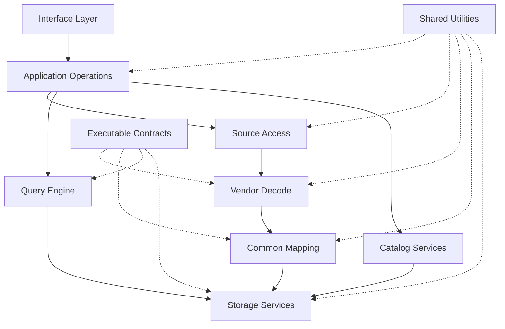
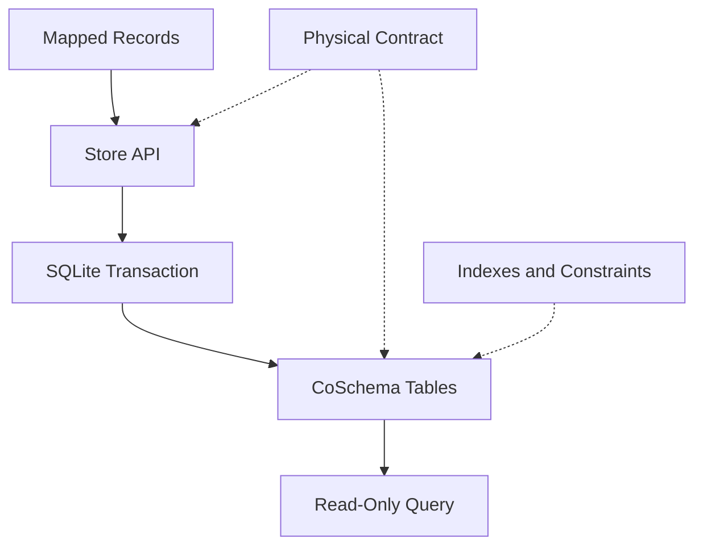
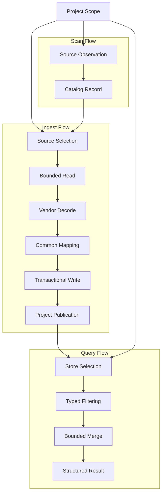
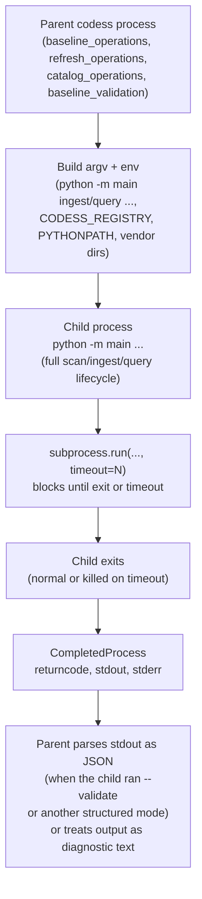
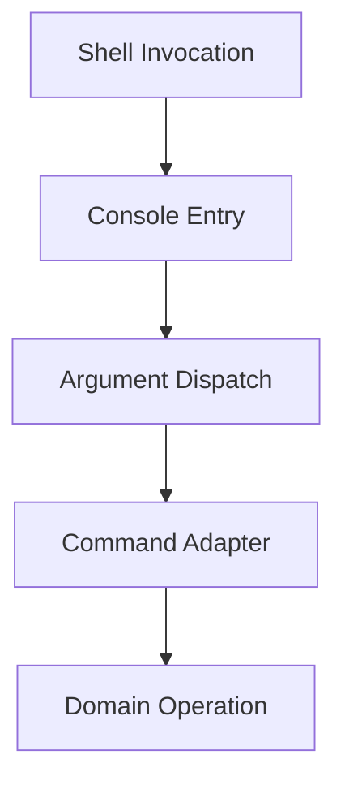

# CoPlan

CoPlan explains how Codess is implemented: which code owns each responsibility,
the allowed dependencies between components, the data passed at runtime, the
physical store implementation, and the tests that establish conformance.

It describes intended structure. Three companion documents carry what this one
deliberately does not:

| Document | Carries |
|---|---|
| [CoTasks](CoTasks.md) | Open work items and the prioritized queue |
| [CoReview](CoReview.md) | Findings, measurements, and the rule each left behind |
| [CoNotes](CoNotes.md) | Duplication and constant audits, and observed process misses |

Product capabilities and functional rationale are in [Codess](Codess.md) and
[Designs](Designs.md), and are not restated here unless they impose a concrete
software boundary or verification obligation.

## Table of Contents

- [1. Implementation Scope](#1-implementation-scope)
- [2. Repository Layout](#2-repository-layout)
- [3. Architecture](#3-architecture)
- [4. CoSchema Read and Write Path](#4-coschema-read-and-write-path)
- [5. Data Flows](#5-data-flows)
- [6. Vendor Record Processing](#6-vendor-record-processing)
- [7. Common Conversion and Mapping](#7-common-conversion-and-mapping)
- [8. Database Lifecycle and Indexing](#8-database-lifecycle-and-indexing)
- [9. Command-Line Interface](#9-command-line-interface)
- [10. Quality Requirements](#10-quality-requirements)
- [11. Test Structure and Coverage](#11-test-structure-and-coverage)
- [12. Current Implementation Status](#12-current-implementation-status)

## 1. Implementation Scope

By this point, the reader has already seen how to start Codess, why the product
exists, and which functional rules its conversions must preserve. CoPlan begins
at the software boundary. It identifies the code that owns each responsibility,
the allowed dependencies between components, the data passed at runtime, the
physical store implementation, and the tests that establish conformance.

This document describes intended implementation architecture, and Section 12
states what of it exists. Where the current code diverges, the finding and the
measurement that decided its disposition are in [CoReview](CoReview.md), and any
unresolved work is a numbered item in [CoTasks](CoTasks.md) with completion
evidence. Product capabilities and functional rationale are not restated here
unless they impose a concrete software boundary or verification obligation.

Vendor record processing receives the most implementation attention because it
contains the greatest structural variation and uncertainty. Catalog,
publication, raw evidence, refresh, and retention are supporting services. They
remain important, but do not define vendor meaning or common query semantics.

## 2. Repository Layout

This is a static filesystem map: it answers where implementation, contracts,
tests, catalogs, and maintenance wrappers live in the source tree. It does not
show imports, runtime calls, database contents, or deployed data locations.

```text
CodeSess/
├── main.py                     # source-tree development entry
├── pyproject.toml              # package and codess command
├── src/
│   ├── cli/                    # command adaptation and rendering (flat)
│   └── codess/                 # source, domain, store, query, operations
│       ├── adapters/           # one vendor decoder per source system
│       │   ├── cc.py
│       │   ├── codex.py
│       │   └── cursor.py
│       ├── vendor_audits/      # bounded structure-only evidence audits
│       │   ├── claude_features.py
│       │   └── codex_features.py
│       └── *.py                # flat modules: catalog, store, query,
│                                # scan/ingest coordination, snapshot,
│                                # retention, evidence, per-vendor source
│                                # access, and shared utilities together
├── schema/
│   ├── coschema/               # current common contract and SQLite DDL
│   ├── mappings/               # vendor mapping profiles
│   └── *.json                  # query, result, policy, and selection contracts
├── catalog/                    # reviewed Project policies and evidence
├── experiments/                # bounded investigations and review notes
├── tests/                      # unit, contract, CLI, and integration tests
└── tools/                      # thin focused maintenance wrappers
```

`adapters/` and `vendor_audits/` are the only subpackages under `src/codess/`;
every other module in that package -- catalog, store, query, scan/ingest
coordination, snapshot, retention, evidence, per-vendor source access
(`codex_source.py`, `cursor_source.py`), and shared utilities -- is a flat
file at the same directory level, not grouped into further subdirectories.
The Component Responsibilities table and the Dependency Rules below
are the actual grouping and boundary authority; this diagram shows where
files sit on disk, which is coarser than and does not substitute for either.
A prior version of this diagram implied a directory split by concern (source
access, domain, store, query, operations) that does not exist in the source
tree; the dependency rules those directories would have encoded are enforced
in code today independent of physical file placement.

The installed entry point is `codess.project:console_main`. Normal users invoke
`codess`; modules below `src/` are implementation surfaces rather than separate
applications.

## 3. Architecture

### 3.1 Software Layers

The diagram is a static code-dependency model, not a function call tree or
runtime data flow. A solid arrow means that the upper component may import or
depend on the public interface of the lower component. It does not assert that
every invocation follows the complete chain. Dashed lines mean that executable
contracts and shared utilities constrain or support several layers without
owning their domain behavior.



Vendor decoding and common mapping are adjacent but separate. The former knows
the source record; the latter knows CoSchema classifications and content
policies. Query and catalog services share storage infrastructure but do not
enter the ingest chain. Runtime records flowing through these components are
shown later under Data Flows.

### 3.2 Component Responsibilities

“Behavioral authority” means the component in which the behavior is implemented
and which must change when that behavior changes. It is not a named human
maintainer, a documentation location, or a list of every caller. “Implementation
location” identifies the current code; the dependency diagram identifies
permitted consumers; Designs, CoSchema, and the vendor schema documents remain
the authorities for functional meaning rather than code ownership.

| Component | Implementation location | Behavioral authority |
|---|---|---|
| Interface layer | `codess.project`, `cli.*_cmd` | Parse the public CLI, adapt arguments, render output, and return exit status. |
| Application operations | `scan`, `query_api`, `refresh_operations`, `baseline_operations`, `ingest_sources`, `ingest_publication`, and currently parts of `cli.ingest_cmd` | Coordinate one use case without defining vendor formats or physical schemas. |
| Project catalog | `project_catalog`, `catalog_operations`, `project_annotations`, `registry_store` | Project identity, locations, workspace bindings, selection, and observations. |
| Source access | `bounded_jsonl`, `codex_source`, `cursor_source`, plus Claude selection in `scan` and ingest coordination | Locate and read attributable source records with stable locators and bounds. |
| Vendor decode | `adapters.cc`, `adapters.codex`, `adapters.cursor` | Interpret one selected source family and emit source-annotated candidate Sessions and Events. |
| Common mapping | `mapping`, `field_state`, `content_processing`, `context_content`, `tool_identity`, `tool_result_status`, `ingest_review` | Apply common classifications, field-state rules, content policy, diagnostics, and mapping evidence. |
| Storage services | `store`, `schema_contract`, `identity`, `processing_contract`, `raw_store`, `snapshot` | Enforce CoSchema, transactions, identities, publication, and retained evidence. |
| Query engine | `query_api`, `investigation`, `configuration_audit`, `artifact_correlation` | Execute typed predicates, bounded merge, expansion, correlation, and structured results. |
| Operational services | `refresh_*`, `baseline_*`, `retention`, `storage_report`, `source_verification` | Compose updates, verify publication, resolve evidence, report storage, and perform reviewed cleanup. |
| Evidence audits | `vendor_audits.claude_features`, `vendor_audits.codex_features`, `cursor_feature_audit`, `codex_parent_audit`, `mcp_audit`, `orientation_audit`, `token_usage` | Measure a bounded source or stored capability without authorizing a mapping. |
| Shared utilities | `config`, `helpers`, `fileio`, `resources`, `resource_policy`, `sanitize`, `progress` | Configuration, safe I/O, resource control, sanitization, and progress reporting. |

### 3.3 Dependency Rules

- Source-access modules may know vendor storage but not CoSchema query behavior.
- Adapters may depend on common mapping and content helpers but not query,
  catalog publication, or command renderers.
- Store and query code must not parse vendor records.
- Query reads normalized stores and must not invoke adapters.
- Cursor table and key-range knowledge belongs in `cursor_source`, not in scan,
  ingest commands, or the adapter.
- Codex active/archive traversal and selection belongs in `codex_source`.
- DDL exists only in `schema/coschema/sqlite/schema.sql`.
- Administrative wrappers call domain operations instead of implementing a
  second workflow.

Focused evidence audits may inspect a vendor store directly when the source
shape itself is the subject of the audit. That exception is read-only,
explicitly bounded, and prohibited from becoming an alternate ingest path.

The exception is a permission, not a preference, and it should be taken only
where a source-access module does not already own the storage in question.
`cursor_feature_audit` relied on it and should not have: `cursor_source`
already owned Cursor connections and key ranges, so the audit's own
connection was a second, weaker implementation of a solved problem rather
than access the exception was needed for. Its queries now live with the rest
of Cursor selection, and the audit owns the report. Where the exception
does still apply -- an audit over a vendor shape no ingest path reads -- the
bound is the same: read-only, structure-only, and not a second decode.

Cross-cutting utilities remain content-neutral unless their stated purpose is
content processing. Logging, progress, resource observation, and catalog code
must not become hidden vendor parsers.

### 3.4 Snapshot File-Access Case Study

The Component Responsibilities table assigns `snapshot` sole behavioral authority over "publication
and retained evidence." Before the consolidation described here, that
assignment was true in intent but not in the code: the physical layout it
governs -- `.codess/`, `current.json`, `manifest.json`,
`raw-manifest.jsonl`, and related filenames -- was independently
constructed and, in several cases, independently *read and hash-verified*
by twelve modules with no shared implementation. This section records what
was found, because the specific shape of the duplication is the evidence
for the dependency rules above, not merely a historical note.

#### 3.4.1 What Was Duplicated

Every module below had its own literal `".codess"`, `"current.json"`,
`"manifest.json"`, or `"raw-manifest.jsonl"` string, constructing the same
paths `snapshot.py` already constructed, for a reason specific to that
module's own stated purpose:

| Module | Stated purpose | What it needed from snapshot files |
|---|---|---|
| `baseline_operations` | Baseline preservation, apply, fixed-point workflow | Legacy-store archival, working-store reset gated on a readable current snapshot |
| `baseline_validation` | Read-only snapshot verification | An independent pointer/manifest read-and-hash-verify, parallel to `snapshot.py`'s own |
| `catalog_operations` | Batch onboarding, Project-location lifecycle | Whether a Project's current snapshot has fully captured raw records |
| `retention` | Retention planning, validated pruning | The strictest read: pointer, manifest, raw manifest, and every store hash, plus containment and identity checks before permitting deletion |
| `project_annotations` | Catalog annotations for reporting | Best-effort snapshot facts (session/event counts, raw mode) for a report row |
| `refresh_operations` | Staged refresh orchestration | Best-effort raw-mode inference to pick a sensible default for the next refresh |
| `project_catalog` | Project identity, locations, durable roots | A verified current `snapshot_id`, consumed by three internal call sites with three different fault-tolerance needs |
| `source_verification` | Locate an Event's original bytes and report whether they still match | Locating which ancestor directory of a store path is a snapshot root |
| `storage_report` | Dated storage observations | A whole-registry, unverified scan of every Project's current snapshot for size/inventory reporting |
| `cli.ingest_cmd` | Ingest CLI command | Runtime-report path, current-snapshot-id lookup, and a sealed-snapshot check gating raw capture upgrade |
| `cursor_source` | Cursor discovery and read-only SQLite access | An unrelated file, `source-links.json`, under the same `.codess/` directory |
| `project` | Project/Git roots, CLI dispatch | The same `source-links.json`, for Claude slug resolution |

Three of the twelve (`project_catalog`, `cli.ingest_cmd`'s
`_current_snapshot_id`/`_current_snapshot_is_sealed`, and
`catalog_operations`) read `current.json` and used its `snapshot_id`
**without verifying `manifest_sha256` at all** -- not a weaker version of
`snapshot.py`'s check, an absent one. A tampered or stale pointer in any of
these paths would have been trusted silently.

#### 3.4.2 Why It Duplicated Rather Than Reused

No module above imported `.codess`/`current.json` from a broken build --
each added its own literal because the module already existing at the time
needed one fact from the snapshot layout, `snapshot.py` did not yet expose
a function returning exactly that fact, and adding one inline string was
smaller than extending the shared module. Repeated across twelve additions
over time, this produced the file-literal duplication without any single
change being the wrong call in isolation -- the structural gap was the
absence of a rule requiring the *next* need to route through `snapshot.py`
rather than repeat the pattern that had worked eleven times already.

The two verified-vs-unverified variants split along a further-avoidable
axis: `current_snapshot()` (formerly `resolve_current_snapshot`) already
existed and performed the correct check when several of the unverified call
sites were written; they did not fail to find it because it was hard to
find, they constructed their own read because a three-line inline read
looked equivalent to a function call and the missing hash comparison was
not visible without deliberately comparing the two.

#### 3.4.3 What Changed

- Every filename and directory-name literal above moved to `config.py`
  (`STORE_DIR`, `CURRENT_POINTER_FILE`, `MANIFEST_FILE`, `MANIFEST_BACKUP_FILE`,
  `RAW_MANIFEST_FILE`, `SNAPSHOTS_DIR`, `LAST_INGEST_REPORT_FILE`,
  `PROJECT_FILE`, `SOURCE_LINKS_FILE`, `WORKING_ARCHIVES_DIR`), which
  `snapshot.py` itself now imports rather than defining locally -- a single
  source for a name any module may cite, independent of whether that module
  also uses `snapshot.py`'s functions.
- The three unverified `current.json` reads (`project_catalog`,
  `cli.ingest_cmd`, and the read/verify logic in `retention` and
  `baseline_validation`) were redirected to call `current_snapshot()`
  instead of re-reading the pointer file, closing the missing-hash-check
  gap as a side effect of removing the duplication, not as a separate
  change.
- `retention._validate_current` keeps genuinely additional checks
  `current_snapshot()` does not perform (containment inside the Project's
  own `snapshots/` directory, snapshot-name-equals-snapshot-id identity,
  raw-manifest hash, per-store hash, SQLite `quick_check`, raw-object
  presence and size) -- these remain local to `retention.py` because they
  exist specifically to gate a destructive pruning decision, not because
  the consolidation was incomplete. A function that already performs a
  stricter check than the shared primitive is not evidence of remaining
  duplication; only an *independent, weaker* reimplementation is.
- `refresh_operations` and `project_annotations`'s best-effort reads (raw
  mode inference, annotation facts) were also redirected to
  `current_snapshot()`, even though their prior unverified behavior was
  low-risk by design (both already degrade gracefully on any read failure)
  -- consistency of "one function reads the pointer" was judged more
  valuable than preserving each site's slightly different historical
  tolerance for a stale pointer.
- The raw `hash_file`/comparison calls this consolidation exposed (nine
  sites in `snapshot.py` alone) were themselves collapsed into four shared
  `fileio` primitives -- `read_hash` and `write_hash` for small JSON
  documents whose content a caller needs afterward, `verify_hash` for
  pass/fail checks on files that may be large (a raw-capture object, a
  SQLite store) and must stream rather than be held in memory, and
  `rewrite_hash` for a verified read-modify-write. `CODESS_NO_HASH` /
  `--no-hash` is a recovery/debugging bypass built on
  the same primitives, not a separate mechanism -- every module that calls
  `read_hash`/`verify_hash`/`rewrite_hash` observes the bypass identically,
  rather than each needing its own opt-out check.
- Two functions with unrelated implementations shared the name
  `current_store_paths` (`snapshot.py`'s single-Project verified accessor
  and `storage_report.py`'s unverified whole-registry scanner). Renamed to
  `current_stores` and `all_store_paths` respectively so the name no longer
  implies they are interchangeable.

#### 3.4.4 What This Predicts Elsewhere

The mechanism observed here -- a module needs one fact from a file another
module already owns, a three-line inline read is smaller than a shared-code
change, the inline read silently drops a check the canonical path performs
-- is not specific to snapshot files. [CoTasks](CoTasks.md)
tracked the Cursor SQL boundary as a comparable case: a second
module reimplementing access to state its owning module already exposes.
Any future audit for the same pattern should look for the same three
preconditions -- a shared physical format, more than one module reading it
for a locally justified reason, and no runtime or lint check requiring the
canonical accessor -- rather than searching for the specific filenames
already fixed here.

## 4. CoSchema Read and Write Path

This section concerns the physical and code realization of the store, not the
logical entity design. CoSchema remains authoritative for entities,
cardinalities, fields, and vocabularies. Repeating its entity-relationship
diagram here would create a second schema description; the implementation view
instead shows where records are checked, written, indexed, and read.



| Store concern | Responsible component | Enforcement |
|---|---|---|
| Physical initialization | `schema_contract`, `store.init_db` | Package verification, DDL execution, application ID, schema version, constraints, and indexes |
| Project and Source identity | `identity`, `store.sync_project_catalog`, `store.ensure_source` | Stable IDs, observed locations, Source revisions, and provenance keys |
| Session replacement | `ingest_pipeline`, `store.replace_session_events`, `store.replace_source_sessions` | Source ownership, transaction rollback, stale-row removal, and state advancement after commit |
| Relationships | `store.upsert_event` and specialized recorders | Foreign keys plus source-supported Interaction, Model Turn, tool, content, and Artifact edges |
| Content and processing | `content_processing`, `store.record_processing_run` | Bounded content identity, derivation links, policy identity, and transformation evidence |
| Diagnostics | `ingest_review`, mapping diagnostics in `store` | Source-, record-, and field-scoped limitations retained beside usable records |
| Read access | `store.connect`, `query_api` | Read-only connections, qualified predicates, deterministic order, and global limits |

Adapters construct source-supported candidate relationships. Common mapping
classifies them. Store code validates and persists them; query code follows
persisted edges but never manufactures a missing relationship.

## 5. Data Flows

This diagram describes runtime data movement. Unlike the dependency diagram,
its arrows mean that observations or normalized records pass between stages.
Scan ends in catalog observations; ingest ends in a published Project store
set; query starts from selected stores and ends in a bounded result.



### 5.1 Scan

`scan.run_scan` is index-led. It uses Claude indexes or path bindings, Codex
`session_meta` records, and Cursor workspace/header metadata. Explicit bounded
Git discovery can locate repository boundaries; ordinary scan does not recurse
through every file below a work root.

Scan writes observations, not normalized Events. Its Session and Event counts
are source-system metrics and can differ from normalized store counts.

### 5.2 Ingest

`cli.ingest_cmd` coordinates the run. Vendor access and adapters produce
records; `store` owns SQLite transactions. State advances only after the
source-owned normalized replacement commits. A valid empty Source removes
stale normalized records from that Source and records an informational
diagnostic.

Claude and Codex process transcript files independently. Cursor selects a
Project cohort from shared SQLite state and replaces the Sessions owned by that
selected database observation in one transaction.

### 5.3 Query

`query_api` owns typed request validation, filter semantics, stable results,
facets, expansion, comparison, and byte/row limits. `cli.query_cmd` owns command
adaptation and human or structured rendering. Direct report modes remain
separate renderers over the same stores.

### 5.4 Subprocess Invocation

Several domain operations do not call `scan`/`ingest`/`query` in-process;
they launch a second `codess` invocation as a child process and read its
exit status, stdout, and stderr. This section describes that boundary --
what data crosses it, and what happens to the child on completion, timeout,
or failure -- since it is easy to miss when reading only the in-process call
graph in 5.1-5.3.



Every launch site (`baseline_operations.run_ingest`,
`refresh_operations`'s ingest/query calls, `catalog_operations.
_run_ingest_stage`, `baseline_validation.run_query_smoke`) follows the same
shape:

| Concern | Behavior |
|---|---|
| Launch | `subprocess.run([sys.executable, "-m", "main", ...], cwd=repo_root, env=env, capture_output=True, text=True, timeout=N)` |
| Environment | `env = os.environ.copy()` plus explicit overrides -- always `PYTHONPATH` (so the child resolves the same `src/` checkout without an install step) and usually `CODESS_REGISTRY`; vendor-directory env vars (`CODESS_CC_PROJECTS`, `CODESS_CURSOR_DATA`, and similar) are forwarded only by call sites that need a non-default vendor source location, not universally |
| IPC | Two channels: **exit status** (`0` accepted, nonzero rejected) and **stdout**, which is either free-form diagnostic text or one JSON document when the child ran in a structured mode (`ingest --validate`, `query` with `--output-format jsonl`); stderr is diagnostic/progress text only, never parsed |
| Timeout | An explicit `timeout=` is required at every site (3600s for ingest, 120s for the baseline query smoke test, a configurable value for refresh); `subprocess.run` enforces it |
| Termination and reap | `subprocess.run` is synchronous: it calls `Popen.wait()` internally and does not return control to the caller until the child has exited, so there is no separate reap step and no zombie-process risk from this code. A `timeout` expiring raises `subprocess.TimeoutExpired` -- the Python standard library kills the child (`Popen.kill()`) and waits for it before raising, so the child is not left running or orphaned; only `refresh_operations` catches this exception explicitly (to report a timeout as a structured failure rather than letting it propagate), the other three sites let an uncaught `TimeoutExpired` surface to their own caller |
| Working directory | Always the parent's `repo_root` (the Codess checkout), not the target Project -- the child's own `--dir`/`--registry` arguments select the Project and registry, not `cwd` |

A structurally identical but separate category launches `git` rather than
`codess` itself: `project.get_project_root` (`git rev-parse
--show-toplevel`) and `candidate_review._git_run` (arbitrary read-only `git`
subcommands for repository and worktree discovery). These use the same
`subprocess.run(..., capture_output=True, text=True, timeout=N)` shape with
a short timeout (5-10s) and treat a nonzero exit or `FileNotFoundError` as
"no Git information available" rather than a fatal error.

No launch site in this codebase uses `subprocess.Popen` directly, threads a
long-lived child, or manages a process pool; every child is a single
bounded request-response invocation. One test uses `Popen`
(`test_cli.py`), reading the child's stdout line by line to assert that
query output streams rather than buffering to completion -- which is a
property of the child that `subprocess.run` cannot observe, since it
returns only after exit. That is an assertion about a launch site, not
another one. A future streaming or long-running
subprocess use case would need its own lifecycle design -- this section
describes only the pattern actually implemented.

## 6. Vendor Record Processing

Vendor record processing is the most specialized part of Codess. Each source
family has different selection indexes, storage envelopes, ordering evidence,
role semantics, tool lineage, context records, and update behavior. An adapter
therefore owns interpretation of one selected source family; it does not own
Project identity, common vocabulary, SQLite layout, publication, or query.

### 6.1 Adapter Contract

Source access supplies an adapter with bounded records plus a Source revision,
stable locator, selected Project, and any direct Session-level metadata. The
adapter emits candidate Sessions and Events that retain exact source type,
subtype, role, identifier, order, and field provenance. Candidate records may
also carry tool, configuration, context, lineage, status, and Artifact evidence
for the common conversion stage.

Every adapter must handle these cases independently:

- a valid record that emits one, several, or no common Events;
- an optional field that is absent, null, empty, malformed, or unsupported;
- a record with useful source evidence but no accepted common classification;
- content that is external, structured, non-text, or over a configured bound;
- direct, structurally mapped, inherited, ambiguous, and unavailable
  relationships; and
- a source format that changes without changing every surrounding record.

Adapters stream or group only as much as the source relationship requires.
They attach mapping candidates and diagnostics but do not write SQL. Current
violations of that boundary are recorded in the code review.

### 6.2 Claude Code Records

Claude Code uses Project-scoped JSONL trees under `~/.claude/projects`. Its
directory slug is lossy, so `sessions-index.json.projectPath`, reviewed catalog
bindings, and the selected checkout carry more authority than reversing the
slug. Main transcript files and supported subagent files are selected before
the bounded line reader enters `adapters.cc`.

| Stage | Implementation detail |
|---|---|
| Session selection | Index entries supply `sessionId`, `fullPath`, `fileMtime`, `isSidechain`, and Project path evidence; top-level and related subagent JSONL remain distinguishable. |
| Record identity | JSONL line, `uuid`, `parentUuid`, `sessionId`, and available `tool_use_id` establish record and call lineage. |
| Message decode | `user`, `assistant`, and `system` envelopes can contain strings or typed `text`, `tool_use`, and `tool_result` blocks; one source line can emit several Events. |
| Participant decode | A `user` envelope can contain a direct prompt, local-command control, delegated task, compacted context, or tool result. Prompt-origin and tagged-command evidence override the envelope role. |
| Context decode | `compact_boundary` and its `isCompactSummary` record become related context Events; system/project instructions, attachments, memory, and product state remain separately classified. |
| Tool decode | Tool-use IDs link calls and results; permission denial is separated from other failures; persisted output paths are validated inside the Session subtree before becoming external content. |
| Configuration | Assistant message model and usage service tier are direct observations; harness version and Session titles remain separate metadata. |
| Session relations | `isSidechain`, agent fields, fork context, and explicit parent identifiers can support a subagent relation; time or path proximity cannot. |

Claude's envelope role cannot be copied directly into `actor_kind`. A `user`
envelope containing `tool_result` is a tool result; one containing
`<local-command-caveat>` is harness context; one containing
`<local-command-stdout>` is harness-produced command output; and one marked
`isCompactSummary` is injected compacted context. Treating all four as human
prompts would corrupt prompt counts, response pairing, and utilization reports.
The adapter therefore classifies the typed block or tagged payload before it
uses the envelope role.

Non-message records require an explicit retention decision. Current behavior
and remaining work are:

| Source case | Current decision | Remaining action |
|---|---|---|
| Image-only user record | Record `attachment_only_records`; do not emit empty human text | Define Artifact/content-link mapping before retaining the image as searchable content |
| `attachment` product-state record | Emit bounded attachment type, item count, initial/command flags, and content-presence metadata; do not copy an unbounded body | Validate newer attachment shapes and decide which fields support search |
| `toolUseResult.persistedOutputPath` | Accept only a path inside the selected Session tree and retain it as related external content | Done: the size is checked before the read and an oversize body is refused with a recorded locator |
| `isSidechain`, `agentId`, fork context, or parent field | Preserve each observed field; create a Session relation only when an explicit parent identity resolves | Measure field availability by Claude Code release and report unresolved parentage |
| Mode, permission, title, queue, snapshot, and similar product state | Emit the currently mapped bounded subtypes; retain unknown shapes as diagnostics rather than message text | Add a subtype only when it has defined query or reconstruction value |

`vendor_audits.claude_features` inventories these shapes and field-presence
rates without retaining content bodies.

### 6.3 Codex Records

Codex stores active and archived rollout JSONL in separate trees. `codex_source`
builds an inventory from `session_meta` before ingest and selects Sessions by
their reported working directory and approved Project bindings. Archive
location is observation evidence, not a different Session identity.

| Stage | Implementation detail |
|---|---|
| Session selection | `session_meta.payload.id`, `cwd`, CLI version, source surface, and active/archive location define the selected rollout and its Session metadata. |
| Record envelopes | `session_meta`, `response_item`, `event_msg`, `turn_context`, and `compacted` have different authority; notification records do not automatically duplicate canonical content. |
| Message decode | Role-bearing response items supply human, developer, system, or model content; reasoning summaries remain distinct from ordinary model responses. |
| Tool decode | Function, custom, web, and tool-search request/result variants retain exact names and call IDs; output linkage uses explicit source identifiers rather than adjacency. |
| Context decode | Developer/system messages, request context, compaction replacement history, and context-compacted notifications remain distinguishable. Encrypted content stays opaque. |
| Turn decode | `turn_context.payload.turn_id` supplies Model Turn identity; model, provider, effort, speed, service tier, and collaboration mode are nullable independent settings with direct or explicit inherited provenance. |
| Lifecycle | Task start/completion, abort, thread settings, and supported collaboration records become typed lifecycle or configuration evidence rather than message text. |
| Session relations | Parentage is stored only from an explicit identifier that resolves to an observed Session. Active/archive location, chronology, and similar content do not establish it. |

The rollout is an execution log, not a guaranteed copy of the complete
harness-to-model transport. Codess therefore claims completeness only for the
selected locally retained records. It does not infer hidden planning, encrypted
reasoning, or omitted request/response traffic.

| Source case | Current decision | Remaining action |
|---|---|---|
| Canonical `response_item` plus an `event_msg` notification carrying the same message or reasoning | Retain the `response_item`; count the notification as a known duplicate envelope | Extend duplicate-shape fixtures when Codex adds notification variants |
| `response_item.reasoning.summary` and `encrypted_content` | Store exposed summary text as reasoning-summary content; never decode encrypted reasoning. Encrypted compaction content remains bounded opaque context | Verify each placement of `encrypted_content`; field spelling alone cannot determine its meaning |
| `turn_context` or settings update followed by Events | Attach only directly observed settings and explicitly inherited settings to subsequent Model Turns; keep provenance for each value | Define and test termination at the next replacement setting, Turn, or Session boundary for every supported field |
| Collaboration begin/end records | Emit lifecycle/activity Events; do not create a separate Session merely because an agent nickname or operation appears | Create parent/child Sessions only from stable child and parent identifiers observed in rollout metadata |
| `parent_thread_id` or `forked_from_id` | Preserve the exact field and create the corresponding relation only when the referenced Session resolves | Audit positive, missing, and dangling identifiers by supported release |
| `compacted` envelope plus `context_compacted` notification | Emit the replacement-history compaction once from `compacted`; suppress the notification duplicate | Verify that newer compaction item variants retain the complete searchable summary or mark opaque/partial content explicitly |

`vendor_audits.codex_features` measures general record and setting shapes;
`codex_parent_audit` measures resolvable, missing, and dangling parent evidence.

### 6.4 Cursor Records

Cursor combines workspace-local SQLite state with a large shared global
database. Project attribution must be established before bubble decoding.
`cursor_source` resolves workspace bindings, reads current `composerHeaders`,
uses workspace `composer.composerData` only as a provenance-labelled fallback,
and selects indexed key ranges for the resulting composer IDs.

| Stage | Implementation detail |
|---|---|
| Project selection | `workspace.json`, header `workspaceId`, fallback composer indexes, catalog bindings, and explicit source links determine the selected Project cohort. |
| SQLite access | Query-only connections include the live WAL, use bounded busy timeouts, and issue prefix ranges over composer IDs; unrelated global rows are not decoded. |
| Source records | `composerHeaders`, `bubbleId:*`, `messageRequestContext:*`, and selected `composerData:*` values have separate Session, Event, context, and diagnostic roles. |
| Value decode | Bubble values are normally UTF-8 JSON with a supported base64-wrapped fallback. Only mapped fields are projected before composer ordering and grouping. |
| Message decode | Bubble type is source evidence, not sufficient participant evidence. Direct user bubbles and assistant-shaped bubbles emit messages only when usable message or tool evidence exists. |
| Tool decode | `toolFormerData`, nonempty legacy `toolResults`, source status, `userDecision`, and call identifiers produce linked calls, results, permission decisions, and application-failure evidence. |
| Context decode | `conversationSummary`, truncation boundaries, request-context values, and context-window observations become bounded context Events or metadata without duplicating summary bodies. |
| Model decode | A non-default `modelInfo.modelName` governs the following inferred Model Turn with inherited provenance; missing or `default` values do not invent a model. |
| Repetition | Within one composer, matching source type and `serverBubbleId` can prove physical duplication. Equal content, repeated tools, or similar responses remain separate Events. |
| Update detection | Selected headers, fallback indexes, bubble ranges, and request-context ranges form the Project change marker; whole-database modification time is only a cheap container observation. |

Cursor still violates the intended source-access boundary:
`adapters.cursor` previously opened SQLite and executed bubble and
request-context queries, which prevented testing decode from bounded source
records alone and spread vendor table knowledge across two components. The Cursor boundary
moved all Cursor SQL, connection handling, and key-range iteration into
`cursor_source`. The adapter now requests records by path and has no SQLite
dependency; its remaining `cursorDiskKV` references are record-type labels
retained as source evidence.

| Source case | Current decision | Remaining action |
|---|---|---|
| Composer absent from headers but present in workspace `composerData` | Use the workspace index only as a provenance-labelled fallback | Measure false attribution and stale entries before treating the fallback as equivalent to a header |
| Composer absent from both indexes | Do not attribute it to a Project from content or chronology alone | Report it as unbound source evidence and require an explicit catalog binding if it matters (coverage reporting) |
| Agent/subagent-looking Composer state without a stable parent ID | Preserve the source fields; do not manufacture a parent Session | Identify and validate an explicit Cursor parent/child field before adding the relation |
| File-backed or oversized context/tool content | Keep the reference and bounded metadata; do not load it as an ordinary message | Define Artifact linkage for observed reference shapes; the content access is bounded |
| Adapter projection omits a source field | The omitted field is neither normalized nor silently claimed as supported | Compare audit shape inventories with projected keys and report loss or unknown fields (coverage reporting) |

`cursor_feature_audit` performs the structure-only inventory. Measurement verifies that
selection remains bounded as unrelated global-database content grows.

**The four-module split, confirmed and corrected.** Cursor needs more modules
than the other vendors because it stores Sessions in shared SQLite databases
rather than per-session files, so selection, caching, and decode are genuinely
separate concerns. Reviewed against the closed source-access boundary, the
split holds, but one module spanned two concerns and now does not:

| Module | Owns |
|---|---|
| `cursor_source` | Selection: storage layout, connections, key ranges, and every selective SQL statement |
| `cursor_cohort` | Caching: when a captured cohort is still valid, and restoring it |
| `adapters/cursor` | Decode: selected records to common Events |
| `cursor_feature_audit` | Reporting: which counted evidence an audit states, and what each shape is taken to mean |

`cursor_feature_audit` had kept its own connection and fifteen vendor SQL
statements -- the same violation closed for the adapter, left in place
because the audit is not on the ingest path. The queries are now
`cursor_source.read_feature_evidence`, and the audit composes the report and
joins the catalog, which is Codess state rather than vendor storage. Output
is byte-identical.

The move removed a defect the boundary had concealed rather than only
tidying ownership. The audit's hand-rolled connection was weaker than the
shared one: no `query_only` pragma, no busy timeout, and no fallback for the
sidecar-free workspace shape that `connect_readonly` handles. A second,
pre-existing fault became visible once the queries sat beside the accessors
that state their preconditions -- a workspace database has no
`composerHeaders` table, so pointing the audit at one produced a bare SQLite
"no such table" rather than saying the audit is scoped to the global store.
Selection now rejects it by name.

The cohort cache stays where it is. It was worth asking whether it belongs
with source access, since both concern the shared database, but they answer
different questions: `cursor_source` decides which rows exist, and
`cursor_cohort` decides whether a capture may be reused across Projects. The
cache holds no vendor SQL, which is the test that would have shown otherwise.

### 6.5 Evidence Audits

“Audit” is Codess implementation terminology, not a vendor record type or a
CoSchema field. It does not mean a security or compliance audit. It is a
read-only, bounded source-shape measurement that answers one question without
retaining message bodies. Examples include counting Claude `user` envelopes
containing a `tool_result`, measuring resolvable and dangling Codex
`parent_thread_id` values, or comparing Cursor composers found in headers with
those found only in a workspace fallback index.

The challenge is that vendor formats are release-dependent, sparse, and only
partly documented. Observing a field proves presence and shape, but not stable
semantics, completeness, or suitability for a common mapping. Negative evidence
also matters: a parent field absent from the selected records does not prove
that the vendor never emits it. Audit output therefore records selection,
source versions, counts, field types, and unresolved cases. It must feed a
mapping decision, fixture selection, or source-to-common gap report; otherwise
the audit has no continuing purpose.

A mapping decision additionally requires understood semantics, a common or
specialized consumer, a declared retention class, and fixtures covering normal
and irregular states.

**Those four gate a mapping, not an audit, and conflating the two makes this
section read as more restrictive than it is.** An audit needs only to be
read-only, bounded, and to feed a decision. It may be a script run once,
reported, and deleted; nothing here requires a fixture or a consumer to
*look* at a vendor file. What the four requirements prevent is the step after:
admitting a field into CoSchema because it was observed, which is how a
schema acquires columns that mean nothing on the next vendor release.

The distinction matters when a survey finds something -- `~/.codex/history.jsonl`
holding prompts for Sessions with no rollout, say. Measuring it is an
audit and needs no ceremony. Deciding that a history-only Session becomes a
Session with prompts and no Model Turns is a mapping decision, and that is
where semantics, consumer, retention, and fixtures apply. The cheap middle
path this section already permits, and which record-level diagnostics now make possible, is to
record a diagnostic saying evidence exists that Codess cannot decode -- a
statement about coverage rather than a new mapping.

Audits are deliberately narrower than adapters. Feature audits omit content
bodies; parentage audits inspect only candidate lineage fields; MCP audits
distinguish discovery from actual invocation; orientation and utilization
audits operate on normalized stores. Their output belongs in generated reports,
not durable implementation claims or alternate ingest paths.

## 7. Common Conversion and Mapping

Vendor adapters expose source evidence in different shapes. The common
conversion stage gives that evidence regular names, types, identities, and
relationships without replacing the exact source designation. This stage is
implemented by shared domain modules and enforced again at the store boundary.

### 7.1 Candidate Record Boundary

A candidate Event carries Session identity, source locator, exact record type
and subtype, available order and time, source role, content, and optional tool,
model, context, status, Artifact, and lineage evidence. `mapping.annotate_mapping`
adds the selected rule, source path, and structured trace. Candidate dictionaries
are currently the adapter-to-domain interface; they are validated when stored,
but a single explicit typed boundary is not yet enforced for all three adapters.

“Dictionary” here means a mutable Python `dict[str, Any]`, not necessarily a
JSON object. Required and optional keys are established by convention across
adapter and store code. This accommodates sparse and changing vendor evidence,
but static analysis cannot reliably catch a misspelled key, an invalid value
type, or inconsistent null handling, and some failures appear only at the store
boundary.

The immediate improvement is a shared `TypedDict` family for candidate Session,
Event, tool, configuration, and diagnostic shapes plus one runtime validator at
the post-decode boundary. `TypedDict` preserves optional source-specific fields
with little conversion cost; runtime validation supplies the protection that
Python type hints alone cannot. Dataclasses can be reconsidered after the
candidate shapes stabilize. W04 includes this candidate contract as well as
mapping-profile enforcement.

### 7.2 Field States and Admission

`field_state` distinguishes absent, explicit null, empty, sentinel-valued,
malformed, unsupported, and valid values before defaults are applied.
`ingest_review` records Source-, record-, or field-scoped diagnostics.
`ingest_pipeline` decides whether a Source can be read and whether its prior
normalized rows can be replaced. A malformed optional field removes only that
mapping; missing identity or an unreadable container can reject the record or
Source at the appropriate boundary.

### 7.3 Names and Representations

| Source evidence | Common representation |
|---|---|
| Vendor record name and subtype | Exact `source_record_type` and `source_record_subtype`, plus a mapped `event_kind` when supported |
| Vendor role or envelope | Exact source role plus independent `actor_kind`, `content_role`, and `origin_kind` |
| Vendor Session or record identifier | Exact vendor ID plus deterministic common identity scoped by its source authority |
| Source order and time | Stable `sequence_no`, nullable explicit time, and separate time-basis and observation fields |
| Tool operation | Exact source tool name and call ID, optional canonical alias, structured input, results, permission evidence, and separate source/common status |
| Model setting | Nullable provider, family, exact name, revision, effort, speed, service tier, and mode in one configuration identity |
| Scalar content | Bounded UTF-8 text with original length, processing state, content identity, and searchable role |
| Structured content | Valid bounded JSON when internal shape is needed; opaque or display text remains text |
| File or URI evidence | Project-relative or external Artifact identity plus evidence-backed Event relation |
| Unknown or partial material | Exact source designation, retained evidence when selected, and a scoped diagnostic rather than a guessed common value |

Common storage uses lowercase `snake_case`; exact vendor spelling remains in
source fields and mapping traces. A source status and normalized outcome can
coexist. A source role never collapses into Actor, and one suggestive model
string does not populate unrelated configuration dimensions.

### 7.4 Content and Resource Processing

`content_processing` applies the selected pre-processing policy before bounded
retention and the post-processing policy before publication. Character decoding,
Unicode handling, control removal, secret suppression, privacy masking,
vocabulary blanking, and topical filtering are ordered and attributable.
`context_content` owns the tighter context/compaction limits. Structured tool
input and output pass through JSON normalization rather than ambiguous string
coercion.

Classification precedes the final size decision so an oversized value can be
diagnosed as a likely wrong record type, external content, or bounded derivation
instead of disappearing as an undifferentiated limit failure. Source, Session,
Event, and context bounds come from versioned policies with safe built-in
defaults.

### 7.5 Mapping Profiles and Conformance

The released profiles in `schema/mappings` declare source selectors, target
structures, operations, and one of `core`, `specialized`, `extension`,
`raw_only`, or `discard`. `schema_contract` verifies profile syntax, referenced
rules, and package integrity. Fixtures demonstrate representative source
shapes and expected common output.

The remaining enforcement gap is runtime symmetry. Adapters annotate mapped
Events, but the same post-decode conformance check and strict/diagnostic policy
do not yet govern every vendor. The intended boundary is:

1. adapter emits a source-annotated candidate;
2. common validation resolves field states and vocabulary;
3. the selected mapping rule is checked against the released profile;
4. diagnostics preserve partial, unsupported, and malformed evidence; and
5. only a conforming candidate enters transactional persistence.

This work is tracked as an item in [CoTasks](CoTasks.md).

## 8. Database Lifecycle and Indexing

Section 4 explains the code path that validates, writes, and reads CoSchema
rows during one operation. This section explains the longer-lived database
artifacts: where files are kept, what one atomic replacement includes, when a
Project store set becomes selectable, how integrity is checked, and why an
index is added. It is therefore about database lifecycle and operational
behavior rather than logical schema or repository layout.

### 8.1 Store Layout

Each Project can have source-system stores such as:

```text
.codess/
├── sessions_cc.db
├── sessions_codex.db
├── sessions_cursor.db
├── ingest_state.json
├── last-ingest-report.json
└── current.json
```

The manifest and current pointer combine the selected source-system databases
into a Project store set. Published sets are also retained in the central
registry so query and evidence access do not depend entirely on the checkout.
This layout does not change the logical entities exposed to query.

### 8.2 Transaction Boundaries

A transaction here is one SQLite atomic write unit. Codess begins the unit
before deleting or replacing source-owned rows, writes the new Session, Events,
relationships, content links, and diagnostics, and commits only after all those
writes succeed. An exception rolls back the unit, leaving its previous rows
visible. Incremental ingest state is updated only after that commit.

The transaction is deliberately smaller than a complete multi-vendor ingest:
one Claude Code or Codex transcript is one replacement unit, while one selected
Cursor database/cohort observation is a replacement unit. Project publication
is a later validated pointer change over completed source-system databases, not
part of the same SQLite transaction.

- One Claude or Codex transcript replacement is atomic.
- One selected Cursor cohort replacement is atomic.
- Source availability and normalized replacement commit together.
- Incremental state advances after commit.
- Project publication selects a complete validated result, never a partial
  working transaction.

### 8.3 Index Strategy

The physical schema indexes identity, Session ordering, source lineage,
Interactions, Model Turns, Event kinds, Actors, statuses, tools, time, model
configuration, and relationship keys used by current queries.

Index changes require:

1. a representative query;
2. `EXPLAIN QUERY PLAN` before and after;
3. relevant table cardinality and selectivity;
4. measured execution and allocation behavior; and
5. identical ordered result identities.

Do not add an index merely because a field is available. Write and storage cost
must be justified by a repeated predicate or relationship traversal.

### 8.4 Publication and Integrity

Query and source inspection use read-only SQLite connections where the platform
permits them. Ingest writes through explicit transactions with foreign keys and
source-owned replacement. A working database can change during ingest while
the Project pointer continues to select the last complete published store set;
this is staging, not partial publication.

Published stores and captured objects are immutable by identity and
verification, not by filesystem permissions. A local writer can modify a file,
but its manifest or content verification then fails. The integrity model detects
uncoordinated corruption; it is not protection against a writer able to alter
both content and its manifest.

## 9. Command-Line Interface

The `codess` command is the public application interface. Command modules adapt
arguments and render results; they should not own vendor SQL, ingest policy,
transactions, or reusable analysis. Python modules and direct read-only SQLite
remain integration surfaces, but are not parallel command implementations.

### 9.1 Configuration Resolution

Configuration resolves in four layers: safe built-ins, environment-backed
machine locations and ordinary defaults, invocation-specific CLI arguments,
and versioned JSON policies for structured content and resources. An explicit
command argument overrides its environment default. Structured policies avoid
a growing matrix of vendor-specific flags.

`config` resolves and validates machine configuration before scan, ingest, or
query. Domain modules parse content and resource policies; command adapters
pass the resolved values into application operations. The parser, policy
schemas, and `codess --help` remain authoritative for current flags and
defaults.

### 9.2 Construction and Dispatch

The installed command is constructed by the package entry in `pyproject.toml`:

```toml
[project.scripts]
codess = "codess.project:console_main"
```

`main.py` provides the equivalent source-tree development entry and delegates
to the same function. This is implementation construction. A user invocation,
such as `codess query overview --dir /path/to/project`, enters that function,
passes through `parse_and_run`, and dispatches to a command adapter.



This is a deliberately shallow runtime dispatch path, not a generated function
call graph. `scan`, `ingest`, and `query` use the primary parser and their
`cli.*_cmd` adapters. Administrative first tokens use `cli.admin_cmd`, which
then calls catalog, evidence, baseline, storage, or other domain operations.

### 9.3 Primary Commands

- `codess scan` discovers and observes candidate Project evidence.
- `codess ingest` decodes and writes source-system stores and publishes a
  Project store set.
- `codess query` searches, reconstructs, summarizes, and emits structured
  results.

### 9.4 Administrative Commands

Administrative operations are grouped under:

- `refresh` for composed Project updates;
- `catalog` for Project identity, selection, locations, and onboarding;
- `baseline` for validated publication operations;
- `evidence` for bounded capability audits;
- `schema` for current contract checks;
- `session` for operator names; and
- `storage` for observation and reviewed cleanup.

Thin scripts in `tools/` may provide familiar focused entry points, but their
logic belongs in `codess` modules and command families.

### 9.5 Structured Query Interface

The reusable query contract supports Sessions, overview, Events, and search.
Requests and results use checked-in JSON contracts. Structured output includes
scope, stable row identities, truncation/completeness information, and facets
needed by external consumers.

New predicates belong in the common typed executor when they serve repeated
use cases. Project-specific or experimental analysis can use direct read-only
SQL or external processing without expanding the public query contract.

### 9.6 Operational Reporting

Operational reporting covers command status, progress, warnings, failures, and
diagnostic context produced while Codess runs. It is separate from query result
data and from source-to-common mapping diagnostics stored in CoSchema. A record
that says an adapter could not map a vendor field belongs with the extracted
data; a record that says a source read started, consumed a number of bytes, or
failed with an I/O error belongs to operational reporting. When an operational
failure also limits extraction completeness, the durable Source diagnostic
records that effect independently.

The intended subsystem is small and synchronous. Codess does not need a
logging server, an in-process message broker, thread supervision, or a general
event bus. Standard stream writes and Python logging locks are sufficient for
the limited parallel work currently performed. An operation identifier and
ordered timestamps provide correlation when a command invokes a subprocess or
performs concurrent reads.

#### 9.6.1 Future Logging Task

**Implemented.** `codess.reporting` is the single application facility for status
logging, progress messages, and error reporting. [Report](Report.md) is the
authoritative specification -- measured costs, event structure, capability gates,
time sources, buffering, backends, profiles, the error boundary, and privacy
classes -- and what the implementation established, including one cost figure
Report over-predicted, is in [CoReview](CoReview.md#the-reporting-facility).

The design sketch that stood here is removed rather than retained beside a fuller
one: two specifications of the same subsystem is how a reader ends up
implementing the older. What remains is the boundary this document owns.

**The channel separation, which is a CLI contract rather than a reporting
detail:**

- stdout contains the requested human or machine-readable result, and nothing
  else. This is what lets `--output-format jsonl` be piped safely.
- stderr contains ordinary human status, progress, warnings, and errors.
- JSON Lines operational output carries the same events under a stable
  machine-readable contract.
- Durable ingest or refresh reports retain only selected bounded operational
  events, not the complete live log.

**`mapping_diagnostics` stays outside the facility.** It is evidence about
decoded data, stored in CoSchema and queried beside it, and subject to the
content policy that governs stored content. Applying an operational redaction
profile to it would redact the evidence a reader opened the store to see.

**A reporting call never raises into the operation it reports on.** A full disk
or a closed pipe must not abort an ingest, which would make the facility a
liability rather than an aid.


### 9.7 External Investigation Interfaces

External interface work is not part of the current implementation tranche.
This section records the reference implementations, their intersection with
Codess use cases, and the boundaries that a later design must evaluate. It does
not authorize a new report contract, dependency, service, user interface, or
export path.

#### 9.7.1 Capability Intersection

Codess must continue to own Project selection, vendor access, decode,
classification, mapping, and provenance. An external system may consume a
published database or a typed Codess result; adopting another system's raw-file
adapter would create a second, inconsistent decode path.

| Codess use case | Required interface capability | Relevant candidates | Principal gap |
|---|---|---|---|
| Project orientation | Select Project store sets; summarize source systems, Sessions, time, models, Actors, tools, and evidence coverage | Datasette; CodeBurn and Claude Monitor UX patterns | Datasette browses databases independently; the monitors summarize a narrower token/cost model. |
| Activity exploration | Apply period and cohort filters; return time buckets and breakdowns; retain unknown and incomplete measures | CodeBurn charts; ccusage periods and tables; Claude Monitor terminal views | Their measures emphasize calls, tokens, cost, quota, and inferred activity rather than Codess Events and relationships. |
| Session investigation | Search content and structured fields; expand a match through Session order, Interaction, Model Turn, tool, and Artifact links | Datasette SQL and stored queries; a Codess-native renderer | Usage-monitor payloads lack the content and relationship graph required for reconstruction. |
| Cross-Project comparison | Apply the same query and definitions to several selected Project store sets | Codess typed query; later analytical consumers | Loading several SQLite files does not itself provide a common cross-database query or reconcile scope and completeness. |
| Reuse and publication | Emit bounded JSON or CSV with stable identities, scope, ordering, provenance, and truncation state | Datasette renderers; ccusage and Claude Monitor output patterns; OpenTelemetry and Langfuse | Existing external schemas omit Codess Source and mapping evidence or assume live, complete request traces. |

#### 9.7.2 Reference Implementations

**Datasette** is the strongest direct-data candidate. It can open a published
SQLite database as immutable, provide read-only table and SQL exploration, and
return JSON or CSV without copying the records. Stored parameterized queries
could expose common Session, Event, tool, and Actor selections. Its plugin hooks
could later add Project-manifest navigation or a Codess result renderer. The
first design must account for one Project store set containing several
source-system databases, restrict arbitrary publication and database download,
preserve query limits, and avoid presenting an individual database as a complete
cross-vendor Project view. Feeding Datasette requires configuration and possibly
a small plugin; it does not require copying its server into Codess.

**CodeBurn** provides the most relevant local web presentation. Its
`src/menubar-json.ts` payload feeds both `src/web-dashboard.ts` and the React
components under `dash/src`. Period selection, metric cards, time-series charts,
ranked bars, tables, Project and Session breakdowns, compact summaries, and
freshness/error handling are useful concepts. Its data contract is dominated by
cost, model calls, cache tokens, and behavioral estimates; filling those fields
with zeros or inferred Codess values would be misleading. A later design should
compare two approaches: adapt generic MIT-licensed components to a Codess-native
endpoint, or reproduce the small visual vocabulary without carrying the
CodeBurn application structure. Its vendor providers, pricing, optimization,
guard, and yield classifiers are not integration points.

**Claude Code Usage Monitor** provides the nearest Python terminal precedent.
`output/snapshots.py` builds one versioned and confidence-labelled snapshot;
`output/formatters.py` renders machine and compact text forms; and
`ui/table_views.py` plus `terminal/themes.py` implement Rich tables and themes.
This separation is useful for a Codess result-first terminal design. Limit
windows, plan assumptions, burn forecasts, and Claude-specific session logic
must remain outside Codess. The design should compare using Rich as an optional
renderer with lifting only isolated MIT-licensed layout and display-width code.

**ccusage** is a useful CLI behavior and modularity reference. Its Rust workspace
separates source adapters, common reporting, configuration, terminal output, and
the CLI. Its date ranges, daily/weekly/monthly/Session cohorts, Project and
source-system selection, compact tables, and JSON output match common entry
points. Its token-and-cost report schema and vendor adapters do not represent
Codess evidence and are not suitable data interfaces. The useful path is to
compare commands and golden outputs while implementing equivalent controls over
the Codess query executor.

**CodexBar** is a focused quota and status application, not a Codess provider
host. Its descriptors and fetch strategies produce usage-window snapshots with
percentages, resets, credits, spend, and provider status. Its compact provider
switching, stale/error treatment, refresh behavior, charts, and separation of
core provider code from Swift UI are useful design references. A Codess provider
would be dishonest until Codess owns those measurements, and the Swift UI is too
platform-specific to adopt merely for historical Session activity. A separate
consumer of a future Codess result is more plausible than extending its current
provider enum.

OpenTelemetry GenAI conventions and Langfuse remain possible selected-export
targets. They offer trace, generation, tool, model, usage, latency, metadata,
visualization, and assessment concepts. Their live-instrumentation assumptions
do not directly describe reconstructed local history. Any design must decide
whether an Interaction becomes a trace root, a Session groups several traces,
Model Turns become generation observations, and linked tool operations become
children; it must also mark reconstruction, missing time, completeness, Source
revision, snapshot, and record identity. Content export remains explicit,
bounded, and policy-filtered.

LiteLLM is relevant only when it is intentionally placed in the live request
path and later treated as another Source. QuotaMeter supplies no useful code or
data interface. General BI systems add deployment and semantic-model work before
they improve Session reconstruction. None belongs in the first evaluation
tranche.

#### 9.7.3 Evaluation Deliverables

The backlog evaluation should produce a decision, not an implementation. It
must:

1. inventory the current Codess query results that already satisfy each early
   use case and identify missing fields or relationships without presuming a
   new public schema;
2. test the architectural viability of direct immutable Datasette access across
   the databases in one Project store set;
3. compare a Codess-native terminal result renderer with isolated reuse from
   Claude Monitor and behavioral compatibility with ccusage;
4. compare adapting CodeBurn's generic web components with implementing a small
   Codess-native local view;
5. specify any proposed result or export contract, including Project and
   snapshot scope, identity, ordering, units, unknown values, completeness,
   truncation, content policy, and versioning;
6. assess license attribution, dependency weight, update coupling, local-server
   security, privacy, and test obligations for each reuse or integration; and
7. recommend staged implementation work, acceptance criteria, and explicit
   rejections for approaches that duplicate vendor decode or misstate evidence.

## 10. Quality Requirements

### 10.1 Accuracy and Completeness

Accuracy means that every normalized identity, value, order, and relationship
represents the selected source evidence and its declared mapping. Completeness
means that every supported record and relationship inside the declared
selection boundary is retained or explicitly accounted for. Success does not
imply support for an entire Source family, vendor release, Session, or field
set.

The conversion and query paths must satisfy these requirements:

- source selection identifies its Project, source system, Source revision, and
  applicable support boundary;
- source-field states remain distinguishable through decode, mapping, and
  diagnostics;
- identity, ordering, Actor classification, and relationships are not inferred
  without a documented evidence basis;
- unknown shapes, ambiguous attribution, exclusions, malformed fields,
  transformations, truncation, and external content remain visible; and
- an important query result can be traced to its stable common identities,
  source locator, mapping evidence, processing state, and result limits.

Supported, unsupported, excluded, rejected, partial, and diagnosed material
must reconcile with the declared selection. A successful partial conversion
must not present itself as complete merely because some values were usable.

### 10.2 Resource and Performance Requirements

Source work should be proportional to the selected Project and records, not to
the complete contents of a shared vendor store. Readers use vendor indexes,
key ranges, bounded streaming, and selective SQLite queries where the Source
permits them. Conversion uses explicit transactions and bounded content;
queries push typed predicates into each selected store, use justified indexes,
and merge globally bounded ordered results.

Large inputs are classified before content limits decide whether to retain,
derive, externalize, or reject them. Hashing and copying stream. Transient
buffers are released after the relevant record or transaction, and progress
identifies the active phase of work. An alternative search or storage engine
requires a measured workload that the existing design cannot satisfy.

### 10.3 Change Traceability

A change is complete when its original requirement can be followed through the
necessary design decision, implementation owner, and validation evidence. Not
every change modifies every artifact; the affected contract determines the
path.

| Stage | Required decision or evidence | Completion condition |
|---|---|---|
| Requirement | Named use case, defect, source gap, or measured limitation, recorded as a [CoTasks](CoTasks.md) item | Scope, priority, affected vendors or components, and expected outcome are explicit |
| Source analysis | Representative exact records, field states, source versions, and relationship evidence | The observed source behavior and unsupported cases are reproducible |
| Design | Functional rule in Designs, source interpretation in the vendor schema, common contract in CoSchema, or component plan here | Only the documents and executable contracts whose authority changes are updated |
| Implementation | Changes in the modules that own source access, decode, mapping, store, query, or interface behavior | Dependency boundaries remain intact or the deviation is recorded |
| Automated validation | Focused unit/contract cases followed by the complete suite | Normal, malformed, partial, and failure paths produce stable expected identities and diagnostics |
| Real-source validation | Smallest current Project with the affected shape, then additional vendors or scale only when claimed | Normalized rows and query results agree with inspected source evidence |
| Release and operation | Package identity, user workflow, or operational guidance only when those surfaces changed | Published contracts and instructions identify the resulting behavior without transient corpus detail |

The work-item ID is the traceability key. Code-review findings cite that ID,
and completion evidence is recorded against the same item rather than in a
separate chronology.

### 10.4 Secure Coding

Codess constructs SQL from selected filters, schema-adaptive column lists,
and vendor-derived key ranges throughout the store, query, audit, and
Cursor-access code. String-built SQL is therefore routine here, not
exceptional, and the standing rule is one of construction discipline rather
than an outright ban on string composition:

- every bound value reaches SQLite through `execute(sql, params)`'s
  parameter argument, never through interpolation into the SQL text;
- SQL text may itself be built from an f-string or concatenation only when
  the interpolated fragment is a `?`-placeholder skeleton (e.g.
  `",".join("?" for _ in values)`), a column or table name drawn from a
  fixed literal set (a Python tuple or dict key list in the surrounding
  function, not derived from filter input), or a column name resolved by
  schema introspection (`PRAGMA table_info`) and passed through
  `cursor_source.quoted_column`/`table_columns`, which escape embedded `"`
  characters before quoting; and
- no other source of SQL-text interpolation is permitted; a new pattern
  requires either a documented addition to this list or removal.

This rule exists because a static scanner cannot itself decide which of
these string-built statements are safe: it can only recognize the shape
"SQL text built by string operation," not which values fed that operation.
Distinguishing a `?`-skeleton or a schema-checked identifier from actual
attacker-reachable data is a judgment call that requires reading the
surrounding function, not a property the scanner can compute. Every
`# noqa: S608` in the codebase is a recorded instance of that judgment call,
not a blanket suppression.

#### 10.4.1 Verification Method

Ruff's `S608` (`flake8-bandit` possible-SQL-injection) rule flags any SQL
string assembled with an f-string, `.format()`, `%`, or concatenation,
independent of whether the interpolated fragment carries a value. The
verification pass read every hit across `src/` at the source line, not
accepted or dismissed from the rule name alone, and classified each into
exactly one of the three permitted patterns above; none matched a fourth,
unrecognized pattern, and no exploitable injection was found.

Neither the count of currently-suppressed sites nor the list of files that
carry them belongs in this document: both change as sites are read,
rewritten under the criteria below, or newly introduced and
reviewed, and a number or file list written into prose goes stale the next
time either happens without anyone updating the text. Run
`tools/report_sql_suppressions.py` for the current figures instead of
citing one here; it also flags any `S608` finding that is *not* currently
suppressed, which is the signal that actually matters day to day -- a
nonzero result there means a site was added since the last review pass, or
an existing exemption was removed without a rewrite, and needs the same
read-and-classify treatment as every other site before it ships.

Each remaining site is covered by a file-level
`[tool.ruff.lint.per-file-ignores]` entry in `pyproject.toml` (see Suppression Mechanism below), added
only after manual verification (not before). A source file carries at most a
single-line pointer at its first S608 site or in its module docstring naming
the permitted pattern its sites use, so the suppression is locally traceable
rather than opaque at the point a reader encounters it.

This is the model for any future rule where the scanner's finding rate and
its true-positive rate diverge: run broad, read every hit once, classify
against a small fixed set of named-safe shapes, suppress only the
classified hits with a reason, and leave everything else flagged.

#### 10.4.2 Rewrite Versus Suppress

A verified-safe hit does not automatically mean `# noqa` (or, since the
per-file exemption in `pyproject.toml`, no source annotation at all — see
10.4.4) is the answer; some sites have a rewrite that clears the warning
outright. Which applies depends on which pattern the site matches.

##### 10.4.2.1 `?`-Placeholder Skeletons

No rewrite avoids the underlying construction: SQLite's parameter binding
has no variable-arity `IN (?, ?, ...)` form, so the placeholder-count
string must be built dynamically regardless of which operator does it.
Two mechanical options exist for the *operator* choice, not the underlying
need:

- Single-line query: `"".join((prefix, placeholders, suffix))` clears the
  warning (ruff's pattern matches f-string/`.format()`/`%`/`+`, not
  `.join()`) and reads acceptably in isolation — the split lands on the
  natural `IN (` / `)` seam.
- Multi-line query: the same `.join()` rewrite forces the SQL template
  apart across separate triple-quoted blocks, splitting `IN (` from its
  closing `)` across list items — a net readability loss, not a style
  disagreement; the SQL's own structure is what gets fragmented. An
  f-string with no source annotation (see Suppression Mechanism below) is the better response here
  even though a mechanical rewrite exists.

**Choose per function, not per query.** If one function contains both a
single-line and a multi-line site of this pattern, use f-string for all of
them, not `.join()` for the ones that happen to fit on one line — mixing
both operators for the same construction within one function reads as if
there is a functional difference between the sites, and there is not; a
reader should not have to check whether the choice of operator means
anything before concluding it doesn't. `orientation_audit.py::
_sqlite_observations` mixed both during this review's first pass and was
corrected to f-string throughout once the multi-line sites in the same
function made an all-`.join()` rewrite impossible. The `.join()` form is
only worth using in a function where every affected site is single-line.

##### 10.4.2.2 Fixed-Literal Column/Table Names

Rewritable, and should be rewritten, where a single-line query interpolates
one identifier drawn from a short, statically enumerable set: replace the
f-string with a literal dict mapping each key to a complete, pre-written
query string. This removes all runtime string construction and ruff does
not flag a bare dict-value lookup passed to `execute()` — a dict
*comprehension* over the same literal keys still triggers the rule, because
the f-string is still evaluated somewhere in the source regardless of when.

Does not apply to a function accepting a caller-supplied identifier list
outside a fixed set (e.g. `snapshot.py::_logical_counts`'s `only:`
parameter) — a lookup-table rewrite there would either silently drop
caller-supplied names the dict doesn't contain, or require anticipating
every name in the schema, neither of which matches the function's
contract. Also does not apply where the query set is combinatorial rather
than a short enumeration (a per-column optional-projection loop, a
per-filter predicate assembly) — a lookup table there would have as many
entries as the current code has branches, trading a verified string-build
pattern for a harder-to-audit literal table of equivalent size.

##### 10.4.2.3 Schema-Introspected Identifiers

Cannot be rewritten to avoid the warning under any tested form, including
`.join()`. SQLite's DB-API binds values through `?` placeholders but has no
equivalent for identifiers; a dynamically resolved column name must enter
the SQL text through some string operation regardless of operator, and
every form tested triggers `S608` identically.

Run `tools/report_sql_suppressions.py` for which files currently rely on
each response above and to confirm no site has gone unreviewed since the
last pass — not a count or file list fixed in this document, which would
go stale the next time a site is rewritten or added.

#### 10.4.3 Automating the Judgment Call

A scanner cannot certify a "safe pattern" match by itself, but a
purpose-built check can verify the narrower, mechanical half of the
judgment once a human has named the patterns:

1. **Params-argument presence.** For every `S608` hit, confirm the same
   `execute(...)` call also passes a second (params) argument, or, if it
   passes none, confirm the SQL text contains no `?` placeholder either
   (a query with no bound values and no placeholders is categorically
   different from one quietly missing its params argument). This is a
   syntactic AST check: walk `ast.Call` nodes for `.execute(`, inspect
   argument count, and cross-reference placeholder count in the string
   literal or f-string fragments. It would have caught, by construction,
   any future site where a value is interpolated directly into SQL text
   instead of passed as a parameter — the exact failure mode S608 exists to
   catch, but confirmed here rather than merely suspected.
2. **Fixed-literal-set provenance for interpolated identifiers.** For the
   "column/table name from a fixed literal set" pattern, a check can verify
   that the interpolated name traces to a `tuple`/`list`/`dict` literal
   assigned in the same function or module (not a function parameter, not a
   filter/request field) by walking the name's binding back through the
   AST. This distinguishes `for key in ("tool_invocations", ...)` from a
   hypothetical `for key in filters["fields"]`, which would not qualify.
3. **Introspection-and-quoting pairing.** For the `quoted_column`/
   `table_columns` pattern, a check can confirm that every value flowing
   into an f-string SQL fragment from those two functions only, never a
   bare `columns[...]` lookup or a raw `PRAGMA` result — i.e., that the
   quoting call is actually on the path, not merely present somewhere in
   the same function.
4. **New-pattern detection.** Any `S608` hit that does not match one of
   items 1-3 above is a genuinely new pattern and must fail the check
   pending a human read and, if accepted, an addition to the permitted-
   pattern list in 10.4 and this section's mechanical rules.

None of this replaces the initial human read that produced the three named
patterns; it prevents the verified conclusion from silently going stale as
the codebase changes. It belongs with the mechanical-enforcement checks CoReview records
once implemented, as a Secure Coding-specific companion to the
import-boundary and SQL-ownership checks already listed there: those check
*where* SQL may be constructed, this checks *how* the SQL that is
constructed there stays safe.

#### 10.4.4 Suppression Mechanism and Source Annotation

`S608` suppression is a file-level `pyproject.toml`
`[tool.ruff.lint.per-file-ignores]` entry, not a per-line `# noqa: S608`
comment — a file with several sites matching the patterns in 10.4.2 needs
one `pyproject.toml` line, not one comment per site. This document is the
sole place the rationale for an exemption is written down: `pyproject.toml`
carries only the mechanical ignore list, and no source file carries a
docstring note, a pointer comment, or any other reference to this section.
A reader auditing why a file is exempted starts and ends here in 10.4,
against the current `pyproject.toml` list, rather than piecing the reasoning
together from a comment that can drift from the file it was written for.

#### 10.4.5 Scope Note

`S608` is the only rule in this category that received the full read-every-
hit verification in 10.4.1. Ruff's full `--select ALL` run also flags
`S603`/`S607` (subprocess call and partial-executable-path warnings) and
`S105` (hardcoded-password-string) at a number of sites; a narrower spot
check during this review (confirming `subprocess.run` calls pass argument
lists rather than `shell=True`) did not surface a concern, but that check
was not the same site-by-site read applied to `S608` and does not license
treating `S603`/`S607`/`S105` as cleared. They have no documented pattern
list here and remain open review scope, not a known-clean result.

## 11. Test Structure and Coverage

Testing has two distinct purposes: demonstrate expected behavior and reveal
implementation paths that the suite did not execute. Test organization answers
the first question; coverage measurement helps with the second. Neither alone
establishes source-format support or correctness on current real data.

### 11.1 Automated Test Structure

| Test group | Principal evidence | Boundary |
|---|---|---|
| Unit | Field states, identity, mapping, content, status, helpers, configuration, and resource policy | One function or small component with controlled inputs |
| Contract | CoSchema package, DDL, mapping profiles, query/result JSON, and policy schemas | Executable agreement between components or releases |
| Vendor adapter | Claude Code, Codex, and Cursor fixtures including malformed, partial, and hazard records | Source record to candidate/common output without live vendor stores |
| Store | Constraints, transactions, replacement, ordering, relationships, content, and diagnostics | Candidate records to one temporary CoSchema database |
| Query | Predicate qualification, NULL and literal handling, order, limits, facets, expansion, and result identity | Read-only operations over controlled stores |
| CLI | Packaging entry, argument parsing, dispatch, exit status, and structured rendering | Installed or source-tree command surface |
| Integration | Scan, ingest, update, query, evidence, and publication across temporary vendor layouts | Several components and filesystem/database boundaries together |
| Scale and hazard | Large counts, skewed Sessions, oversized records, rollback, and bounded allocation cases | A named resource or failure claim rather than general correctness |

Tests and fixtures live under `tests/`; contract inputs also come from `schema/`.
Temporary vendor roots, registries, and Project store sets prevent the automated
suite from mutating live Claude Code, Codex, or Cursor data. The ordinary suite
is:

```bash
pytest -q
```

#### 11.1.1 Test Naming

**A test name identifies; the docstring explains.** The name answers "which
test failed" from a one-line pytest summary. The reasoning -- why the
behavior is what it is, what would break otherwise -- goes in the docstring,
where it can be a sentence with punctuation and does not have to survive
being read as an identifier.

**Form: `test_<subject>_<condition>`.** Both parts are noun phrases naming
what is under test and which case; neither is a clause. Articles (`a`,
`an`, `the`), copulas (`is`, `are`, `does`), and conjunctions are the signal
that a name has become a sentence, because an identifier does not need
grammar to be read:

| Instead of | Write | Why |
|---|---|---|
| `test_capture_rejects_a_source_that_changed_during_the_read` | `test_capture_source_changed` | Subject `capture`, condition `source_changed`. The rejection is the assertion, and the docstring already says it. `mid_read` is the docstring's job too -- the condition needs only enough to distinguish the test from its siblings. |
| `test_criticality_is_decided_by_the_field_not_the_state` | `test_criticality` | One test, no sibling to distinguish from; the claim is the docstring's. |
| `test_a_delta_without_a_backup_still_decodes` | `test_delta_without_backup` | The condition names the case; "still decodes" is what the assertions check. |
| `test_git_discovery_never_walks_a_broad_system_root` | `test_discovery_broad_system_root` | The refusal is the behavior under test, not part of its identity. |

**The rule that decides:** if the name contains a verb asserting an outcome
-- `rejects`, `records`, `is`, `never_walks`, `still_decodes` -- that verb
belongs in the docstring, and the condition it applied to stays in the name.
Removing the verb should leave a name that still distinguishes the test from
its siblings; if it does not, the condition was under-specified rather than
the verb necessary.

**Shorter than feels natural is usually right.** The condition needs only
enough to separate a test from its siblings, and the class or module already
supplies the subject: inside `TestResolveSlug`, `test_leading_dotdot` is
complete. Applying this to `tests/test_helpers.py` brought its longest name
from 56 characters to 38 and its median from 47 to 17, without losing a
distinction -- the removed words were all restating what the assertions do.

**This is the house style, not an isolated slip.** 592 of 1018 test names
(58%) carry a prose connective, and the repository median is 47 characters,
so length does not by itself identify the problem -- the flagged example was
unremarkable by length and a full sentence by construction. Renaming every
file at once would be a large diff touching no behavior; the convention
applies to new and edited tests, and a file being changed for other reasons
is the occasion to bring its names along, as `test_helpers.py`,
`test_field_state.py`, and `test_snapshot_raw.py` were here.

**A stale name is worse than a verbose one.** Four tests cited design
identifiers `A14`, `A16`, `D17`, and `D18` that appear in no document in the
repository -- a name that has stopped identifying anything, which no length
or grammar rule catches.

No linter enforces this. `flake8-pytest-style` (`PT`) checks assertion
structure rather than naming, and no rule caps length or detects a verb
phrase, so this is a review convention. Writing it down is the enforcement:
the rule was previously unstated, which is why it was not applied.

### 11.2 Coverage Measurement

Coverage is measured over both `codess` and `cli`, with branches enabled:

```bash
pytest --cov=codess --cov=cli --cov-branch --cov-report=term-missing
```

Line coverage shows whether a statement executed; branch coverage distinguishes
alternate decisions inside an executed function. Neither proves that assertions
were strong, vendor fields were interpreted correctly, all source releases were
represented, or important query combinations were exercised.

Coverage must therefore be read along several dimensions:

| Dimension | Evidence |
|---|---|
| Python path | Line and branch reports for the measured process |
| Contract behavior | Valid and invalid executable-schema cases |
| Source-shape coverage | Fixture and audit inventory of supported, malformed, and unknown vendor records |
| Scenario coverage | Named scan, ingest, replacement, query, evidence, and failure workflows |
| Real-source coverage | Inspected source records compared with normalized rows and stable query results |
| Scale coverage | Timings, query plans, rows, allocations, and result identity for one stated workload |

CLI integration tests launch child processes. An ordinary parent-process
coverage run does not attribute those child paths, so a low scan or ingest
percentage can coexist with successful installed-command tests. Coverage
percentage remains diagnostic; completion depends on the named behavior and
expected evidence.

**The command-layer figures from a parent-only run are wrong, not merely
incomplete**, and by enough to mislead. Measured both ways over the same suite:

| Module | Parent-process only | With child processes attributed |
|---|---|---|
| `cli/scan_cmd.py` | 0% | fully covered |
| `cli/query_cmd.py` | 12% | 73% |
| `cli/ingest_cmd.py` | 66% | 93% |
| `codess/walk_sessions.py` | 36% | 87% |
| **Whole tree** | **79%** | **87%** |

A module reported at 0% that 53 CLI tests exercise is the failure mode to
recognize: the number describes where coverage was collected, not what the
suite ran.

**Collecting the child processes** needs `coverage`'s own subprocess support --
a `.pth` file on the path calling `coverage.process_startup()`, `parallel =
True`, and `COVERAGE_PROCESS_START` pointing at that configuration, then
`coverage combine`. Wiring this into the ordinary invocation is W13; until it
is, read a command-module percentage as unmeasured rather than as untested.

### 11.3 Validation Sequence

For a change:

1. inspect the exact source shape and distinguish absent, malformed,
   unsupported, and valid field states;
2. state the mapping and retained source evidence;
3. run focused unit, contract, adapter, store, or query tests;
4. run the complete automated suite;
5. exercise the smallest real Project containing the affected source shape;
6. add one Project for each additional adapter changed;
7. use a multi-source Project for common classification or query behavior;
8. use a large or skewed Project only for the scale claim being made; and
9. for any decode, classification, or mapping change, run
   `tools/decode_audit.py` over the Projects exercised in steps 5 to 7 and
   confirm it exits zero.

Step 9 is what makes the classification claim re-checkable rather than
observed once. The audit is content-free, so it can run over whatever real
Projects a developer has locally, and its nine invariants fail the run rather
than reporting a number nobody compares. `tools/quality_report.py` covers the
same ground for lint, type, and test counts.

Every classification or mapping change inspects exact source evidence and the
resulting normalized row. Every query change compares stable result identities
with focused direct SQL or a reference implementation.

### 11.4 Performance Workloads

Performance evidence records the selected Project and source shape, phase
timing, source bytes, selected record counts, SQLite plans and rows visited,
peak memory or allocation evidence, progress stage, and ordered result identity.
Optimization is complete only when the functional result remains equal and the
measured bottleneck improves on a small correctness case and the intended scale
case.

## 12. Current Implementation Status

### 12.1 Core Pipeline

| Capability | Implemented scope |
|---|---|
| Project and Source discovery | Index-led source observation, Project attribution, catalog bindings, and bounded Git discovery |
| Claude Code decode | Selected main and supported subagent JSONL, messages, tools, context, configuration, and lineage |
| Codex decode | Selected active/archive rollout JSONL, messages, summaries, tools, context, lifecycle, settings, and supported collaboration evidence |
| Cursor decode | Read-only workspace/header selection and bounded decode of selected bubbles, tools, context, status, and model evidence |
| Participant classification | Independent human, harness, tool, and model Actors with source role, content role, origin, and Session relation |
| CoSchema persistence | Transactional source replacement, constraints, indexes, Project store sets, and evidence locators |
| Query and reconstruction | Typed Session, overview, Event, search, configuration, expansion, saved-result, comparison, evidence, and citation operations |
| Cross-Project querying | Bounded ordered merge over explicitly selected Project store sets |

### 12.2 Supporting Operation

Catalogs, raw evidence, complete Project publication, refresh, storage
observation, and reviewed pruning are implemented sufficiently for current
operation. Work in these areas is maintenance unless a correctness, recovery,
or storage defect blocks the core pipeline.

Operational reporting is **built but not adopted**, and the distinction
matters: `codess.reporting` implements the contract -- gates, event structure,
sinks, profiles, privacy -- and is exercised by its own tests, while the
command layer still writes status through the facilities it was built to
replace. Measured across `src/`: 8 `reporting.*` call sites against 43
`print(file=sys.stderr)` calls and 63 direct `sys.stderr` writes, all in the
four command modules.

The stdout half is correct and should not change: a `print()` carrying a
requested result is the result channel, which is what lets `--output-format
jsonl` pipe safely. What has not moved is the stderr half -- status, progress,
warnings, and errors -- which is exactly what the facility exists for. Adoption
is tracked as a work item; until it lands, the channel separation holds by
convention at each call site rather than by construction.

### 12.3 Functionality Baselines

12.1 and 12.2 record what is implemented. This section states what the
implemented parts should add up to, in the order the additions become
useful. A baseline is a state in which the system is dependable for a named
reader, not a fraction of the task list completed: the point of naming them
is to make "is this ready for X" answerable without re-reading 14.

Two are defined. A third -- external consumption -- is deliberately not,
because it has no requester; see the note at the end.

#### 12.3.1 Baseline 1: Trustworthy Single-Project Investigation

*For an operator investigating their own Project on their own machine, who
needs the answers to be right rather than merely produced.*

The claim this baseline makes is narrow and checkable: what Codess reports
about one Project matches what the vendor actually recorded, and where it
cannot, it says so.

Already in place: decode for the three source systems, transactional
publication with verified snapshots, the typed query surface over Sessions,
overview, Events, and search, Interaction and Model Turn expansion, and
bounded JSON and CSV output. The identity and integrity foundation is
settled -- the write gate consults the executable contract, every
derived value states what it identifies, and no derivation happens
outside one module.

**Met.** Decode is validated against real Sessions rather than fixtures, with no
classification inconsistency across every Project the development machine holds
([CoReview](CoReview.md#real-source-validation) records the scale and the
method) -- the discovery lists are environment-configurable rather than fixed to
one machine's tree, and lint, type, and test counts report together so the claims
are measurable rather than asserted.

What this baseline does not require: cross-Project work, external output
contracts, or performance characterisation. A single Project answered
correctly is the whole claim.

#### 12.3.2 Baseline 2: Reproducible, Shareable Results

*For a reader acting on a result they did not produce -- a review, a report,
a second person checking the first.*

The added claim is that a result carries enough with it to be re-derived and
challenged: what was selected, what was mapped, what was missed, and under
which released contract.

In place: coverage reporting states what a store mapped, missed, and could not
name, including evidence a vendor retained that no adapter decodes; one reporting
contract separates status, progress, warnings, and errors from results, so a
consuming program can read stdout alone.

| Remaining | Why the baseline needs it |
|---|---|
| **W04** | A shared candidate-record contract enforced at the decode boundary, so every vendor is held to the same released profile rather than to whatever its adapter emits. |
| **W05** | Predicates and reconstruction reviewed against real investigations, so the query surface is known to answer the questions asked of it. |
| **W13** | Mechanical enforcement of the architecture and contract paths, so the boundaries this document asserts are checked rather than described. |

**Order within the baseline.** W04 comes first: coverage reporting states loss
against exactly the profiles W04 enforces, so a report built before that
enforcement attests to nothing -- it is already built, which means W04 now
qualifies a report rather than gating it. W05 wants real investigations to check
against, which is the same input Baseline 1's decode validation used.

**The wire-format work regenerated twice.** Time columns, the `contract_digest`
rename, algorithm names out of stored values, identity derivation, and an
Event-kind split landed together as CoSchema format 5; nine constant columns, a
diagnostic-granularity rename, and one shared vendor description landed together
as format 6 ([CoReview](CoReview.md#coschema-format-6)). Batching is what
makes that two rebuilds instead of eleven.

#### 12.3.3 Why a Third Baseline Is Not Defined

External consumption -- W16's interface evaluation, W17's cross-Project
inputs, and the deferred analytical products -- would be the natural third.
It is not stated as a baseline because no consumer has asked for it. 9.7
analyses the capability intersection carefully, but building an interface
against no requester is how a system acquires surfaces nobody uses and
everybody maintains. The standing rule for deferred directions applies: reopen when a
concrete consumer or a measured limitation justifies it, and let that
consumer's requirements define the baseline rather than this document
guessing them.
