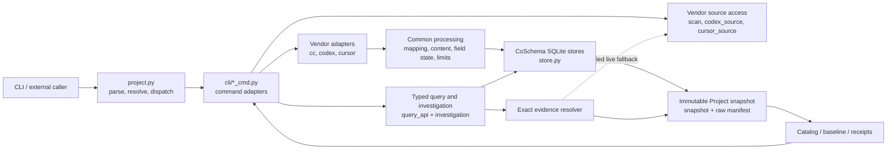
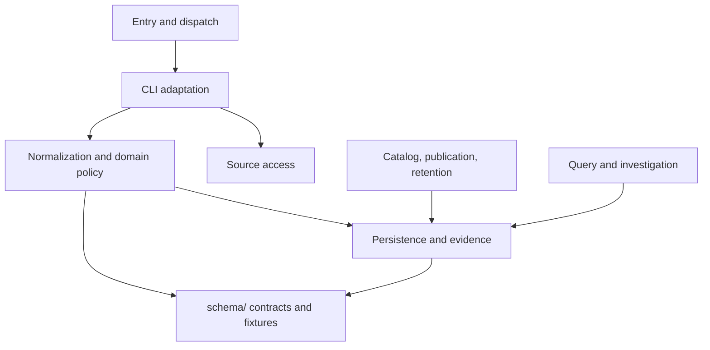
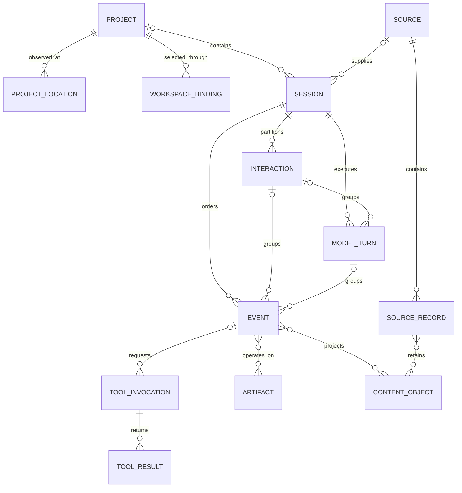
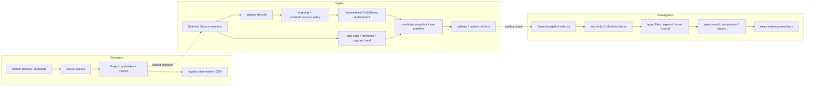
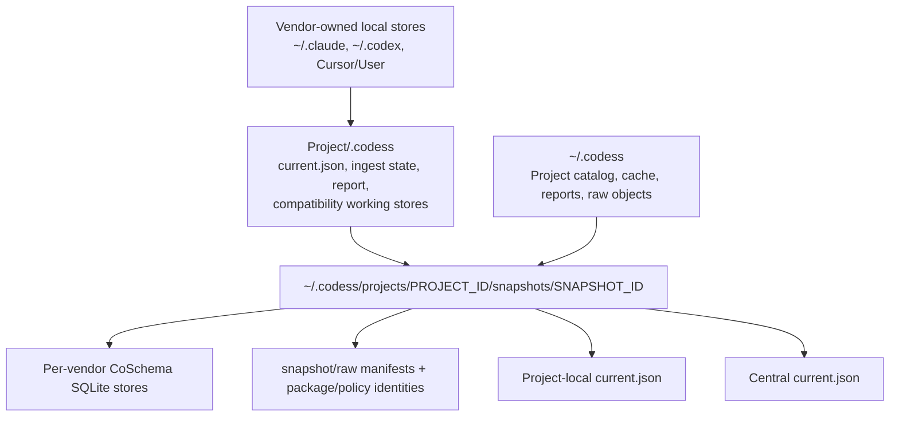
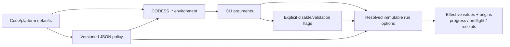

# CoPlan — implementation guide and work registry

**Audience:** contributors and maintainers changing Codess or deciding what to
do next.

This document owns software components/modules, entity composition, data and
configuration flows, repository architecture, CLI/runtime contracts,
implementation mapping, coding/test guidance, delivery order, the actionable
work queue, and engineering decisions. Product requirements
belong in **Codess.md**; user workflows in **README.md**; design rationale in
**Designs.md** and **Schemas.md**; operating procedures in **Operations.md**.

A subject has one narrative owner. Another document may contain a tight link
or a fact needed for its own audience, but must not repeat the owning problem
statement, analysis, options, recommendation, or status.

## Contents

1. [Repository layout](#1-repository-layout)
2. [System architecture](#2-system-architecture)
3. [Configuration](#3-configuration)
4. [CLI and runtime contract](#4-cli-and-runtime-contract)
5. [Feature to implementation map](#5-feature--implementation-map)
6. [Coding techniques](#6-coding-techniques)
7. [Tests](#7-tests)
8. [Central work registry](#8-central-work-registry)
9. [Change routing](#9-change-routing)

Implementation readers normally follow:

1. [architecture at a glance](#20-architecture-at-a-glance);
2. [components and modules](#21-components-and-module-catalog);
3. [entity expressions](#23-entity-expressions);
4. [data flows](#24-data-flows);
5. [persistence topology](#25-persistence-topology);
6. [configuration resolution](#31-what-is-configurable-why-and-how); and
7. [feature-to-code map](#5-feature--implementation-map).

## 1. Repository Layout

**Scan** means index-led discovery of Projects that have vendor session data.
Daily commands are `scan`, `ingest`, and `query`; administrative command
families are summarized in §4.7.

```
CodeSess/
├── main.py                  # repository entry point
├── README.md                # user/customer landing page
├── Codess.md                # product specification and document map
├── CoPlan.md                # implementation guide and work registry
├── Operations.md            # maintainer runbook
├── Designs.md / Schemas.md  # rationale and schema-evolution design
├── *Schema.md               # common and vendor data contracts
├── src/cli/                 # argument adaptation, rendering, exit codes
├── src/codess/              # domain operations, adapters, persistence
├── schema/                  # machine-readable contracts and fixtures
│   └── coschema/sqlite/schema.sql
├── catalog/                 # policies, reviewed evidence, accepted baselines
├── tests/                   # unit, contract, workflow, and scale tests
└── tools/                   # compatibility and developer entry points
```

| Artifact family | Form | Authoritative for | Principal consumers |
|---|---|---|---|
| Product and user documentation | `Codess.md`, `README.md` | Requirements, vocabulary, supported workflows | Users, feature design |
| Implementation and work registry | `CoPlan.md` | Components, data/configuration flow, code boundaries, tests, work state | Contributors, maintainers |
| Design rationale | `Designs.md`, `Schemas.md` | Alternatives, decisions, schema-evolution and translation method | Implementers reviewing change |
| Data contracts | `CoSchema.md`, `*Schema.md`, `schema/coschema/` | Common meaning, vendor evidence, executable DDL/JSON contracts | Adapters, store, validation, query |
| Interface contracts | `schema/query-*.json`, `schema/project-set-v1.json`, `schema/investigation-v1.json` | Versioned request/result/composition shapes | CLI, external clients, tests |
| Policy schemas and examples | `schema/*policy*.json`, examples | Content/resource/candidate/validation policy syntax | Option resolution, preflight, CI |
| Reviewed operational facts | `catalog/` | Approved baselines, policies, evidence inventories, candidate dispositions | Catalog/baseline operations |
| Runtime observations | Project `.codess/`, registry reports/receipts | Dated ingest, refresh, snapshot, resource, and validation outcomes | Operations and diagnosis |
| Automated evidence | `tests/`, `schema/coschema/fixtures/` | Regression, contract, workflow, compatibility, failure, and scale cases | CI and change validation |

## 2. System Architecture

### 2.0 Architecture at a glance

Codess separates vendor evidence, normalization, immutable Project snapshots,
and investigation. Discovery is index-led: Claude, Codex, and Cursor keep
session data outside the Project tree and retain Project paths in their own
indexes or records. `--dir` and `--dirs` are validated Project filters, not a
request to crawl the filesystem.



The principal boundaries are:

- source access knows vendor storage but not CoSchema query behavior;
- adapters map selected vendor records but do not own discovery or publication;
- store and snapshot code own persistence but not vendor interpretation;
- query reads normalized snapshots and never invokes adapters; and
- catalog/baseline code selects and publishes snapshots but does not redefine
  their entities.

### 2.1 Components and module catalog

`main.py` and the installed `codess` entry point both call
`codess.project.console_main()`. `parse_and_run()` routes `scan`, `ingest`, and
`query` through the shared parser and routes administrative command families
through `cli.admin_cmd`.



| Component | Modules | Responsibility and boundary |
|---|---|---|
| Entry and command dispatch | `main.py`, `codess.project`, `cli.scan_cmd`, `cli.ingest_cmd`, `cli.query_cmd`, `cli.admin_cmd` | Parse once, resolve roots/registry/options, adapt domain results to exit codes and output. Command modules do not define vendor formats or duplicate DDL |
| Discovery and vendor source access | `codess.scan`, `codess.codex_source`, `codess.cursor_source`, Claude path helpers in `codess.project` | Discover/index Sources, bind them to Projects, fingerprint selected evidence, and issue bounded read-only vendor queries. Source modules do not normalize Events |
| Vendor decoding | `codess.adapters.cc`, `codess.adapters.codex`, `codess.adapters.cursor` | Decode selected records and emit mapped Session/Event candidates with exact source fields and mapping evidence |
| Mapping and admission | `codess.mapping`, `codess.field_state`, `codess.ingest_pipeline`, `codess.ingest_review`, `codess.processing_contract` | Apply common mapping rules, classify absent/malformed fields, enforce transactional replacement, and retain reviewable failures |
| Content and tool policy | `codess.content_processing`, `codess.context_content`, `codess.sanitize`, `codess.tool_identity`, `codess.tool_result_status`, `codess.resource_policy`, `codess.resources` | Decode/sanitize/bound content, resolve scoped policy, preserve tool identity/status, and report resource observations without owning vendor selection |
| Normalized persistence | `codess.store`, `codess.schema_contract`, `codess.schema_evolution`, `codess.acceptance` | Initialize canonical DDL, enforce CoSchema contracts, replace normalized data transactionally, and classify compatibility |
| Raw evidence and snapshots | `codess.raw_store`, `codess.cursor_cohort`, `codess.snapshot`, `codess.evidence`, `codess.evidence_resolver` | Capture/reuse transactionally consistent selected evidence, retain or reference exact Source revisions, build immutable snapshots, and resolve normalized rows back to verified sealed/captured/live evidence |
| Project catalog and curation | `codess.catalog`, `codess.candidate_review`, `codess.project_catalog`, `codess.project_annotations`, `codess.registry_store`, `codess.catalog_operations` | Maintain stable Project/location/workspace identity, observations, annotations, and explicit review decisions |
| Baselines, refresh, and retention | `codess.baseline_catalog`, `codess.baseline_operations`, `codess.baseline_validation`, `codess.refresh_operations`, `codess.refresh_receipts`, `codess.retention`, `codess.storage_report` | Validate/publish reviewed snapshots, compose routine refresh, record outcomes, and inventory/prune derived storage |
| Typed query and results | `codess.query_api`, `codess.investigation`, `codess.configuration_audit`, `codess.orientation_audit` | Bind typed requests, execute bounded cross-store operations, derive stable results/comparisons, and create cited investigation records |
| Analysis helpers | `codess.artifact_correlation`, `codess.token_usage`, `codess.session_names` | Add evidence-backed correlations, non-billing token observations, and user-assigned names without changing stable identities |
| Evidence audits | `codess.mcp_audit`, `codess.codex_parent_audit`, `codess.cursor_feature_audit`, `codess.vendor_audits.*` | Inspect bounded vendor/store evidence for one capability; audits inform mappings but are not alternate ingesters |
| Shared infrastructure | `codess.config`, `codess.helpers`, `codess.fileio`, `codess.bounded_jsonl`, `codess.progress`, `codess.identity` | Configuration constants, safe path/file helpers, bounded structured I/O, progress, and globally stable identity construction |
| Executable artifacts | `schema/coschema/`, `schema/*.json`, `schema/mappings/`, `catalog/` | Machine-readable entity/DDL/mapping/query/policy contracts and reviewed operational selections; prose links to these rather than restating every field |

The module catalog is architectural, not a claim that every module is equally
public. Stable interfaces are the CLI, versioned JSON artifacts, CoSchema
package, and documented Python operation boundaries. Helpers prefixed `_` and
command-rendering functions remain internal.

### 2.2 Dependency rules

This subsection is **normative policy**, not a full import graph. It answers: *where must we not put parsing or store logic so layers stay thin?* A short checklist here is **not** “every allowed edge” — see **§2.1** for who calls whom.

- **`cli/*_cmd`:** do not parse vendor JSONL/SQLite inline; ingest goes through **`adapters/*`**.
- **`adapters/cc.py`, `adapters/codex.py`:** do not import **`scan`**, **`scan_cmd`**, or **`ingest_cmd`**.
- **`query_cmd`:** do not import **`adapters/*`**.
- **Cursor callers:** do not duplicate `state.vscdb`, workspaceStorage, table,
  or key-range knowledge; use **`cursor_source`**.
- **Codex callers:** do not duplicate active/archive traversal, metadata reads,
  or active-over-archive selection; use **`codex_source`**.
- **Store and schema code:** do not import vendor adapters or source modules.
- **Catalog/baseline code:** may select and validate snapshots but must not
  reinterpret vendor records.

Allowed dependencies point downward through the component diagram. A cross-cut
such as progress, identity, or resource reporting must remain content-free and
must not become a backdoor from persistence into a vendor adapter.

### 2.3 Entity expressions

This section shows composition and cardinality for implementers. `CoSchema.md`
and `schema/coschema/contract.json` remain authoritative for meaning,
nullability, and fields.



Project snapshots and Assemblies are higher-level artifacts rather than
CoSchema tables:

```text
Project
  := stable logical identity
     + ProjectLocation*
     + WorkspaceBinding*

Source
  := (source_system_id, source_uri, source_revision)

Session
  := vendor/harness container
     + ordered Event*
     + optional Interaction* and ModelTurn* partitions

ActorObservation(Event)
  := actor_kind
     + exact source_role
     + content_role
     + origin_kind
     + supporting mapping provenance

ModelConfiguration
  := nullable(provider, family, exact_name, revision,
              effort, speed, service_tier, mode)
     + exact source configuration provenance

ArtifactIdentity
  := Project
     + kind
     + one or more of relative_path, URI,
       repository_object_id, content_sha256

ProjectSnapshot(P, observed_at)
  := exact CoSchema package
     + decoder/validator/software identities
     + selected Source revisions
     + per-vendor normalized stores
     + raw-evidence manifest
     + validation/publication evidence

Assembly
  := explicit selection(ProjectSnapshot+)
     + query/export specification
     + derived result identity and provenance
```

| Expression or relation | Implementation invariant | Main owner |
|---|---|---|
| `Project 1 → N Location/WorkspaceBinding` | One Git repository is one Project; paths and vendor workspace IDs are observations, not replacement identities | `project_catalog`, D21 |
| `Source 1 → N SourceRecord` | Source revision is immutable; record locators are stable only within that revision | adapters, `store`, `evidence_resolver` |
| `Session 1 → ordered Event*` | `(session_id, sequence_no)` is canonical where sequence exists; vendor timestamps do not replace ordering | adapters, `store` |
| `Interaction/ModelTurn ↔ Event*` | These are additive partitions over Events; absent boundaries remain NULL/unknown rather than inferred globally | mapping, `query_api` |
| `ActorObservation(Event)` | Actor is an evidence-backed multivariate classification, not a table or a synonym for vendor `role` | adapters, mapping, A27 |
| `ModelTurn → ModelConfiguration?` | Configuration dimensions remain independently nullable; exact source values and occurrence provenance survive normalization | adapters, `configuration_audit`, A12 |
| `ToolInvocation 1 → N ToolResult` | Source call IDs are vendor/Session-scoped lineage, not global identity | tool mapping and CoSchema |
| `Event N ↔ N Artifact` | Operation, evidence source, and confidence belong to the relation | `artifact_correlation`, `event_artifacts` |
| `Event/SourceRecord N ↔ N ContentObject` | Content identity and storage class are distinct from Event fields and raw-object location | content tables, `raw_store` |
| `Project → Snapshot*` | Snapshots are immutable dated observations; current pointers select but do not mutate them | `snapshot`, baseline operations |
| `Snapshot+ → Assembly*` | An Assembly is derived and must retain every Project/snapshot/source identity | `query_api`, A19/P19 |

### 2.4 Data flows

The three daily pipelines share Project selection and configuration resolution,
but only ingest crosses from vendor evidence into CoSchema.



#### Discovery — Scan

- **Purpose:** Under a **work root**, which **project dirs** have session data, **which vendors**, rough **counts/sizes**.
- **Mechanism:** **Index-led** — vendor registries/listings under **`config`** roots, not a full-disk crawl. Maps paths, filters, dedupes, **`canonicalize`**, recency, **`--source`**, CSV out. File opens for metrics are **read-only**, not ingest.
- **Indices:** CC / Codex / Cursor on-disk detail → **CCSchema**, **CodexSchema**, **CursorSchema**.

**Root semantics**

- **`resolve_cli_roots`** validates and returns path filters.
- **`run_scan`** maps vendor-owned records into those roots; it does not crawl project trees.
- **`canonicalize`** prefers leaf project paths and removes configured aggregator parents.

**Other**

- **`_is_agg`:** One segment below **`work_root`** in **`AGGREGATORS`** → drop as aggregator parent, not a leaf project.
- **Scan vs ingest shape:** Scan = one CSV row, **multiple** vendors possible. Ingest = **`_ingest_cc` / `_ingest_codex` / `_ingest_cursor`** per vendor, one **`--source`** selection — shared project loop, **separate** DB files and parsers.

**Long-term:** A scan-produced project list can feed batch ingest/query through `--dirs`; no separate crawler is required.

#### Ingest

- **Purpose:** Project root → **`.codess/`** normalized **sessions** / **events**.
- **Mechanism:** **`project`** path resolution → **`adapters/*`**
  normalization → transactional **`store.replace_*`** →
  **`ingest_state.json`** mtime keys after commit.

#### Query

- **Purpose:** Read-only reporting on the local store.
- **Mechanism:** Resolve retained snapshot stores — see **§2.5**.
  **`query_cmd`** opens them read-only and does not write vendor trees.

### 2.5 Persistence topology

The Project-local `.codess/` directory holds the local current-snapshot pointer,
incremental `ingest_state.json`, the last ingest report, and compatibility
working stores when present. Current query resolution follows the retained
snapshot pointer first and falls back to legacy working paths only when no
current snapshot is installed.

Accepted immutable snapshots live below
`~/.codess/projects/<project-id>/snapshots/` by default. Each snapshot contains
per-vendor databases such as `sessions_cc.db`, `sessions_codex.db`, and
`sessions_cursor.db`; the central and Project-local `current.json` pointers are
promoted atomically. **CoSchema.md** owns store semantics and **Operations.md**
owns retention and recovery procedures.



| Persistence class | Authority | Mutation model |
|---|---|---|
| Vendor source | Vendor harness/application | Read-only to Codess |
| Working store and ingest state | Current local normalization process | Transactional source replacement; state advances after commit |
| Raw object store | Content-addressed retained evidence | Append/reuse, then receipt-based retention |
| Immutable snapshot | Exact dated normalized observation | Build new; never edit in place |
| Current pointers | Selected snapshot reference | Atomic replacement after validation |
| Catalog, policies, receipts | Project identity, reviewed selection, and operational observations | Versioned/atomic records; not conversation authority |
| Saved query/investigation result | Derived research artifact | Immutable identity over exact request/input/result provenance |

Changed or forced Claude and Codex transcripts replace one normalized session
transactionally. Cursor refresh replaces records owned by the selected source
database. Empty valid transcripts remove stale normalized sessions and add the
nonfatal `empty_sources` diagnostic before ingest state advances.

### 2.6 Implementation versus validation

Verification baseline is the full **`pytest tests/`** suite. **Validated** here means representative automated coverage, not every edge case.

| Area | Implemented | Validated | Registry reference |
|------|-------------|-----------|--------------------|
| Scan (index-led) | Yes | CLI + `test_scan*`, metrics | **V-CU2** |
| Ingest | Yes | Adapters, replacement/store integration, CLI | Transactional replacement, empty sources, active/archive deduplication, continue/fail-fast handling, and scoped global Cursor ingest are covered |
| Query | Yes | CLI, store, scale tests | Read-only aggregation, global numbering, session origin details, lineage, evidence-backed audit rows, and globally bounded reports across project/vendor stores |
| **`validate_config()`** | Yes | Unit and subprocess CLI tests | Applied consistently to scan, ingest, and query |
| Store / DDL | Yes | `test_store` | — |
| Sanitize | Yes | Sanitizer, adapter, helper, and CLI tests | Content-processing policy; external enterprise scanners are optional |

**Completeness:** Main workflows, configuration validation, source replacement,
cross-store query aggregation, lineage, audit normalization/reporting, and
bounded row reports are covered. Preflight and versioned session/stat output
are implemented. All incomplete coverage and deferred scope is classified in
§8 (known gaps and postponed topics).

### 2.7 Verified wiring

Cross-checked against **`src/`** and **`tests/`** so this plan does not drift from the repo. Re-audit after large refactors.

- **`main.py`:** prepends **`src/`**, calls
  **`codess.project.console_main()`** → **`main()`** →
  **`parse_and_run()`**.
- **Dispatch:** **`parse_and_run`** recognizes administrative families first
  and delegates them to **`cli.admin_cmd`**. Otherwise it parses the shared
  daily-command arguments, lazy-imports **`cli.scan_cmd` /
  `cli.ingest_cmd` / `cli.query_cmd`**, and branches on **`args.command`**.
- **`run_scan(work_root, …)`:** parameters are **`vendor_filter`**, **`recent_days`**, **`debug`**, and **`subagent`**. Scan is index-led and exposes no recursion option.
- **`validate_config()`:** invoked before work by scan, ingest, and query; errors are printed to stderr and return exit 1.
- **`query_cmd`:** opens every selected project store read-only and aggregates report rows in Python, avoiding SQLite's attached-database limit and preserving duplicate vendor session IDs internally. It imports **`get_project_stores`**, **no** **`adapters/*`**.
- **`scan.py`:** imports **`codex_source`** and **`cursor_source`** for vendor discovery/metrics; **does not** import adapters or **`walk`**.
- **`project.py` module imports:** contain no Codex/Cursor storage-layout or SQLite details.
- **`adapters/*`:** **no** imports of **`scan`**, **`scan_cmd`**, or **`ingest_cmd`**.
- **Central registry (`ingested_projects.json`):** **`codess.registry_store`** merges per-project records. **Scan** always upserts **`scan`** / **`last_scan`** for every discovered project path into **`resolve_registry_directory(args)`** (default **`CODESS_REGISTRY`**). **`--registry PATH`** overrides that root and, when set, **also** filters CSV to paths present in the file **before** this run + appends **`reg_*`** columns — **no** sidecar. **Ingest** merges **`sources`** / **`last_ingestion`**. **Query `--stats`** merges **`query`** / **`last_query`** into the same file (**§4**).
- **`validate_scan_source_for_cli` / scan `--source`:** invalid tokens → **stderr + exit 1** before any scan work; this is the global invocation contract in §4.1.
- **`store.init_db`:** executes **`schema/coschema/sqlite/schema.sql`** when that file exists (path resolved from **`store.py`** location).

---

## 3. Configuration

### 3.1 What Is Configurable, Why, and How

The configuration system separates machine locations, invocation behavior,
policy files, catalog decisions, and schema/package identity. They are
not one undifferentiated settings object.



The precise precedence depends on the configuration class:

| Configuration class | Examples | Resolution order | Implementation |
|---|---|---|---|
| Machine/vendor locations | Claude, Codex, Cursor roots; registry root | platform/code default → ENV → selected CLI path where supported | `config.py`, `resolve_registry_directory` |
| Ordinary run defaults | days, minimum source size, force, debug, redact, stop, raw mode | code default → ENV at import → CLI value/flag | `config.py`, `build_scan_run_options`, `build_ingest_run_options` |
| Resource maximums | transcript/container/Event/context limits | built-ins → partial resource-policy file → individual ENV → individual CLI → `--no-resource-limits` | `resource_policy.py`, `IngestRunOptions.resource_policy` |
| Content transformation | charset, suppression, masking, vocabulary, topics, min/max characters | no policy → ENV/CLI-selected file; inside file: global rules → every matching scope in declaration order → built-in adapter bound | `content_processing.py`, `schema/content-policy.example.json` |
| Project selection and validation | catalog decisions, annotations, project sets, baseline policy | explicit versioned artifact + command selector; no implicit ENV merge | catalog/project-set/policy contracts |
| Schema and processing identity | CoSchema package, decoder, validator, software release | selected installed package/profile; recorded, compared, never overridden as a casual flag | `schema_contract`, `processing_contract`, snapshots |
| Display/query bounds | result row/byte/facet/window limits | typed request/CLI defaults → explicit request values | `query_api`, `query_cmd` |

`config.py` reads ordinary environment variables at import time into
module-level `Path`, `int`, and `bool` values. `codess.project.build_parser()`
parses the CLI once. `build_scan_run_options()` and
`build_ingest_run_options()` then produce small frozen dataclasses so source
and Event loops consume resolved values rather than reading ENV repeatedly.
Query binds its typed request in `query_cmd`/`query_api`; it does not yet need
an ENV-backed options dataclass.

Effective resource values retain per-field origin and the exact policy-file
SHA-256 in reports. Content processing retains applied actions and policy
identity with mapping/processing evidence. Catalog decisions and source
evidence are inputs, not configuration precedence layers.

**`CODESS_MIN_SIZE` / `--min-size`:** Ingest skips a source file when **`st_size < min_size`**. **`min_size == 0`** means **no size floor** (including empty files). That is **not** the same as omitting **`--min-size`**: omission currently uses the legacy **`config.MIN_SIZE`** default of 20 KiB unless overridden by **`CODESS_MIN_SIZE`** at import. This is an optional noise heuristic, not a resource guard, and can hide valid tiny Sessions. Curated onboarding already passes zero. The ordinary zero-default and structural classification of empty/tiny Sources are postponed under **P15**, not ingest-code consolidation **A11**. **`validate_config`** rejects **`MIN_SIZE < 0`**.

**Vendor roots must be absolute:** **`validate_config()`** rejects relative
Claude, Codex active/archive, and Cursor roots. Resolving a vendor root from the
process cwd is fragile for scan, CI, and daemons.

**`main.py` vs commands:** **`main.py`** only extends **`sys.path`** and calls **`codess.project.main()`**. **`project.build_parser()`** defines **one** **`ArgumentParser`** (no subparsers): positional **`CMD`** ∈ {**`scan`**, **`ingest`**, **`query`**} plus **all** flags. **`parse_and_run()`** parses **once**, sets logging from **`-v` / `CODESS_VERBOSE`**, then dispatches to **`scan_cmd.run` / `ingest_cmd.run` / `query_cmd.run`**. Unused flags for a given CMD are simply ignored by that command’s implementation.

**Options object (`project.py`):** Ordinary ENV is read **once at import** in
**`config`**. **`build_scan_run_options(args)`** /
**`build_ingest_run_options(args)`** resolve each invocation into a small
**frozen dataclass**. Resource maximums additionally inspect only their six
explicit environment names once during that resolution so a policy file can be
layered below them and each effective origin can be reported. No ENV is read
inside source/Event loops. **`scan_cmd`** / **`ingest_cmd`** pass **only** the
fields they need into **`run_scan`** / **`_ingest_*`**. **Query** can gain the
same pattern when it grows ENV-backed toggles.

**Why global args/ENV, not per-vendor sections:**

- **Vendor-specific *paths* already exist:** `CODESS_CC_PROJECTS`,
  `CODESS_CODEX_SESSIONS`, `CODESS_CODEX_ARCHIVED_SESSIONS`, and
  `CODESS_CURSOR_DATA` point at tool-owned storage on this machine.
- **Behavior knobs are intentionally *run-wide*:** One **`scan`** / **`ingest`** applies a **single policy** to every vendor selected by **`--source`** (`CODESS_DAYS`, `CODESS_MIN_SIZE`, `CODESS_DEBUG`, `CODESS_FORCE`, …). That keeps **one argv surface**, **one import-time config**, and shared loops in **`scan_cmd` / `ingest_cmd`** without a combinatorial matrix (`--min-size-cc`, `CODESS_DEBUG_CODEX`, …).
- **Vendor-only semantics** stay in **code + Schema**, not parallel ENV trees: e.g. **`CODESS_SUBAGENT`** affects **CC** scan metrics only; Cursor/Codex ignore it. Per-vendor *behavior* differences that need toggles belong in ***Schema.md** + adapter options first; new **`CODESS_*`** or flags would follow a proven need.

### 3.2 Combining `--dir` and `--dirs`

1. If **`--dirs FILE`** is passed, **`helpers.validate_dirs_file`** runs first: file **must exist**, be a **regular file**, be **readable**, and contain **≥1** usable root — otherwise **stderr** message and **exit 1** (scan / ingest / query). The file may be a plain one-path-per-line list or a candidate CSV with a **`directory_path`** column; this permits direct use of the maintained active-work CSV.
2. **`helpers.parse_dir_list(dirs_file, dir_args)`** builds **one ordered list** of **resolved** `Path`s.
3. If **`--dirs FILE`** validated, plain lines or CSV **`directory_path`** values are read **first** (in file order).
4. Each **`--dir PATH`** is **appended** in argv order.
5. **Duplicates** (same resolved path) are **skipped**.
6. **User root strings** (`--dir` lines, **`--dirs`** file): **`..`** in any path **component** is **disallowed** (skipped + warning). **Relative** paths: any segment **starting with `.`** except the lone segments **`.`** and **`..`** is **disallowed** — this blocks **hidden-style** relative segments (e.g. **`.venv`**, **`.private`**) while still allowing **`.`** (cwd) and paths like **`./repo`** (the **`.`** segment is explicitly allowed). **Absolute** paths may contain segments such as **`.config`** under the home tree. **Empty** lines / empty **`--dir`** arguments are skipped. Root strings are paths, not glob patterns.
7. If the result is **empty**: **`scan_cmd`** uses **`Path.cwd()`**; **`ingest_cmd`** and **`query_cmd`** use **`get_project_root()`** (`git rev-parse --show-toplevel` from cwd, else cwd — see **`project.py`**).

**`DEFAULT_WORK` / `is_excluded`:** There is **no** CLI flag for **`DEFAULT_WORK`** (`~/Work`). **`is_excluded(p, work_root=None)`** uses **`DEFAULT_WORK`** only as the **`relative_to`** anchor when **`work_root`** is omitted — **`scan.run_scan`** passes the real **`work_root`** into **`canonicalize`**, so exclusion is relative to the **scan root**, not **`~/Work`** unless you omit the argument in other call sites.

### 3.3 Environment Variables

Defaults in the table are when the variable is **unset**.

| Variable | Role | Default (if unset) |
|----------|------|---------------------|
| `CODESS_CC_PROJECTS` | CC projects root | `~/.claude/projects` |
| `CODESS_CODEX_SESSIONS` | Codex sessions root | `~/.codex/sessions` |
| `CODESS_CODEX_ARCHIVED_SESSIONS` | Codex archive root; set explicitly with an overridden active root | `~/.codex/archived_sessions` when the active root is default |
| `CODESS_CURSOR_DATA` | Cursor User dir | OS-specific under `Cursor/User` (see `config._cursor_data`) |
| `CODESS_DAYS` | Scan default recent days | `90` |
| `CODESS_MIN_SIZE` | Ingest skip small sources (bytes) | `20480` |
| `CODESS_FORCE` | Ingest ignore mtime state | `0` → false (see **boolean ENV** below) |
| `CODESS_DEBUG` | Verbose / debug behaviors | `0` → false (see **boolean ENV** below) |
| `CODESS_REGISTRY` | Registry dir for stats JSON | `~/.codess` |
| `CODESS_SUBAGENT` | CC scan include sidechains | `0` → false (see **boolean ENV** below) |
| `CODESS_STOP` | Fail-fast: stop whole command on first error | `0` → false; combine with **`--stop`** |
| `CODESS_VERBOSE` | Python logging **DEBUG** for the process (`-v` equivalent) | `0` → false |
| `CODESS_REDACT` | Ingest: enable redaction default (same patterns as **`--redact`**) | `0` → false |
| `CODESS_RAW_MODE` | Ingest raw evidence policy: `none`, `reference`, `capture`, or `seal` | `reference` |
| `CODESS_STRICT_MAPPING` | Ingest: fail a Source on unsupported/lossy mapping rather than retain a diagnostic and continue | `0` → false |
| `CODESS_CONTENT_POLICY` | Content-processing policy JSON path | no file |
| `CODESS_RESOURCE_POLICY` | Partial `codess.resource-policy/1` JSON file | no file; built-ins apply |
| `CODESS_MAX_TRANSCRIPT_BYTES` | One Claude/Codex transcript maximum | `268435456` |
| `CODESS_MAX_SOURCE_BYTES` | Compatibility alias for transcript maximum | transcript built-in |
| `CODESS_MAX_CURSOR_CONTAINER_BYTES` | One Cursor SQLite container maximum | `10737418240` |
| `CODESS_MAX_EVENTS_PER_SOURCE` | Normalized Events from one Source | `200000` |
| `CODESS_MAX_EVENTS_PER_SESSION` | Normalized Events in one Session | `100000` |
| `CODESS_MAX_CONTEXT_CONTENT_CHARS` | One context or compaction body | `250000` |
| `CODESS_MAX_CODESS_DB_BYTES` | Storage-report warning threshold for one CoSchema DB | `2147483648` (2 GiB) |
| `CODESS_MAX_CURSOR_DB_BYTES` | Storage-report warning threshold for Cursor's global DB | `10737418240` (10 GiB) |

**Boolean ENV (`CODESS_DEBUG`, `CODESS_FORCE`, `CODESS_SUBAGENT`,
`CODESS_STOP`, `CODESS_VERBOSE`, `CODESS_REDACT`,
`CODESS_STRICT_MAPPING`):** Implemented in **`config.py`** via
**`env_bool()`**: **true** only if, after **`.lower()`**, the value is exactly
**`1`**, **`true`**, or **`yes`**. **Unset** uses default **`0`** → false.
Values like **`y`**, **`Y`**, **`on`**, **`2`** are **false** (not generic
shell truthiness). Export e.g. `CODESS_DEBUG=1` or `CODESS_DEBUG=yes`.

**Why `CODESS_*` vs `DEBUG` / `FORCE` / `SUBAGENT`:** Shell and CI need **prefixed** names (`CODESS_DEBUG`, …) to avoid collisions with unrelated tools. **`config.py`** exposes short **Python** names (`DEBUG`, `FORCE`, `SUBAGENT`) as **bools read once at import** from those variables. Docs refer to **ENV** with the `CODESS_` name; code samples may show **`config.DEBUG`** meaning “the bool parsed from **`CODESS_DEBUG`**.”

**Boolean policy (flags + ENV):** Default is **false** unless the **CLI flag** is passed or the **`CODESS_*`** env parses **true** (see above). **`store_true`** flags: presence → **true**; omission → **false** at argparse, then OR with env where the table says so.

**Note on scan vs ingest `--debug`:** Both use **`CODESS_DEBUG` → `DEBUG`** via **`args.debug or DEBUG`**, but **effects differ**: **scan** uses it only for **discovery trace** + CSV shape; **ingest** uses it for adapter diagnostics/verbosity. Raw retention is controlled independently by **`--raw-mode` / `CODESS_RAW_MODE`**.

**CLI `store_true`:** There is **no** `-y` shorthand.

**Boolean and pseudo-boolean flags — by command**

- **Top-level `-v` / `--verbose`:** true when **`args.verbose or VERBOSE`** from **`CODESS_VERBOSE`**; **`parse_and_run`** sets **`logging.basicConfig(DEBUG)`**. Not the same as **`CODESS_DEBUG`** (vendor/session diagnostics) or the always-on, content-free ingest progress stream documented in **Operations.md**.
- **Scan `--debug`:** **`args.debug or DEBUG`**. **`--subagent`:** **`args.subagent or SUBAGENT`**.
- **Ingest `--debug` / `--force` / `--redact`:** each **`args.* or`** matching **`CODESS_*`**; **`--force`** argparse default stays **`False`** so omission does not imply force.
- **Query:** mode flags only; **no** **`CODESS_*`** booleans for **`--stats`**, **`--tool`**, etc.

**Validation:** **`validate_config()`** checks **`CODESS_DAYS`** in
**[0, 3650]**, **`MIN_SIZE` ≥ 0**, and every configured vendor root is
absolute. Malformed values are reported without an import traceback; every
command exits 1 before doing work.

---

## 4. CLI and Runtime Contract

**Purpose:** Operator-facing **flags**, **ENV**, and **defaults**. Vendor metric semantics → ***Schema.md**.

**Table columns:** **Flag** | **ENV** (variable name, or **—**) | **Default** (when flag omitted / ENV unset as applicable) | **Explanation**.

### 4.1 `codess scan`

| Flag | ENV | Default | Explanation |
|------|-----|---------|-------------|
| `--dirs PATH` | — | — | Plain path list or candidate CSV with `directory_path` (§3.2). |
| `--dir PATH` | — | — | Append root; repeatable. |
| *(no dirs after merge)* | — | **`Path.cwd()`** | **Scan** only; see §3.2. |
| `--source cc,codex,cursor` | — | all three | Comma-separated vendor subset; **order does not matter**. Tokens are compared case-insensitively after trim. **`all`** clears the filter (same as omitting **`--source`**). **Invalid token** (anything other than **`cc`**, **`codex`**, **`cursor`**, or the whole value **`all`**) is a **global** error: **stderr** message listing bad tokens and **exit 1** — no partial vendor set. |
| `--out PATH` | — | `codess_walk.csv` | CSV path; **`write_csv`** creates **parent directories**. |
| `--out -` | — | — | CSV to **stdout** (not **`write_csv`**). |
| `--days N` | `CODESS_DAYS` | **`90`** | Recent window; omitted → **`CODESS_DAYS`**. |
| `--debug` | `CODESS_DEBUG` | off if flag omitted **and** unset ENV | Discovery trace + CSV **`dir_path`**; **`args.debug or DEBUG`** — see **§3.3**. |
| `--subagent` | `CODESS_SUBAGENT` | **`SUBAGENT`** from ENV | **`args.subagent or SUBAGENT`** — see **§3.3**. |
| `--registry PATH` | `CODESS_REGISTRY` | — | **Directory** for **`ingested_projects.json`**: default **`CODESS_REGISTRY`** (`~/.codess`); **`PATH`** overrides for this invocation. **Scan:** always **writes** merged index metrics to that directory; when **`--registry`** is **passed**, **also** restricts CSV to paths already listed **before** this run and adds **`reg_*`** columns. **Argparse requires a path** — no bare **`--registry`**. |
| `-v` / `--verbose` | `CODESS_VERBOSE` | off | Python **`logging`** level **DEBUG** (process-wide); not **`CODESS_DEBUG`**. |

**Precedence (scan):** **`--days` omitted** → **`CODESS_DAYS`**. **`--subagent`:** **`args.subagent or SUBAGENT`**. **`Registry`:** **`project.resolve_registry_directory(args)`** selects the registry **root** for **both** scan upserts and (when **`--registry PATH`** is set) filter + join columns.

**Output columns:** `path,vendor,sess,mb,span_weeks` (with `dir_path` when `--debug`). With **`--registry`**, append **`reg_path`**, **`reg_updated`**, **`reg_sources`** — **§4.1** table. Metric definitions: **CCSchema** §7, **CodexSchema** §6, **CursorSchema** §5. Rows with **`path=(global)`** are unscoped Cursor central-DB scan aggregates, emitted at most once in a multi-root run and never registered as Projects. Project metrics and ingest use only global composers whose header workspace maps to that Project.

### 4.2 `codess ingest`

| Flag | ENV | Default | Explanation |
|------|-----|---------|-------------|
| `--dirs` / `--dir` | — | **`get_project_root()`** | Same merge as scan (§3.2); empty list → git root or cwd. |
| `--source` | — | **`all`** | `cc` \| `codex` \| `cursor` \| `all`. |
| `--min-size BYTES` | `CODESS_MIN_SIZE` | **`20480`** | Skip sources smaller than N bytes. |
| `--candidate-snapshot` | — | off | Maintainer path: build an immutable candidate without changing local or central current pointers. Baseline apply owns validation and promotion. |
| `--resource-policy JSON` | `CODESS_RESOURCE_POLICY` | built-in maximums | Load a partial, versioned maximum policy; contract in `schema/resource-policy-contract.json`. |
| `--max-source-bytes N` | `CODESS_MAX_TRANSCRIPT_BYTES`; legacy `CODESS_MAX_SOURCE_BYTES` | 256 MiB | Override the Claude/Codex transcript maximum. |
| `--max-cursor-container-bytes N` | `CODESS_MAX_CURSOR_CONTAINER_BYTES` | 10 GiB | Override the Cursor SQLite container maximum. |
| `--max-events-per-source N` | `CODESS_MAX_EVENTS_PER_SOURCE` | 200,000 | Override the normalized Event maximum for one Source. |
| `--max-events-per-session N` | `CODESS_MAX_EVENTS_PER_SESSION` | 100,000 | Override the normalized Event maximum for one Session. |
| `--max-context-content-chars N` | `CODESS_MAX_CONTEXT_CONTENT_CHARS` | 250,000 characters | Override the normalized context/compaction body maximum. |
| `--no-resource-limits` | — | off | Disable all maximums after file, ENV, and CLI resolution; reports retain this origin. |
| `--raw-mode none\|reference\|capture\|seal` | `CODESS_RAW_MODE` | `reference` | Select raw-evidence retention independently of normalized content policy. |
| `--strict-mapping` | `CODESS_STRICT_MAPPING` | off | Fail the affected Source on unsupported/lossy mapping. |
| `--content-policy JSON` | `CODESS_CONTENT_POLICY` | no file | Load scoped pre/post content-processing rules. |
| `--validate` | — | off | Parse and validate using temporary stores without mutating Project, registry, raw store, snapshots, or ingest state. |
| `--force` | `CODESS_FORCE` | **`FORCE`** from ENV if flag omitted | **`args.force or FORCE`**; argparse **`default=False`**. Ignores **`ingest_state.json`** mtime skips when true. |
| `--redact` | `CODESS_REDACT` | off | **`args.redact or INGEST_REDACT`**; patterns in **`config.REDACT_PATTERNS`**. |
| `--debug` | `CODESS_DEBUG` | **`DEBUG`** from ENV | **`args.debug or DEBUG`** — see **§3.3**. |
| `--no-progress` | — | live progress on | Suppress timestamped ingest progress on stderr while retaining `codess.progress/1` events in runtime/preflight reports. |
| `--stop` | `CODESS_STOP` | continue independent Sources/Projects and return failure if any failed | Fail immediately on the first source/project error. |
| `--registry PATH` | `CODESS_REGISTRY` | **`~/.codess`** | Central registry dir (`ingested_projects.json`). **`PATH`** overrides default. |

### 4.3 `codess query`

| Flag | ENV | Default | Explanation |
|------|-----|---------|-------------|
| `--dirs` / `--dir` | — | **`get_project_root()`** | Same merge as §3.2; empty → git root or cwd. |
| `--project-id ID` | — | — | Typed query only: repeat exact catalog Project IDs and resolve their durable central current snapshots. Mutually exclusive with path selectors. |
| `--project-set FILE` | — | — | Typed query: resolve canonical `codess.project-set/1` inputs; each Project may name a snapshot or resolve current. Enables explicit cross-Project/historical union. |
| `--all-current` | — | — | Compatibility spelling for a transient eligible catalog cohort. Run `catalog status` first; this selector is not a freshness or publication label. |
| *(multiple roots)* | — | aggregated | Sessions are globally ordered across selected projects. Roots without stores warn and contribute zero; all roots without stores exit 1. |
| *(multiple vendor DBs)* | — | aggregated | Every existing legacy or per-vendor store returned by `get_project_stores` participates in one logical report. |
| `--source SPEC` | — | all | Query-side vendor scope: `cc`, `codex`, `cursor`, comma-separated union, or `all`. Applied inside stores to every data-bearing report; invalid tokens fail globally. |
| `--limit N` | — | unlimited | Globally limit rows after deterministic cross-project/vendor ordering for `--sessions`, `--permissions`, `--lineage`, and `--audit`. `0` emits no rows; negative values fail before stores are opened. |
| `--session-id ID` | — | — | Show a session by stable global ID or an unambiguous vendor session ID; preferable to recency ordinal in composed workflows. |
| `--output-format table\|jsonl\|csv` | — | table | Sessions/stats have versioned JSONL and spreadsheet-safe CSV; redirect CSV stdout to a file. Other reports currently require table output. |
| `query sessions\|overview\|events\|search` | — | — | Typed actions producing `codess.query-result/1`; the legacy flag modes below remain compatibility paths. |
| `--event-id`, `--interaction-id`, `--model-turn-id` | — | — | Repeatable stable drill-down predicates for typed event/search actions. |
| `--event-kind`, `--status`, `--model`, `--tool-name`, `--actor-kind`, `--content-role`, `--origin-kind`, `--parent-session-id`, `--session-relation`, `--initiation-kind`, `--artifact`, `--text`, `--since`, `--until` | — | — | Typed normalized predicates; unknown request fields are rejected rather than ignored. Timestamps are Unix milliseconds. |
| `--expand interaction\|model-turn`, `--before N`, `--after N` | — | no expansion/window | Expand selected Event IDs to a complete Interaction or Model Turn and union a same-Session sequence window. |
| `--group-repetitions`, `--facet-limit N` | — | false, 50 | Return bounded facets and exact compatible repetition groups while preserving every occurrence. |
| `--byte-limit N` | — | 16 MiB | Maximum returned inline content bytes for typed event/search results. |
| `--save-request`, `--save-result`, `--result-input`, `--compare-result` | — | — | Atomic persistence, derivation-bearing stable-ID chaining, and prior comparison. Comparison exits 3 for added/removed/changed rows or summary/provenance change. |
| `query evidence --event-id ID` | — | — | Resolve a normalized event to source-record and verified sealed/captured/live evidence. Exit 2 means no exact candidate is available. |
| `query cite --result-input RESULT --summary-file FILE --processor-id ID` | — | — | Build `codess.investigation/1` from a supplied summary and exact bounded Event citations; Codess records but does not generate the interpretation. |
| `query configurations` | — | — | Audit normalized model/settings coverage and exact `source_config` provenance without inferring missing settings. `--session-id` restricts configurations, occurrence totals, examples, and vendor coverage to the resolved Session; an unknown or ambiguous identifier fails rather than widening scope. |

**Modes:** **`--stats`**, **`--sessions`**, **`--tool`**, **`-sess`**,
**`--session-id`**,
**`--permissions`**, **`--task-review`**, **`--lineage`**, **`--audit`**,
**`--diagnostics`**, **`--artifacts`**, and **`--taxonomy`**. Exactly one report
mode is accepted; **`--show`** modifies `-sess` or `--session-id`. Session
numbers form one global recency order with
deterministic project/source/id tie-breakers; duplicate original IDs remain
distinct internally. Session rows include release and concise
origin/storage/parent details. **`--lineage`** joins Claude tool-use ids and
Codex call ids to results, and reports missing, orphaned, unlinked, or denied
outcomes. **`--stats`** prints aggregate totals. Current all-source stats merge
each Project's complete counts into **`ingested_projects.json`**;
vendor-filtered or historical stats do not overwrite that registry summary.
**`--audit`** reports only the
evidence-backed contract in **CoSchema.md**; unsupported vendor/state pairs are
not inferred. Omitting all mode flags exits 1.

### 4.4 `--dirs` File Format

- **`--dirs` file:** plain path lines (where **`#`** starts a comment) or a candidate CSV with **`directory_path`**; if **`--dirs`** is passed, it must contain ≥1 usable root — **§3.2**.
- Paths are validated directories and act as exact project roots or scan path filters; they are not recursively expanded.
- Explicit candidate Git discovery is the exception: it is depth-bounded and
  prunes a branch immediately after finding its first repository. Index-led
  vendor observations below a repository map to the nearest enclosing Git root.

### 4.5 Filter Wiring

Vendor-specific **meaning** of timestamps, sidechains, and sizes lives in **\*Schema.md** — this file only ties **which knob** hits **which code**.

- **Recent sessions:** `scan.py` with **`--days`** / **`CODESS_DAYS`**; timestamp semantics per vendor schema.
- **CC sidechains:** `scan.py` with **`--subagent`** / **`CODESS_SUBAGENT`**; detail in **CCSchema**.
- **Min source size:** ingest with **`--min-size`** / **`CODESS_MIN_SIZE`**; bytes on **source** files before parse.

### 4.6 Operational quick check

`codess scan --dir . --out -`

**Batch errors:** By default, **scan** (per work root) and **ingest** (per file /
DB / project) log failures and continue; exit code 1 if any source failed. Scan
summarizes **`malformed`**, **`invalid_keys`**, **`failed_sources`**, and
**`failed_roots`**. Ingest summarizes **`malformed`**, **`ignored`**,
**`empty_sources`**, and **`failed_sources`**; the first three are nonfatal.
**`--stop`** or **`CODESS_STOP`** makes source failures fail fast.

Incomplete CLI semantics and their dispositions are registered in §8.

### 4.7 Administrative command surface

These implemented families preserve `scan`, `ingest`, and `query`. An editable
install from `pyproject.toml` exposes `codess`; `python -m main` remains the
source-tree compatibility entry point. Focused commands and orchestrators call
the same domain operations:

```text
codess refresh …
codess catalog candidates …
codess catalog status …
codess catalog annotations …
codess catalog state …
codess catalog decide …
codess catalog onboard …
codess catalog location add …
codess catalog location retire …
codess catalog relocate
codess baseline validate …
codess baseline apply …
codess baseline freeze …
codess baseline verify …
codess evidence gather …
codess evidence audit …
codess schema compare …
codess session name|unname|names …
codess storage report …
codess storage prune …
codess storage token-validate …
```

`codess candidate-review` may remain as a discoverable alias for
`catalog candidates`. Candidate output is read-only by default and combines
production scan results with optional catalog/CSV and bounded local Git
observations. Git recursion and remote network checks require explicit flags.
Recommendations are `consider|defer|exclude`; only an explicit catalog decision
may be selected for curated ingest.

`catalog onboard` is the normal curated batch interface. It resolves entries
with one saved review decision, prints and records the plan, runs
`ingest --validate`, and applies
only when explicitly requested. `--stop-after plan|preflight` exposes stages;
the receipt preserves every stage. `ingest --dirs` remains the direct explicit
path interface.

`baseline freeze` must reuse read-only reviewed-set verification before and
after atomic catalog replacement. `baseline verify` remains separately
callable for CI and diagnosis. `evidence gather` invokes capability-specific
vendor audit functions once and may emit their detailed component reports;
vendor wrappers are focused aliases, not separate implementations.

Full semantics, user types, Git/activity justification, location lifecycle,
and code boundaries are in **Designs.md §12**.

---

## 5. Feature → Implementation Map

**Purpose:** Index of **where** features live in code (not a second copy of **§2**).

| Feature | Primary modules | Notes |
|---------|-----------------|--------|
| Multi-root roots | `helpers.parse_dir_list`, `*_cmd` | Combining `--dir` and `--dirs` |
| Vendor filter | `scan`, `ingest_cmd`, argparse | `frozenset` of names |
| Recent window | `scan`, `config.CODESS_DAYS` | ms cutoff |
| CC sidechain counts | `scan._session_metrics_cc` | **CCSchema** |
| Codex active/archive selection | `codex_source`, `scan`, `ingest_cmd` | One shared inventory; active wins over archive |
| Cursor workspace + global | `cursor_source`, `scan`, `ingest_cmd`, `adapters.cursor` | Shared selection/SQL, then selected-value decoding; **CursorSchema** |
| Stable Project/location/workspace identity | `project_catalog`, `project_annotations`, `catalog_operations` | Project UUID is independent of paths and vendor workspace IDs |
| Incremental ingest | `store.should_ingest`, selected source markers, state JSON | State advances only after committed replacement |
| Source replacement | `store.replace_session_events`, `replace_source_sessions` | removes stale transcript/DB-owned events transactionally |
| Content and resource policy | `content_processing`, `resource_policy`, `resources`, adapters | Scoped actions and effective limit origins are retained |
| Raw evidence and exact resolution | `raw_store`, `snapshot`, `evidence_resolver` | Sealed/captured/live precedence with revision verification |
| Immutable snapshot publication | `snapshot`, `baseline_operations`, `baseline_validation` | Build candidate, validate, then atomically replace pointers |
| Routine refresh | `refresh_operations`, `refresh_receipts` | Resolve explicit Project selection, preflight all, apply independently |
| Typed query kernel | `query_api`, `query_cmd` | Read-only predicates, expansion, global ordering, bounds, saved results |
| Cited investigation | `investigation`, `query_api`, query/investigation schemas | Supplied analysis bound to exact constituent evidence |
| Tool lineage report | `query_cmd._lineage` | joins Claude/Codex ids; shows missing/orphan results |
| Audit report | `query_cmd._audit` | direct denial/failure/abort/compaction evidence per CoSchema support matrix |
| Redaction | `sanitize`, adapter opts | regex list in **config** |
| Central registry JSON | **`registry_store`**, **`ingest_cmd._save_stats`**, **`scan_cmd`**, **`query_cmd._stats`**, **`config.get_stats_path`**, **`project.resolve_registry_directory`** | **`ingested_projects.json`** is a **merged** project registry: **scan** (index metrics), **ingest** (store **`sources`**), and **query `--stats`** (counts). **`--registry PATH`** overrides **`CODESS_REGISTRY`**; **no** bare **`--registry`**. |

### Investigation capability implementation

The user-facing capability IDs are defined in **README.md**. Their code and
data owners are kept here so user workflows do not expose internal module
names.

| Use cases | Main implementation and contracts |
|-----------|-----------------------------------|
| **UC1** | `project.resolve_cli_roots`, `project_catalog.load_project_set` / `resolve_project_query_scopes`, `schema/project-set-v1.json`, `snapshot.*_store_paths_from_base`, `query_cmd.QueryScope` |
| **UC2** | `query_cmd._parse_source_tokens`, `_typed_filters`, `query_api._event_predicate`, normalized actor/role/origin/relation fields |
| **UC3** | `query_api._overview` (including bounded daily exchange/actor engagement), `query_cmd._project_counts`, `_tool_table`, `_artifacts`, `storage_report`, `token_usage` |
| **UC4** | `query_cmd._session_by_identifier`, `_show_session`, canonical `events.sequence_no` ordering |
| **UC5–UC6** | `query_api._expanded_event_predicate`, `_event_rows`, global heap merge, facets/repetition summaries, CoSchema `events`, `interactions`, and `model_turns` |
| **UC7** | `query_cmd` lineage/audit/permission/task/tool reports plus `query_api` actor/tool/status Event predicates; `tests/test_provenance_checks.py` owns the completed human/harness/tool/model source proof |
| **UC8** | `query_cmd._artifacts`, `artifact_correlation`, `correlation_assertions`, `event_artifacts` |
| **UC9** | `query_api` request/result/observation/derivation/comparison contracts, `investigation.build_investigation`, `query_cmd._typed_output`, and query/investigation JSON Schemas |
| **UC10** | `raw_store`, snapshot raw manifests, `sources`, and `source_records` |

The typed vertical path is owned by `codess.query_api`, with JSON contracts in
`schema/query-request-v1.json` and `schema/query-result-v1.json`.
`codess.evidence_resolver` owns exact event evidence precedence, and
`codess.configuration_audit` owns nullable model-setting/provenance coverage.
Legacy table/row renderers remain in `cli.query_cmd`; they do not define the
new request semantics.

### Content processing implementation

`codess.content_processing` implements byte decoding, pre-normalization, and
post-normalization hooks from the functional contract in
**Designs.md §10**. Claude, Codex, and Cursor message/result adapters call
the shared pre/post path; Claude external sidecars also use the byte decoder.
Keep action traces connected to mapping diagnostics and `processing_runs`.
Built-in adapter bounds remain the final layer after global and matching scoped
policy rules.

---

## 6. Coding Techniques

**Audience:** People changing **`adapters/*`**, **`store.py`**, or **`cli/*_cmd.py`**.

Start from the **component map in §2.1**: ingest normalizes and replaces one source
transactionally; query reads **`store`** only.

- **Transaction boundary:** adapters yield normalized records; ingest buffers one
  transcript or one selected Cursor database result so delete/replace/insert is
  atomic, then commits before updating ingest state.
- **Cursor SQLite reads:** use read-only URI in the adapter so we do not take write locks on vendor DBs.
- **Errors:** log and skip bad lines where vendor format drifts; scan tolerates
  partial index reads. Ingest diagnostics count malformed, ignored, empty, and
  failed sources so partial data is visible without making every drift a hard
  failure.
- **Tolerant parsing:** **`JSONDecodeError`**, missing keys, and unknown records
  are skipped intentionally. Keep diagnostics and representative vendor
  fixtures current whenever a supported format changes.
- **CSV output:** **`helpers.write_csv`** for paths; **`scan_cmd`** writes stdout with **`csv.writer`** when **`--out -`** because stdout is not a path.
- **DDL:** only **`schema/coschema/sqlite/schema.sql`** via **`store.init_db()`** so schema is not duplicated in Python.
- **Host status:** prefer bounded invocations of established host tools (`git`,
  `stat`, `find`, and, when needed, `ps`, `vm_stat`/`free`, `df`, `lsof`, or
  `netstat`/`ss`) from a small shell workflow. Add Python OS/process/network
  APIs only when Codess needs a versioned machine-readable contract,
  cross-platform normalization, timeout/error semantics, or reuse inside core
  selection. Never infer source-system authorship from generic host activity.

The **A11** ingest/wrapper consolidation is complete and retained in §8.6;
reopen it only for a reproduced layering defect.

---

## 7. Tests

This section sits **after** coding practices (**§6**) because tests validate
the implementation described above. Add backlog rows only for a specific
uncovered contract or reproduced defect; generic calls for “more tests” do not
qualify for a central registry row.

**Goals:** Regressions in CLI, metric math, adapters, and store — without relying on a real **`~/.claude`** tree.

**Approach:** **Unit** tests use **`tmp_path`**, fake JSONL, temp SQLite. **CLI** tests use **`subprocess`** **`python -m main …`** with **`CODESS_*`** aimed at temp dirs. **Integration** flows live in **`test_integration.py`**. Prefer **temp env** per child process; do not mutate the developer’s home directory in tests.

**Module ↔ test file** — order follows **`src/codess/`** then CLI-focused tests:

- **`test_config.py`** — **`config`**, **`build_*_run_options`** in **`project`**
- **`test_helpers.py`** — **`helpers`**
- **`test_project.py`** — shared CLI/Project paths, roots, and Claude slugs
- **`test_codex_source.py`** — Codex active/archive inventory, cache invalidation, selection, and deduplication
- **`test_store.py`** — **`store`**, **`schema/coschema/sqlite/schema.sql`**
- **`test_scan.py`**, **`test_candidate.py`**, **`test_subagent_detail.py`** — **`scan`**, scan CLI subprocess
- **`test_registry_store.py`** — **`registry_store`** merges
- **`test_*_adapter.py`** — **`adapters/*`**
- **`test_sanitize.py`** — **`sanitize`**
- **`test_cli.py`**, **`test_integration.py`** — **`cli/*`**, **`parse_and_run`**, replacement and end-to-end
- **`test_scale.py`** — bounded Cursor header/prefix-query and Codex active/archive scale checks
- **`test_storage_report.py`** — page utilization, text/session skew, thresholds, dated history, and deltas
- **`test_token_usage.py`** — Claude deduplication, Codex cumulative deltas, and explicit Cursor unavailability

**Coverage emphasis:** **`parse_dir_list`** and **`--dirs`**, scan CSV shape, adapter edge cases, and configuration validation.

### 7.1 Coverage evidence

Obtain current counts from `pytest --collect-only -q` and current outcomes from
`pytest`; do not copy those transient totals into this plan. The suite layers
are:

- **Unit/contract:** direct adapters, identity, schema, store, mapping,
  processing, query-kernel, acceptance, resource, and retention tests using
  generated records and temporary SQLite databases.
- **Functional:** CLI tests run the actual entry point in subprocesses;
  integration tests exercise ingest/replacement/query flows across Claude,
  Codex, and Cursor temporary source layouts.
- **System/real data:** approved immutable baselines run fixed-point value
  acceptance, policy, query smoke, integrity, and foreign-key checks outside
  the ordinary pytest fixtures. Zero400 additionally supplies the large Cursor
  performance and changing-live-source evidence.

Use a validation ladder; do not make Zero400 the default functional smoke test:

1. run the focused unit/contract and CLI tests for the changed behavior;
2. exercise the current smallest accepted, query-ready, single-vendor Project
   whose source system covers the behavior;
3. add the smallest matching Project for each adapter actually changed; and
4. use Zero400 only when the claim involves cross-vendor behavior, a large
   Cursor selection, skew/scale, or changing-live-source handling.

**SWEmore is the current default real-data smoke Project.** It is an accepted
single-vendor Codex baseline with a direct per-session JSONL Source and is much
smaller than Zero400. Confirm that it remains `query_ready`, single-vendor, and
small with `codess catalog annotations` rather than copying transient counts
into this plan. Use its read-only query smoke for normalized/query changes and
`codess refresh --project SWEmore --source codex --stage preflight` when
decoder, ingest, resource, or temporary-store behavior changes. For a
Claude- or Cursor-specific change, select the smallest current single-vendor
Project for that source system instead; today the catalog identifies spank-py
and Logs respectively, but the catalog—not these examples—is authoritative.
Snapshot construction/publication changes should first use this small
single-vendor tier, then add a large/skew case only after correctness passes.

Escalate work according to the claim being made, not simply because more data
is available:

| Situation | Required expansion or action |
|---|---|
| Small single-vendor smoke fails | Fix or explain the failure before adding Projects; a larger cohort usually obscures the defect |
| Vendor adapter, mapping, or supported-release behavior changes | After focused fixtures and the small smoke pass, test the smallest current Project containing each changed source shape or release boundary; inspect exact Source evidence for every changed outcome |
| Common schema, taxonomy, provenance, query, or result behavior changes | Test at least one small Project per affected source system, then the smallest multi-vendor or cross-Project case that proves the common behavior |
| Ordering, lineage, compaction, tools, permissions, attachments, or irregular admission changes | Select Sessions because they contain the relevant shape: ordinary plus one complex/tool-heavy and one tiny, partial, historical, or previously misclassified case where applicable. Session count alone is not coverage |
| Atomic publication, rollback, retention, or snapshot integrity changes | Run failure-injection tests and a small candidate snapshot first; add a larger accepted snapshot only after pointer, manifest, hash, count, and recovery behavior agree |
| Bounds, streaming, allocation, or performance changes | Use synthetic boundary/skew tests and the small Project first, then one measured large/skew Project representative of the claimed bottleneck |
| A new vendor field or possible capability is noticed | Preserve namespaced evidence if useful, but add common functionality only when exact evidence has stable meaning and a stated use case, query, validation, or compatibility need |
| An existing result is wrong, lost, unstable, unsafe, or non-reproducible | Fix promptly with a minimal reproducer and regression test; expand to every vendor/shape that shares the faulty code path |
| Behavior is merely awkward or a feature is imaginable | Add work only after a repeated workflow, demonstrated investigation gap, or specific user requirement establishes value and acceptance criteria |
| Operation is slow or resource-heavy | Optimize only after reproducing the problem and measuring the dominant phase, CPU/RSS/I/O, input size/shape, and baseline result. Validate identical functional results on the small case before comparing the representative large case |

More Projects are therefore a compatibility sample, not a confidence ritual.
More Sessions are useful only when they add a distinct source shape, release,
behavior, or scale distribution. Stop expanding a run when every affected
contract and claimed boundary has direct evidence; do not pursue catalog-wide
execution for a local change.

Coverage measurement must enable coverage.py's subprocess patch; an ordinary
single-process run omits CLI child execution and materially understates
`query_cmd.py`. Coverage is an on-demand dated observation, not a checked-in
threshold or project-status label. Establish one reproducible
subprocess-aware command/configuration and retain its machine-readable output
before setting a gate.

Coverage percentage does not establish functional completeness. The CLI suite
includes an end-to-end bounded search → saved result → stable-ID derivation →
complete Interaction/sequence window → exact evidence workflow. A3 and A7 add
focused source-provenance and reusable-result contracts. Broader
action/renderer parity and scale/skew cases remain under A1, A2, A4, and A9.

**When adding a feature:** extend tests in the **same PR**.

---

## 8. Central work registry

This is the sole registry for active work, known gaps, open decisions,
event-triggered maintenance, and postponed topics. Other documents own product
requirements, design rationale, vendor facts, procedures, and evidence; they
link here instead of maintaining another queue.

### 8.1 Execution rules

#### 8.1.0 Designator scheme

To keep planning IDs legible, this registry uses a small fixed set. Do not mint
new prefix families; add to an existing register.

- **A** — implemented or conditionally maintained work (§8.2).
- **P** — postponed proposals (§8.4). A P item is not authorized work. When its
  restart condition is met, it is re-scoped into an A item rather than silently
  activated.
- **T** — evidence or operational conditions (§8.4.5) that may reopen an A or P
  topic.
- **D** — decisions (§8.3). A resolved choice that constrains work; not itself a task.
- **Gaps** (§8.5) — known limitations. The prefixes `L-*`, `V-*`, `E-*` are
  **category facets** of one gaps register (scope/measurement/output/content/
  evidence, and vendor `CC/CU/CX/CTX`), not separate registers.
- **UC** — user-facing use cases (README capability matrix).
- **R** — settled review checkpoints (§8.1.1).

There is no durable "PR-n" designator. Priorities are written as words
(`critical`, `high`, `normal`, `later`) so they cannot be confused with P-item
identifiers. Completed identifiers are not recycled, but this registry does not
retain their implementation chronology; Git and the relevant document version
resolve old references.

- Work active items in dependency order unless a production defect or source
  format change takes priority.
- Land each feature vertically: request/contract, data operation, renderer or
  interface, compatibility path, unit/scale tests, real-store smoke test, and
  the affected README capability row.
- A vendor fact or research idea becomes work only when it receives a registry
  ID here.
- Rebuild derived stores and replace accepted baselines rather than mutating
  them in place.

#### 8.1.1 Current decisions

- **R1:** CoSchema format 4 is accepted and current. Formats 2 and 3 remain
  read-only compatibility inputs; derived stores are rebuilt, not migrated.
- **R2:** routine fingerprints are fast, labelled, and non-authenticating.
  Software 0.2.1 writes SHA-256 for full ordinary files through 64 MiB,
  bounded sampling above it, main-plus-WAL composition, and Cursor's
  transactionally read selected headers plus bubble key/length/512-byte edges.
  Exact retained objects use complete SHA-256. Unsupported historical digest
  labels do not satisfy current live-reference validation and follow the
  generic mismatch/rebuild path.
- **R3a:** authoritative occurrence provenance remains per-event JSON with the
  source record/locator/field and exact designation. Normalized configuration
  columns are not occurrence history.
- **R3b:** a materialized configuration-observation table is postponed until a
  demonstrated query requires it. A rebuildable projection is preferred over
  prematurely expanding the central format.

Preserve useful vendor/release evidence, normalized common mappings, exact
source designations, and dated immutable snapshots. `--force` remains the
escape hatch for suspected fingerprint sampling or vendor-timestamp gaps.

#### 8.1.2 Work intake

New work starts from a current use case, reproduced defect, vendor-format
change, or explicit research question. It joins an existing A or P item when
the owner and exit condition match. Otherwise, add one compact gap entry with
an impact statement and restart condition. Do not retain the review sequence
that led to the item.

Classify the evidence before changing the registry: a defect needs a failing
case, a requirement needs an affected use case and expected outcome, and a
research idea needs a question and decision it could inform. Duplicated feature
lists are deleted. Speculative variants stay in the owning design discussion
until evidence justifies implementation work.

Layered JSON query design can therefore be set aside safely. The current
version-1 typed request/result contract, CLI bindings, saved requests/results,
and SQL-backed executor remain supported. **P17** will restart from a carrier
comparison and requirements review rather than treating the current proposed
layers as an approved implementation plan.

Current status is derived rather than copied into this plan:

```sh
codess catalog status --registry ~/.codess
tools/project_status.sh /path/to/project ~/.codess
codess scan --dir /path/to/project --source cc,codex,cursor --out -
```

The first command reports each selected Project and `N/N` query readiness; the
second reports Git, pointers, ingest receipts, exact-path Claude sources, and
Project-local tool-state markers; the third performs Project-limited
source-system index assessment. Session/Event/raw-record totals and test counts
belong in dated command output, manifests, and comparison reports. They are not
copied into durable project documentation or used as progress metrics.

Real-Project validation policies retain structural expectations:
`required_sources` means that a reviewed compatibility baseline must exercise
the named adapter, not that the Project or Codess requires that product.
`raw_mode`, allowed diagnostics, decoder/validator versions, fixed-point
behavior, and source-specific rules remain meaningful. Transient
`minimum_sessions`, `minimum_events`, and exact `expected_raw_records` gates
have been removed from living Project policies; the deterministic CI fixture
retains them to test the policy mechanism. Immutable snapshot manifests and
reviewed catalogs already record the actual observed counts for comparison.

`package_mismatch` has one precise meaning: an immutable Project snapshot's
CoSchema package digest differs from the exact package selected for the
current query policy. Setpack, wp, and harduw currently point at retained
CoSchema-3 snapshots and therefore fail the default exact-package selector;
they are not corrupt and may be inspected only under an explicit compatible
historical-read policy or rebuilt. This is not “mapping is obsolete”: the
immutable observation remains valid under its recorded package. It simply
does not claim exact current-package behavior. Unsupported read layouts and
hash failures report separately. Personal-catalog binding now rejects macOS
and Unix temporary-system locations such as `/private/var/folders` and `/tmp`;
tests use isolated registries instead of creating durable catalog entries.

ZeroPerf is a linked worktree of the Zero400 repository. Its duplicate legacy
Project entry is retained for historical evidence but marked with the
catalog-only `worktree` disposition, related to the Zero400 Project, and
excluded from broad Project selection. The next evidence refresh is a normal
Zero400 source assessment and re-ingest, not a bespoke row/ID migration.
ZeroPerf-specific historical snapshots remain explicitly addressable until
ordinary retention removes them; any source records that a current adapter can
attribute to the repository/worktree enter the new Zero400 snapshot through
the normal path.

Extraction validity uses a low-cost status pass before large Cursor work. Git
activity is a strong primary signal, while vendor index times, tool-state files,
receipts, and exact source revisions supply independent observations. Build
outputs and logs are only activity hints unless a retained invocation links
them to a source system. A wrong status or selection claim opens a narrowly
reproduced A item; it does not justify an unbounded all-signal freshness model.

### 8.2 Implementation review and active work

#### 8.2.1 Use-case implementation review

This table is the concise review surface for system status. **Implemented**
means the primary use case works end to end on current Project snapshots.
**Partial** means a useful path is coded and validated but the named
investigation step still needs CLI/query work. **Designed** means only a
workaround or lower-level composition exists. Detailed requirements and
commands remain in **README UC1–UC11**; the work and gap IDs below own the next
implementation.

All use cases depend on the implemented CoSchema-4 ingestion, immutable
snapshot, provenance, resource-bound, diagnostic, raw-evidence, and validation
foundation. Current suite and baseline outcomes are reported by the validation
commands above; passing them does not imply that every query workflow below is
complete.

| Use case | State | What is coded and validated now | Most direct next work |
|---|---|---|---|
| **UC1 — find Sessions for Projects** | **Partial, broadly usable** | Exact Project IDs, saved current/named-snapshot sets, explicit directories, per-Project catalog readiness with `N/N` coverage, dated routine-refresh observations, and explicit historical diff/union | **A1:** add catalog-attribute selection only after concrete predicates are specified. A wrong readiness/refresh or repository/worktree claim becomes a focused A26/A28 defect |
| **UC2 — select by source system** | **Partial, broadly usable** | Claude/Codex/Cursor unions plus Session, time, model, event-kind, status, artifact, tool, actor, role, origin, relation, and initiation scope | **A1:** missing normalized predicates/action parity. Caller-selected fields are P17 |
| **UC3 — orient by volume and time** | **Implemented core; measured extensions remain** | Session relation and Interaction-initiation partitions; UTC months; bounded UTC daily human/model exchange and actor engagement; daily/monthly raw tool call/result/input/output metrics; Event-gap histogram; Session/Interaction/turn/Event/text/tool/artifact/model volume, elapsed span, event days, and active-time sensitivity. `evidence audit orientation` independently reconciles the core observations to read-only SQL across current query-ready Projects | **A2/A9:** retain empty/tiny/skew fixtures and add only measured high-cardinality distributions or performance work |
| **UC4 — open a known Session** | **Implemented for whole Sessions and bounded typed Event windows** | Select by ordinal, stable global ID, or unambiguous vendor ID and display chosen content classes; typed sequence/window results can feed the next operation | Terminal presentation remains separate from typed result composition |
| **UC5 — find and reconstruct an exchange or event group** | **Implemented for the scoped core exchange** | Stable Event, Interaction, and Model-Turn selection in global canonical order; complete Interaction/turn expansion and sequence windows; end-to-end Claude/Codex/Cursor provenance checks across human, harness, tool, and model evidence. Claude and Cursor delegated prompts and current Codex protocol subagent/collaboration shapes are mapped; current Codex tool-search/MCP-transport/rollback records are retained | Add new vendor shapes only when direct evidence appears; local Codex subagent/collaboration occurrence remains a T4 evidence trigger, not a blocker |
| **UC6 — search text, paths, errors, symbols, or topics** | **Partial, broadly usable** | Bounded normalized substring search over content, tool input/output, and artifact paths with scope/completeness warnings, returned-row facets, and lossless exact repetition groups | **A4:** maintain current semantics and change order only from a reproduced usability defect. **P13:** raw-source search is further-phase. Alternative indexed retrieval is distant |
| **UC7 — investigate tool operations, outcomes, failures, or denials** | **Partial, scoped typed path validated** | Tool lineage, audit, permission, task-review, tool histogram, typed actor/tool/status filtering, and tested denial/failure expansion across Claude/Codex/Cursor | Fixed legacy reports remain table-oriented; broader runtime-component and context analysis is evidence-triggered |
| **UC8 — correlate work across vendors or artifacts** | **Partial** | Artifact extraction, event links, confidence-bearing correlation assertions, aggregate reports, and SQL drill-down | **A2/A19:** expose constituent stable IDs where a demonstrated typed aggregate requires them. Repository/worktree identity is settled by D21 |
| **UC9 — export and compose investigations** | **Implemented for homogeneous typed results** | Typed JSON results, failure-tested atomic saves, stable-ID derivations, guarded changed-snapshot comparison, explicit historical union, constituent-ID repetition groups, and cited summaries. Mandatory result identity is separate from maintainer timing/allocation/SQL reporting | **P17:** optional caller field selection/package presentation. **A9:** developer execution evidence. Heterogeneous analytical products remain A19/P19 |
| **UC10 — verify exact source evidence** | **Implemented** | Event → source record → exact sealed/captured/live resolver with mismatch and unavailability reporting; exercised on Claude, Codex, and Cursor evidence | Maintenance only under **T1/T2/T6** when vendor shapes, mappings, or code change |
| **UC11 — assemble cross-Project analytical data** | **Designed; basic virtual composition works** | Repeated `--dir`/`--dirs`, typed saved results, and external SQLite/DuckDB/pandas composition | **A19:** compare top-down workproducts with bottom-up fields and prototype a manifest plus current virtual query. **P19/P17:** Assembly export formats/optional fields |

The most obvious implementation sequence by user value is:

1. **UC1–UC3:** finish scope and orientation so every later investigation starts
   from an accurate Project/source/Session cohort.
2. **UC4–UC7:** finish windows, lineage predicates, repetition facets, and typed
   human/harness/tool/model evidence so a researcher can locate and inspect the
   actual exchange and tool outcome.
3. **UC9:** make the selected evidence reproducibly composable and citable.
4. **UC8/UC11:** generalize the same operations across Projects and analysis
   datasets/exports.

Capability cases are promoted from this use-case table, not invented from
vendor record inventories. Each case must specify: UC and investigation
question; exact Project/snapshot/Source/record evidence; input selector and
bounds; expected common and namespaced source fields; stable identities,
relations, and order; completeness/unsupported diagnostics; and fixture plus
real-snapshot assertions.

The current validation sequence is:

1. keep UC1/UC3 scope, count, and readiness regressions green across the six
   reviewed Projects;
2. keep the completed A3 Claude/Codex/Cursor core checks as adapter-change
   gates; their actor proof set is human, harness, tool, and model;
3. keep the completed A12 model/effort/service provenance assertions beside
   their matching source cases and add another only when direct evidence or a
   changed source shape requires it;
4. keep the completed A7 changed-snapshot, constituent-citation, atomic-save,
   incompatible-shape, and result-composition cases green; and
5. leave field projection, raw search, and Assembly exports to P17/P13/P19;
   change search ordering only from a reproduced A4 usability defect.

#### 8.2.2 Query and investigation completion checklist

| Work item | Remaining functional behavior | Required validation before completion |
|---|---|---|
| **A27 — actor/origin and runtime lineage** | **Complete for current evidence.** Claude sidechain/agent-path and Cursor `isSubagent` user envelopes map as harness-delegated prompts. Current Codex OSS parent/fork/thread-source and collaboration shapes map to Session lineage and harness Events, with fixture validation because no reviewed local rollout contains them. Direct-user, unpaired harness context, assistant role, MCP transport/application outcome, and rollback mappings remain covered. MCP repeated source-call IDs are duplicate candidates, not presumed global identities | Maintenance only: keep focused fixtures and real-snapshot assertions green; retain NULL instead of inferred parentage. A real local Codex collaboration occurrence or changed vendor shape reopens the smallest mapping case under T1/T4. Richer speculative runtime context and ordinary truncation policy are not A27 work |
| **A1 — typed query-kernel hardening** | Exact IDs, saved Project/snapshot sets, typed row predicates, global ordering, bounds, and limit pushdown are implemented. Add only demonstrated catalog predicates or missing normalized predicates | Predicate/NULL/obsolete-location tests and read-only SQL reconciliation; version-2 layered JSON and caller field projection are postponed under P17 |
| **A2 — orientation** | **Core implementation and real-store reconciliation complete.** Relation/initiation partitions, UTC months, Event-gap histogram, active-time sensitivity, bounded daily exchange/actor/subagent engagement, labelled response anchors, and daily/monthly raw tool observations are implemented. Monthly tool Interaction counts are distinct across day boundaries. `evidence audit orientation` independently reconciles current query-ready Projects to SQLite. Displays may calculate ratios/percentages; cost/quota/token-burn/timeout remain out of scope | Retain the SQL audit plus empty/tiny/long-idle/skew fixtures. Add distributions only from a demonstrated investigation or measured performance need under A9 |
| **A3 — core exchange provenance checks** | **Complete for the approved scope.** Claude, Codex, and Cursor each pass source→adapter→store→typed Interaction→exact live-evidence tests with human, harness, tool, and model actors plus real denial/failure status evidence | `tests/test_provenance_checks.py` is the contract. Agent/subagent, MCP, and context variants remain preserved and evidence-triggered but do not reopen A3 |
| **A4 — bounded normalized finding** | Literal escaping, returned-row facets, and lossless exact-repetition grouping are implemented. Retain measured repeated-shape coverage and canonical ordering | Exact matches, bounds, completeness, and occurrence preservation remain regression-tested. No separate search-report project remains |
| **A7 — reusable results and typed composition** | **Complete for homogeneous typed results.** Stable-ID derivation, explicit observation-preserving historical union, guarded changed-snapshot comparison, cited investigation records, saved tool-result → complete four-actor Interaction expansion, repetition-group constituent citations, failure-tested atomic saves, and incompatible-shape rejection are implemented | Current query/investigation regressions are the contract. Heterogeneous joins/analytical products remain A19/P19; optional package presentation remains P17 |
| **A28 — routine-refresh observations** | **Implemented.** Each Project's latest completed preflight/apply observation is derived from bounded checkpointed `codess.refresh-receipt/1` discovery. Status reports stage, outcome, observation time, receipt, source selection, raw mode, and resulting snapshot when known without claiming that every vendor Source is fresh | Plan-only and malformed receipts are ignored; completion time, not filename, selects the latest result; failed outcomes remain visible; tests cover supersession and no-evidence behavior |
| **P17 — query language and package research** | Further phase: reevaluate layered JSON, caller-selected fields, public/private package registries, and external clients as one design programme | Restart with use-case requirements and carrier comparison; no current interface is deprecated merely to begin the prototype |

These items do not include raw-source search (**P13**) or cross-Project
Assembly exports (**P19**). Zero400/ZeroPerf repository identity is already
settled and is not a pending migration.

#### 8.2.3 First investigation-package tranche mapping

The five names in Designs are scenarios, not five new engines or work-item
trees. Their current and deferred owners are:

| Scenario | Existing core owner | Remaining work owner |
|---|---|---|
| `project-session-inventory` | UC1–UC2, A1 typed Sessions and source scope | A1 concrete catalog predicates; P17 package wrapper/field selection |
| `project-orientation` | UC3, A2 overview, activity sensitivity, and daily exchange engagement | A2 diverse-real-store reconciliation and only measured distributions; P17 renderer/package metadata |
| `exchange-window` | UC5/UC7, completed A3 expansion/provenance and A7 result composition | P17 wrapper only if a repeated consumer warrants it |
| `normalized-findings` | UC6, A4 bounded literal finding/facets | A4 ordering change only after a reproduced usability defect; P17 wrapper |
| `tool-outcome-review` | UC7, completed A3 tool/permission provenance and A7 composable rows | P17 wrapper only if a repeated consumer warrants it |

This tranche does not authorize the later JSON carrier. Each scenario is first
validated through the current CLI/request/executor on diverse Projects; P17
may package only behavior already defined in the core.

#### 8.2.4 Prioritized current and pending work

Priority reflects importance and urgency; dependencies control execution order.
Complexity is relative (`S`, `M`, `L`) and is not a time estimate.

There is currently no mandatory new feature or performance implementation.
The review choices are **A1** for a demonstrated query-kernel gap, **A19** for
a deliberately bounded Assembly-requirements investigation, and **A20** as
opportunistic terminology maintenance when a public contract changes. A12 and
A27 are evidence-triggered compatibility maintenance. A5, the performance
portion of A9, and all deeper performance work are postponed together in
§8.4.3. Completed core items remain in §8.6 rather than competing for priority.
**A20 alone owns terminology work:** A12 owns model/configuration provenance
and A27 owns actor/origin/runtime lineage.

##### Group 0 — correctness gates

| Priority | ID | State | Dependencies | Complexity | Next outcome |
|---:|---|---|---|:---:|---|
| **critical** | **A27** | Complete for current evidence; compatibility maintenance only | A3 four-actor core | S | Keep Claude/Cursor real assertions and Codex protocol fixtures green; add a local Codex collaboration occurrence only under T4 |
| **critical** | **A28** | Complete | Routine refresh receipts | S | Maintain bounded receipt parsing and conservative status vocabulary |
| **normal** | **A12** | Complete for current evidence; compatibility maintenance only | A3 four-actor source checks | S | Maintain vendor/release evidence under T1/T2; add new fields only from direct evidence |

##### Group 1 — query specification and reusable workflows

| Priority | ID | State | Dependencies | Complexity | Next outcome |
|---:|---|---|---|:---:|---|
| **high** | **A1** | Conditional maintenance; no current unmet predicate is approved | A22 completed | M | Add a catalog or normalized predicate only for a demonstrated query gap; layered JSON and caller projection are P17 |
| **normal** | **A2** | Core complete and reconciled | A1 scope/bounds; A27 actor corrections | S | Maintain `evidence audit orientation` and skew fixtures; promote only measured follow-up distributions or A9 performance work |

##### Group 2 — investigation automation

| Priority | ID | State | Dependencies | Complexity | Next outcome |
|---:|---|---|---|:---:|---|
| **normal** | **A8** | Core cited-result workflow exercised on current Zero400 evidence | A7 | S | Maintain content/whole-row citation binding; native summary generation and paired-result packaging require a demonstrated consumer |
| **normal** | **A20** | Parallel | Public contract changes | M | Apply the glossary incrementally to new public fields while preserving compatible CLI/result spellings |

##### Group 3 — execution, storage, and profiling

| Priority | ID | State | Dependencies | Complexity | Next outcome |
|---:|---|---|---|:---:|---|
| **normal** | **A9** | Query-correctness maintenance only; performance portion postponed in §8.4.3 | A1 typed operations | M | Maintain the §8.2.6 test contract; add a missing mechanism only for a reproduced defect |
| **later** | **A5** | Postponed in §8.4.3 | Next changed large Cursor capture | M | No current work; retain bounded markers and measure cache restore only after explicit resumption |

There is no current list of reproduced **A9 correctness defects**. A9 is the
owner if a typed operation disagrees with its reference/SQL result on
qualification, NULL/literal handling, identity, ordering, expansion, row/byte
bounds, or completeness. L-E1, L-E3, and L-E4 are recorded performance or
allocation limitations and remain postponed in §8.4.3; they are not open
correctness bugs.

##### Group 4 — analytical Assemblies

| Priority | ID | State | Dependencies | Complexity | Next outcome |
|---:|---|---|---|:---:|---|
| **later** | **A19** | Investigation only | A1/A7 | L | Compare desired analysis workproducts with bottom-up entities/fields; prototype one manifest plus virtual query. Assembly exports and optional field selection remain P19/P17 |

A8's real cited-result exercise is complete. Its required reconsideration
covers **P15**, **P19**, and **P10** below.

The reconsideration keeps P10/P15/P19 postponed. The A8 sample adds a
useful P15 case—tool-call Events may have empty message content yet remain
semantically nonempty through typed tool input and configuration provenance—
but it does not justify the full cross-vendor admission programme. It exposed
no search-order failure, no Misses assessment consumer for P10, and no
Assembly format requirement beyond A19 for P19. Zero400/ZeroPerf is closed by
the successful repository-Project rebuild and D21; another incorrect duplicate
becomes a focused catalog defect rather than a generic enforcement programme.

#### 8.2.5 A12 model, release, and configuration provenance

A12 is complete for the configuration values currently evidenced by Claude,
Codex, and Cursor. It remains a compatibility contract, not an open programme
for adding nullable columns. New source fields or states are admitted only
under T1/T2 with exact evidence and a consuming query.

| ID | State | Implemented contract | Maintenance trigger / linked use cases |
|---|---|---|---|
| **A12.1** | **complete** | Typed Session/Event filters and Event/facet/overview output cover exact model plus seven independent configuration dimensions; representative current stores were exercised | T1/T2; **UC2, UC5, UC10** |
| **A12.2** | **complete** | Set-based audit reports linked/default turn counts, bounded Source revision/locator examples, direct versus inherited occurrence evidence, and normalized/representative/recorded states | Add `derived`, `ambiguous`, `unsupported`, or profile/range specialization only when a real producer requires it; **UC5, UC9, UC10** |
| **A12.3** | **complete** | Codex evidence proves provider, exact model, effort, service tier, and mode across defaults/turn settings | Changed `turn_context`/`thread_settings_applied`; **UC2, UC5, UC7** |
| **A12.4** | **complete** | Claude evidence proves assistant model and usage service tier with direct occurrence provenance; effort/speed correctly remain NULL | Changed source shape; **UC2, UC3, UC5** |
| **A12.5** | **complete** | Cursor exact `modelInfo.modelName`, turn links, and explicitly inherited governing-selection provenance are queryable and baseline-validated | Changed source shape; never infer effort/speed/service; **UC2, UC8, UC10** |
| **A12.6** | **complete** | Harness release, decoder/validator profiles, and model configuration are distinct | Package/profile change; **UC1, UC9** |
| **A12.7** | **complete at observed scope** | Exact mode is queryable without cross-vendor aliasing; unevidenced family/revision/speed/sampling/capability values remain namespaced or NULL | A direct producer plus demonstrated query; **UC3, UC8** |

No A12 implementation remains scheduled. Vendor documentation owners are
`CCSchema.md`, `CodexSchema.md`, and `CursorSchema.md`; common-field meaning
remains in `CoSchema.md` and implementation design in `Designs.md §9`.

#### 8.2.6 A9 test levels and current contract

A9 is a correctness backstop for the typed query executor. It is not an
authorization to build every test mechanism once proposed in Designs. The
current coverage is:

| Level | A9 area and criterion | Current evidence | Disposition |
|---|---|---|---|
| **Unit/contract** | Invalid requests fail; exact IDs, NULLs, literal `%`, `_`, and `\`, row/byte bounds, configuration provenance, and stable result identities retain defined meaning | `tests/test_query_api.py`, `tests/test_cli.py`, and focused identity/configuration tests | **implemented**; add a case with each changed predicate or contract |
| **Functional** | A typed operation qualifies, orders, expands, and bounds rows correctly in one or more temporary stores | Query API tests cover representative filters, global order-before-limit, Interaction/window expansion, repetition, derivation, comparison, evidence, and configuration audit | **implemented**; a backend-neutral all-predicate evaluator is set aside until a mismatch demonstrates its value |
| **Feature/workflow** | Public CLI operations compose into a useful investigation without a private side path | `tests/test_cli.py` covers bounded search → saved result → complete exchange/window → exact evidence, JSON/CSV, multi-Project scope, and failure handling | **implemented** for UC1–UC7, UC9, and UC10 paths exercised there |
| **Integration** | Source-specific evidence survives source reader → adapter → CoSchema store → typed query, and multiple stores compose consistently | `tests/test_provenance_checks.py`, `tests/test_integration.py`, and `tests/test_scale.py` cover all three vendors, subprocess boundaries, 60-store ordering, and limits | **implemented**; keep one changed vendor shape beside its mapping |
| **System** | A rebuilt immutable candidate is fixed-point stable, contract-valid, queryable, evidence-resolvable, and publication-safe on representative real Projects | Baseline validation/apply/freeze and query-smoke workflows cover small and diverse Projects; large Zero400 is used only when scale or Cursor evidence requires it | **implemented as an operational validation ladder**, not a mandatory pytest corpus |

Two Designs proposals are intentionally not current acceptance requirements:
there is no separate backend-neutral reference executor, and no brittle
`EXPLAIN QUERY PLAN` suite. Independent read-only SQL reconciliation exists for
orientation and selected counts, but not as a combinatorial oracle for every
predicate. Reopen either mechanism only for a reproduced qualification,
ordering, bounds, completeness, or required-access-path defect; reduce the
failure to a deterministic fixture before using a large real store.

### 8.3 Decision register

Resolve a decision immediately before its first consuming work item; do not
block unrelated work.

**State:** **D1–D21 are resolved.** D4 postpones; D7's composition is adopted but
each method still requires evaluation; D11 adopts normalized identity while
occurrence representation stays at R3a/R3b. Reopen a decision only with contrary
implementation or vendor evidence.

| ID | Decision | Needed by | Resolution and justification |
|----|----------|-----------|-----------------------|
| **D1** | Query interface shape | **A1–A4**, **P17** | **Adopted now:** action subcommands and version-1 typed requests share one kernel. A later layered JSON/package interface is unapproved P17 research and cannot deprecate the current path without parity and compatibility evidence. |
| **D2** | Inline and saved selection representation | **A1**, **A7**, **P17** | **Adopted: retain both selectors and resolved stable IDs.** A broad catalog selector supports deliberate refresh; the dated result records exact Project/snapshot inputs, filters, algorithm/package/schema versions, outcomes, and limitations. “Current” alone is never a durable research identity. |
| **D3** | Derived active-time sensitivity | **A2** | **Adopted: sensitivity, not one duration.** Report observed elapsed span separately and estimate active time with declared 5, 30, and 120-minute gap caps plus configurable values. Never label the estimate observed, billable, or charged; add the gap histogram next. |
| **D4** | Raw-source search over authorized vendor fields and messages | **P13** | **Adopted: postpone as a feature.** The earlier “full-source” name overclaimed completeness. Raw-source search covers policy-authorized searchable values in exact vendor revisions, including evidence not projected into normalized content. It is not raw capture, exact-evidence resolution, or normalized search; retaining a raw Source never authorizes indexing it. |
| **D5** | Exact evidence resolution precedence | **A6** | **Adopted: equality before location.** Resolve a verified exact sealed/captured object first and exact live evidence next. Report changed live files as mismatches and unavailable sources as unavailable—never silently substitute a different revision. |
| **D6** | SQL and query-package boundary | **A1**, **A9**, **P17** | **Adopted: typed application specifications own behavior; SQL is one optimized backend and expert escape hatch.** Current contract, functional, workflow, integration, and independent-reconciliation tests own correctness. Build a backend-neutral oracle only after a mismatch shows the existing tests cannot isolate a pushable operation. Keep non-equivalent expansion, cross-store ordering, byte bounds, evidence, and raw access in core stages. Add a stable SQL view only after two independent consumers repeat a row contract. |
| **D7** | Topic/phase derivation methods and composition | **A8** | **Adopted: multiple composed methods, iteratively:** (1) deterministic lexical rules and explicit vendor events; (2) phase heuristics over ordered windows; (3) optional versioned embeddings for recall; (4) optional LLM labels only on bounded candidates; (5) an ensemble assertion that cites its inputs. Preserve every method/version/evidence/confidence separately and promote a stage only after a labelled evaluation set shows added value. |
| **D8** | What result provenance is mandatory? | **A1**, **A7**, **P17** | **Adopted:** optional future package identity; canonical bound request and hash; result identity; dated execution observation; processor, Project/store/snapshot/package/decoder/validator identities; policy hashes; multidimensional completeness; limits/truncation; limitations; and constituent stable IDs. Observation time identifies the run but remains outside stable result meaning/content identity. |
| **D9** | Historical snapshot semantics | **A1**, **A7** | **Adopted:** one verified current or explicitly named immutable snapshot by default. Diff compares two named observations by stable IDs, source revisions, semantic/content and package hashes. Union is separately explicit and retains observation identity plus duplicate diagnostics. Discovery is metadata-first from the maintained registry/manifests. Never combine per-row “latest” observations implicitly; see **Designs.md §13**. |
| **D10** | Saved-result validity across Project moves | **A7** | **Adopted:** treat relocation separately from extraction correctness. Bind result identity/comparison to stable entity IDs and snapshot/query hashes; retain filesystem paths only as time-specific provenance. A move updates location bindings, not prior evidence. |
| **D11** | Model-configuration identity and provenance | **A2–A3**, **A12**, **R3a/R3b** | **Adopted:** keep provider, family, exact name, revision, effort, speed, service tier, and mode nullable and independently queryable. Use the normalized tuple as null-safe identity; never infer one setting from another. Preserve exact source values/field paths. R3a/R3b retain occurrence JSON now and postpone a relational projection until demonstrated. |
| **D12** | Supported provenance window | **A12**, D13 | **Adopted:** model change, harness change, or any other readable/deducible parameter can define the minimum acceptable level for a given Codess release. The cutoff is rooted in major breaking format incompatibilities, never model capability. Below the window → source-quarantine diagnostic, not silent best-effort. Model choice stays evidence (`model_configurations`), never a support gate. |
| **D13** | Vendor vs session behavior | D12, D17 | **Adopted:** behavior seen across *all* sessions at a given model/harness provenance is vendor-specific; only behaviors explicitly declared `unsupported` (→ diagnostic), `ignored` (→ `retention: discard`), or `adjusted/mapped` (→ named rule + `mapping_trace`) are exceptions. One-session variance never drives a mapping rule. |
| **D14** | Cross-vendor renditions are separate artifacts | **T5**, `correlation_assertions` | **Adopted:** resolve each vendor → common (N mappings). Do **not** require every vendor combination → each other (N² resolution is an explicit non-goal). Cross-vendor linkage is an optional additive search/process step via `correlation_assertions` + shared `relative_path`; it never rewrites identities. Intra-session model attribution beyond `model_turn_id` coverage is a separate confidence-graded inference, not a normalization requirement. |
| **D15** | Compaction is evidence-graded | **A18**, **T4** | **Adopted and implemented:** map only a direct vendor record. Claude supplies a boundary plus a linked plaintext summary; Codex supplies a `compacted` envelope with a dedicated encrypted `compaction` item; Cursor supplies a plaintext `conversationSummary` with boundary IDs. Preserve the body even when encrypted, but classify by the containing record rather than by field spelling. Repeated history and notification records are provenance, not duplicate Events. An unsupported shape remains `indeterminate`, never inferred from error-looking prose. |
| **D16** | Capture consistency and optional quiesce | **A6** | **Adopted:** rely on the SQLite online-backup-over-live-WAL primitive plus a capture-verify-recapture stability loop that records `consistency=source_advanced` when a write lands mid-capture. Orderly harness shutdown is an **opt-in hint only** (detect running harness, suggest closing, prefer idle windows); never a forced kill. |
| **D17** | Acceptance-gate outcomes (with D18) | **A12**, D13, D16, D18 | **Adopted:** the value-level gate compares rebuilt vs. prior store per field/row and reports `match` / `mismatch` / `vacant` (`field_state.compare`), where `vacant` (a non-present side) takes precedence over `mismatch` (both present, differing). A `mismatch` or `vacant` on an identity/order/lineage field is `fatal`; else `advisory`. The structural contract gate (`validate_database_contract`) is unaffected. Prerequisite for v4 promotion. |
| **D18** | Field-state resilience | **A16**, D13, D17 | **Adopted:** every adapter field is classified `present`/`absent`/`empty`/`null`/`sentinel`/`malformed` (umbrella `vacant` = absent-family, excludes `malformed`). Non-present states emit `info` (or `warn` for `malformed`) diagnostics; **no input ever crashes the program** — a bad field is dropped with a diagnostic and the record still lands; only an unreadable source quarantines. Shares the `vacant` token and `fatal`/`advisory` scale with D17. Impl: `field_state.py`. |
| **D19** | Decoder/validator dating and path identity | **A12**, D10, D17 | **Adopted:** CoSchema continues to version readable stored meaning/layout; independent decoder and validator profiles begin at `0.2` for the current capability/filter update and are recorded in stores, manifests, reports, and policy requirements. Logical Projects use generated UUIDv4 IDs as cross-store keys. Path hashes remain only for machine-local location identity and idempotent evidence identities. Vendor-observed historical paths remain provenance and carry explicit `path_obsolete`; they never replace the active Project root. |
| **D20** | Global database versus reproducible analytical Assemblies | **A1**, **A7**, **A9**, **A19**, **P19** | **Adopted direction:** retain immutable per-Project snapshots as authority and use explicit Assemblies above them. Before selecting a default Assembly export, compare desired analysis workproducts with bottom-up common and namespaced source-specific fields through a manifest plus virtual-query prototype. Candidate JSONL/Parquet/DuckDB/SQLite outputs are derivatives, never vendor parsers or second authorities; the input relation supports both Assembly→Project and Project→Assembly lookup. |
| **D21** | Git repository versus worktree/workspace Project identity | **A26/A28** | **Adopted: exactly one Codess Project per Git repository.** Clones, linked worktrees, workspace directories, branches, and vendor workspace IDs are Project locations, bindings, or dated observations under that Project, even when substantial independent work occurs in them. They never mint additional Project IDs. Non-Git work may still have a Project. A discovered duplicate worktree Project is marked non-selected and related to the repository Project; ordinary re-ingest refreshes the repository Project while historical duplicate snapshots remain addressable until retention. Do not rewrite normalized identities merely to consolidate the catalog. |

### 8.4 Postponed topics

Intentionally outside the active sequence. The externally orchestratable table
can be composed today from Codess commands and system tooling; native
implementation is justified only when orchestration, portability, provenance,
or atomic failure semantics become product requirements. Event triggers
(§8.4.5) name the conditions that promote a postponed or gap item into Active.

#### 8.4.1 Externally orchestratable

There is no open Codess implementation in this category. P1–P3 and P6–P9
were closed because standard scanners, schedulers, LLM clients, SQLite/data
tools, and report renderers already compose with Codess's typed commands.
Routine multi-Project refresh is also implemented at the approved scope.
If external composition later proves insufficient, record the concrete missing
atomicity, portability, provenance, or lifecycle behavior as a new A item; do
not reactivate the broad proposal.

#### 8.4.2 Product functionality still postponed

| ID | Topic | Current capability or recent evidence | Restart condition |
|----|-------|---------------------------------------|-------------------|
| **P5** | Alternative indexed retrieval | Current bounded normalized search and ordinary query planning remain adequate | See §8.4.3; any derivative remains rebuildable and does not authorize raw indexing under **P13/D4** |
| **P10** | Misses assessment-store integration | Saved Codess selections, cited results, and exact evidence can feed Misses without merging authorities | A concrete assessment workflow proves which additional entities and relationships must persist |
| **P13** | Raw-source search | Normalized search plus exact evidence supports current investigations | A recorded investigation cannot be answered by those paths; then follow P13.1–P13.8 |
| **P15** | Semantic admission of empty, tiny, and structured Events | Current bounds/diagnostics preserve meaningful tiny text and bodyless structured tool Events; empty textual messages are excluded | Reopen when inconsistent adapter outcomes cause a demonstrated loss or misclassification |
| **P17** | Layered query language, caller projection, and packages | Version-1 typed requests/results, CLI binding, saved requests/results, and homogeneous composition cover current workflows | An external client or repeated workflow requires parameterized packages/projection; begin with carrier and compatibility comparison |
| **P19** | Analysis datasets and Assembly exports | Project sets and typed cross-Project reads provide virtual composition; no bulk consumer or export profile is yet selected | After A19 proves one top-down workproduct and vendor-specific projection; compare formats using **Designs §13 “Cross-Project analytical assemblies”** |
| **P21** | Rebuild legacy `package_mismatch` Projects | `harduw`, `setpack`, and `wp` remain outside current query/review needs | They enter a needed cohort or a release requires all eligible Projects query-ready; preflight the `incomplete` designator first |
| **P22** | Cursor performance optimization | Selective bounded access and diagnostics remain supported; the historical high-water observation is not a current defect | See §8.4.3; require a new measured current problem or changed large capture |

#### 8.4.3 Performance concerns — postponed as one group

Performance work is not part of the current implementation sequence. Preserve
the observations and existing diagnostics, but do not add instrumentation,
benchmarks, caches, indexes, streaming rewrites, or snapshot changes until the
group is explicitly resumed.

| Reference | Concern retained for review | Resume condition |
|---|---|---|
| **A5 / L-E4** | Cursor cache restore I/O and RSS for a newly selected or changed cohort | A naturally required changed large capture, followed by explicit approval to measure it |
| **A9 / L-E1 / L-E3** | Cross-store materialization, complete-composer buffering, SQL plans, and execution diagnostics | A reproducible user-facing latency/RSS defect in a current supported query or ingest path |
| **P5** | Alternative indexed retrieval | Repeated standard-query failure after ordinary planner/query fixes are exhausted |
| **P22** | Cursor selection, grouping, writing, and large-container optimization | A new measured current Cursor problem or changed large capture—not the historical high-water result alone |
| **T8** | Recurrence of slow Claude operation | A materially slow current Claude command recurs after the fixed configuration-audit query |
| **T9** | Slow snapshot construction with high CPU | Explicit resumption. Begin with subphase measurements on SWEmore; add a large/skew Project only if the cause or proposed change is scale-dependent |

When resumed, use the §7.1 ladder: reproduce, measure the dominant phase,
preserve a baseline result, change one mechanism, prove identical small-case
behavior, and only then run the representative large case.

#### 8.4.4 Follow-up implementation decomposition

P13 and P15 are postponed specifications, not authorized implementation. Raw
source search restarts only when normalized search plus exact evidence cannot
answer a recorded investigation. Shared semantic admission restarts only when
adapter differences cause demonstrated loss or inconsistent classification.

The tables below state the implementation order if either topic is resumed.

| ID | Stage | Work and output | Validation or exit criterion |
|---|---|---|---|
| **P13.1** | Investigation | Inventory authorized raw fields/record types, unavailable/opaque/encrypted cases, privacy classes, and representative current Source revisions per source system | Reviewed inventory identifies searchable, metadata-only, suppressed, and unsupported values without conversation-body publication |
| **P13.2** | Contract design | Define `codess.raw-search-request/1` and result contract with exact Project/snapshot/Source/revision/record/field identity, literal semantics, bounds, completeness, and authorization-policy hash | JSON examples validate; every result locator can name one exact value without inventing a CoSchema Event |
| **P13.3** | Source readers | Add bounded JSONL field streaming for Claude/Codex, selected-key/row SQLite queries for Cursor, and linked external-text handling; binary/base64 remains metadata-only | Vendor fixtures prove stable locators, type/encoding preservation, and no whole-Cursor-database decode |
| **P13.4** | Execution | Reuse Project-set resolution, raw manifests, evidence availability/equality, decoding/content policy, progress, and bounded result streaming | Below/equal/above record/read/match/excerpt/result limits stop before unbounded allocation and report exact truncation reasons |
| **P13.5** | Privacy and lifecycle | Specify explicit enablement, field allow/deny policy, secret suppression, result retention, raw deletion propagation, and audit evidence | Ordinary normalized search never opens raw Sources; removed Sources invalidate/delete derivatives and stale matches cannot resolve silently |
| **P13.6** | Optional index | Benchmark index-free queries; only if justified, prototype a revision/policy/decoder-bound rebuildable derivative with allocation reporting | Index and streaming results are semantically equivalent on fixtures; rebuild/removal is deterministic and the index is not authoritative |
| **P13.7** | Integration tests | Cross-check literal `%`/`_`/backslash behavior, unavailable references, invalid UTF-8, unknown fields, external content, and exact evidence re-resolution | Complete fixture matrix passes with bounded memory and no unsupported value treated as searched |
| **P13.8** | Real validation | Run explicitly approved bounded searches on one recent Project per source system, inspect every outlier/failure, and compare normalized versus raw recall | Review shows useful additional evidence, acceptable allocation/privacy behavior, and no unexplained locator or completeness mismatch |

| ID | Stage | Work and output | Validation or exit criterion |
|---|---|---|---|
| **P15.1** | Investigation | Build an admission matrix for textual messages/context and bodyless structured tool/status/permission/lifecycle/mode/attachment records | Matrix identifies required canonical payload, meaningful tiny examples, empty cases, and vendor-specific ambiguity |
| **P15.2** | Design | Define `admitted`, `informational_non_event`, `unsupported`, and `rejected` outcomes with reason, compliance descriptors, Source-record identity, and severity | Missing preferred fields or irregular format is informational unless semantic meaning is unavailable or unsafe |
| **P15.3** | Shared implementation | Add one semantic-admission function after decoding/policy and before Event emission; adapters provide typed candidate fields rather than independent size rules | Identical canonical candidates receive identical outcomes across adapters; no path/min-size heuristic decides Event meaning |
| **P15.4** | Adapter integration | Apply to Claude, Codex, and Cursor while preserving structured payloads, external links, and mapping diagnostics | Tiny meaningful text and valid bodyless structured Events survive; empty textual message Events do not |
| **P15.5** | Corpus review | Reclassify current empty/tiny/irregular records and inspect all behavior changes against exact evidence | No reasonable relevant record is rejected for preferred-format noncompliance; changed counts are explained |
| **P15.6** | Fixed-point validation | Rebuild representative three-vendor and irregular/large baselines twice under the same policy | Semantic identities/counts are stable; rejected/non-Event records retain source provenance and deterministic diagnostics |

#### 8.4.5 Event-triggered maintenance

Conditions that promote a postponed or gap item into Active work.

| ID | Trigger | Required response |
|----|---------|-------------------|
| **T1** | Vendor storage or source-format change, or observed unmapped evidence | Update the vendor fact document and smallest representative fixture; run the bounded vendor audit and compatibility gate |
| **T2** | Package/schema/mapping change or accepted source refresh | Run preflight, fixed-point rebuild, semantic sampling, query smoke tests, and atomic baseline replacement |
| **T3** | Material ingest/rebuild or unexplained storage growth | Run storage observation and dry-run prune; apply only a reviewed selection with a receipt |
| **T4** | Representative local Codex subagent/collaboration records, distinct speed tier, direct usage/billing attribution evidence, a new lifecycle shape, or another recorded evidence gap appears | Add the minimal source shape, mapping, fixture, and compatibility assertion; update the gap disposition |
| **T5** | Project move, replacement checkout, or demonstrated cross-vendor correlation need | Update stable location/source bindings; add a corpus member only when the existing corpus cannot answer the compatibility question |
| **T6** | Every implementation change | Follow the §7.1 validation ladder; keep the relevant full-suite and representative candidate, onboarding, evidence, baseline, relocation, and real-store workflows green |
| **T7** | Rule authors who cannot ship Python become a bottleneck for a vendor mapping | Reopen the transform-DSL question per `experiments/JsonDSL.md`; JSONata is the designated candidate |
| **T8** | A materially slow Claude operation recurs on a current Project | Follow the investigation in **T8 — Claude operation performance** below |
| **T9** | Snapshot construction was observed to be slow with sustained high CPU | **Explicitly postponed.** Retain the observation under §8.4.3 and follow **T9 — snapshot construction performance** below only after resumption |

#### T8 — Claude operation performance

**Scope and observed problem.** One configuration-audit invocation over a
current Claude store ran long enough to appear stalled. The command did not
provide enough phase detail to distinguish vendor decoding, database access,
or report construction while it was running.

**Analysis and completed resolution.** The delay was caused by Codess issuing
correlated per-configuration database scans. It was not traced to Claude's
source format or decoder. Set-based aggregation and bounded representative
occurrence selection fixed that query path. There is therefore no established
general Claude performance defect to fix now.

**Alternatives if slowness recurs.**

- changing the Claude adapter before measurement risks optimizing the wrong
  layer;
- adding only more progress messages improves observability but not execution;
- immediately caching results adds invalidation and provenance complexity; or
- measuring the actual dominant phase first permits a targeted query, adapter,
  store, or progress-reporting change.

**Recommendation and trigger.** Keep this item dormant. On the next materially
slow Claude scan, ingest, or query, record the exact command, Project and
snapshot, Source count/bytes, store size, phase timings, and peak RSS. Inspect
the dominant SQLite query plan or adapter phase and compare incremental with
forced/fresh execution where applicable. Change code only after that evidence
identifies the bottleneck. This costs little during normal operation, avoids
attributing an application defect to a vendor format, and produces evidence
that can validate the eventual fix.

#### T9 — snapshot construction performance

**Observed problem.** Snapshot construction has been slow while sustaining high
CPU utilization. The current progress trace brackets the entire snapshot phase
but does not identify which internal operation consumes the time. No vendor,
Project size, store, or subphase is yet established as the cause.

**Implementation analysis.** Construction currently performs a SQLite backup
for each store, updates snapshot metadata, runs `PRAGMA integrity_check`, hashes
the completed store, and counts the logical rows used by the manifest.
Immediate publication then verifies the candidate by hashing its stores again,
checking their database contracts and snapshot metadata, and recounting the
manifested rows. Sealed raw objects are also verified individually. These
checks protect snapshot integrity, but some full-store work is repeated across
construction and immediate publication and is a plausible CPU cost—not yet a
measured diagnosis.

**Candidate resolutions.**

- add subphase elapsed/CPU measurements and byte/row counters around backup,
  integrity checking, hashing, logical counts, sealed-object verification, and
  pre-publication verification;
- determine whether repeated hashes or logical counts can be safely shared
  across construction and immediate publication without weakening later
  independent snapshot verification;
- consolidate database scans only where benchmark evidence shows a material
  gain and the same corruption, package, identity, and row-count failures
  remain detectable; and
- retain strict validation rather than introduce a routine low-assurance
  snapshot mode merely to improve reported speed.

**Recommendation and follow-up.** This issue is explicitly postponed with the
other performance concerns in §8.4.3. If resumed, instrument before optimizing,
then benchmark unchanged and rebuilt snapshots across a small store and add a
current large or skewed Project only when the cause or proposed change is
scale-dependent. Record store/raw bytes, logical rows, wall and process CPU
time per subphase, peak RSS, filesystem type, sealed mode, and whether the
candidate is immediately published. Optimize the dominant repeated pass,
rerun failure-injection and snapshot-integrity tests, and require identical
manifests, pointer rollback behavior, and readable published stores. High
aggregate CPU alone indicates active work, not which check is redundant or
safe to change.

### 8.5 Known gaps

The IDs below are stable references for README use cases, vendor evidence, and
tests. A gap is not automatically active work; the **Disposition** column names
its active item or trigger.

| ID | Known gap | Disposition |
|----|-----------|-------------|
| **L-S1** | Typed catalog-attribute predicates are incomplete | **A1/A19** |
| **L-S2** | Some typed actions lack predicate parity; layered requests are postponed | **A1/P17** |
| **L-S3** | No broad historical-discovery shortcut | Add an A item only for a blocked investigation |
| **L-O1** | No native nested CSV projection or streaming result envelope | **A9/P17**, with a demonstrated consumer |
| **L-O2** | Some aggregates omit constituent Session/Event IDs | **A2/A19**, when downstream composition requires them |
| **L-O3** | No native investigation graph or summary generator | **A8**, with a repeated consumer |
| **L-M1** | High-cardinality orientation and scale/skew profiling remain limited | **A2/A9**, after measurement |
| **L-M2** | Observed response spans and gap caps are not active or billable time | Preserve labels under **A2** |
| **L-M3** | Token and quota evidence is incomplete and vendor-specific | Reopen only under **T4**; never infer tokens from text |
| **L-M4** | Claude scan and ingest use different default subagent scopes | **A2/A27**, maintained under **T1/T4** |
| **L-C1** | No wildcard, topic, near-duplicate, or packaged search layer | **A4/P17**, only from a reproduced use case |
| **L-C2** | Content-disposition reporting is uneven across retained fields | **A6/A27**, evidence-triggered |
| **L-P1** | Actor, phase, turn, and correlation confidence varies by source | Preserve evidence and confidence under **A27/A2–A8** |
| **L-P2** | Exact repetition does not establish duplicate or semantically repetitive evidence | **A4**; retain every occurrence |
| **L-E1** | Cross-store reports materialize and sort in Python | **A9** |
| **L-E2** | Substring search has no policy-aware rebuildable index | Benchmark only after an **A4** need |
| **L-E3** | Cursor Interaction construction buffers one complete composer | **A9**, after performance work resumes |
| **L-E4** | Changed Cursor cohorts still require backup/compression and may require restore | **A5/A9**, after performance work resumes |
| **L-E5** | No cataloged Assembly manifest or standardized bulk export | **A19/P19** |
| **L-E6** | Pre-truncation semantic size and physical allocation are not fully measured | **A9**, only for a decision-bearing need |
| **V-CC1** | Claude slug decoding is lossy when the index lacks an explicit Project path | Prefer indexed paths; reopen mapping only with new evidence |
| **V-CC2** | Rich Claude runtime-context snapshots remain partially specialized | **A12/A27/T1**, evidence-triggered |
| **V-CC3** | Image-only Claude user records lack bounded attachment entities | Add identity/link records without copying base64 bodies |
| **V-CC4** | Claude product tools and configured MCP servers cannot be inferred from names alone | Separate configuration and occurrence evidence under **A27** |
| **V-CTX1** | Context, memory, skills, attachments, reasoning, and token state lack one complete common model | Specialize only for evidenced use cases |
| **V-CX1** | No reviewed local Codex parent/collaboration occurrence | **T4**; retain fixture mappings and NULL unknowns |
| **V-CX2** | Codex connector transport success may contain application failure | Preserve both statuses under **A27** |
| **V-CU1** | Cursor headers are incomplete for some historical sessions | Maintain indexed fallback and ambiguity fixtures under **T1** |
| **V-CU2** | Cursor scan time range is incomplete when headers lack usable timestamps | Preserve coverage diagnostics; do not decode all bubbles merely for dates |
| **V-CU3** | Cursor exposes exact `modelInfo.modelName` and accepted/rejected `toolFormerData.userDecision`, but no separate observed effort, speed, or service-tier fields | Validate model/permission provenance under **A12**; retain absent settings as NULL |
| **V-CU4** | Cursor subagent lineage may lack a parent Session ID | Preserve NULL lineage under **A27/T1** |
| **V-CU5** | Cursor discovery, transport, and application outcomes are distinct | Preserve bounded call IDs and nested status under **A27** |
| **E-1** | Lifecycle abort is fixture-only in the reviewed corpus | Add a real shape only under **T4** |
| **E-2** | Model settings are uneven across source systems | **A12**; preserve exact values and NULL unknowns |

### 8.6 Established foundation

Completed work is retained here only when it defines the platform on which an
open item depends. Detailed implementation history belongs in Git, tests, and
versioned evidence reports.

- **Schema and provenance.** CoSchema v4 supplies the canonical database and
  JSON contracts, common and vendor mappings, content lineage, diagnostics,
  immutable snapshots, and explicit reader compatibility.
- **Ingestion and validation.** Preflight, bounded admission, fixed-point checks,
  exact evidence verification, candidate publication, and three-vendor fixtures
  protect the normalized store without inventing absent source facts.
- **Catalog and refresh.** Stable Project identities, locations, annotations,
  readiness status, selective refresh, capture-stability observations, and
  retention receipts support reviewed operation across projects.
- **Investigation.** Typed selection, saved results, historical union,
  changed-snapshot comparison, aggregate citation, and structured export form
  the reusable query foundation.
- **Vendor evidence.** Claude, Codex, and Cursor preserve observed model,
  configuration, actor, origin, lineage, context, and compaction evidence.
  Unsupported settings and relationships remain NULL.
- **Operational safeguards.** SHA-256 fingerprints, resource limits and
  observations, pipeline-safe shutdown, latest-only pruning, and explicit
  non-billing token attribution bound routine processing.

Closed A and P identifiers are not maintained as a second history ledger. An
older reference resolves through Git or the document version that contained it;
new work receives a current item only when it changes an unresolved outcome.

### 8.7 Elicitation checklist

Behaviors to confirm against real records. The operator supplies (or notes) the
interaction just prior; Codess checks the corresponding session/event/tool rows.
Answers feed **T1** and remaining attribution/context-specialization work.

- **Codex:** `/archive` then `codex resume --last` (archive state, resume
  lineage); `codex fork` (fork lineage); mid-session model/effort/service change
  via `thread_settings_applied` (does it update `model_configurations`);
  compare older/newer `compacted` window-ID shapes without interpreting the
  encrypted summary.
- **Claude:** `/compact` (boundary, accounting, and linked summary retained);
  slash command vs task-notification vs typed prompt (the four-way
  `direct_user_input`/`harness_injected`/`task_notification`/`slash_command`
  split); subagent or `--fork` (`parent_session_id`, `session_relation_kind`).
- **Cursor:** compare auto-summary and manual `/compress`
  `conversationSummary`/boundary shapes across releases; mid-session model
  switch (per-turn `modelInfo.modelName`, surrounding-event attribution);
  accept/reject a tool permission (`toolFormerData.userDecision` →
  `normalized_status`).
- **Cross-vendor:** same file in two vendors (shared `relative_path` +
  `correlation_assertions`, not a normalization requirement).

## 9. Change routing

Documentation ownership is in **Codess.md §4**:

- User-visible investigation behavior → **README.md** and the relevant **A/L/D**
  registry rows.
- Vendor source fact → the matching vendor schema; actionable status → §8.
- Module/component boundary, entity composition, data/configuration flow, CLI
  wiring, or feature-to-code ownership → §§1–5 here.
- Functional or research rationale → **Designs.md**; schema
  compatibility/evolution rationale → **Schemas.md**.
- New database shape → **CoSchema.md**,
  `schema/coschema/sqlite/schema.sql`, mappings, store code, and fixtures.
- Maintainer procedure → **Operations.md**; evidence result →
  **CompatibilityReview.md** or its machine-readable catalog.
- Every implementation change updates its registry disposition and acceptance
  evidence without creating a second task list.

The form of maintained documentation follows **Codess.md §4.2**. In
particular, registry rows remain terse; detailed problem statements, analysis,
and alternatives live in the owning prose section rather than in a table cell.
