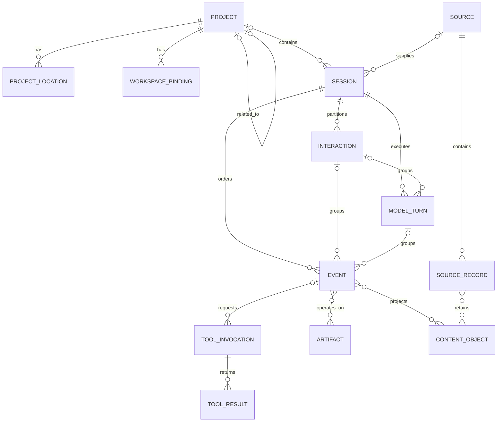
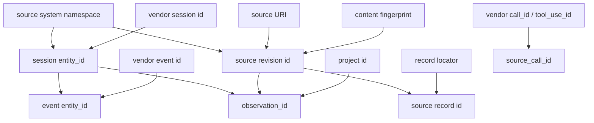

# CoSchema

CoSchema is the current vendor-neutral logical model and SQLite store contract
for Codess. It defines the regular structures searched across Claude Code,
Codex, and Cursor while retaining exact source-system evidence.

The machine-readable logical contract is
`schema/coschema/contract.json`. The physical database contract is
`schema/coschema/sqlite/schema.sql`. Those files are authoritative for fields,
types, nullability, references, constraints, and indexes.

## Package Identity

The current package is rooted at `schema/coschema/` and includes the common
contract, mapping grammar, SQLite DDL, manifest, and conformance fixtures.
Vendor mapping profiles under `schema/mappings/` are part of the package
verified by `schema/coschema/manifest.json`.

Current store identity is:

| Property | Value |
|---|---|
| Format ID | `codess.coschema` |
| Format version | `4` |
| SQLite `application_id` | `0x434F4445` |
| SQLite `user_version` | `4` |
| Decoder profile | `0.2` |
| Validator profile | `0.2` |

Codess software version, source-system release, model configuration, decoder
profile, validator profile, and CoSchema format describe different things and
remain separate provenance.

### Versioning Between Code and Extractions

Six identifiers are maintained independently because they answer different
questions. Conflating them would force a rebuild whenever any one changed:

| Identifier | Declares | Changing it means |
|---|---|---|
| `FORMAT_VERSION` (5) | The CoSchema layout: tables, columns, constraints | Stores must be rebuilt; a different layout cannot be read |
| `contract_digest` | The executable contract -- the DDL, the logical and mapping contracts, and the three vendor profiles | Something that determines how a store is written or decoded changed. Validation fixtures are deliberately outside it |
| `DECODER_VERSION` (0.2) | How vendor records are interpreted into common Events | The same source would now decode differently, so existing rows are not comparable to new ones |
| `VALIDATOR_VERSION` (0.2) | What is accepted, rejected, or diagnosed | The same records would now be admitted or refused differently |
| `IDENTITY_FORMAT` (`codess.id/1`, emitted as `id1`) | How entity identities are derived | Every `entity_id` changes; nothing resolves across the boundary. The tag travels in the value, so two schemes are distinguishable |
| Software version (`created_by`) | Which Codess release wrote the store | Recorded as provenance only; never gates anything |

Every store records all of them in `store_meta` at creation. That record is
what connects an extraction to the code that produced it: a reader can ask
which decoder interpreted a row without inferring it from a release date.

**Where each value lives.** Five of the six are written once per store into
`store_meta` by `store.init_db`; the sixth is embedded in the values it
qualifies:

| Identifier | Defined in | Written to | Checked by |
|---|---|---|---|
| `FORMAT_VERSION` | `schema_contract.py` | `store_meta.format_version`, and SQLite `PRAGMA user_version` | `require_store`, both directions |
| `contract_digest` | Computed by `contract_digest()` over the six executable files | `store_meta.contract_digest` | `require_store`, writes only |
| `DECODER_VERSION` | `processing_contract.py` | `store_meta.decoder_version` | `require_store` (writes), plus the manifest and every mapping profile at load |
| `VALIDATOR_VERSION` | `processing_contract.py` | `store_meta.validator_version` | `require_store` (writes), plus the manifest |
| Software version | `codess/__init__.py` | `store_meta.created_by` | Nothing; provenance only |
| `IDENTITY_FORMAT` | `identity.py` | Hashed into every `entity_id` and named in it as `id1` | Readable from any identity; see below |

`IDENTITY_FORMAT` was the gap and is now closed. It was fed into the digest,
so changing it changed every derived identity, but it appeared nowhere in the
resulting value and was not written to `store_meta` -- so a store could not
report which derivation produced its identities. Because identities are
compared *across* stores, the qualifier has to travel with the value rather
than sit in one store's metadata: two stores built under different schemes
would otherwise appear to disagree about the same Session.

Every identity is therefore now `codess:<kind>:id1:<64 hex>`. The tag names
the derivation scheme; the algorithm is deliberately absent, because a reader
recomputes through `codess_hash`, which owns that choice, and naming it in
the value would make changing the algorithm a wire-format change.
A change to `IDENTITY_FORMAT` remains a format change requiring a full
rebuild, but a reader can now tell which scheme produced a value.

**What is enforced, and when.** Reads require only that the store is a
Codess store of the current format. Writes additionally require the package
digest, decoder version, and validator version to match the running software:

| Check | Read | Write |
|---|---|---|
| `application_id` is Codess | Yes | Yes |
| `format_version` supported | Yes | Yes |
| `store_meta` agrees with SQLite header | Yes | Yes |
| `contract_digest` matches | No | Yes |
| `decoder_version` matches | No | Yes |
| `validator_version` matches | No | Yes |

So a change to `FORMAT_VERSION`, `contract_digest`, `DECODER_VERSION`, or
`VALIDATOR_VERSION` forces a rebuild before the next write. A change to the
software version does not, and `IDENTITY_FORMAT` does not either -- it would
instead make previously derived identities cease to match, which is a
correctness problem no store check would catch and a reason to treat it as a
format change in practice.

The read/write asymmetry is deliberate. Reading a store written by a
different decoder is safe: the rows are what that decoder produced, and their
provenance is recorded. *Appending* is not, because the store would then hold
rows from two interpretations with nothing distinguishing them. A refused
write therefore directs a rebuild rather than a migration, since vendor
sources remain the authority.

**The `package` is the released contract set**, not the Python distribution:
the SQLite DDL, the logical and mapping contracts, the three vendor mapping
profiles, and ten conformance fixtures, enumerated in
`schema/coschema/manifest.json` with a SHA-256 per file. `verify_package()`
hashes each file, compares it to the manifest, and folds the results into one
digest. Editing any listed file changes that digest and makes existing stores
unwritable -- including the fixtures, which no runtime code reads. That
coupling is deliberate: the fixtures define what a conforming store looks like.

**Vendor, harness, provider, and the parts of a model name** are defined once
in [CoNames](CoNames.md), which is authoritative for them. The schema
consequence is that `provider` is a separate column from `sessions.vendor_name`
and is filled per Model Turn: a harness commonly runs another company's model,
so the two differ in half of Cursor's rows.

**A model name is retained, not parsed into.** The exact string the harness
recorded is stored verbatim in `model_name_exact`, because it is what reached
the API and is the only value a reader can compare against vendor
documentation. The decomposed columns are filled beside it, never in place of
it, and a name Codess cannot resolve leaves them null rather than guessed.

**Two model levels, answering two questions.** `sessions.session_model_param_id`
and `model_turns.model_param_id` are not a value and its summary; they answer
different questions and neither is derived from the other:

| Level | Question it answers | Populated by |
|---|---|---|
| `sessions.session_model_param_id` | What was this Session *configured* with | The vendor's own Session-level statement, where one exists |
| `model_turns.model_param_id` | Which model *served* this turn | Per-turn evidence, overriding the Session default |

The Session value seeds turn resolution rather than summarizing it: a turn with
no stated model inherits it, and a turn that states one overrides it. So a
Session-level null is not a decode gap. Claude records the model per assistant
record and never as a Session header, so all of its Sessions carry null here
while every one of its Model Turns carries a model -- the true answer is that
the vendor states no Session-level model, and CoSchema's rule that an unstated
value stays null applies directly.

**Query the turn level for cross-vendor model comparison**, because that is the
level all three vendors populate. Sessions do change model mid-way -- measured
at 17 of 415 Sessions carrying more than one distinct model across their turns
-- so a Session-level answer would be wrong for exactly the population a
comparison question is usually about.

**Vendor releases are recorded, never gated.** Each Session stores the
harness version observed in its source records (`sessions.harness_version`,
with `sessions.release` for the product release where the vendor supplies
one), so the range of versions present is a query rather than a
configuration. Codess keeps no supported-version list, and a record shape the
decoder does not recognize becomes an `unsupported` diagnostic rather than a
failure. This is why Sessions from many harness releases decode through one
path without a compatibility layer: the vendors have kept their record
envelopes stable, and the cases where they have not are visible as
diagnostics rather than silent loss.

## Core Entities

| Entity | Purpose |
|---|---|
| `projects` | Stable work identity plus selected descriptive attributes. |
| `project_locations` | Machine-local paths, clones, worktrees, and observed location state. |
| `workspace_bindings` | Evidence-backed source-system workspace attribution to a Project. |
| `sources` | One observed Source revision, locator, storage family, availability, and integrity evidence. |
| `source_records` | Exact record positions, types, subtypes, ordering, and classification within a Source. |
| `sessions` | Source-system conversation/thread identity, Project attribution, lifecycle, time, and relation evidence. Carries both `id` (the vendor's own identifier, unique in this store) and `session_entity_id` (derived from vendor-stated facts, identical on any machine that ingested the same Session). `events` and `sources` follow the same pattern with `event_entity_id` and `source_entity_id`. See [CoNames 4](CoNames.md#identifier-suffixes). |
| `interactions` | Initiating work units within a Session. |
| `model_turns` | Evidenced model executions and their optional Interaction and configuration. |
| `events` | Ordered normalized observations with exact source classification and mapping evidence. |
| `model_params` | Nullable independent parameters a user selected or a vendor stated: provider, line, generation, version, gradation, variant, exact name, revision, effort, speed, service, and mode. **`provider` names the company whose model answered, which is not the vendor of the harness that ran it**: Cursor engages Anthropic and xAI models alongside its own, so the two differ in half its rows. **Line, generation, version, and gradation decompose the model name**: the line is the series (`claude`, `gpt`), the generation its major step in whole numbers, the version the release within it, and the gradation the capability level (`opus`, `sol`). A name Codess cannot resolve leaves the derived columns null rather than guessed, so "not recognized" is distinct from "has none". See [CoNames 3](CoNames.md#model-name-parts). |
| `tool_invocations` | Requested tool operations, exact names, call lineage, input, and status. |
| `tool_results` | Ordered results and outcomes linked to invocations when source evidence permits. |
| `artifacts` and `event_artifacts` | Durable files, URIs, repository objects, and evidence-backed Event operations. |
| `content_objects` | Deduplicated bounded content identity: one row per distinct retained body. |
| `event_content`, `source_record_content`, `tool_result_content`, `artifact_content` | The four link tables joining a content object to what it belongs to. Each carries a `relation_kind` and optional offsets, so one body can be referenced by several owners without being stored twice. |
| `processing_runs` and `content_derivations` | Content policy, processor, actions, inputs, outputs, and limitations. |
| `mapping_diagnostics` | Source-, record-, or field-scoped mapping limitations and failures. |
| `correlation_assertions` | Reviewable cross-record or cross-Project relationships with method and evidence. |

## Relationships

Common relationships are additive projections over source evidence. An
unavailable parent, call/result edge, Interaction boundary, Model Turn, or
Artifact relationship remains absent with an applicable diagnostic. It is not
inferred from proximity, timestamps, equal text, or suggestive names.

Identity flows through those relationships in a fixed direction. Each
`entity_id` is derived from upstream evidence and, where an entity is
meaningful only inside a parent, from the parent's identity -- never the
reverse, and never from a value stored in the row being identified:

Reading the diagram: a Session identity needs only its source system and the
vendor's own Session identifier, so it is reproducible anywhere. An Event
identity is qualified by its Session, so Event identities from different
Sessions cannot collide even when vendors reuse identifiers. A Source record
identity is qualified by the Source revision, binding it to one immutable
observed state. An observation identity combines the entity, its Source
revision, and the Project, which is what distinguishes two extractions of
the same logical entity.

`source_call_id` is deliberately outside this derivation. It is retained
vendor text rather than a Codess identity, hashed only when it exceeds the
relational bound, and scoped by Session rather than globally -- which is why
the schema constrains it as `UNIQUE(session_id, source_call_id)`.

A derived identity is never stored inside a structure whose digest it
depends on. Identity and integrity belong to a layer above the data they
describe: content is hashed, and the resulting digest and any name are
recorded in a separate document that is not itself an input to that hash.

## Identity

### Identifier Classes

Entities carry more than one identifier because each answers a different
question. Four classes exist, and the prefix names the class:

| Class | Form | Scope | Answers |
|---|---|---|---|
| Row key | `id`, integer or text | One database file | Which row is this, for joins and foreign keys |
| `entity_id` | `codess:<kind>:id1:<64 hex>` | Every store, machine, and rebuild | Which logical entity is this, independently of any database |
| `observation_id` | `codess:observation:id1:<64 hex>` | One extraction of one entity | Which act of observing produced this row |
| `vendor_`/`source_` value | Exact upstream text | The vendor's own namespace | What did the source system call it |

**An `entity_id` is independent of storage.** It is
derived only from upstream evidence -- a source-system namespace plus
vendor-supplied identifiers -- never from a row number, file path, insertion
order, or the database that happens to hold it. Two consequences follow, and
they are the reason the field exists at all. The same Session ingested into
two Project stores receives the same `entity_id`, so a cross-store query can
merge results without a join key that only one store knows. And rebuilding a
store from vendor sources reproduces the same values, so a saved query
result still resolves after a regeneration.

Row keys cannot do this: an integer `id` is meaningful only inside one file
and changes on rebuild. This is the specific justification for maintaining
identity fields in addition to what SQLite and the runtime provide -- a
`entity_id` is not a duplicate primary key but the only value that survives
crossing a store boundary or a rebuild. Identifiers without that
justification should not be added; every one below states which of the four
questions it answers.

`entity_id` values are always the full 32-byte digest. They are qualified by
a format tag and entity kind and are compared and stored, never truncated.

The form is `codess:<kind>:id1:<digest>`, where `id1` names the derivation
scheme rather than the algorithm. Nothing recomputes an identity to verify
it, so naming the algorithm stated an implementation choice inside a value
that is stored, compared, and quoted by operators, and made changing the
algorithm a wire-format change. Names describe a value's use -- `_id` for a
stable entity name, `_key` for a derived lookup value promising only
equality, `_hash` or `_digest` for an integrity claim a reader recomputes --
and only the last needs an algorithm named at all. The scheme tag is what a
reader needs instead: it says which derivation produced the value, so two
schemes are distinguishable across stores.

**A Source identity is derived from vendor-stated facts, not from a local
path.** `source-revision` previously took the absolute path, so the same
transcript read on two machines produced two identities and cross-store
deduplication on `sources.entity_id` failed silently. It now takes the
source system, the vendor-assigned name within that store (the trailing two
path segments), and the revision fingerprint. The name is retained because a
fingerprint alone does not identify a Source: a Claude subagent transcript
can be byte-identical to its parent, and they are two Sources.

**`observation_id` separates the entity from its observation.** One logical
Session can be seen through several Source revisions, and the same entity
can be extracted into different Projects. `entity_id` stays equal across all
of those, which is what makes it useful; `observation_id` distinguishes
them, binding a row additionally to its Project and Source revision. Query
results carry an observation identity so a reader can tell which extraction
supplied a row when several stores contribute to one answer.

### Project

Projects use generated stable identifiers independent of paths.

**A Project is a work area with its own Session history, not a repository.**
The two usually coincide and deliberately need not. A linked git worktree
shares a repository with its parent and is a separate Project, because every
vendor already treats it as one: Claude writes a separate slug directory with
its own prompt history, Codex records a distinct `cwd`, Cursor a distinct
workspace. Codess indexes what the vendors recorded, so defining a Project
against the repository would require joining Sessions the vendors never joined
and would leave `git` -- which no vendor consults -- deciding what a Session
belongs to.

The relation between such Projects is recorded rather than implied:
`related_project_id` names the parent repository's Project, and the two remain
Projects.

**Locations, workspace identifiers, and source-reported paths are observations
of one Project.** A Project moved or copied keeps its identity and gains a
location; a location whose directory is gone is retired rather than deleted, so
the record states where the work went.

**What is not a Project.** A subdirectory a Session happened to run in -- 4 of
376 observed transcripts record more than one working directory, all within one
Project -- and a worktree the harness created for its own use, which is the
tool's working area rather than the operator's.

### Source

A Source revision is unique by source-system namespace, Source URI, and revision
evidence. Source records are located within that revision. The same logical
Session can be observed through several Source revisions without losing the
distinction between Session identity and observation lineage.

Two identities implement this, and the pair is what lets Codess cite exact
evidence for a decoded record.

**Source revision identity** answers "which exact state of which file did
this come from," combining the source-system namespace, the Source URI, and
a revision value. The revision is a *content fingerprint*, not a timestamp:
a SHA-256 over the file for ordinary sizes, and a bounded sampling of
windows for files above the full-hash limit. Deriving it from content rather
than modification time is what makes it survive copying, archiving, and
restoration -- operations that routinely rewrite timestamps while leaving
bytes unchanged. A file edited in place becomes a new revision; the same
file moved does not.

**Source record identity** answers "which position within that exact state,"
combining the Source revision identity with a locator -- a line offset,
database key, or equivalent address depending on the vendor's storage. It is
built *on* the revision identity rather than beside it, so a record
identity names a position in one immutable observed state. The same line in
a file that has since changed is a different record identity, which is the
intended behavior: the evidence a decoded row cites must not silently
re-point at different content.

Both retain the full digest. Neither is path-derived, so both are portable
across machines.

### Session and Event

A Session ID is deterministic from the source-system namespace and available
source Session identity. The exact upstream ID remains in
`vendor_session_id`. An Event ID is deterministic within its Session and source
record identity. Observation IDs additionally bind records to Project and
Source revision context where required.

Human-readable Session names and source titles are metadata, not identity.

### Tool Calls

`tool_invocations.source_call_id` is an exact vendor free-text lineage value
scoped by source system and Session. The relational copy is bounded to 100
UTF-8 bytes. Longer values use a UTF-8-safe prefix plus a complete SHA-256
digest; source metadata or retained evidence keeps the original.

## Ordering and Time

`sequence_no` is the deterministic within-Session order for normalized Events
and applicable Interaction and Model Turn groups. Event sequence values are
positive and unique within one Session.

`started_at`, `ended_at`, and `event_at` contain explicit source or mapping time
or remain `NULL`. File modification time is stored separately as Source
observation evidence and is not promoted silently to Session time.

Event-oriented numeric times use Unix milliseconds. Manifest, ingest, and
observation timestamps use RFC 3339 UTC strings. Time-basis fields state the
evidence supporting a normalized value.

### Time Column Naming

The rule above -- numeric for source-reported event time, text for
Codess-recorded time -- is currently stated only in prose, while every column
carries the same `_at` suffix regardless of which it is. A reader cannot tell
from `observed_at` and `event_at` that one is RFC 3339 text and the other
Unix milliseconds, and must consult the DDL for each.

The naming does not merely fail to help; it actively misleads in one place.
`sessions.started_at` is `REAL` while `processing_runs.started_at` is `TEXT`.
The same column name denotes two different representations in one schema, so
code reading both must know which table it is in, and a query joining them
cannot compare the values without conversion.

The columns already differ by something more durable than their storage
type. Enumerating all nineteen from the DDL, they fall into three groups by
*who observed the instant*, and the representation follows the group:

| Group | Columns | Type |
|---|---|---|
| Codess recorded | `observed_at` (×3), `ingested_at` (×2), `created_at`, `asserted_at`, `processing_runs.started_at`, `completed_at` | `TEXT`, RFC 3339 UTC |
| Source reported | `sessions.started_at`, `sessions.ended_at`, `tool_invocations.started_at`, `tool_invocations.ended_at`, `event_at`, `record_at`, `timestamp` | `REAL`, Unix milliseconds |
| Filesystem observed | `source_mtime` (×2) | `REAL`, Unix milliseconds |

Exactly one name spans two groups, and it is the collision: `started_at` is
source-reported `REAL` in `sessions` and `tool_invocations`, and
Codess-recorded `TEXT` in `processing_runs`. No other name is ambiguous.

**The two representations are both correct, and the name is what is wrong.**
They differ because the values answer different questions and carry different
guarantees:

| | `sessions.started_at` | `processing_runs.started_at` |
|---|---|---|
| Who observed it | The vendor | Codess |
| Type | `REAL`, Unix milliseconds | `TEXT`, RFC 3339 UTC, `NOT NULL` |
| Nullable | Yes -- a vendor may record no time | No -- Codess always knows when it ran |
| Derived from | `MIN(events.event_at)`, materialized | The clock at the start of the run |
| Compared against | Other vendor instants, for ordering and `--since` | Other Codess runs, for provenance |

A source-reported time must stay numeric because it is a *reported value*: it
arrives in epoch form, it is compared and aggregated across hundreds of
thousands of Events, and it may be absent, so a nullable `REAL` preserves both
the arithmetic and the vendor's silence. Converting it to text would impose a
precision and an offset the vendor never stated.

A Codess-recorded time must stay textual because it is a *provenance
statement*: it is read by a person auditing what ran, it is never aggregated,
and RFC 3339 carries its own offset so the record is unambiguous outside this
database. Storing it as an epoch number would make a receipt unreadable and
invite comparison against vendor instants that were measured by a different
clock.

So the representations should not be unified. What should change is the name:
one identifier denoting two units in one schema is the defect, and the fix is
to name the group in the column rather than to force one type on both.

**The suffix states the representation.** A time column ending `_at` holds Unix
milliseconds and was reported by a vendor or the filesystem; one ending `_when`
holds RFC 3339 UTC text and was recorded by Codess. A reader then needs neither
the DDL nor a convention memo to know which a column holds, and `started_at`
means milliseconds everywhere it appears -- `processing_runs.started_at` becomes
`started_when`, which is what removes the collision. The columns renamed are
listed in `experiments/format-decisions.md` and land with the next format.

**One reader per representation, and the vendor rule sits above it.**
`timeval.epoch_ms` reads an `_at` value from whatever a vendor wrote --
ISO-8601 text, epoch seconds, or epoch milliseconds -- because the scale is not
stated in the field and all three appear across the three vendors. It is
deliberately permissive, and what it will not do is the caller's: which field
holds a time is vendor knowledge, and what an implausible value means is a
vendor's own question.

So each adapter wraps it rather than replacing it, and the wrapper is where a
vendor-specific rule lives:

| Vendor | Wrapper | Rule above `epoch_ms` |
|---|---|---|
| Claude | `cc._parse_timestamp` | None. Claude writes ISO-8601, and the numeric paths are a guard against a format change rather than a shape real records reach |
| Codex | `codex._parse_timestamp` | None. Same reason |
| Cursor | `cursor_source.parse_timestamp` | **A plausibility floor.** A numeric value below `EPOCH_SECONDS_FLOOR` is rejected rather than scaled |

**Cursor needs the floor and the others do not**, which is why it is not in the
shared reader. Cursor bubbles carry values that are not times at all -- small
counters and enum codes sit in fields a reader would take for stamps, and
`timingInfo.clientStartTime` holds milliseconds since process start. Scaled by
the shared rule, a counter becomes a 1970s instant that looks like evidence.
Imposing the floor on all three instead would make the shared reader reject a
genuine pre-2001 stamp from a vendor that has no counters in its time fields --
trading a real failure for a hypothetical one.

**A second gate applies after conversion.** `is_sane` bounds a converted value
to `[2020-01-01, now + 24h]` before it is copied into a derived field. The
floor and the gate are not redundant: the floor rejects a value whose *scale* is
wrong, the gate rejects one whose *instant* is implausible, and a counter large
enough to pass the floor is what the gate is for.

**A comparison across the two converts at query time, not in the store.** The
conversion lives in `codess.timeval.iso_to_ms`; SQLite's `strftime('%s', ...)`
is the equivalent for a direct-SQL reader. A stored numeric copy of a `_when`
column would reintroduce exactly the duplicate-column class that
`events.timestamp`, `sources.ingested_at`, and `sessions.ingested_at` were
removed for -- a second value that can disagree with the first, with nothing
asserting they match -- and would widen every bookkeeping table for a comparison
the common predicates never make. Converting at the point of use also keeps
visible that two differently measured clocks are being compared. Should a
measured query pattern ever justify it, the answer is an expression index rather
than a column, because SQLite recomputes it and it cannot drift.

**Nineteen columns is too many, and counting what each holds shows why.**
The vendors supply almost one time between them: every Claude and Codex
record carries `timestamp`, and Codex adds `started_at`/`completed_at` on a
minority of records. Measured over 21 real store sets:

| Column | Rows | Populated | Reading |
|---|---|---|---|
| `events.event_at` | 250,427 | 94% | The vendor instant |
| `events.timestamp` | 250,427 | 94% | **Byte-identical to `event_at` in all 250,427 rows** |
| `sources.observed_at` | 422 | 100% | When the Source was read |
| `sources.ingested_at` | 422 | 100% | **Byte-identical to `observed_at` in all 422 rows** |
| `tool_invocations.ended_at` | 85,840 | **0%** | Never written by any adapter |
| `processing_runs.started_at`, `completed_at` | 0 | — | Table has no rows |
| `sessions.started_at`, `ended_at` | 497 | 99% | Derived from first/last Event |
| `sessions.source_mtime`, `sources.source_mtime` | 919 | 100% | Filesystem |
| `sessions.observed_at`, `ingested_at` | 497 | 100% | Ingest bookkeeping |
| `event_at_basis` | 250,427 | 100% | Which basis `event_at` used |
| `source_records.record_at` | 195,591 | 92% | Per raw record |
| `project_locations.observed_at`, `mapping_diagnostics.created_at`, `correlation_assertions.asserted_at` | 37,838 | 100% | Row bookkeeping |

So of nineteen: **two are exact duplicates** of another column, **one is
never written** by any adapter, **two belong to a table that is empty
because content policy is opt-in** rather than because nothing writes it,
**four are ordinary row bookkeeping** on unrelated tables, and **two record
filesystem state**. The genuinely distinct time facts are the vendor instant
(`event_at`, with `event_at_basis` recording how it was obtained),
`record_at` for raw records, the derived Session span, and the ingest
observation -- roughly six, which is close to what the sources support.

#### Resolution

**Four removals and one rename are implemented; two proposed removals are
held.** The duplicates and the unwritten column are gone, the collision is
renamed, and `sessions.started_at`/`ended_at` are retained for a reason the
original resolution did not weigh -- stated below with the rest.

*Removed -- duplicates.* Three pairs store one instant twice, measured over
21 real store sets:

| Column | Evidence |
|---|---|
| `events.timestamp` | Byte-identical to `event_at` in all 250,427 rows. `event_at` is kept because it pairs with `event_at_basis`. |
| `sources.ingested_at` | Byte-identical to `sources.observed_at` in all 422 rows. |
| `sessions.ingested_at` | Byte-identical to `sessions.observed_at` in all 497 rows. |

Each pair was meant to separate reading a Source from committing it. Nothing
writes them apart, so the distinction exists only in the column names.

*Removed -- unwritten.*

| Column | Evidence |
|---|---|
| `tool_invocations.ended_at` | Null in all 85,840 rows; no vendor reports an invocation end. Re-measured before removal: null in all 59,375 rows across 25 current store sets. |

*Held -- derivable, but on the read path.* `sessions.started_at` and
`ended_at` are exactly `MIN`/`MAX(events.event_at)` in all 497 rows (448 of
448 on re-measurement), so the original resolution proposed removing them as
a denormalization no workload had asked for. Removing them was attempted and
reversed: they carry the indexed `--since`/`--until` predicate in
`query_api` and are read by 46 sites, so deriving them puts an aggregate over
the events table on every Session listing and every time-filtered query.

That is the cost the original reasoning did not weigh, and it inverts the
conclusion: the denormalization has a measured consumer. The columns stay,
with the DDL stating that they are materialized `MIN`/`MAX(event_at)` so a
reader is not left to infer it. Whether they should instead become a view
depends on the measured workloads; until those exist, removing a
column that carries the common read path would be optimizing against a guess.

*Kept -- seven, each answering a distinct question.*

| Column | The question only it answers |
|---|---|
| `events.event_at` | When did the vendor say this Event happened? |
| `events.event_at_basis` | Where did that instant come from -- the record, the Session, the file, or nothing? Without it a substituted time is indistinguishable from a reported one. |
| `source_records.record_at` | When did the *raw record* occur, at the 195,591-row source grain rather than the 250,427-row Event grain? |
| `sources.source_mtime`, `sessions.source_mtime` | What did the filesystem say when the read started? Taken from the same `stat` that admits the Source, so it pairs with the bytes actually read -- a Source changing mid-read is detected by comparing against it, which a post-read stamp could not do. |
| `sources.observed_at` | When did Codess read this Source? |
| `tool_invocations.started_at` → `source_started_at` | When did the vendor say the invocation began? **Renamed, implemented** -- this was the collision, and the other half (`ended_at`) is removed rather than renamed. |
| `processing_runs.started_at`, `completed_at` | When did a content-policy run begin and end? Empty because the policy is opt-in, not because nothing writes it: `record_processing_run` is called from `ingest_publication` and both are test-covered. |

Counting the pair columns once, that is the vendor instant and its basis,
the raw-record instant, the filesystem mtime, the read observation, the
invocation start, and the processing-run span -- **seven facts, against the
roughly four the sources supply plus three Codess genuinely adds**.

*Proposed and not acted on.* `project_locations.observed_at`,
`mapping_diagnostics.created_at`, and `correlation_assertions.asserted_at`
are row-creation stamps on derived tables whose rows are rebuilt whenever
their inputs change, and no query reads them. They were listed for removal
"by consequence"; they are retained for now because each is a bookkeeping
stamp on a table this change does not otherwise touch, and dropping a column
whose only argument is that it is small is the kind of change that belongs
with a reason of its own.

The renames are trivial beside the removals, which is the point: renaming
twelve columns that should not exist would have been the larger and less
useful change.

The duplication is not the naming problem, but it is why the naming problem
went unnoticed: a schema with two names for one instant has already stopped
being read as a whole. Removing the duplicates and the unwritten columns is
the larger part of the change, and it should happen with the rename rather
than after it.

Naming the provenance therefore resolves the collision and states what a
reader needs: whether the instant is evidence from the source, a fact about
Codess's own processing, or an observation of the file. Those carry
different trust and different comparability -- a source-reported time is
only as good as the vendor's clock, and joining one to a Codess-recorded
time is usually a mistake regardless of how either is encoded.
`source_mtime` already names its provenance in this way, which is why it
was never ambiguous.

Naming the *encoding* instead was the earlier proposal and is withdrawn. A
suffix such as `_atms` binds the column name to a storage decision, so
changing the encoding -- to integer microseconds, or to text for a source
that reports offsets -- becomes a rename across the DDL, the contract, every
query path, and every consumer. It also answers a question a reader rarely
has, while leaving the provenance question it does have unanswered.

The exact spelling is settled with the change. A `source_` prefix on the
vendor-reported columns follows the precedent `source_mtime` already sets,
leaves the Codess-recorded columns untouched, and makes the distinction
visible at the point of use: `sessions.source_started_at` against
`processing_runs.started_at`. This is a breaking schema change and is
tracked with the other CoSchema strengthening work rather than applied
piecemeal.

## Types and Classification

Every mapped Event can retain:

- exact `source_record_type` and `source_record_subtype`;
- normalized `event_kind`;
- `actor_kind`, `content_role`, and `origin_kind`;
- Interaction initiation and Session relation where applicable;
- exact and normalized status;
- mapping rule and structured mapping trace; and
- field- or record-level diagnostics.

The principal Actor kinds are human, harness, tool, and model. Source role is
independent: a `user` role can carry a tool result, delegated prompt, injected
context, or direct human prompt.

Common classifications remain open where vendor evidence can introduce useful
new values. Closed taxonomies are used only where stable query behavior requires
a bounded vocabulary.

## Tools and Outcomes

Source tool names are free text. `canonical_tool_name` can group reviewed aliases
without replacing the exact name.

Invocation input and result payload have explicit boundaries. Structured
invocation input and structured result values use valid JSON; display or
unstructured result bodies use text. A harness subprocess is not automatically
called a model tool operation without source evidence.

Source status preserves the vendor value. Normalized status supports common
search over pending, running, succeeded, failed, denied, cancelled, incomplete,
and unknown outcomes. Transport and application status can coexist so a
completed transport does not conceal an operation failure.

## Model Configuration

Model configuration dimensions are nullable and independent:

- provider;
- model family;
- exact model name;
- model revision;
- reasoning effort;
- speed tier;
- service tier; and
- mode.

A missing value remains missing. Codess does not infer speed, effort, service,
or mode from the model name. Configuration identity uses the complete null-safe
tuple.

Each normalized occurrence records direct source field and locator provenance.
When a vendor places one setting on a governing record, propagated occurrences
are explicitly marked as inherited and retain the governing Event or record.

## Metadata and JSON

Typed, frequently queried meaning belongs in columns or relations. JSON is used
only for intrinsically structured or sparse values:

- mapping traces;
- tool argument and result objects;
- configuration source evidence;
- processing actions;
- correlation evidence; and
- bounded namespaced extension objects.

Identifiers, paths, versions, statuses, source types, field paths, and primary
mapping rules remain scalar. Extension JSON cannot conceal required identity,
duplicate canonical fields, contradict common values, or become an unbounded
raw-record dump. SQLite enforces `json_valid()` for structured fields.

### Canonical Serialization

JSON that is stored, compared, or digested uses one serialization: keys
sorted, compact separators, and non-ASCII characters emitted as UTF-8 rather
than `\u` escapes. Both escaped and unescaped forms are valid JSON and parse
to the same object, but they are different bytes, so any digest over a
document depends on the choice. Fixing it once is what makes equal content
produce equal digests.

UTF-8 is preferred because it is smaller for the non-ASCII content Codess
routinely stores, remains legible in query output and database browsers, and
matches the JSON interchange default. Neither form has a storage advantage:
both satisfy `json_valid()`, round-trip through `TEXT` unchanged, and yield
equal `json_extract` results.

Encoding tolerates lone surrogates rather than rejecting them. Filesystem
paths whose bytes are not valid UTF-8 surface in Python as surrogates, and
strict encoding would raise on them, so a single undecodable filename would
otherwise abort an operation. `codess/hashing.py` owns this serialization;
CoReview records the analysis behind it.

## Content

Content objects separate content identity from Event projections and raw-object
location. They record media type, charset, byte and character length, storage
class, bounded inline content or external raw-object identity, privacy class,
and applicable metadata.

Typed links associate content with Events, Source records, tool results, and
Artifacts. A record can be semantically useful through tool, configuration,
status, or context data even when ordinary message content is absent.

Content processing records the selected policy, processor, action sequence,
input/output identity, and rejection or truncation reason. Derived searchable
content never silently claims to be exact source bytes.

## Artifacts and Correlation

Artifact identity prefers Project-relative paths for files inside a Project.
Observed absolute paths remain evidence. External files use an external URI and
scope rather than a misleading `../` relative path.

Cross-Project or cross-vendor correspondence is represented by a correlation
assertion with method, evidence, confidence, and observation context. An
assertion does not rewrite the original Project, Artifact, Session, or Event
identity.

## Diagnostics

Mapping diagnostics separate structural scope from operational severity:

- Source scope: selected Source cannot be processed safely;
- record scope: one source record cannot produce valid common records; and
- field scope: one value is absent, malformed, ambiguous, unsupported, or
  omitted while other record content remains usable.

Diagnostics retain Source, record locator, field path, source value state,
mapping rule, reason, severity, and bounded detail. Query and validation can
therefore distinguish unavailable evidence from a supported value that happens
to be `NULL`.

## Store Sets and Raw Evidence

Codess writes per-source-system SQLite stores for a selected Project and
publishes them through a manifest and current pointer as one Project store set.
A unified Codess store is the logical queryable collection of selected Project
store sets; it does not require copying them into one SQLite file. Source
replacement is transactional. Query opens normalized databases read-only.

Raw retention uses the `codess.raw/1` sidecar format outside query databases.
Reference mode records locator and update evidence. Capture stores an exact
content-addressed revision. Seal makes the selected raw objects part of the
published Project store set. Raw objects are not duplicated into Session
tables.

JSONL capture uses bounded streaming. Cursor capture uses SQLite backup so
committed write-ahead-log state is represented consistently. Exact retained
objects and source-system stores use complete SHA-256 verification.

## Query Contract

The common query contract supports Sessions, overview, Events, and search over
one or more selected Project store sets. Predicates cover identifiers, source
system, classification, status, model configuration, tool, Artifact, time, and
bounded text.

Results retain Project and store scope, stable row identities, deterministic
order, applied limits, completeness or truncation information, and facets.
Interaction and Model Turn expansion follows persisted relations and ordered
Events. Structured request and result contracts live in `schema/query-*.json`.

Direct SQLite access remains supported for exploratory joins, distributions,
query-plan inspection, and specialized analysis.

## Mapping Contract

`schema/coschema/mapping-contract.json` defines the executable profile shape.
A mapping entry identifies its source system and storage family, supported
record selector and field paths, target common or specialized field, named rule
or host transform, guards and ordered alternatives, source and normalized
vocabulary, retention class, ambiguity or loss, diagnostic behavior, and
fixtures. Vendor profiles live under `schema/mappings/`.

Mapping diagnostics identify Source, record, or field scope independently from
severity. Conformance fixtures cover required minima, representative optional
values, valid boundaries, named invariant failures, vendor hazards, and exact
source-to-common outcomes.

## Contract Maintenance

The schema package, mappings, DDL, writer, query code, and fixtures must agree.
A current contract change proceeds from functional requirement and vendor
evidence through mapping, query, machine-readable contract, DDL, tests, and
representative real-source validation.

Changes to identity, ordering, Actor meaning, lineage, status, or content
semantics rebuild affected source-system stores and Project store sets. Vendor
Sources remain unchanged.
