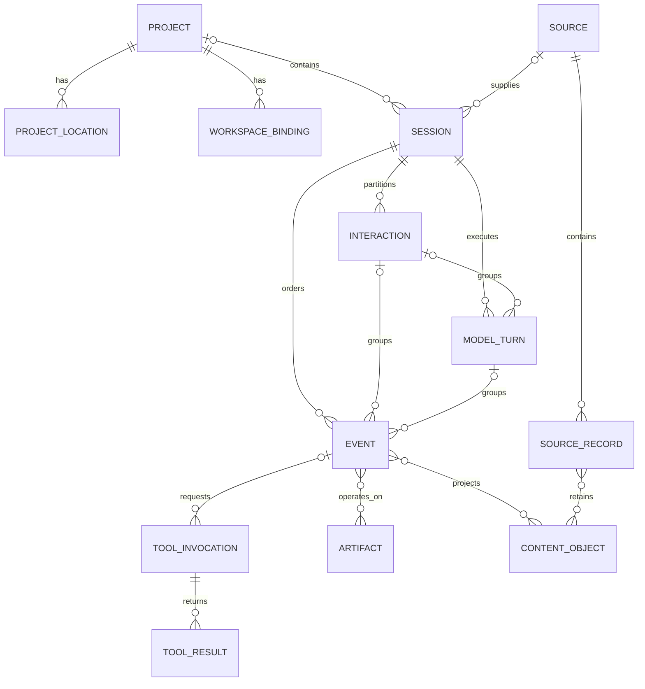
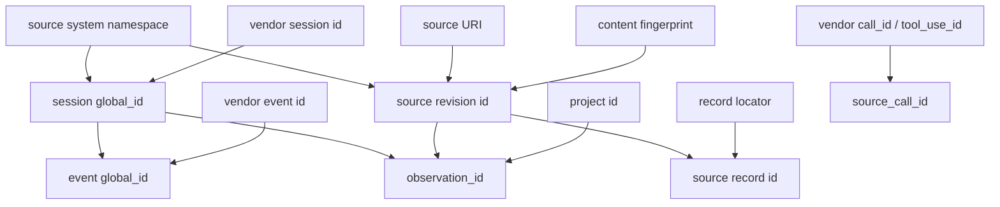

# CoSchema

CoSchema is the current vendor-neutral logical model and SQLite store contract
for Codess. It defines the regular structures searched across Claude Code,
Codex, and Cursor while retaining exact source-system evidence.

The machine-readable logical contract is
`schema/coschema/contract.json`. The physical database contract is
`schema/coschema/sqlite/schema.sql`. Those files are authoritative for fields,
types, nullability, references, constraints, and indexes.

## 1. Package Identity

The current package is rooted at `schema/coschema/` and includes the common
contract, mapping grammar, SQLite DDL, manifest, and conformance fixtures.
Vendor mapping profiles under `schema/mappings/` are part of the package
verified by `schema/coschema/manifest.json`.

Current store identity is:

| Property | Value |
|---|---|
| Format ID | `codess.coschema` |
| Format version | `4` |
| SQLite `application_id` | `0x434F4445` |
| SQLite `user_version` | `4` |
| Decoder profile | `0.2` |
| Validator profile | `0.2` |

Codess software version, source-system release, model configuration, decoder
profile, validator profile, and CoSchema format describe different things and
remain separate provenance.

## 2. Core Entities

| Entity | Purpose |
|---|---|
| `projects` | Stable work identity plus selected descriptive attributes. |
| `project_locations` | Machine-local paths, clones, worktrees, and observed location state. |
| `workspace_bindings` | Evidence-backed source-system workspace attribution to a Project. |
| `sources` | One observed Source revision, locator, storage family, availability, and integrity evidence. |
| `source_records` | Exact record positions, types, subtypes, ordering, and classification within a Source. |
| `sessions` | Source-system conversation/thread identity, Project attribution, lifecycle, time, and relation evidence. |
| `interactions` | Initiating work units within a Session. |
| `model_turns` | Evidenced model executions and their optional Interaction and configuration. |
| `events` | Ordered normalized observations with exact source classification and mapping evidence. |
| `model_configurations` | Nullable independent provider, model, revision, effort, speed, service, and mode values. |
| `tool_invocations` | Requested tool operations, exact names, call lineage, input, and status. |
| `tool_results` | Ordered results and outcomes linked to invocations when source evidence permits. |
| `artifacts` and `event_artifacts` | Durable files, URIs, repository objects, and evidence-backed Event operations. |
| `content_objects` and content links | Deduplicated bounded content identity and its relation to Events, records, tools, and Artifacts. |
| `processing_runs` and `content_derivations` | Content policy, processor, actions, inputs, outputs, and limitations. |
| `mapping_diagnostics` | Source-, record-, or field-scoped mapping limitations and failures. |
| `correlation_assertions` | Reviewable cross-record or cross-Project relationships with method and evidence. |

## 3. Relationships

Common relationships are additive projections over source evidence. An
unavailable parent, call/result edge, Interaction boundary, Model Turn, or
Artifact relationship remains absent with an applicable diagnostic. It is not
inferred from proximity, timestamps, equal text, or suggestive names.

Identity flows through those relationships in a fixed direction. Each
`global_` identity is derived from upstream evidence and, where an entity is
meaningful only inside a parent, from the parent's identity -- never the
reverse, and never from a value stored in the row being identified:

Reading the diagram: a Session identity needs only its source system and the
vendor's own Session identifier, so it is reproducible anywhere. An Event
identity is qualified by its Session, so Event identities from different
Sessions cannot collide even when vendors reuse identifiers. A Source record
identity is qualified by the Source revision, binding it to one immutable
observed state. An observation identity combines the entity, its Source
revision, and the Project, which is what distinguishes two extractions of
the same logical entity.

`source_call_id` is deliberately outside this derivation. It is retained
vendor text rather than a Codess identity, hashed only when it exceeds the
relational bound, and scoped by Session rather than globally -- which is why
the schema constrains it as `UNIQUE(session_id, source_call_id)`.

A derived identity is never stored inside a structure whose digest it
depends on. Identity and integrity belong to a layer above the data they
describe: content is hashed, and the resulting digest and any name are
recorded in a separate document that is not itself an input to that hash.

## 4. Identity

### 4.1 Identifier Classes

Entities carry more than one identifier because each answers a different
question. Four classes exist, and the prefix names the class:

| Class | Form | Scope | Answers |
|---|---|---|---|
| Row key | `id`, integer or text | One database file | Which row is this, for joins and foreign keys |
| `global_` identity | `codess:<kind>:sha256:<64 hex>` | Every store, machine, and rebuild | Which logical entity is this, independently of any database |
| `observation_id` | `codess:observation:sha256:<64 hex>` | One extraction of one entity | Which act of observing produced this row |
| `vendor_`/`source_` value | Exact upstream text | The vendor's own namespace | What did the source system call it |

**`global_` designates independence from storage.** A `global_id` is
derived only from upstream evidence -- a source-system namespace plus
vendor-supplied identifiers -- never from a row number, file path, insertion
order, or the database that happens to hold it. Two consequences follow, and
they are the reason the field exists at all. The same Session ingested into
two Project stores receives the same `global_id`, so a cross-store query can
merge results without a join key that only one store knows. And rebuilding a
store from vendor sources reproduces the same values, so a saved query
result still resolves after a regeneration.

Row keys cannot do this: an integer `id` is meaningful only inside one file
and changes on rebuild. This is the specific justification for maintaining
identity fields in addition to what SQLite and the runtime provide -- a
`global_id` is not a duplicate primary key but the only value that survives
crossing a store boundary or a rebuild. Identifiers without that
justification should not be added; every one below states which of the four
questions it answers.

`global_id` values are always the full 32-byte digest. They are qualified by
a format tag and entity kind and are compared and stored, never truncated.

The current form embeds the digest algorithm, as
`codess:<kind>:sha256:<digest>`. That is a recognized weakness rather than a
guarantee: nothing recomputes these values to verify them, so the algorithm
name states an implementation choice inside a value that is stored,
compared, and quoted by operators, and changing the algorithm would
therefore be a wire-format change. Names should describe a value's use --
`_id` for a stable entity name, `_key` for a derived lookup value promising
only equality, `_hash` or `_digest` for an integrity claim a reader
recomputes -- and only the last needs the algorithm named. Integrity fields
such as `stored_sha256` and `manifest_sha256` are correctly named on that
basis. The identity prefixes are under review; existing values are not
rewritten, since any change to them alters documents already written.

**`observation_id` separates the entity from its observation.** One logical
Session can be seen through several Source revisions, and the same entity
can be extracted into different Projects. `global_id` stays equal across all
of those, which is what makes it useful; `observation_id` distinguishes
them, binding a row additionally to its Project and Source revision. Query
results carry an observation identity so a reader can tell which extraction
supplied a row when several stores contribute to one answer.

### 4.2 Project

Projects use generated stable identifiers independent of paths. For Git-backed
work, one repository is one Project. Locations, linked worktrees, workspace
identifiers, and source-reported paths are observations related to that Project.

### 4.3 Source

A Source revision is unique by source-system namespace, Source URI, and revision
evidence. Source records are located within that revision. The same logical
Session can be observed through several Source revisions without losing the
distinction between Session identity and observation lineage.

Two identities implement this, and the pair is what lets Codess cite exact
evidence for a decoded record.

**Source revision identity** answers "which exact state of which file did
this come from," combining the source-system namespace, the Source URI, and
a revision value. The revision is a *content fingerprint*, not a timestamp:
a SHA-256 over the file for ordinary sizes, and a bounded sampling of
windows for files above the full-hash limit. Deriving it from content rather
than modification time is what makes it survive copying, archiving, and
restoration -- operations that routinely rewrite timestamps while leaving
bytes unchanged. A file edited in place becomes a new revision; the same
file moved does not.

**Source record identity** answers "which position within that exact state,"
combining the Source revision identity with a locator -- a line offset,
database key, or equivalent address depending on the vendor's storage. It is
built *on* the revision identity rather than beside it, so a record
identity names a position in one immutable observed state. The same line in
a file that has since changed is a different record identity, which is the
intended behavior: the evidence a decoded row cites must not silently
re-point at different content.

Both retain the full digest. Neither is path-derived, so both are portable
across machines.

### 4.4 Session and Event

A Session ID is deterministic from the source-system namespace and available
source Session identity. The exact upstream ID remains in
`vendor_session_id`. An Event ID is deterministic within its Session and source
record identity. Observation IDs additionally bind records to Project and
Source revision context where required.

Human-readable Session names and source titles are metadata, not identity.

### 4.5 Tool Calls

`tool_invocations.source_call_id` is an exact vendor free-text lineage value
scoped by source system and Session. The relational copy is bounded to 100
UTF-8 bytes. Longer values use a UTF-8-safe prefix plus a complete SHA-256
digest; source metadata or retained evidence keeps the original.

## 5. Ordering and Time

`sequence_no` is the deterministic within-Session order for normalized Events
and applicable Interaction and Model Turn groups. Event sequence values are
positive and unique within one Session.

`started_at`, `ended_at`, and `event_at` contain explicit source or mapping time
or remain `NULL`. File modification time is stored separately as Source
observation evidence and is not promoted silently to Session time.

Event-oriented numeric times use Unix milliseconds. Manifest, ingest, and
observation timestamps use RFC 3339 UTC strings. Time-basis fields state the
evidence supporting a normalized value.

## 6. Types and Classification

Every mapped Event can retain:

- exact `source_record_type` and `source_record_subtype`;
- normalized `event_kind`;
- `actor_kind`, `content_role`, and `origin_kind`;
- Interaction initiation and Session relation where applicable;
- exact and normalized status;
- mapping rule and structured mapping trace; and
- field- or record-level diagnostics.

The principal Actor kinds are human, harness, tool, and model. Source role is
independent: a `user` role can carry a tool result, delegated prompt, injected
context, or direct human prompt.

Common classifications remain open where vendor evidence can introduce useful
new values. Closed taxonomies are used only where stable query behavior requires
a bounded vocabulary.

## 7. Tools and Outcomes

Source tool names are free text. `canonical_tool_name` can group reviewed aliases
without replacing the exact name.

Invocation input and result payload have explicit boundaries. Structured
invocation input and structured result values use valid JSON; display or
unstructured result bodies use text. A harness subprocess is not automatically
called a model tool operation without source evidence.

Source status preserves the vendor value. Normalized status supports common
search over pending, running, succeeded, failed, denied, cancelled, incomplete,
and unknown outcomes. Transport and application status can coexist so a
completed transport does not conceal an operation failure.

## 8. Model Configuration

Model configuration dimensions are nullable and independent:

- provider;
- model family;
- exact model name;
- model revision;
- reasoning effort;
- speed tier;
- service tier; and
- mode.

A missing value remains missing. Codess does not infer speed, effort, service,
or mode from the model name. Configuration identity uses the complete null-safe
tuple.

Each normalized occurrence records direct source field and locator provenance.
When a vendor places one setting on a governing record, propagated occurrences
are explicitly marked as inherited and retain the governing Event or record.

## 9. Metadata and JSON

Typed, frequently queried meaning belongs in columns or relations. JSON is used
only for intrinsically structured or sparse values:

- mapping traces;
- tool argument and result objects;
- configuration source evidence;
- processing actions;
- correlation evidence; and
- bounded namespaced extension objects.

Identifiers, paths, versions, statuses, source types, field paths, and primary
mapping rules remain scalar. Extension JSON cannot conceal required identity,
duplicate canonical fields, contradict common values, or become an unbounded
raw-record dump. SQLite enforces `json_valid()` for structured fields.

### 9.1 Canonical Serialization

JSON that is stored, compared, or digested uses one serialization: keys
sorted, compact separators, and non-ASCII characters emitted as UTF-8 rather
than `\u` escapes. Both escaped and unescaped forms are valid JSON and parse
to the same object, but they are different bytes, so any digest over a
document depends on the choice. Fixing it once is what makes equal content
produce equal digests.

UTF-8 is preferred because it is smaller for the non-ASCII content Codess
routinely stores, remains legible in query output and database browsers, and
matches the JSON interchange default. Neither form has a storage advantage:
both satisfy `json_valid()`, round-trip through `TEXT` unchanged, and yield
equal `json_extract` results.

Encoding tolerates lone surrogates rather than rejecting them. Filesystem
paths whose bytes are not valid UTF-8 surface in Python as surrogates, and
strict encoding would raise on them, so a single undecodable filename would
otherwise abort an operation. `codess/hashing.py` owns this serialization;
CoPlan 13.4.8 records the analysis behind it.

## 10. Content

Content objects separate content identity from Event projections and raw-object
location. They record media type, charset, byte and character length, storage
class, bounded inline content or external raw-object identity, privacy class,
and applicable metadata.

Typed links associate content with Events, Source records, tool results, and
Artifacts. A record can be semantically useful through tool, configuration,
status, or context data even when ordinary message content is absent.

Content processing records the selected policy, processor, action sequence,
input/output identity, and rejection or truncation reason. Derived searchable
content never silently claims to be exact source bytes.

## 11. Artifacts and Correlation

Artifact identity prefers Project-relative paths for files inside a Project.
Observed absolute paths remain evidence. External files use an external URI and
scope rather than a misleading `../` relative path.

Cross-Project or cross-vendor correspondence is represented by a correlation
assertion with method, evidence, confidence, and observation context. An
assertion does not rewrite the original Project, Artifact, Session, or Event
identity.

## 12. Diagnostics

Mapping diagnostics separate structural scope from operational severity:

- Source scope: selected Source cannot be processed safely;
- record scope: one source record cannot produce valid common records; and
- field scope: one value is absent, malformed, ambiguous, unsupported, or
  omitted while other record content remains usable.

Diagnostics retain Source, record locator, field path, source value state,
mapping rule, reason, severity, and bounded detail. Query and validation can
therefore distinguish unavailable evidence from a supported value that happens
to be `NULL`.

## 13. Store Sets and Raw Evidence

Codess writes per-source-system SQLite stores for a selected Project and
publishes them through a manifest and current pointer as one Project store set.
A unified Codess store is the logical queryable collection of selected Project
store sets; it does not require copying them into one SQLite file. Source
replacement is transactional. Query opens normalized databases read-only.

Raw retention uses the `codess.raw/1` sidecar format outside query databases.
Reference mode records locator and update evidence. Capture stores an exact
content-addressed revision. Seal makes the selected raw objects part of the
published Project store set. Raw objects are not duplicated into Session
tables.

JSONL capture uses bounded streaming. Cursor capture uses SQLite backup so
committed write-ahead-log state is represented consistently. Exact retained
objects and source-system stores use complete SHA-256 verification.

## 14. Query Contract

The common query contract supports Sessions, overview, Events, and search over
one or more selected Project store sets. Predicates cover identifiers, source
system, classification, status, model configuration, tool, Artifact, time, and
bounded text.

Results retain Project and store scope, stable row identities, deterministic
order, applied limits, completeness or truncation information, and facets.
Interaction and Model Turn expansion follows persisted relations and ordered
Events. Structured request and result contracts live in `schema/query-*.json`.

Direct SQLite access remains supported for exploratory joins, distributions,
query-plan inspection, and specialized analysis.

## 15. Mapping Contract

`schema/coschema/mapping-contract.json` defines the executable profile shape.
A mapping entry identifies its source system and storage family, supported
record selector and field paths, target common or specialized field, named rule
or host transform, guards and ordered alternatives, source and normalized
vocabulary, retention class, ambiguity or loss, diagnostic behavior, and
fixtures. Vendor profiles live under `schema/mappings/`.

Mapping diagnostics identify Source, record, or field scope independently from
severity. Conformance fixtures cover required minima, representative optional
values, valid boundaries, named invariant failures, vendor hazards, and exact
source-to-common outcomes.

## 16. Contract Maintenance

The schema package, mappings, DDL, writer, query code, and fixtures must agree.
A current contract change proceeds from functional requirement and vendor
evidence through mapping, query, machine-readable contract, DDL, tests, and
representative real-source validation.

Changes to identity, ordering, Actor meaning, lineage, status, or content
semantics rebuild affected source-system stores and Project store sets. Vendor
Sources remain unchanged.
