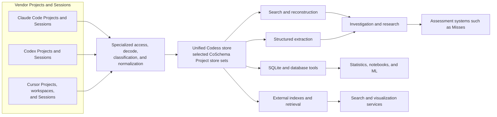

# Codess

Codess turns locally retained coding-assistant sessions into reliable,
searchable records of development work. It reads the distinct stores maintained
by Claude Code, Codex, and Cursor, preserves their evidence, and maps understood
meaning into a common database model.

The immediate value is practical investigation: find the Sessions associated
with a Project, locate an exchange, reconstruct its surrounding Interaction,
inspect tool activity, and compare work across source systems. The larger vision
is a persistent conversion discipline that supplies stable inputs to assessment,
statistics, visualization, research, and other data systems.

Vendor conversion, regular storage, and investigation are the central product.
The external ecosystem describes compatible directions for extending those
records; it is not a promise that every listed interface or service is bundled.

## 1. Problem

Coding harnesses retain far more than a visible chat transcript. Depending on
the product and release, local stores can include human prompts, model output,
tool calls and results, permission decisions, context injections, compaction
summaries, model settings, subagent activity, file references, lifecycle events,
and usage observations.

That evidence is difficult to use directly:

- each source system uses a different storage layout and record vocabulary;
- structures change between releases and can be only partly documented;
- one logical exchange may be spread across several records or tables;
- vendor roles such as `user` and `assistant` do not reliably identify the
  human, model, harness, or tool that produced the content;
- tools, subprocesses, agents, plugins, and Model Context Protocol (MCP)
  operations expose different identifiers and result relationships;
- large shared stores require selective queries rather than complete decoding;
- timestamps, identifiers, ordering, and Project attribution vary in quality;
- exact source evidence and normalized meaning are both necessary; and
- direct searches across vendor stores are difficult to reproduce or combine.

A collection of one-off export scripts does not solve this problem. Every
consumer would have to rediscover vendor formats, classification hazards,
Project attribution, and provenance. Results would be difficult to compare and
could silently change when a product updates its local storage.

## 2. Solution

Codess separates six responsibilities:

1. **Discover and select** relevant Projects, workspaces, Sessions, and Sources.
2. **Access** vendor stores through bounded filesystem reads and selective
   database queries.
3. **Decode** each storage family with a specialized, release-aware adapter.
4. **Classify and normalize** understood evidence without discarding exact
   source designations.
5. **Store and index** regular Project records suitable for direct and composed
   queries.
6. **Search and reconstruct** Sessions, Interactions, Model Turns, tools,
   artifacts, and supporting evidence.

The normalized database is not a replacement for vendor evidence. It is a
searchable projection whose records retain the source system, Source revision,
record locator, exact type and subtype, mapping rule, and available lineage.
When a value cannot be interpreted reliably, Codess keeps the source evidence
and records the limitation instead of manufacturing a common value.

## 3. Conversion Discipline

Codess treats ingestion as a persistent conversion process rather than a file
copy or transcript formatter.

### 3.1 Specialized Source Access

Source access is specific to each storage family. Claude and Codex transcripts
can be streamed as bounded JSON Lines (JSONL). Cursor requires read-only,
indexed SQLite selection of the workspaces and composers associated with the
chosen Project. Source access avoids decoding unrelated content and supplies
stable record locators to the adapter.

### 3.2 Disciplined but Opportunistic Decode

Vendor decoders are strict about evidence and tolerant about availability.
They accept useful records even when optional fields are absent, malformed, or
new. A defect in one optional value does not invalidate a usable message or tool
operation. Conversely, a decoder does not guess identity, time, Actor,
relationship, status, or meaning merely to fill a common field.

Opportunistic decode therefore means:

- recognize useful records as soon as their structure and meaning are supported;
- preserve unknown or vendor-specific records for later investigation;
- promote fields into the common model only when evidence and a use case justify
  the mapping;
- report partial, ambiguous, unsupported, and rejected values explicitly; and
- improve adapters continuously as representative vendor evidence appears.

### 3.3 Exact and Common Meaning

Codess stores two complementary views:

- **source evidence** preserves vendor names, record types, field values,
  identifiers, locators, ordering, and relationships; and
- **normalized meaning** supplies regular Projects, Sources, Sessions,
  Interactions, Model Turns, Events, Actors, tools, results, content, and
  Artifacts for mixed-source queries.

Normalized fields are a common search surface, not a claim that every source
system has identical semantics. A query can use common fields while retaining
the source values needed to explain differences.

### 3.4 Accuracy and Completeness

Conversion checks whether selected source evidence is represented accurately
and completely within the declared support boundary. Structural readability,
identity, ordering, relationships, content, classification, and query results
are checked against representative vendor records and real investigations.
Unsupported, ambiguous, excluded, and rejected material remains visible in
diagnostics rather than disappearing behind a successful run.

## 4. Core Model and Terminology

Codess uses a small set of concepts consistently across source systems.

| Term | Meaning |
|---|---|
| **Project** | Stable identity for a continuing body of work. For Git-backed work, one repository is one Project; clones, worktrees, directories, and vendor workspaces are locations or bindings. |
| **Source** | Logical upstream evidence container such as a transcript file or database. |
| **Source revision** | One observed state of a Source, with update and provenance evidence. |
| **Session** | One source-system conversation or thread identity and lifecycle. |
| **Interaction** | Initiating work unit that may contain several Model Turns, tool operations, harness Events, clarification requests, and replies. |
| **Model Turn** | One evidenced model execution within an Interaction. It is not necessarily a displayed message or user-assistant pair. |
| **Actor** | Immediate evidence-backed producer or operative participant, principally human, harness, tool, or model. |
| **Event** | One ordered normalized observation within a Session. |
| **Artifact** | File, URI, repository object, or other durable object operated on or mentioned by an Event. |
| **Source-system store** | One CoSchema SQLite database for one source system and Project observation. |
| **Project store set** | The selected source-system stores, manifest, and current pointer that represent one Project observation. |
| **Unified Codess store** | A logical queryable collection of selected Project store sets; it need not be one SQLite file. |
| **Search result** | Bounded result carrying stable record identities, scope, and provenance. |

Actor, source role, content role, origin, and Session relationship remain
separate dimensions. A vendor `user` envelope can carry harness-generated
context or a tool result; an `assistant` envelope does not by itself prove a
new model execution. This separation is essential to reliable counts and
behavioral research.

Use the capitalized entity names Project, Source, Source revision, Session,
Interaction, Model Turn, Actor, Event, and Artifact for Codess concepts. Use
lowercase words for generic or exact upstream concepts.

Important distinctions are:

- a Project is not merely a directory, checkout, workspace, or Session;
- a Source is not a Session and may contain one or many Sessions;
- a Session ID is stable identity, while a Session name is a mutable operator
  alias and a source title is source-system evidence;
- a Model is configuration for a Model Turn, not an Actor or harness;
- an Actor is not synonymous with a source role;
- normalized fields do not replace exact source designations; and
- a search result is a derived selection, not another source of truth.

## 5. Core Capabilities

### 5.1 Project and Session Orientation

Codess can identify the source systems and Sessions associated with a Project,
then summarize their ordering, time coverage, volume, model evidence, tool use,
and participant classifications. This establishes where useful work exists
before a researcher reads large bodies of content.

Typical questions include:

- Which Claude, Codex, or Cursor Sessions concern this repository?
- Which Sessions contain the most tool activity or content?
- When did activity occur, and which periods are worth examining?
- Is a Session direct human work, delegated work, or another relationship?

### 5.2 Exchange Location and Reconstruction

Researchers can search for a distinctive prompt, response, tool operation,
error, status, file, or content fragment and reconstruct the surrounding
sequence. Expansion can recover the complete Interaction or Model Turn rather
than returning an isolated matching row.

This supports questions such as:

- Where did a particular instruction first appear?
- What model response and tool operations followed it?
- Which result belongs to a tool invocation?
- What happened immediately before and after an error or denial?
- Was a short prompt direct human input or harness-generated control traffic?

### 5.3 Vendor and Model Comparison

Common fields permit comparisons without erasing source distinctions. A query
can compare similar Event kinds, tools, Actors, model configurations, or
outcomes across source systems while retaining the exact vendor types and
values that qualify the comparison.

Useful investigations include:

- how vendors represent tools, planning, compaction, or delegated work;
- which configuration dimensions are directly recorded by each harness;
- where one vendor provides stronger ordering, lineage, or status evidence;
- how similar work differs across models or harness releases; and
- which normalized classifications are well supported, partial, or unavailable.

### 5.4 Development-Process Investigation

Session records expose the mechanics of development, not only conversation
text. Codess can support analysis of file reads and edits, terminal commands,
searches, tool failures, permission decisions, retries, planning operations,
and overlapping work on common Artifacts.

This helps reconstruct how an outcome was produced, find repeated failure
patterns, compare manual and automated work, and identify interactions between
several coding systems working on the same Project.

### 5.5 Communication and Behavior Assessment

Codess can select precisely framed inputs for systems that study
misunderstandings, instruction following, assessment quality, or model
behavior. A derived assessment can point back to the exact Events, surrounding
Interaction, source classifications, and tool activity rather than copying an
unstructured transcript fragment.

The Misses project is one possible consumer. Codess remains responsible for
vendor decode and normalized search; the assessment system remains responsible
for its cases, labels, ratings, and interpretation.

### 5.6 Evidence Review

For any important normalized finding, Codess aims to answer:

- which Project, Session, Source, and Source revision supplied it;
- which exact record and field were used;
- which mapping produced the normalized value;
- whether content was bounded, transformed, redacted, or omitted;
- which relationships were direct and which were unavailable; and
- whether the result can be reconstructed from the selected evidence.

## 6. Search Requirements

Search is a principal product capability, not a presentation layer over ingest.
Codess search should support:

- one or many Projects;
- one or many source systems;
- Session, Event, Interaction, and Model Turn identifiers;
- Event kind, Actor, content role, origin, status, tool, model, time, and
  Artifact predicates;
- bounded literal content search;
- deterministic ordering and limits;
- complete surrounding sequence expansion;
- useful facets and volume summaries;
- stable result identities and reusable result selection; and
- direct access through SQLite and structured command output.

Performance comes first from selecting only relevant vendor records during
ingest, storing typed common fields, maintaining appropriate SQLite indexes,
pushing predicates into each source-system store, and merging only bounded
result streams. Alternative search engines are extensions justified by measured
queries, not substitutes for correct classification or indexing.

## 7. Derived Processing and External Ecosystem

Regular source-system stores and Project store sets allow capabilities to grow
beyond the built-in command line without requiring every consumer to
reverse-engineer vendor formats.

Potential consumers include:

- the SQLite command line and database browsers;
- Python, R, pandas, Polars, and notebook workflows;
- analytical engines operating over selected databases or exports;
- dashboards, timelines, and other visualizations;
- graph views of Sessions, Events, tools, and Artifacts;
- text search, ranking, and retrieval services;
- qualitative and quantitative assessment systems;
- structured datasets for statistics or machine learning; and
- local APIs exposing selected search and evidence operations.

Codess should make such extensions straightforward through regular fields,
stable identities, read-only query access, structured output, and explicit
derivation metadata. An external store or service may improve search,
visualization, aggregation, or presentation, but it must not become an
independent vendor decoder or erase source provenance.

Session records can contain private source code, prompts, paths, credentials,
and operational details. Local read-only use is the default. Export, remote
indexing, or third-party services require explicit selection and appropriate
content processing.

## 8. Product Boundaries

Codess concentrates on local coding-assistant evidence and the structures
needed to investigate it. It does not attempt to:

- recover server-hidden reasoning or data absent from vendor stores;
- infer a human, model, parent Session, time, or causal link without evidence;
- treat generated files or Git activity as proof that a particular harness
  performed the work;
- replace vendor stores as the source of truth;
- turn every vendor field into a common field;
- provide billing, quota, or cost accounting without authoritative data; or
- make every possible analytical export a core storage format.

Snapshots, catalogs, raw capture, refresh, and retention support reliable
operation. They remain secondary to correct decode, classification, storage,
and search.
