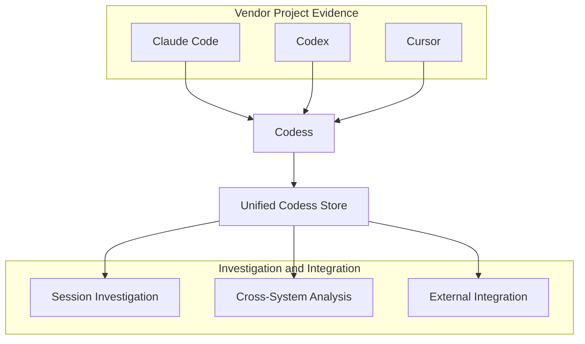

# Codess

Codess makes locally retained coding-assistant work available for systematic
investigation. It provides a durable path from dissimilar vendor records to
regular, queryable evidence without pretending that every product records the
same activity or uses the same concepts.

## 1. Problem and Opportunity

Coding assistants do much more than display chat messages. Their
harnesses select context, invoke models, run tools, request permissions,
delegate work, compact prior history, and record parts of the resulting
activity. Depending on the product and release, local stores can contain human
prompts, model output, tool calls and results, context injections, model
settings, subagent relationships, file references, lifecycle events, and usage
observations.

Together, these records can explain how development work progressed: what a
developer asked, which evidence the model received, how the harness mediated
the work, which tools operated on which files, where failures occurred, and how
the response evolved. They can support investigation of a single Interaction,
comparison of several coding systems, quantitative study of development
activity, and carefully selected input to assessment or research systems.

The records are difficult to use directly. Claude Code, Codex, and Cursor have
different storage layouts, vocabularies, identifiers, and notions of a
message, turn, tool operation, or workspace. Their formats change between
releases and are only partly documented. One Interaction can span several
records or tables, and role labels such as `user` or `assistant` do not reliably
identify whether the immediate participant was a human, harness, tool, or
model. Large shared databases also make complete export or decoding wasteful.

One-off transcript exporters move the problem downstream. Every consumer must
then rediscover source formats, Project attribution, ordering, classification,
and provenance. Results become difficult to reproduce or compare, and a
vendor update can silently change their meaning. Codess instead centralizes
that source-specific work and exposes a disciplined common foundation.

## 2. Codess Approach

Codess separates vendor access and interpretation from common storage and
investigation. It first identifies the relevant Project, workspace, Session,
and Source evidence. Specialized readers select only the attributable vendor
records. Vendor adapters then decode those records, preserve their exact
designations, and map supported meaning into CoSchema. The resulting Project
store sets can be searched individually or as one logical collection.

This diagram shows the product boundary: several vendor evidence families
enter Codess, become one logical query surface, and support investigation and
integration. It deliberately omits the internal conversion stages specified in
the Designs document.

The unified store is a logical query surface, not necessarily one physical
database. Each selected CoSchema Project store set retains its Project and
source-system scope. Codess can therefore combine regular queries while still
showing which vendor Source and observed revision supplied every result.

The normalized database is not a replacement for vendor evidence. A stored
Event retains its source system, Source revision, record locator, exact type
and subtype, mapping evidence, and available lineage. When Codess cannot
interpret a value reliably, it records the limitation and preserves available
source evidence instead of manufacturing a common value.

## 3. Evidence Conversion and Storage

Codess treats ingestion as a continuing conversion discipline rather than a
file copy or transcript-formatting operation. Source selection, decoding,
classification, persistence, and publication form one evidence-preserving
sequence.

### 3.1 Project and Source Selection

A Project is the continuing body of work to which vendor activity is
attributed. For Git-backed work, one repository is one Project; clones,
worktrees, editor workspaces, and filesystem locations are bindings or
observations of it. This distinction permits one Project to retain activity
from several tools without creating a different identity for every checkout or
workspace.

Selection begins with vendor indexes and metadata rather than unrestricted
filesystem traversal. Claude project bindings, Codex Session metadata, and
Cursor workspace and composer indexes identify candidate Sources and Sessions.
Ambiguous or obsolete locations remain reviewable instead of being silently
assigned to a convenient directory.

### 3.2 Specialized Source Access

Source access follows the storage family. Claude Code and Codex transcripts
can be read as bounded JSON Lines streams. Cursor requires read-only, indexed
SQLite queries that select the workspaces, composers, and key ranges associated
with the chosen Project. Selective access avoids decoding unrelated content in
a shared database and gives every selected record a stable source locator.

Update detection is similarly source-aware. File state can identify a changed
transcript, while Cursor needs markers derived from the selected headers,
workspace indexes, and bubble ranges rather than the modification time of the
entire application database. A source is decoded again when its selected
evidence changes or when an explicit validation or rebuild requires it.

### 3.3 Decode, Classification, and Mapping

Vendor adapters interpret record envelopes, structural variants, ordering,
lineage, content, and configuration evidence. They are strict about meaning
but tolerant about availability. A malformed optional timestamp or setting
does not invalidate an otherwise useful message or tool result. Conversely, a
decoder does not guess identity, Actor, relationship, status, or time merely
to populate a common field.

Codess can preserve a useful vendor-only record before a complete common
taxonomy exists. Fields enter the common model only when their meaning is
supported by representative evidence and a concrete investigation,
relationship, or query need. Partial, ambiguous, unsupported, and rejected
values remain visible through mapping evidence and diagnostics.

Source and common meaning remain complementary. Exact vendor names, record
types, field values, identifiers, and locators explain what was observed.
Normalized Projects, Sources, Sessions, Interactions, Model Turns, Events,
Actors, tool operations, content, and Artifacts provide regular predicates and
relationships. A common value makes mixed-source search possible; it does not
claim that all vendors expose identical semantics.

### 3.4 CoSchema Persistence and Publication

Normalized records are stored in constrained and indexed SQLite databases.
Each source-system database represents that vendor's contribution to one
Project observation. A validated collection of those databases, its manifest,
and its current pointer form a Project store set. Selected Project store sets
can then participate in a unified Codess query without first being copied into
one monolithic database.

Source replacement is transactional. A failed conversion does not publish a
partly replaced Source, and incremental state advances only after the database
commit. Publication selects a complete validated store set and preserves the
previous selectable result if candidate construction or verification fails.

## 4. Features and Benefits

Codess reads the distinct stores maintained by Claude Code, Codex, and Cursor,
preserves their evidence, and maps understood meaning into a common database
model. Its immediate benefit is practical investigation: find the Sessions
associated with a Project, locate an Interaction, reconstruct its surrounding
Interaction, inspect tool activity, and compare work across source systems.

The broader benefit is durable separation of concerns. Vendor access and
decode are maintained once, while investigations, statistics, visualizations,
assessments, and research can operate on regular records with explicit
provenance. Improvements to a decoder can be validated and applied without
requiring every downstream consumer to understand the vendor store again.

### 4.1 Project and Session Orientation

An investigation often begins by establishing what evidence exists. Codess can
identify the source systems and Sessions associated with a Project and
describe their ordering, time coverage, content volume, participant
classifications, model evidence, and tool activity. This orientation separates
direct work from delegated or subagent-related work and helps a researcher
choose a relevant Session or period before reading a large body of content.

Because Project identity is separate from directory and workspace identity,
orientation can also reveal activity recorded by several harnesses, workspaces,
clones, or worktrees for the same continuing repository.

### 4.2 Interaction and Development Reconstruction

Codess can locate a distinctive prompt, response, tool operation, error,
permission decision, file, status, or content fragment and recover its
surrounding sequence. Interaction and Model Turn relationships distinguish an
initiating work unit from the several model messages, harness operations, tool
requests, results, and clarification cycles it may contain.

This reconstruction exposes the mechanics of development rather than only its
displayed Session content. A researcher can follow file reads and edits, terminal
commands, searches, failures, denials, retries, planning operations, and
overlapping work on common Artifacts. It becomes possible to ask not merely
what the final answer said, but how the outcome was produced and which evidence
supports that account.

### 4.3 Vendor, Harness, and Model Comparison

Common fields permit comparison without erasing source distinctions. Similar
Event kinds, Actors, tools, model configurations, or outcomes can be selected
across source systems while the exact vendor types and values remain attached
to each result. This makes differences in tool representation, compaction,
delegation, configuration, ordering, lineage, and status evidence directly
inspectable.

Comparisons can identify where a vendor supplies stronger evidence, where a
classification is only partially supported, and where apparently similar
records do not actually mean the same thing. Model, effort, service tier,
speed, and mode remain independent dimensions and are compared only when the
harness records them directly or supplies justified inheritance evidence.

### 4.4 Communication and Behavior Assessment

Codess can prepare precisely selected, context-preserving inputs for systems
that study misunderstandings, instruction following, assessment quality, or
model behavior. Instead of copying an isolated transcript quotation, a derived
assessment can point to the exact Events, their Interaction, participant
classification, tool activity, and Source provenance.

The Misses project is one possible consumer. Codess remains responsible for
vendor decoding, common storage, selection, and reconstruction. An assessment
system remains responsible for defining its cases, labels, ratings,
interpretation, and quantitative methodology.

## 5. Search and Investigation

Search is a principal Codess capability, not merely a presentation layer over
ingest. Its purpose is to move reliably from a broad body of Project evidence
to a bounded, reproducible selection and then recover enough surrounding
structure to interpret that selection correctly.

### 5.1 Progressive Investigation

A typical investigation starts with one or more Projects and source systems,
reviews their Sessions and activity summaries, and narrows by time, model,
Actor, tool, Artifact, status, or known content. A matching Event can then be
expanded through its Interaction, Model Turn, Session sequence, tool
relationships, and supporting evidence. Intermediate structured results can be
saved and used as the bounded input to a subsequent operation.

This progression supports both discovery and precise retrieval. A researcher
can locate where an instruction first appeared, determine whether a short
prompt was direct human input or harness-generated control traffic, connect a
tool result to its invocation, and examine what occurred immediately before
and after a failure or permission denial.

### 5.2 Query Dimensions and Relationships

The common query surface covers Project, source system, Session, Event,
Interaction, and Model Turn identity; Event kind and participant
classification; tool and status; model configuration; time; Artifact; and
bounded literal content. These predicates can be composed over one or several
selected Project store sets.

Sequence and persisted relationships govern reconstruction. Timestamps remain
useful filters and evidence, but they do not replace within-Session ordering or
prove causal links. Expansion follows recorded Interaction, Model Turn, tool,
parent, and Artifact relationships and reports when the selected evidence
cannot establish one.

### 5.3 Results and Direct Access

Structured results retain stable record identities, selected Project and
snapshot scope, deterministic ordering, row and byte limits, completeness or
truncation information, facets, and derivation metadata. A result can therefore
be compared, cited, passed to another process, or revisited without relying on
screen-formatted output.

The public command interface supports common investigations, while direct
read-only SQLite access remains available for exploratory joins,
distributions, query-plan inspection, and specialized research. Specialized
analysis should consume the same stored entities and provenance rather than
creating an alternate vendor-decoding path.

## 6. Integration and External Ecosystem

Regular source-system databases and Project store sets allow Codess to
participate in a broader data ecosystem without requiring each consumer to
reverse-engineer vendor formats.

### 6.1 Database and Analytical Access

SQLite command-line tools and database browsers can inspect individual Project
stores directly. Python, R, pandas, Polars, notebooks, and analytical engines
can consume bounded query results or selected read-only databases. Derived
datasets may use JSON, CSV, Parquet, DuckDB, or another appropriate format when
a concrete consumer and provenance model justify the materialization.

### 6.2 Early Adoption and External Systems

Early adopters need a short path from a current Project store set to a useful
answer. The first external interfaces should support the same progression as
Codess search rather than introduce a separate analytics model:

| Entry point | Immediate question | Required result |
|---|---|---|
| Project orientation | Which source systems, Sessions, models, Actors, tools, and time ranges are represented? | A coverage and activity summary with current Project and snapshot scope. |
| Activity exploration | When did human, model, harness, and tool activity occur, and how was it distributed? | Daily or hourly counts and volumes, observed latency measures, and vendor/model/tool breakdowns without invented cost or quota data. |
| Session investigation | Which Session or Interaction contains a prompt, response, error, command, file, or distinctive text? | Bounded matches that expand through recorded sequence and relationships to their supporting Events. |
| Cross-Project comparison | How do selected Projects, source systems, periods, models, or tool patterns differ? | The same defined measures over each cohort, with unknown and incomplete evidence visible. |
| Reuse and publication | How can a result be charted, assessed, or supplied to another system? | Versioned JSON or CSV carrying selection, identity, ordering, completeness, and provenance. |

These are activity and investigation uses, not billing features. Token counts
are reported when the source records them. Codess does not manufacture prices,
quota percentages, rate-limit windows, or model-call boundaries from textual
volume.

Most coding-assistant monitors begin with live APIs, account dashboards,
status-line feeds, or token counters. They are well suited to current quota,
reset, spend, request, and availability questions. Codess starts from locally
retained development records. It can expose the prompts and responses that were
preserved, harness and tool traffic, context and compaction records, agent work,
files and commands, source ordering, and relationships among those Events.

| Dimension | API and usage monitoring | Codess investigation |
|---|---|---|
| Principal unit | Request, quota window, token counter, or account | Project, Source, Session, Interaction, Model Turn, Event, and Artifact |
| Primary questions | How much was used, what remains, what did it cost, and when does it reset? | What work occurred, how did it proceed, which evidence was involved, and where is the relevant exchange? |
| Content | Commonly absent or deliberately excluded | Searchable when retained locally and admitted by content policy |
| Internal activity | Usually request totals and limited tool or agent counters | Preserved harness, model, tool, context, compaction, and agent Events when the source records them |
| Historical basis | API observations or product-specific counter reconstruction | Versioned local Source observations with record locators, mappings, ordering, and completeness evidence |

The two perspectives can complement one another, but neither should be
silently converted into the other. External interfaces may browse Codess
stores, render typed results, or accept selected exports. They must not become
parallel vendor decoders or redefine common meaning without a CoSchema change.

### 6.3 Derived Research and Assessment

Qualitative and quantitative assessment systems can use reproducible Codess
selections as their evidence input. Statistical or machine-learning workflows
can combine records from several Projects or source systems while retaining
the Project, snapshot, Source, query, and processing provenance needed to
explain the resulting dataset.

### 6.4 Privacy and Export

Session records can contain private source code, prompts, paths, credentials,
and operational details. Local read-only use is the normal boundary. Export,
remote indexing, shared visualization, or third-party processing requires
explicit selection, appropriate content policy, bounded output, and a clear
retention decision.

## 7. Core Model and Terminology

Codess uses the following concepts consistently across source systems.

| Term | Meaning |
|---|---|
| **Project** | Stable identity for a continuing body of work. For Git-backed work, one repository is one Project; clones, worktrees, directories, and vendor workspaces are locations or bindings. |
| **Project location** | An observed checkout, worktree, directory, or historical path associated with a Project. |
| **workspace** | A source-system or editor scope associated with a Project; it is not a Codess entity or Project identity. |
| **Source** | Logical upstream evidence container such as a transcript file or database. |
| **Source revision** | One observed state of a Source, with update and provenance evidence. |
| **Session** | One source-system conversation or thread identity and lifecycle. |
| **conversation** or **thread** | Vendor or interface terminology; Codess uses Session for the common entity. |
| **Interaction** | Initiating work unit that may contain several Model Turns, tool operations, harness Events, clarification requests, and replies. |
| **exchange** | Informal prose only; specifications use Interaction, Model Turn, or Event sequence. |
| **Model Turn** | One evidenced model execution within an Interaction. It is not necessarily a displayed message or user-assistant pair. |
| **Actor** | Immediate evidence-backed producer or operative participant, principally human, harness, tool, or model. |
| **Event** | One ordered normalized observation within a Session. |
| **Artifact** | File, URI, repository object, or other durable object operated on or mentioned by an Event. |
| **Source-system store** | One CoSchema SQLite database for one source system and Project observation. |
| **Project store set** | Selected source-system stores, manifest, and current pointer representing one Project observation. |
| **Unified Codess store** | Logical queryable collection of selected Project store sets; it need not be one SQLite file. |
| **Search result** | Bounded result carrying stable record identities, scope, provenance, and limitations. |

Actor, source role, content role, origin, and Session relationship are separate
dimensions. A vendor `user` envelope can carry harness-generated context or a
tool result, while an `assistant` envelope does not by itself prove a new model
execution. A Model describes configuration for a Model Turn; it is not an
Actor or harness.

A Project is not merely a directory, checkout, workspace, or Session. A Source
is not a Session and can contain one or many Sessions. A Session identifier is
identity, a human-readable Session name is a mutable operator alias, and a
source title is vendor evidence. Normalized fields do not replace exact source
designations, and a search result is a derived selection rather than another
source of truth.

Use the capitalized entity names Project, Source, Source revision, Session,
Interaction, Model Turn, Actor, Event, and Artifact for Codess concepts. Use
lowercase words for generic or exact upstream concepts.

## 8. Product Boundaries

Codess concentrates on locally retained coding-assistant evidence and the
structures needed to investigate it. It cannot recover server-hidden reasoning
or information that a vendor did not retain. It does not infer human
authorship, model execution, parentage, time, or causality without supporting
evidence, and it does not treat generated files or Git activity as proof that a
particular harness performed the work.

Vendor Sources remain the primary evidence. Codess supplies a normalized,
queryable projection and optional exact capture; it does not replace the vendor
store or turn every observed vendor field into a common field. Billing, quota,
and cost accounting require authoritative data beyond suggestive local
observations and are not central Codess capabilities.

Vendor conversion, regular storage, and investigation are the central product.
SQLite and structured output provide extension points, but every possible
analytical database, index, visualization, service, or export format is not a
required built-in product. Such additions belong in the central offering only
when a demonstrated use case, provenance model, and measured limitation
justify them.

Snapshots, catalogs, raw capture, refresh, and retention support reliable
operation. They remain secondary to accurate and complete source selection,
decode, classification, storage, and search.
