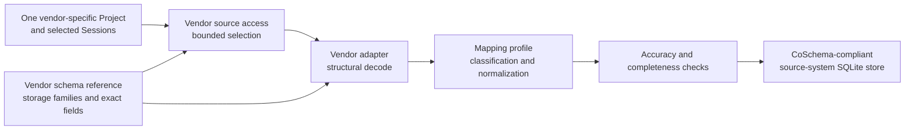
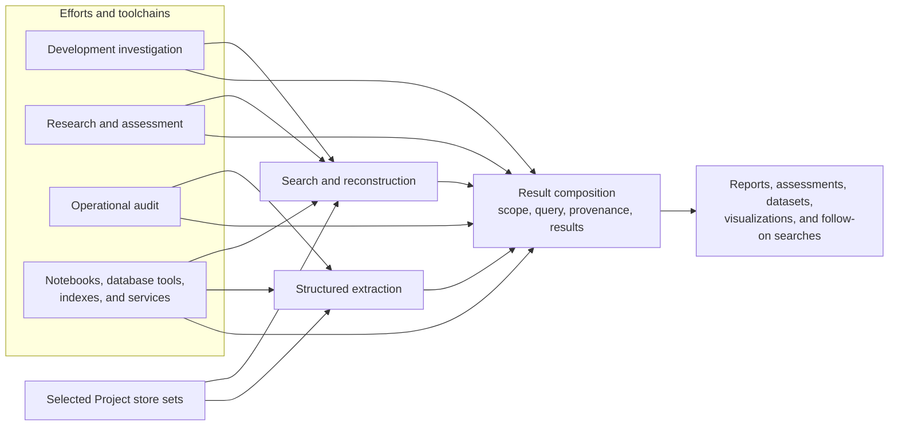

# Codess Functional Design

This document defines what Codess must do functionally and why. It explains the
rules that remain true even if modules, commands, tables, or storage techniques
change.

## 1. Design Center

Codess exists to decode heterogeneous coding-assistant records precisely and
make them searchable without erasing source meaning. Five priorities govern
the design:

1. preserve evidence before generalizing it;
2. classify records by what they represent, not only by vendor envelope names;
3. make common structures regular enough for direct and mixed-source search;
4. keep selection, decoding, storage, and query bounded; and
5. validate against representative vendor records and investigation outcomes.

Supporting operation must not complicate or delay source decoding,
classification, storage, or search unless evidence integrity requires it.

## 2. Vendor Conversion Pipeline

Each conversion handles one selected source system for one Project. The source
system's own schema governs access and decode; CoSchema governs the emitted
database. Mixed-source search happens only after these independent conversions.

The stages obey these rules:

- discovery uses metadata and vendor indexes without normalizing content;
- source access selects only records attributable to the requested Project;
- decoders interpret one vendor storage family at a time;
- normalization adds common meaning while preserving exact source evidence;
- checking rejects or diagnoses inaccurate and incomplete outputs before
  publication; and
- storage supplies typed relationships and access paths for later search.

## 3. Project and Source Selection

### 3.1 Project Identity

A Project is a stable work identity. For Git-backed work, one repository is one
Codess Project. Clones, linked worktrees, workspace directories, branches, and
vendor workspace identifiers are Project locations or bindings, not additional
Projects.

Paths are observations. They can move, become unavailable, or reflect a vendor
location that no longer matches the active checkout. Paths therefore support
selection and provenance but do not define durable Project identity.

### 3.2 Source Identity

A Source is a logical upstream evidence container, such as one JSONL transcript
or SQLite database. A Source revision is one observed state of that container.
Source identity includes the source-system namespace, locator, storage family,
and revision evidence.

A Source is not a Session. One Source can contain one Session, many Sessions, or
supporting records used by several Sessions.

### 3.3 Selection Authority

Discovery observations recommend candidates; they do not authorize ingestion.
Explicit Project paths, Project catalog selections, and reviewed workspace or
source bindings authorize the scope. Recency, size, Git activity, and vendor
counts help rank or inspect candidates but do not establish meaning by
themselves.

Filesystem traversal stops at a real repository or Project boundary and prunes
generated, dependency, cache, build, environment, backup, and third-party
trees. Vendor indexes and database keys are preferred over broad filesystem
search.

## 4. Vendor Decode Discipline

### 4.1 Evidence Before Normalization

Every supported normalized record should retain enough information to answer:

- which source system and Source revision supplied it;
- which exact record and field were used;
- what the source called the record, role, status, or operation;
- what ordering and relationship evidence existed; and
- which mapping produced the common representation.

Exact source type and subtype remain scalar searchable values. Mapping traces
are structured because several source paths or rules can contribute to one
normalized Event.

### 4.2 Tolerant Field Handling

Vendor fields can be absent, empty, null, sentinel-valued, malformed,
structured differently, or unsupported. These states are not equivalent.

An optional malformed field produces a field diagnostic and is omitted while
the usable record continues. A record missing core identity or structural
evidence can be rejected without invalidating unrelated records. A Source that
cannot be read consistently or attributed safely is rejected as a Source.

No input value should crash the complete ingest. Tolerance does not mean silent
coercion: every unsupported or lossy decision must remain inspectable.

### 4.3 Opportunistic Support

Codess can preserve a useful vendor-only record before a complete common
taxonomy exists. New common fields or classifications require:

- representative evidence;
- stable understood meaning;
- a consuming query, relationship, or validation requirement; and
- fixtures covering normal and irregular states.

This allows adapters to improve continuously without turning every observed
field into permanent common schema.

### 4.4 Common Model and Mapping Profiles

Claude Code, Codex, and Cursor each map into CoSchema. Codess does not maintain
point-to-point vendor translations: those would multiply rules and allow a
common concept to change meaning for every vendor pair.

An executable mapping profile identifies supported source evidence, its target
meaning, guarded alternatives, retention and loss behavior, diagnostics, and
conformance examples. Profiles specify mappings; adapters still own streaming,
structural variants, multi-record relationships, and transformations that
require code.

Common and source-specific values are complementary. Common fields support
regular predicates and joins. Exact source fields and mapping traces explain
the translation and preserve differences. An extension cannot override a
common field, and a missing common value is not permission to infer one.

### 4.5 Translation Admission and Conformance

Adding or correcting a mapping starts with representative source evidence and
a concrete investigation, relationship, or query need. The maintainer then:

1. identifies storage family, record type, field paths, ordering, and links;
2. classifies each value as common, specialized, extension, raw-only, or
   irrelevant;
3. updates the vendor description, mapping profile, and named transform;
4. preserves the exact source value and translation trace;
5. adds minimal, representative, partial, malformed, unsupported, and hazard
   fixtures as appropriate; and
6. compares application and SQLite enforcement with a small real Project.

Diagnostics distinguish Source, record, and field scope independently from
severity. They must locate and explain the failed translation without exposing
unbounded content. A partially mapped record must not present itself as
complete when required evidence failed.

## 5. Entities and Relationships

### 5.1 Session

A Session is one source-system conversation or thread identity and lifecycle.
Its source Session identifier is scoped by source system. A human-readable
Session name is an optional operator alias and is not identity.

A Session can be direct, delegated, forked, subagent-related, or otherwise
classified when the source provides evidence. Parentage and other relations
remain absent when not directly supported.

### 5.2 Interaction

An Interaction is an initiating work unit. It can contain several Model Turns,
tool operations, harness Events, clarification requests, and replies.

An Interaction is not assumed to be one user message followed by one assistant
message. Its boundary can be vendor-provided, structurally mapped, or unknown.
Boundary source and confidence remain visible.

### 5.3 Model Turn

A Model Turn is one evidenced model execution. A vendor message envelope does
not necessarily define a turn, and a turn can produce several messages, tool
requests, or lifecycle Events.

Model-configuration dimensions are independent and nullable. Codess does not
derive one from another or parse configuration from suggestive model names.

### 5.4 Event

An Event is one ordered normalized observation within a Session. It retains
source record type, subtype, locator, Event kind, available participant
classification, time evidence, content, tool or Artifact relations, and mapping
evidence.

`sequence_no` provides deterministic within-Session ordering. Vendor timestamps
are evidence and query dimensions, not substitutes for sequence. Equal
timestamps do not establish identity or order.

### 5.5 Artifact

An Artifact is a durable referent such as a file, URI, repository object, or
generated document. An Event can read, create, modify, delete, execute, or
mention an Artifact.

Project-relative paths are preferred for portable correlation. Absolute paths
remain observed evidence. An external file is not assigned a misleading
Project-relative identity merely because a Session mentioned it.

## 6. Classification

### 6.1 Independent Dimensions

Codess classifies participant and content evidence along separate axes:

| Dimension | Question |
|---|---|
| `source_role` | What role name did the vendor record contain? |
| `actor_kind` | Which immediate participant produced or performed the Event? |
| `content_role` | What function does the content serve? |
| `origin_kind` | How did the content enter the Session? |
| `initiation_kind` | What initiated the Interaction? |
| `session_relation_kind` | How is the Session related to another Session or runtime? |

The principal Actor kinds are human, harness, tool, and model. More specialized
runtime identities remain source evidence unless a vendor exposes a distinct,
stable participant whose representation serves a demonstrated query.

### 6.2 Human and Harness Separation

A vendor `user` role is not sufficient evidence of human authorship. Tool
results, delegated prompts, system instructions, queued controls, and injected
context commonly travel inside user-shaped envelopes.

Direct typed or submitted prompt evidence is strongest. Structural subagent,
delegation, tool-result, developer/system, and context markers override a role
fallback. When direct evidence is unavailable, classification remains unknown
or qualified instead of inflating human-prompt counts.

### 6.3 Event Types

Common Event kinds support broad search, while exact vendor type and subtype
remain available for precise investigation. Common kinds should describe
observable function, including messages, tool invocations and results,
failures, permissions, context operations, lifecycle changes, and configuration
observations.

An unrecognized vendor record is not automatically `other`. It remains
source-specific evidence with a diagnostic until its meaning is understood.

### 6.4 Status

Source status and normalized status coexist. Source values remain exact.
Normalized values provide a small search vocabulary such as pending, running,
succeeded, failed, denied, cancelled, incomplete, and unknown.

Transport success and application success are distinct. A tool transport can
complete while its returned body reports an application failure. Permission
denial is preserved independently from any surrounding tool status.

## 7. Tools, Agents, and Context

### 7.1 Tool Relationships

Tool names are source free text because harness, plugin, skill, MCP, and release
registries vary. An optional canonical name can group well-understood aliases
without replacing the exact source name.

A tool invocation can have zero, one, or several results. Source call IDs are
scoped lineage values, not globally unique identities. Missing call IDs produce
explicit unlinked or incomplete relationships rather than guessed pairing.

Invocation input, result content, status, permission evidence, timing, and
transport/application outcomes remain distinguishable.

### 7.2 Agents and Subagents

Agent and subagent interactions are retained when the source exposes them.
Useful evidence includes Session relationships, participant identifiers,
delegated prompts, status, model settings, caller/callee relations, and timing.

The word `agent` in a tool name or message does not prove a distinct runtime
participant. Classification follows structural evidence, not branding.

### 7.3 Context and Compaction

System and developer instructions, harness context, request context, memory
operations, reasoning summaries, and compaction records have different
semantics. Codess preserves the source distinction and maps supported context
operations into specialized Events.

A compaction summary is content and must remain bounded but searchable. An
encrypted reasoning or context body is retained only according to its evidenced
purpose; Codess does not decode opaque server state.

## 8. Content and Provenance

### 8.1 Content Classes

Searchable content includes bounded message text, reasoning summaries exposed
by the vendor, tool input and output, context or compaction bodies, and selected
Artifact references. Structured values are stored as valid JSON where their
structure matters; scalar identifiers, names, statuses, paths, and record types
remain scalar.

Empty message text does not by itself define an Event. A record can still be
semantically useful through tool, context, status, configuration, or Artifact
evidence. Conversely, arbitrary metadata or a binary payload is not promoted to
conversation content merely because it occupies a text-capable field.

### 8.2 Bounds

Bounds protect the system from accidental binary data, massive logs, malformed
containers, and records that cannot plausibly fit a coding-model interaction.
They are configurable safety ceilings, not quality filters.

When a bound is exceeded, Codess reports the classified Source or record and
does not silently truncate before classification. Searchable content may be
bounded with explicit derivation metadata; exact large evidence can remain
external or in an explicitly retained raw object.

### 8.3 Processing

Content processing can decode character sets, normalize supported text,
sanitize invalid control data, redact secrets, apply privacy masking, or omit
configured vocabulary and topics. Processing order, selected policy, actions,
and resulting limitations remain attributable to the output.

Processing does not change Event identity, fabricate missing meaning, or make a
derived body equivalent to exact source content.

### 8.4 Evidence and Integrity

Hashes provide deterministic content identity and corruption detection within a
local-writer trust boundary. They are not authentication against an attacker
who can modify both data and manifests.

Routine update fingerprints can be bounded and non-authenticating. Exact
retained objects and published stores use complete SHA-256 verification.

### 8.5 Raw Evidence and Capture

Raw evidence preserves an exact Source revision outside the searchable
database. It is useful when a source may change or disappear, a decoder must be
re-run against identical bytes, or a finding requires record-level inspection.
It also carries substantial costs: copied private content, storage growth,
retention work, and accidental duplication of large shared containers.

The decided design therefore separates four modes:

- `none` retains no raw reference beyond ordinary normalized provenance;
- `reference`, the normal mode, records the live locator and bounded update
  evidence without copying the Source;
- `capture` stores one content-addressed exact revision when an investigation
  explicitly requires stable bytes; and
- `seal` binds selected captured revisions into a published Project store set.

Content addressing prevents multiple retained copies of the same revision.
Raw objects remain outside conversation tables and are not an alternate search
surface. JSONL capture streams bounded input. Capturing a shared Cursor SQLite
container requires a transactionally consistent backup and can be much larger
than the selected Project cohort, which strengthens the case for reference mode
unless exact recovery or comparison is required.

General raw-source search, routine capture of every Source, and remote raw
archives are optional directions, not central Codess functionality. They would
require a demonstrated investigation need, explicit privacy and retention
policy, and measured storage behavior.

## 9. Storage and Search

### 9.1 Regular Source-System Stores

Codess stores common entities and relationships in SQLite because it provides
transactions, constraints, indexes, portable read-only access, and a mature
query ecosystem. Per-source-system databases form a Project store set and can
be queried as one logical Project or composed across selected Projects.

A Project store set becomes selectable only after every selected source-system
replacement has completed its checks. Publication must never expose a partial
working transaction.

Physical tables and indexes implement CoSchema; they do not define vendor
meaning. Vendor-specific evidence remains in typed source fields, mapping
records, and bounded extension data rather than parallel vendor-only databases
with incompatible query models.

### 9.2 Search Semantics

Search predicates apply to typed fields before content. Project, source system,
Session, Event kind, Actor, role, origin, tool, status, model, time, and Artifact
filters narrow the search space. Literal content search then operates over the
declared searchable fields.

`%` and `_` are literal user characters unless a query interface explicitly
offers pattern syntax. SQL implementation must escape them rather than expose
storage-engine wildcard behavior accidentally.

Results have deterministic order and global limits. Expansion to an Interaction
or Model Turn occurs from selected stable identities and returns the complete
ordered group subject to explicit result bounds.

### 9.3 Repetition

Physical duplicate storage can be removed only when a stable vendor identifier
proves that two records represent the same logical record. Separate real Events
remain separate even when their content is equal.

Search presentation may group exact repeated retained content, but the group
must preserve every constituent Event identity and expand losslessly. Similar
or semantically related content requires a versioned derived method and never
authorizes Event deletion.

### 9.4 Performance

Performance requirements follow the core pipeline:

- use vendor indexes and key ranges to avoid unrelated source records;
- stream JSONL and large content in bounded chunks;
- decode only selected Cursor composer values;
- batch writes inside source-level transactions;
- index common high-value predicates and relationship keys;
- push filters and limits into each SQLite store;
- merge bounded ordered results across stores; and
- release large transient buffers after their record or transaction is written.

Optimization begins with a reproducible query or ingest workload, phase timing,
input shape, query plan, CPU, allocation, and result identity. Functional output
must remain equal after the change.

## 10. Accuracy, Completeness, and Cooperative Refinement

Accuracy is evaluated along distinct dimensions: the source record is read
correctly; its meaning is classified without unsupported inference; identity,
order, and relationships are preserved; and searches reconstruct the expected
evidence. Completeness is always scoped to the selected Sources and declared
support. Admitted records, exclusions, unsupported structures, truncation, and
diagnostics must all be accounted for.

Refinement proceeds from a concrete record or investigation:

1. capture the relevant source shape and intended question;
2. distinguish absent, malformed, ambiguous, unsupported, and valid values;
3. propose and trace the narrowest faithful mapping;
4. compare source records with stored rows and reconstructed exchanges;
5. cross-check the result through an independent query or evidence path;
6. repeat across another Session, Project, or vendor when the claim is common;
7. encode the established behavior in fixtures and regression tests.

Useful cross-correlations include source record to normalized row, prompt to
Interaction and Model Turns, tool invocation to result, Event to Artifact,
workspace or path binding to Project, and two source systems operating on the
same durable work. Correlation establishes an evidenced relationship; it does
not by itself establish causation or identical meaning.

Developer and model cooperation accelerates this cycle without replacing
evidence. A developer supplies intended task meaning, source-system context,
and judgment on ambiguous classifications. A model can discover structures,
compare examples, propose mappings, expose anomalies, formulate queries, and
generate candidate fixtures. Accepted conclusions are then encoded in mappings,
constraints, tests, and reproducible queries rather than retained as model
assertions.

## 11. Derived Use and Optional Ecosystem

### 11.1 Decided Composition Requirements

Different efforts can select the same regular stores and run separate searches
or extractions. Any composed result must bind its selected Project store sets,
query or transformation specifications, constituent result identities,
provenance, and outputs. A composition is derived work, not another vendor
Source or common database authority.

Every derived product should retain:

- Project and selected store identity;
- source-system and Source provenance;
- stable constituent record identities;
- query or transformation specification;
- processor identity;
- content limitations and diagnostics; and
- output format and integrity information.

### 11.2 Optional Consumer Directions

Third-party databases, notebooks, dashboards, visualizations, search engines,
and assessment systems can operate over source-system stores, Project store
sets, or explicit structured results. These are optional consumer directions,
not required Codess storage formats or bundled services.

SQLite remains the normalized authority. Another format can optimize a
specific analytical or presentation workload without becoming a second common
model. External services are opt-in because local Session data may be private.

## 12. Design Change Criteria

A functional change is justified by at least one of:

- a reproduced wrong, lost, unstable, unsafe, or incomplete result;
- a current vendor structure that cannot be represented faithfully;
- a repeated investigation blocked by missing classification or query behavior;
- a measured resource or performance failure; or
- an explicit downstream consumer with clear provenance requirements.

The change must identify affected use cases, evidence, common and vendor
semantics, storage/query consequences, diagnostics, and validation. Attractive
but unconsumed fields, formats, classifications, or services remain outside the
core until such evidence exists.
