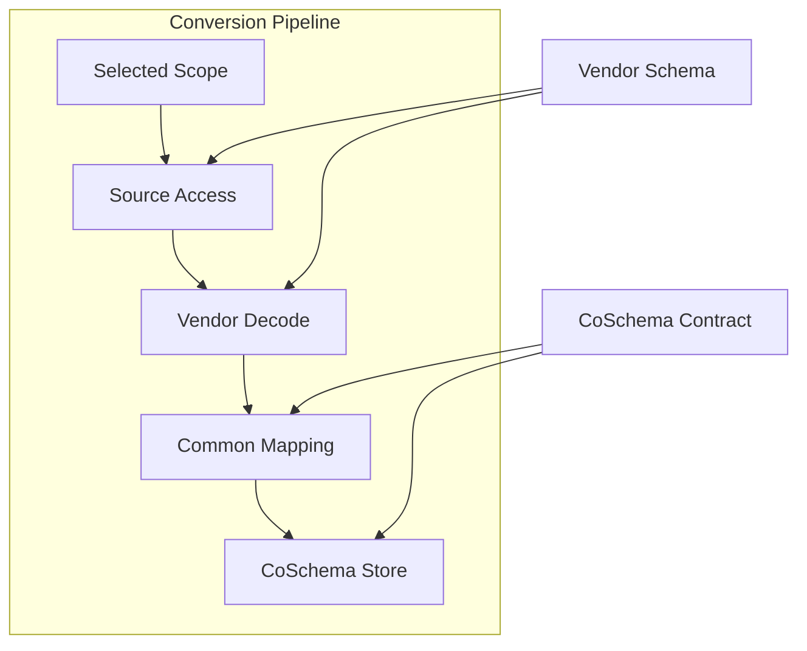
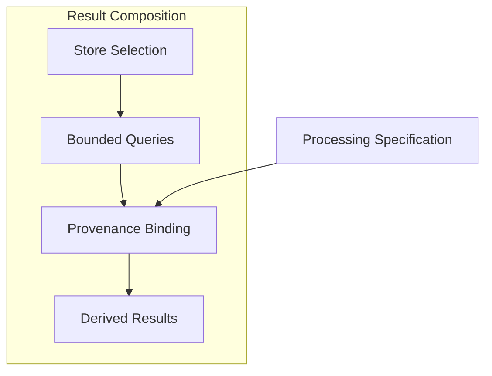

# Codess Functional Design

Vendor stores describe activity in product-specific records, while CoSchema
defines the regular entities that Codess exposes for investigation. The
functional design lies between those two contracts. It determines which
evidence is admitted, how identity and relationships are established, what can
be normalized, what must remain source-specific, and which guarantees a query
result can make.

This document specifies those durable decisions. It does not describe package
layout, command implementation, current work status, or every field in the
machine-readable contracts. Its subject is the behavior that must remain true
when an implementation module, vendor release, physical table, or external
consumer changes.

## 1. Functional Scope and Authority

Codess conversion has two simultaneous obligations. It must preserve enough
source evidence to explain and reconsider an interpretation, and it must emit
regular entities and relationships that support useful cross-source queries.
Neither obligation can replace the other. A raw vendor designation without a
common meaning is difficult to compare; a common value without its source
evidence is difficult to trust.

Authority is deliberately layered:

| Decision | Authority |
|---|---|
| What a vendor record contains | Observed vendor Source and vendor schema evidence |
| Which Project a location or workspace represents | Reviewed Project identity and binding evidence |
| How a supported source value maps | Named vendor mapping rule and decoder behavior |
| What a common entity or field means | CoSchema logical contract and controlled vocabulary |
| How common meaning is stored | CoSchema physical contract |
| What a search or reconstruction returns | Typed query semantics and persisted relationships |

An upstream layer supplies evidence; a downstream layer cannot rewrite it. A
Project binding does not alter a vendor workspace identifier. A mapping adds
common meaning without replacing the exact source type. A SQLite column does
not define vendor semantics merely because the writer stores a value there.

Functional support is explicit and partial. Codess can support one record type,
field, or relationship without claiming complete support for its surrounding
Source. Missing evidence remains missing, unsupported evidence remains
diagnosed, and optional malformed evidence does not invalidate an otherwise
usable record. Publication and query must expose those boundaries rather than
turning a successful conversion into an unqualified completeness claim.

## 2. Conversion Pipeline

The Conversion Pipeline describes one source-system contribution to one
Project. Its purpose is narrower than the project-level diagram in Codess: it
defines the transformation boundary between selected vendor evidence and one
CoSchema source-system store. It does not describe cross-Project investigation
or external consumers.

Selected Scope identifies the Project, source system, approved locations or
workspace bindings, and applicable Sources. Source Access reads only the
attributable records and assigns stable locators. Vendor Decode interprets the
storage envelope, structural variants, order, and source relationships. Common
Mapping applies controlled classifications and creates common relationships
while preserving source designations. CoSchema Store validates and persists
the accepted result transactionally.

The pipeline is directional. Discovery observations can propose scope but do
not create common Events. Vendor Decode cannot invent Project identity. Common
Mapping cannot make an unavailable source relationship direct. Storage and
query cannot reinterpret an unknown vendor record merely to satisfy a column or
predicate.

## 3. Identity, Entities, and Relationships

### 3.1 Normative Terminology

Codess specifications use entity names precisely:

| Term | Normative Use |
|---|---|
| **Project** | Stable identity for one continuing body of work. For a Git-backed effort, one repository is one Project. |
| **Project location** | Observed checkout, worktree, directory, or historical path associated with a Project. |
| **workspace** | Source-system or editor scope associated with a Project through evidence. It is not a Codess entity or Project identity. |
| **Source** | Logical upstream evidence container such as a transcript or database. |
| **Source revision** | One observed state of a Source. |
| **Source record** | One addressable vendor record within a Source revision. |
| **Session** | One source-system conversation or thread identity and lifecycle. |
| **conversation** or **thread** | Vendor or user-interface description. Codess uses Session when referring to the common entity. |
| **Interaction** | One initiating work unit that can contain several Model Turns and Events. |
| **exchange** | Informal prose only. Specifications use Interaction, Model Turn, or Event sequence according to the intended boundary. |
| **Model Turn** | One evidenced model execution. |
| **Event** | One ordered normalized observation within a Session. |
| **Actor** | Immediate evidence-backed producer or operative participant in an Event. |
| **Artifact** | Durable referent such as a file, URI, or repository object. |

A source title and a human-readable Session name are descriptive metadata, not
Session identity. A model is configuration for a Model Turn, not an Actor. An
agent-branded tool name is source evidence, not proof of a separate runtime
participant.

### 3.2 Identity Scope

Identity keys reflect the smallest authority that can establish sameness:

| Object | Identity Scope | Consequence |
|---|---|---|
| Project | Catalog-wide generated identifier | Moving or recloning a repository does not create a new Project. |
| Project location | Machine and normalized observed path | The same path on another machine is a different observation. |
| Workspace binding | Source system, workspace identifier, and Project | One vendor workspace can be related without becoming Project identity. |
| Source revision | Source system, Source locator, and revision evidence | Re-reading changed bytes creates a new observation of the Source. |
| Source record | Source revision and record locator | A locator is not globally meaningful outside its Source revision. |
| Session | Source system and vendor Session identifier | The same vendor identifier in another source system is distinct. |
| Event | Session and stable source-derived Event identifier | Equal content does not establish Event identity. |
| Content object | Complete content digest | Equal retained bytes can share content identity without merging Events. |
| Artifact | Project-relative or external durable locator | Observed absolute paths remain evidence rather than portable identity. |

Observation identity is separate from logical identity. One Session or Event
can be observed through successive Source revisions or Project store sets. A
query result must be able to distinguish the stable entity from the particular
observation that supplied it.

### 3.3 Event Hierarchy and Cardinality

The common event hierarchy is intentionally not a user-message/assistant-message
pair:

| Parent | Child | Cardinality and Rule |
|---|---|---|
| Project | Project location or workspace binding | Zero or more evidence-backed observations |
| Project | Session | Zero or more attributed Sessions across source systems |
| Source revision | Source record | Zero or more records in source order where available |
| Source revision | Session | Zero, one, or many Sessions depending on storage family |
| Session | Interaction | Zero or more initiating work units |
| Session | Model Turn | Zero or more evidenced model executions |
| Session | Event | One ordered sequence for every emitted Event |
| Interaction | Model Turn or Event | Zero or more members; boundaries can be direct, mapped, inferred, or unavailable |
| Model Turn | Event | Zero or more model, harness, or tool-related observations associated by evidence |

A direct human prompt commonly opens an Interaction, but autonomous or
scheduled model activity can open one without a human Event. An Interaction can
include clarification, several Model Turns, tool invocations and results,
permission decisions, and harness control Events. A displayed message does not
necessarily correspond to a Model Turn, and one Model Turn can produce several
Events.

Session parentage and relation kind are stored only when the Source supplies a
direct field or a supported structural mapping. Timestamp proximity, adjacent
files, similar text, and agent-like names do not establish parentage.

### 3.4 Ordering and Time

`sequence_no` is the deterministic normalized order within a Session and the
basis for reconstruction. Source order is preserved even when timestamps are
missing, equal, or non-monotonic. Interaction and Model Turn sequence values
order those groups within the Session but do not replace Event order.

Explicit event and lifecycle times retain their source or mapping basis. Source
modification time, observation time, ingestion time, and publication time are
different facts and remain in separate fields. File modification time can help
detect a changed Source but does not become Session or Event time without an
explicit mapping rule.

### 3.5 Tools, Artifacts, and Content

A Tool Invocation is a requested operation associated with the requesting
Event, Session, and available Interaction or Model Turn. It can have no result,
one result, or several ordered results. A vendor call identifier is free text
scoped to its source system and Session. Missing identifiers produce an
explicitly unlinked result rather than guessed pairing.

Exact tool name, canonical reviewed alias, namespace, input, source status,
normalized status, permission evidence, and timing are independent values.
Transport completion does not imply application success. A harness subprocess
is not classified as a model tool operation unless the Source represents it as
one.

An Event can operate on or mention several Artifacts, and an Artifact can be
related to Events from several Sessions. Project-relative file identity is
preferred when the file belongs to the Project. An external file uses an
external locator rather than a misleading relative path.

Content identity is separate from Event, Source record, Tool Result, and
Artifact identity. Typed relations connect one retained or derived content
object to those entities. Deduplicating equal bytes must not delete distinct
Events or Source records.

## 4. Conversion Semantics and Controlled Vocabulary

### 4.1 Field States and Admission

Absent, explicit null, empty, sentinel-valued, malformed, unsupported, and
valid are distinct source-field states. Adapters decode those states before
applying default values. An optional malformed field produces a field-scoped
diagnostic while the rest of a usable record continues. Missing core identity
or structure can reject one record; an unreadable or unattributable container
can reject the Source.

No individual source value should crash the complete ingest. This tolerance is
not silent coercion. The resulting Event, diagnostic, or Source failure must
show which field or structure could not be used and why.

### 4.2 Mapping and Retention

Each supported normalized value names the source field or structure and the
mapping rule that produced it. Mapping profiles describe supported selectors,
target fields, guarded alternatives, retention, ambiguity, loss, diagnostics,
and conformance fixtures. Adapters retain code ownership of streaming,
multi-record structure, and transformations that cannot be expressed as field
selection.

Mapping decisions use five retention classes:

| Class | Meaning |
|---|---|
| `core` | Stable meaning represented by a CoSchema field or relationship |
| `specialized` | Useful typed meaning retained for a narrower source or investigation |
| `extension` | Bounded namespaced structure not permitted to override common meaning |
| `raw_only` | Evidence retained outside normalized query fields |
| `discard` | Irrelevant or duplicative material omitted by an explicit rule |

A new common mapping requires representative evidence, stable understood
meaning, a consuming query or relationship, and fixtures for normal and
irregular states. Vendor-only evidence can be retained before it qualifies for
the common model. Codess does not create point-to-point translations between
vendors; every supported source maps independently into CoSchema.

### 4.3 Vocabulary Classes

Codess distinguishes vocabulary governance from physical type:

| Vocabulary Class | Examples | Rule |
|---|---|---|
| Exact source value | Source role, record type, source status, source tool name | Preserve as free text with its source field and locator. |
| Closed common taxonomy | Normalized status, boundary source, diagnostic level | Values are enumerated by the CoSchema contract; additions require a contract change. |
| Open common vocabulary | Event kind, Actor kind, content role, origin kind | Stable documented values support queries; new values require evidence and mapping review. |
| Operator metadata | Session name, note, review disposition | User-managed description; never source or entity identity. |
| Structured extension | Mapping trace, source configuration, sparse vendor evidence | Valid bounded JSON under a defined namespace or contract. |

Field names and vocabulary values use lowercase `snake_case` in common storage.
Exact vendor spelling remains in source fields. A normalized value never
replaces the source value from which it was derived.

### 4.4 Participant and Session Classification

Participant evidence is classified along independent axes. `source_role`
preserves the vendor role. `actor_kind` identifies the immediate producer or
operative participant. `content_role` describes what the content does.
`origin_kind` describes how it entered the Session. `initiation_kind` describes
what opened an Interaction, and `session_relation_kind` describes a supported
relationship between Sessions.

The principal Actor kinds are `human`, `harness`, `tool`, and `model`. A vendor
`user` role is not sufficient evidence of human authorship: tool results,
delegated prompts, system instructions, queued controls, and injected context
often use user-shaped envelopes. Direct submitted-prompt evidence is strongest;
tool, delegation, context, and runtime markers override a role fallback.
Unresolved evidence remains unknown rather than inflating human or model
activity.

Agent and subagent activity is represented through supported Session
relationships, participant evidence, delegated prompts, caller/callee fields,
status, configuration, and timing. Branding a tool or record as `agent` does
not by itself establish a new Actor or Session.

### 4.5 Event and Outcome Classification

Common Event kinds describe observable function: message content, tool
invocation or result, permission decision, context operation, lifecycle change,
configuration observation, failure, and other supported behavior. Exact source
record type and subtype remain searchable beside the common kind. An unknown
record is not automatically mapped to `other`; it remains source-specific with
a diagnostic until its meaning is understood.

Source status and normalized status coexist. The common status vocabulary
supports pending, running, succeeded, failed, denied, cancelled, incomplete,
and unknown outcomes. Transport status, application status, permission state,
and surrounding Model Turn status remain distinguishable.

Model configuration dimensions are independent and nullable. Provider, model
family, exact model name, revision, reasoning effort, speed tier, service tier,
and mode are recorded only from direct or explicitly inherited evidence. Codess
does not parse one dimension from a suggestive value in another.

### 4.6 Context, Compaction, and Content

System and developer instructions, harness context, request context, memory
operations, reasoning summaries, and compaction records have different source
and common meanings. Supported operations become typed Events or content
relations; they are not flattened into ordinary human or model messages.

A compaction summary is bounded searchable content. A vendor-exposed reasoning
summary can be searchable when its meaning is established. Encrypted reasoning
or context state remains opaque and is retained only according to its evidenced
purpose; Codess does not claim to decode server-hidden state.

Searchable content can include bounded message text, tool input and output,
context or compaction bodies, and selected Artifact references. Structured
values use valid JSON when their internal shape matters. Identifiers, names,
statuses, paths, versions, record types, and primary mapping rules remain
scalar.

An empty text field does not by itself suppress a semantically useful Event: a
record can carry tool, configuration, context, status, or Artifact evidence.
Conversely, arbitrary metadata, binary data, or a massive log is not promoted
to Session content merely because it occupies a text-capable field.

### 4.7 Processing, Bounds, and Provenance

Content processing can decode declared character sets, normalize supported
Unicode, remove invalid controls, redact secrets, mask private values, blank
configured vocabulary, or filter topics. The selected policy, processing order,
actions, input identity, output identity, and rejection or truncation reason
remain attributable. Processing cannot change Event identity or fabricate
missing meaning.

Bounds are configurable safety ceilings, not quality filters. Selection and
classification occur before an oversized body is rejected or represented by a
bounded derivation. Exact large evidence can remain external or enter an
explicit raw capture, but random binary data and multi-megabyte log output do
not belong in indexed Session content.

Every emitted common record retains enough provenance to identify source
system, Source revision, Source record locator and type, mapping rule, and
applicable field evidence. Diagnostics distinguish Source, record, and field
scope independently from severity and use bounded detail.

### 4.8 Raw Evidence and Integrity

Raw evidence preserves an exact Source revision outside the searchable
database when a decoder must be repeated against identical bytes, a Source can
disappear, or an investigation requires record-level inspection. It also
copies private content and can consume substantial storage, especially for a
shared Cursor database.

The four modes are ordered by how much they retain. `observe` is the least
retaining and still observes: it fingerprints the Source and records its
locator, modification time, size, and consistency, keeping no bytes.
`reference` is the normal mode, adding a resolvable reference to the same
observation. `capture` stores one content-addressed exact revision. `seal`
binds selected captured revisions to a published Project store set.

`observe` retains its manifest entry deliberately, because that entry is what
makes a Source's absence checkable: `availability=not_retained` states that
Codess read the Source and kept nothing, which a manifest that never mentions
the Source cannot state, and only the first can be audited later. The mode was
previously spelled `none`, which promised nothing was recorded while the
observation was written; the previous spelling is still accepted so retained
manifests and operator scripts keep working.

Raw objects remain outside Session content and are not an alternate search
surface. JSONL capture streams input, while Cursor capture uses a consistent
SQLite backup. Complete SHA-256 identifies retained objects and published
stores. Bounded fingerprints can detect routine change but do not authenticate
content or replace complete verification.

## 5. Storage and Query Semantics

### 5.1 Source-System Stores

Each source-system store contains one vendor contribution to a selected
Project observation. A Project store set combines the selected stores,
manifest, and current pointer. The unified Codess store is a logical queryable
selection of Project store sets rather than a required monolithic database.

Source replacement is transactional, and incremental state advances only after
commit. A Project store set becomes selectable only after its selected stores
and manifest pass publication checks. A failed candidate does not replace the
previous selectable set.

Physical tables and indexes implement CoSchema but do not define vendor
meaning. Typed source fields, mapping evidence, and bounded extensions retain
source-specific distinctions without creating incompatible vendor query models.

### 5.2 Query Predicates and Ordering

Typed predicates narrow before content search. Project, source system, Session,
Event kind, Actor, content role, origin, tool, status, model configuration,
time, and Artifact filters can be composed over selected Project store sets.
Literal content search then operates only over declared searchable fields.

`%` and `_` are literal user characters unless an interface explicitly offers
pattern syntax. SQL execution must escape them rather than leaking storage
wildcard behavior. NULL, absent, unknown, and empty retain distinct query
meaning.

Results use deterministic order and global row and byte limits. Cross-store
merge cannot apply a complete limit independently to each store and present the
union as a globally bounded result.

### 5.3 Reconstruction and Repetition

Interaction or Model Turn reconstruction begins with stable selected identities
and follows persisted relations and Session order. It returns the complete
requested group subject to explicit result bounds and reports missing or
partial relationships instead of filling them from timestamp or text
similarity.

Physical duplicate records can be removed only when a stable source identifier
proves they are the same logical record. Separate Events remain separate when
their content is equal. Presentation can group exact repeated content only when
every constituent Event identity remains available and the group expands
losslessly. Similarity or topical relation requires a versioned derived method
and never authorizes deletion.

### 5.4 Result Contracts

A structured result binds its canonical request, Project and snapshot scope,
store provenance, stable row identities, deterministic ordering, applied
bounds, completeness or truncation state, derivation metadata, and result
identity. A saved result is a derived selection, not a Source or new common
authority.

Direct read-only SQLite access remains valid for exploratory joins,
distributions, query-plan inspection, and specialized research. Repeated public
behavior belongs in the typed query contract so that command, library, and
external consumers share predicate and result semantics.

## 6. Derived Results and Composition

Composition combines selected stores or bounded query results for a downstream
investigation without creating another vendor decoder or common-schema
authority.

A composition records the selected Project store sets, constituent query or
transformation specifications, stable input identities, processor identity,
content limitations, diagnostics, output format, and integrity information.
Several queries can contribute to one derived result, but each contribution
retains its own selection and provenance.

Notebooks, analytical databases, dashboards, visualizations, search indexes,
assessment systems, and local services can consume stores or structured
results. Another format can optimize one analytical or presentation workload,
but it does not become a second common model. External and remote processing is
opt-in because Session evidence can contain private source code, prompts,
paths, credentials, and operational details.
