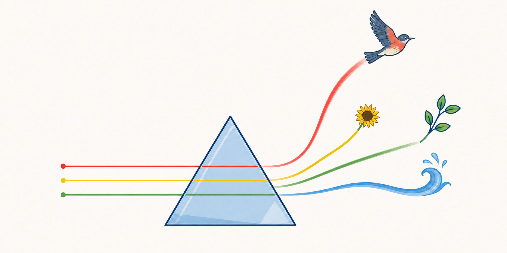

<p align="center">
  
</p>
# Codess

Codess discovers, decodes, normalizes, and searches local coding-assistant
Sessions from Claude Code, Codex, and Cursor. It preserves exact vendor evidence
while providing regular Project, Session, Event, tool, model, and Artifact
structures that can be queried together.

Use Codess to find work associated with a repository, reconstruct an Interaction,
inspect tool or model activity, compare source systems, and supply structured
inputs to later research or assessment.

## Choose a Starting Point

### I Want to Explore One Project

Follow the [basic setup and first run](Operations.md#4-first-project) to scan,
ingest, orient, and search one repository. Start here if you want to answer:

- Which Sessions exist for this Project?
- Which source systems contributed them?
- What are the largest or most active Sessions?
- Where did a particular prompt, response, tool call, error, or file appear?

### I Want to Investigate Sessions or Interactions

Read [Search and Investigation](Codess.md#5-search-and-investigation), then use the typed query
actions described under [Investigation](#investigation). These operations can
filter Events, expand complete Interactions or Model Turns, and retain stable
identities for later evidence review.

### I Want to Compare Projects, Vendors, or Models

Read [Vendor, Harness, and Model Comparison](Codess.md#43-vendor-harness-and-model-comparison) and
the relevant vendor reference:

- [Claude Code Source Schema](CCSchema.md)
- [Codex Source Schema](CodexSchema.md)
- [Cursor Source Schema](CursorSchema.md)

Repeated `--dir`, a path list passed with `--dirs`, or an explicit Project set
can select several Project store sets as one unified query scope. Common fields
support mixed-source queries; exact vendor types and mapping evidence remain
available to qualify results.

### I Operate or Maintain Codess

Use [First Project](Operations.md#4-first-project) for ordinary operation and
[Basic Diagnosis](Operations.md#9-basic-diagnosis) when results or performance
are unexpected.

## Quick Start

Codess requires Python 3.10 or newer. From the repository root:

```bash
python -m pip install -e .
```

The ordinary path relies on defaults for all three source systems, the registry,
raw references, and resource bounds:

```bash
codess scan --dir /path/to/project --out -
codess ingest --dir /path/to/project
codess query overview --dir /path/to/project
codess query search --dir /path/to/project --text 'distinctive phrase'
```

Codess reads vendor-owned stores and writes Codess data under the selected
Project's `.codess/` directory and the central registry, normally `~/.codess/`.
Review [Data Safety](#data-safety) before capturing raw evidence or exporting
content.

## Investigation

The typed query interface supplies four primary actions:

| Action | Purpose |
|---|---|
| `sessions` | List selected Sessions and their source, time, relationship, and model evidence. |
| `overview` | Summarize volumes, time coverage, Actors, tools, models, and activity. |
| `events` | Select exact Events or structured Event groups. |
| `search` | Find bounded content and structured matches. |

Common filters include:

```text
--source
--session-id
--event-id
--interaction-id
--model-turn-id
--event-kind
--actor-kind
--content-role
--origin-kind
--tool-name
--status
--model
--reasoning-effort
--service-tier
--artifact
--text
--since / --until
```

Use `codess --help` for the current flag contract. Useful compositions include:

```bash
# Tool failures in one Project.
codess query events --dir /path/to/project \
  --event-kind tool.result --status failed

# Search one source system and expand each match to its complete Interaction.
codess query search --dir /path/to/project --source codex \
  --text 'permission denied' --expand interaction

# Structured output for another program.
codess query events --dir /path/to/project \
  --tool-name Read --output-format jsonl
```

For a reproducible investigation, save the initial selection, expand it, and
bind the reviewed result to a summary:

```bash
codess query search --dir /path/to/project --text 'distinctive phrase' \
  --save-result selected.json
codess query events --dir /path/to/project --result-input selected.json \
  --expand interaction --save-result context.json
codess query cite --dir /path/to/project --result-input context.json \
  --summary-file summary.md --processor-id analyst/manual-1 \
  --save-investigation investigation.json
```

## Direct Database Access

Each source-system store is a SQLite database and may be inspected read-only
with the SQLite command line, Python's `sqlite3`, database browsers, notebooks,
or other query tools. The physical schema is
`schema/coschema/sqlite/schema.sql`; the
[Query Contract](CoSchema.md#14-query-contract) explains the logical access
surface.

Open a store without allowing writes:

```bash
sqlite3 'file:/absolute/path/to/sessions_codex.db?mode=ro'
```

Examples:

```sql
SELECT source_system_id, COUNT(*) AS sessions
FROM sessions
GROUP BY source_system_id;

SELECT event_kind, actor_kind, COUNT(*) AS events
FROM events
GROUP BY event_kind, actor_kind
ORDER BY events DESC;

SELECT sequence_no, event_kind, actor_kind, content
FROM events
WHERE session_id = ?
ORDER BY sequence_no;
```

Direct SQL is useful for exploratory joins, distributions, query-plan review,
and access to physical fields. The Codess query interface is preferable when
you need Project selection, cross-store composition, stable structured output,
Interaction expansion, or evidence resolution.

## Data Safety

Vendor session stores can contain source code, prompts, tool input and output,
local paths, credentials, and other private material.

- Codess opens vendor databases read-only and does not vacuum or modify them.
- The default raw mode records Source identity without making a complete raw
  copy.
- Content bounds prevent accidental ingestion or display of unbounded records.
- Redaction and content policies are available but do not replace review.
- Export or third-party indexing must be explicitly selected.
- `.codess/` data should not be committed to a Project repository.

The [Raw Evidence](Operations.md#8-raw-evidence) procedure covers explicit
capture. Storage deletion remains a reviewed maintenance operation.

## Documentation Map

| Document or area | Focus |
|---|---|
| [Codess](Codess.md) | Problem, solution, product capabilities, terminology, boundaries, and longer-term vision |
| [Operations](Operations.md) | Installation, source locations, normal execution, diagnosis, and maintenance commands |
| [Functional Design](Designs.md) | Decided functional behavior, rationale, invariants, and explicitly optional directions |
| [Implementation Plan](CoPlan.md) | Software layers, vendor processing, common mapping, database lifecycle, CLI construction, test coverage, current state, code review, and work registry |
| [CoSchema](CoSchema.md) | Common entities, relationships, fields, vocabularies, and query/store contracts |
| [Claude Code Source Schema](CCSchema.md) | Claude Code storage, records, selective access, mapping, and limitations |
| [Codex Source Schema](CodexSchema.md) | Codex storage, records, selective access, mapping, and limitations |
| [Cursor Source Schema](CursorSchema.md) | Cursor storage, records, selective access, mapping, and limitations |
| `schema/` | Executable SQL, JSON, mapping, policy, and fixture contracts |
| `catalog/` and the configured registry | Project selections, source bindings, observations, reports, and receipts |
| `experiments/` | Bounded investigations that are not part of the accepted design or implementation plan |
